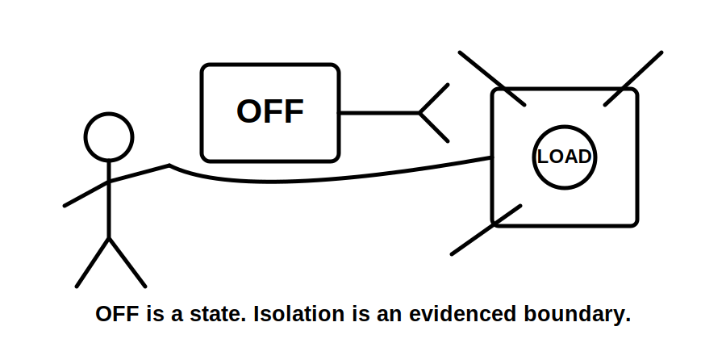
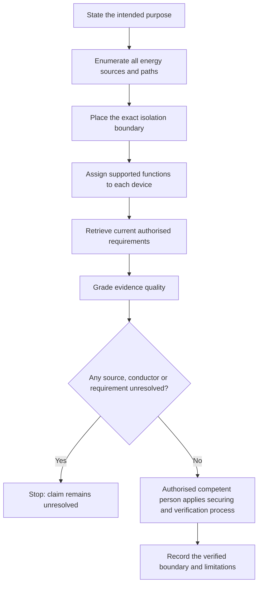
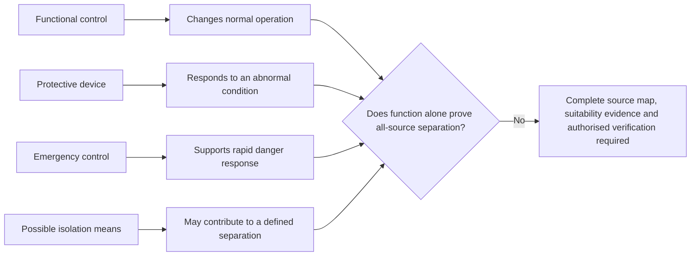
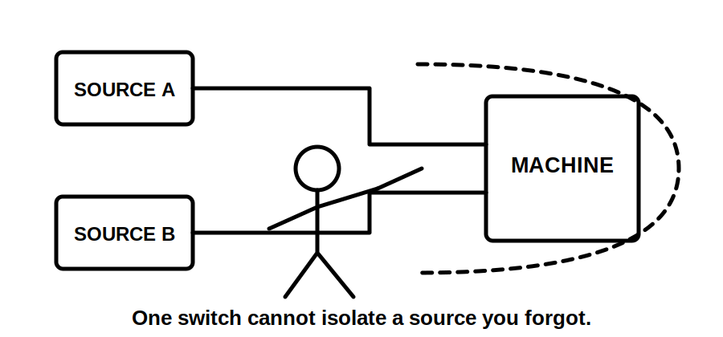

# Day 13A — Switching, Isolation and Main Switches

> **Source and safety notice:** This module teaches an original paper-based reasoning method for distinguishing switching functions, defining isolation boundaries and reviewing main-switch claims. It does not reproduce standards clauses, tables, figures, prescribed test values or field isolation procedures. Exact device requirements, pole arrangements, neutral treatment, accessibility, identification, emergency switching, alternate-supply provisions, securing, verification and jurisdiction-specific duties must be checked against current authorised standards, amendments, legislation, regulator and network requirements, manufacturer instructions, workplace procedures and RTO directions. Do not perform live work or use this module as an isolation procedure. This module is `review-required`, `reference_check_required` and not `technically-reviewed`.

## Navigation

- **Previous:** [Day 12 — Rest, Calculation Correction and Catch-Up](./day-12-rest-calculation-correction-and-catch-up.md)
- **Next:** [Day 13B — Switchboard Construction and Arrangements](./day-13b-switchboard-construction-and-arrangements.md)

## 1. Outcome and entry check

### Observable learning objectives

By the end of this block, the learner should be able to:

1. classify a device claim as **functional switching**, **protective operation**, **emergency switching**, **possible isolation means** or **unresolved**;
2. define an isolation boundary by naming the equipment, every relevant source, energisable conductors, proposed isolating means, stored-energy paths and verification point;
3. explain why an OFF command, open contact, stopped machine or device label does not by itself prove isolation;
4. distinguish the purpose of a main switch from the stronger claim that every source and relevant conductor is separated;
5. grade evidence as **observed**, **documented**, **verified**, **assumed** or **missing**;
6. apply the **S-E-P-A-R-A-T-E** workflow to an unfamiliar paper scenario;
7. reopen an earlier conclusion when a new source, control supply, storage system, interconnection or altered drawing is discovered;
8. produce a bounded written conclusion that states what is supported, what remains unresolved and why practical action must stop.

### Entry check — six minutes, closed note

Answer without consulting notes:

1. What is the difference between stopping equipment and isolating it?
2. Why is a contactor state not enough to prove a safe work boundary?
3. What must an isolation-boundary statement identify?
4. How can generation, storage or a control supply undermine a single-switch assumption?
5. What evidence would be needed before relying on a device as an isolation means?
6. When should a learner stop rather than infer a field procedure?

Mark each response **supported**, **partly supported** or **guess**. A high-confidence guess about isolation is a priority remediation item.

## 2. Why it matters

Switching changes an operating state. Isolation is a controlled claim about separation from relevant electrical energy. Confusing the two can leave conductors energised, permit automatic restart, overlook backfeed, preserve a control or auxiliary supply, or create a false belief that work can begin safely.

The governing reasoning chain is:

**purpose → complete source map → exact boundary → suitable means → secured state → authorised verification → bounded claim**

A weak answer starts with a familiar device and assumes its label defines the result. A defensible answer starts with the intended purpose and boundary, then demands evidence for every relevant energy path.

## 3. Core concepts and terminology

### Functional switching

**Functional switching** starts, stops or changes normal equipment operation. A wall switch, controller, thermostat, contactor or software command may perform this role. Functional control does not by itself establish a safe work boundary.

### Protective operation

**Protective operation** is a device response to a defined abnormal condition. A fuse, circuit-breaker or RCD may operate protectively. Protective operation is not automatically equivalent to deliberate isolation; suitability for any isolation role must be established from authorised evidence.

### Emergency switching

**Emergency switching** is intended to remove or control electrical energy rapidly when an unexpected danger exists. Its purpose, location, accessibility, operating action and relationship to isolation remain source-controlled questions.

### Isolation

**Isolation** is separation of an installation, circuit or item of equipment from every relevant source of electrical energy using suitable means within an authorised safe-work process. Device suitability, pole coverage, neutral treatment, securing, identification and verification remain `reference_check_required`.

### Main switch

A **main switch** provides a defined switching function at or for a switchboard or installation boundary. The title does not prove that it separates every conductor or every possible source. Multiple supplies, embedded generation, storage, control supplies and downstream interconnections may require additional devices, warnings or procedures.

### Isolation boundary

An **isolation boundary** states exactly what is separated from exactly which energy sources. It should name:

- the installation section, circuit, board or equipment covered;
- each normal, alternate, generated, stored, control and feedback source;
- every conductor or path capable of energising the boundary;
- the proposed isolating means;
- stored or mechanically retained energy relevant to the task;
- the point and authorised method by which the condition is verified.

### Operating state and electrical condition

- **Off** describes a command or indicated operating state.
- **Open** describes a contact or switching position.
- **Stopped** describes equipment behaviour.
- **De-energised** describes an electrical condition established through an authorised process.
- **Isolated** is a bounded conclusion supported by complete source control and authorised verification.

These terms are related but are not interchangeable.

### Evidence grades

- **Observed:** directly seen or shown in the scenario, without proving internal function.
- **Documented:** supported by a drawing, schedule, label or manufacturer record whose currency is known.
- **Verified:** checked through the applicable authorised process by a competent person.
- **Assumed:** plausible but unsupported.
- **Missing:** required evidence is absent.

### Claim grades

- **Described:** states an apparent function or arrangement.
- **Supported:** connects the claim to current documentary evidence.
- **Verified:** depends on authorised practical verification outside this module.
- **Unresolved:** evidence is incomplete or contradictory; no practical conclusion is permitted.

## 4. Rule-finding workflow

Use **S-E-P-A-R-A-T-E**:

1. **S — State the purpose.** Is the task normal control, protective response, emergency action or isolation for a controlled activity?
2. **E — Enumerate every source.** Map normal supply, alternate supply, generation, storage, auxiliary/control supply, feedback and retained energy.
3. **P — Place the boundary.** Name the exact equipment, circuit, board and conductors intended to be separated.
4. **A — Assign device functions.** Classify each device by supported function; do not promote a label into proof of suitability.
5. **R — Retrieve authorised requirements.** Check current standards, amendments, legislation, regulator, network, manufacturer, workplace and RTO sources.
6. **A — Assess evidence quality.** Grade drawings, labels, device data, source maps and procedures as observed, documented, verified, assumed or missing.
7. **T — Test the claim for completeness.** Ask whether any source, conductor, operating state or changed condition can defeat the proposed boundary.
8. **E — Express a bounded conclusion.** State what is supported, what remains unresolved, what evidence is needed and the stop condition.

The diagram separates educational reasoning from practical authority. This module can take a learner only to the evidence gate; it does not supply the field procedure represented by the final authorised step.

### Reopening triggers

Reopen the source map, boundary and conclusion when:

- a photovoltaic, generator, battery or UPS source is added or discovered;
- a control transformer, auxiliary circuit or interconnection is identified;
- drawings, labels or schedules disagree with the observed arrangement;
- the work boundary changes;
- a device is replaced, reconfigured or found to have a different function;
- remote control, automatic restart or stored energy becomes relevant;
- an upstream or downstream isolation assumption changes.

## 5. Visual model or worked example

### Function does not prove boundary

This model prevents a category error: a device may perform a useful switching function without proving the complete electrical condition needed for isolation.

### Worked paper example — fictional workshop

A fictional workshop has:

- a normal grid supply;
- a labelled main switch at the main switchboard;
- rooftop generation connected through a separate device;
- a control transformer feeding a machine contactor;
- a battery-backed communications cabinet;
- a local red stop button on the machine;
- drawings that predate the battery installation.

A learner claims: “Press the red stop and open the main switch; the machine is isolated.”

Apply **S-E-P-A-R-A-T-E**:

1. **State:** the intended purpose is isolation for a controlled maintenance task, not ordinary stopping.
2. **Enumerate:** grid, generation, control supply, battery-backed circuits and retained energy must be considered.
3. **Place:** the boundary is the machine, including power, control and any connected auxiliary terminals.
4. **Assign:** the red stop is an operating or emergency control unless stronger evidence proves another function. The labelled main switch has a defined switching role but its complete source coverage is not yet supported.
5. **Retrieve:** current authorised information is needed for device suitability, source coverage, pole treatment, securing, identification and verification.
6. **Assess:** the old drawing is documented but stale; device labels are observed evidence; battery and control paths are incompletely documented.
7. **Test:** alternate and auxiliary paths can defeat the proposed boundary.
8. **Express:** **unresolved — do not proceed until every source path, suitable isolating means and authorised verification method are confirmed**.

No field switching sequence is inferred from the example.

### Worked-example fading

For a second fictional scenario, complete only the missing stages:

- the purpose and equipment boundary are supplied;
- independently enumerate sources and energisable paths;
- classify each device function;
- identify the minimum missing evidence;
- write the bounded conclusion.

For a third scenario, complete the full workflow without prompts and then compare your evidence grades with a peer or trainer.

## 6. Practical application

### Scenario — community workshop switchboard

A community workshop contains a main switchboard, a distribution board, a photovoltaic system, a battery-backed communications cabinet and several fixed machines. One machine starts through a contactor and has a local stop button. The single-line diagram predates the battery installation.

Complete a paper-only review.

### Part A — function classification

For each device, record:

- apparent function;
- evidence grade;
- claim grade;
- evidence needed before it could be relied upon for an isolation claim.

Use only: functional switching, protective operation, emergency switching, possible isolation means or unresolved.

### Part B — source and boundary map

Draw every known or plausible energy path to:

1. the main switchboard;
2. the distribution board;
3. the selected machine;
4. the communications cabinet.

Mark each path **documented**, **observed**, **assumed** or **missing**. Then write one precise boundary statement for the machine and one for the distribution board.

### Part C — evidence register

Create a register with these headings:

| Claim | Available evidence | Evidence grade | Missing evidence | Consequence if wrong |
|---|---|---|---|---|
| Device function |  |  |  |  |
| Source coverage |  |  |  |  |
| Conductor coverage |  |  |  |  |
| Identification and accessibility |  |  |  |  |
| Securing and verification process |  |  |  |  |

The table is an original assessment scaffold, not a standards table.

### Part D — changed-condition transfer

A portable generator connection is later added to the workshop. Without describing a field sequence:

1. identify every earlier claim that must be reopened;
2. update the source and boundary maps;
3. list the new authorised evidence required;
4. explain why the old conclusion cannot simply be retained.

### Part E — bounded conclusion

Write four short statements:

1. what is described by the available evidence;
2. what is supported by current documentation;
3. what remains unresolved;
4. the exact stop condition preventing practical action.

### Assessment rubric — 12 points

Score each category 0, 1 or 2:

1. correct distinction between switching functions and isolation;
2. completeness of source and conductor mapping;
3. precision of the boundary statement;
4. quality of evidence grading and source selection;
5. changed-condition reopening logic;
6. safety-bounded conclusion and escalation.

**Critical-error gates:** regardless of the numerical score, the attempt is not ready if it treats OFF as isolation, omits a known source, invents a field procedure, claims verified isolation from paper evidence, or proceeds despite missing safety-critical evidence.

## 7. Common errors and safety checkpoint

### Common errors

- treating an OFF indication, stopped machine or open contact as proof of isolation;
- assuming one main switch controls every source;
- ignoring neutral, control, generation, storage, feedback or retained-energy paths;
- treating a contactor, thermostat or software command as a sufficient isolation boundary;
- relying on old drawings without checking alterations;
- assuming a protective device is suitable for isolation without authorised evidence;
- overlooking automatic restart or remote operation;
- using labels as a substitute for tracing and verification;
- copying a remembered sequence rather than locating the approved procedure;
- giving a pass verdict while source arrangements remain unknown.

### Safety checkpoint

Stop and escalate when:

- any source or backfeed path is unknown;
- device function or suitability cannot be verified;
- the installation differs from drawings, schedules or labels;
- alternate generation, storage, control or retained-energy arrangements are unclear;
- the authorised isolation, securing or verification procedure is unavailable;
- resolving the question would require live work or unauthorised access;
- the task exceeds the learner’s authority, supervision or competence.

This module authorises no switching, isolation, access, testing, verification, energisation or return-to-service action. Practical work must follow the applicable safe-work system and be performed by authorised competent persons using suitable equipment and current approved procedures.

## 8. Retrieval and next links

### Closed-note retrieval

1. Distinguish functional switching, protective operation, emergency switching and isolation.
2. Why can an open contactor fail to establish an isolation boundary?
3. What six elements belong in a strong boundary statement?
4. Why is a main-switch label evidence rather than proof of all-source separation?
5. Expand **S-E-P-A-R-A-T-E**.
6. Name five evidence grades and four claim grades.
7. List four changed conditions that force reopening of the conclusion.
8. State the correct conclusion when one source path remains unknown.

### Varied retrieval

Twenty-four to seventy-two hours later, use a different fictional installation containing a normal supply, a UPS, a local control device and incomplete drawings. Complete the source map, classify functions, state the boundary and produce a bounded conclusion without reopening this module.

### Exit check

The learner is ready to continue when they can independently:

- distinguish function from isolation evidence;
- map all stated and plausible energy paths;
- write an exact boundary statement;
- grade evidence without promoting assumptions;
- reopen the analysis after a changed condition;
- stop without inventing a practical procedure.

### Knowledge-base links

- [[Day 12 - Rest Calculation Correction and Catch-Up]]
- [[Day 13A - Switching Isolation and Main Switches]]
- [[Day 13B - Switchboard Construction and Arrangements]]
- [[Safety and Electrical Risk]]
- [[Wiring Rules and Design]]
- [[Inspection Testing and Verification]]

**Next:** Day 13B — Switchboard Construction and Arrangements.

<!-- sequence-navigation:start -->
### Sequence navigation

- [← Previous: Day 12 — Rest, Calculation Correction and Catch-Up](./day-12-rest-calculation-correction-and-catch-up.md)
- [Four-week learning plan](../MASTER_PLAN.md)
- [Next: Day 13B — Switchboard Construction and Arrangements →](./day-13b-switchboard-construction-and-arrangements.md)
<!-- sequence-navigation:end -->