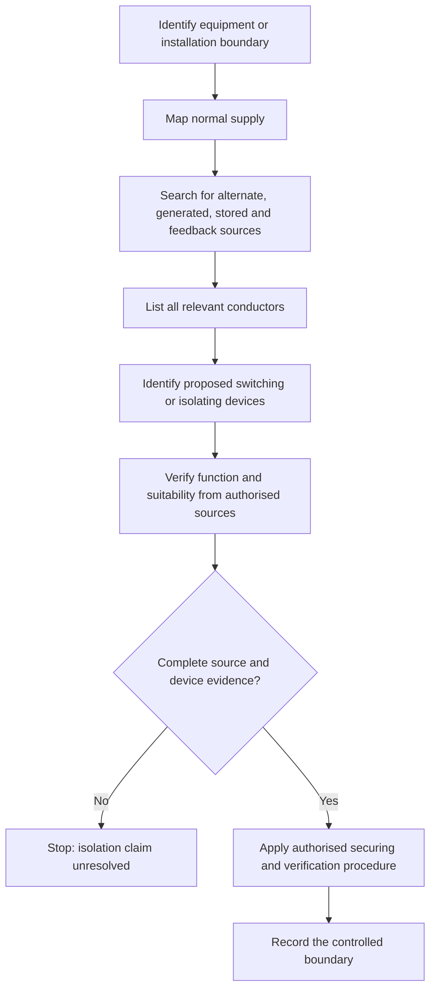
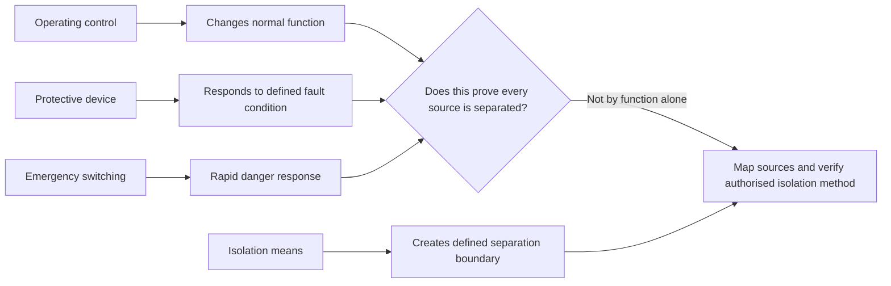

# Day 13A — Switching, Isolation and Main Switches

> **Source and safety notice:** This module teaches an original reasoning workflow for switching, isolation and main-switch identification. It does not reproduce standards clauses, tables, diagrams or prescribed field procedures. Exact device requirements, pole arrangements, neutral treatment, accessibility, labelling, emergency switching, alternate-supply provisions, lock-off procedures, verification steps and jurisdiction-specific rules must be checked against current authorised standards, amendments, legislation, regulator and network requirements, manufacturer instructions, workplace procedures and RTO directions. Do not perform live work or rely on this module as an isolation procedure. This module is not `technically-reviewed`.

## Navigation

- **Previous:** [Day 12 — Rest, Calculation Correction and Catch-Up](./day-12-rest-calculation-correction-and-catch-up.md)
- **Next scheduled block:** [Day 13B — Switchboard Construction and Arrangements](../MASTER_PLAN.md#week-2--circuit-design-cables-and-switchboards)

## 1. Outcome and entry check

### Learning objectives

By the end of this block, the learner should be able to:

1. distinguish functional switching, isolation, emergency switching and protective operation;
2. identify the source, equipment and conductors that define an isolation boundary;
3. explain why an open control contact does not necessarily prove electrical isolation;
4. identify the purpose of a main switch without assuming that every labelled switch isolates every source;
5. review pole coverage, neutral treatment, accessibility and identification as source-controlled questions;
6. apply the **S-A-F-E** evidence workflow to a paper installation scenario;
7. recognise alternate, multiple and backfeed sources that can defeat a simple isolation assumption;
8. state a bounded conclusion and stop when source arrangements or isolation evidence are incomplete.

### Entry check — six minutes, closed note

1. What is the difference between turning equipment off and isolating it?
2. Can a contactor, thermostat or software command by itself establish a safe isolation boundary?
3. What conductors and sources must be considered before claiming equipment is isolated?
4. Why may a board have more than one source of supply?
5. What makes a main switch useful to an operator or emergency responder?
6. Which parts of an isolation method must come from authorised procedures rather than memory?

Mark each answer as **supported**, **partly supported** or **guess**. A confident guess about isolation is a priority error.

## 2. Why it matters

Switching changes an operating state. Isolation establishes a defined separation from electrical energy so work or another controlled activity can proceed under an authorised safe-work system. Confusing the two can leave conductors energised, allow automatic restart, expose a backfeed path or create a false sense of safety.

The governing mental model is:

**all sources → all relevant conductors → isolating means → secured state → verified condition → controlled work boundary**

A device label is evidence, not proof. A complete conclusion depends on the actual source arrangement, device function, pole coverage, wiring, condition, identification and the authorised verification process.

## 3. Core concepts and terminology

### Functional switching

**Functional switching** starts, stops or changes normal equipment operation. Examples may include a wall switch, controller, contactor or automatic control function. It is primarily about operation, not establishing a safe work boundary.

### Isolation

**Isolation** is the separation of an installation, circuit or equipment from every relevant source of electrical energy using a suitable means and an authorised process. The exact requirements for device suitability, pole coverage, securing, identification and verification remain `reference_check_required`.

### Emergency switching

**Emergency switching** is intended to remove or control electrical energy rapidly where an unexpected danger exists. Its purpose, location, accessibility and relationship to isolation must be verified from current authorised sources.

### Protective operation

A circuit-breaker, fuse or RCD may operate for a protective purpose. Protective operation is not automatically equivalent to deliberate isolation. Device suitability and workplace procedures determine whether a protective device may form part of an isolation method.

### Main switch

A **main switch** provides a defined switching function at or for a switchboard or installation boundary. The title does not prove that it disconnects every conductor or every possible source. Multiple supplies, embedded generation, energy storage, control supplies or downstream interconnections may require additional switching and warning arrangements.

### Isolation boundary

An **isolation boundary** identifies exactly what is separated from exactly which sources. A useful boundary statement names:

- the equipment, circuit or board covered;
- each normal and alternate source;
- the relevant active, neutral and other energisable conductors;
- the isolating device or devices;
- any stored or generated energy;
- the point at which the safe condition is verified.

### Off, open and de-energised

- **Off** describes an operating command or indicated state.
- **Open** describes a contact or switching position.
- **De-energised** describes an electrical condition established through the authorised process.

These terms are related but not interchangeable.

## 4. Rule-finding workflow

Use the **S-A-F-E** workflow:

1. **S — Survey every source.** Identify normal supply, alternate supply, generation, storage, control, feedback and stored-energy paths.
2. **A — Assign the boundary.** State the exact board, circuit, equipment and conductors intended to be separated.
3. **F — Find the authorised requirements.** Verify device function, suitability, pole coverage, neutral treatment, accessibility, labelling, securing and test procedure.
4. **E — Establish evidence or stop.** Record the identified devices and source references; where evidence is missing, classify the state as unresolved and do not claim isolation.

### Evidence record

For a paper review, record:

- installation or equipment identifier;
- intended purpose: operation, isolation, emergency action or protection;
- normal and alternate sources;
- relevant conductors and possible backfeed paths;
- device type, location and identification;
- number of poles or switched conductors, subject to source verification;
- accessibility and operating context;
- means of preventing unintended operation;
- required labels and warnings;
- manufacturer information;
- standard, amendment, regulator, network and workplace references;
- evidence status: confirmed, assumed or missing.

## 5. Visual model or worked example

### Function-versus-boundary model

### Worked paper example — fictional installation

A fictional workshop switchboard has:

- a normal grid supply;
- a labelled main switch;
- a rooftop inverter connected through a separate device;
- a small control transformer supplying a contactor circuit;
- a machine with a local red stop button;
- incomplete board labelling.

A learner states: “Press the red stop button and open the main switch; the machine is isolated.”

Apply **S-A-F-E**:

1. **Survey:** normal supply, inverter contribution, control supply and possible stored energy are identified.
2. **Assign:** the intended boundary is the machine, including power and control terminals.
3. **Find:** authorised information is needed for main-switch coverage, inverter isolation, control-transformer supply, local device function, securing and verification.
4. **Establish evidence or stop:** the red stop button is only an operating or emergency control until proven otherwise. The main-switch label does not prove all-source isolation. The correct paper conclusion is **unresolved — do not proceed until all source paths and the authorised isolation method are confirmed**.

No field switching sequence is inferred from this example.

## 6. Practical application

### Original scenario — community workshop switchboard

A community workshop contains a main switchboard, a distribution board, a photovoltaic system, a battery-backed communications cabinet and several fixed machines. One machine starts through a contactor and has a local stop button. The single-line diagram predates the battery installation.

Complete a paper-based switching and isolation review.

### Part A — classify functions

For each listed device, classify its apparent function as:

- functional switching;
- protective operation;
- emergency switching;
- possible isolation means;
- unknown pending evidence.

Do not promote a device from “possible” to “suitable” based on its label alone.

### Part B — source map

Draw every known or plausible energy path to:

1. the main switchboard;
2. the distribution board;
3. the selected machine;
4. the communications cabinet.

Mark each path **confirmed**, **assumed** or **missing evidence**.

### Part C — boundary statements

Write one precise boundary statement for the selected machine and one for the distribution board. Each statement must identify the load or board, sources, conductors, devices and verification point.

### Part D — main-switch review

Prepare a question set rather than a compliance verdict:

- Which source or section does each main switch control?
- Are multiple main switches required or already present?
- Are operating positions and controlled supplies clearly identified?
- Can the intended operator reach and identify the device?
- Could generation, storage or control wiring energise equipment after one switch is opened?
- What current authorised rule and manufacturer evidence resolves each question?

### Part E — bounded conclusion

Conclude with:

1. what can be identified from the available evidence;
2. what cannot yet be claimed;
3. the missing drawings, labels, device data and source documents;
4. the specific stop condition preventing a field isolation decision.

## 7. Common errors and safety checkpoint

### Common errors

- treating an OFF indication as proof of isolation;
- assuming one main switch controls every source;
- ignoring neutral, control, generation, storage or feedback paths;
- treating a contactor or software command as a sufficient isolation boundary;
- relying on old drawings without checking subsequent alterations;
- assuming a protective device is suitable for isolation without evidence;
- overlooking automatic restart or remotely commanded operation;
- describing a field sequence from memory rather than using the authorised procedure;
- using labels as a substitute for tracing and verification;
- giving a pass verdict while source arrangements remain unknown.

### Safety checkpoint

Stop and escalate when:

- any source or backfeed path is unknown;
- device function or suitability cannot be verified;
- the installation differs from drawings or labels;
- alternate generation or storage arrangements are unclear;
- the authorised isolation, securing or verification procedure is unavailable;
- live work would be required to resolve the question;
- the task exceeds the learner's authority, supervision or competence.

This module supports paper reasoning only. Actual isolation must follow the applicable safe-work system and be performed by authorised competent persons using suitable equipment.

## 8. Retrieval and next links

### Closed-note retrieval

1. State the difference between functional switching and isolation.
2. Why does an open contactor not automatically prove safe isolation?
3. What does an isolation boundary need to name?
4. Why can a main switch label be insufficient evidence?
5. List four possible sources or paths beyond the normal grid supply.
6. Expand **S-A-F-E**.
7. What conclusion is appropriate when a source path remains unknown?
8. Give three reasons to stop a switching or isolation review.

### Applied practice

Take a fictional board diagram and annotate:

- every source;
- every switching device;
- the apparent function of each device;
- the intended isolation boundary;
- missing evidence;
- the authorised sources needed before a conclusion.

### Exit check

The learner is ready to continue when they can distinguish device function from isolation evidence, map multiple supply paths and write a bounded no-guess conclusion without inventing a field procedure.

### Knowledge-base links

- [[Day 12 - Rest Calculation Correction and Catch-Up]]
- [[Day 13A - Switching Isolation and Main Switches]]
- [[Day 13B - Switchboard Construction and Arrangements]]
- [[Safety and Electrical Risk]]
- [[Wiring Rules and Design]]

**Next:** Day 13B — Switchboard Construction and Arrangements.

<!-- sequence-navigation:start -->
### Sequence navigation

- [← Previous: Day 12 — Rest, Calculation Correction and Catch-Up](./day-12-rest-calculation-correction-and-catch-up.md)
- [Four-week learning plan](../MASTER_PLAN.md)
- [Next: Day 13B — Switchboard Construction and Arrangements →](./day-13b-switchboard-construction-and-arrangements.md)
<!-- sequence-navigation:end -->
