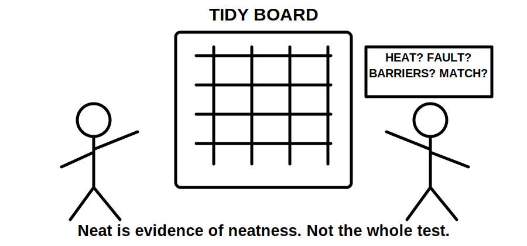
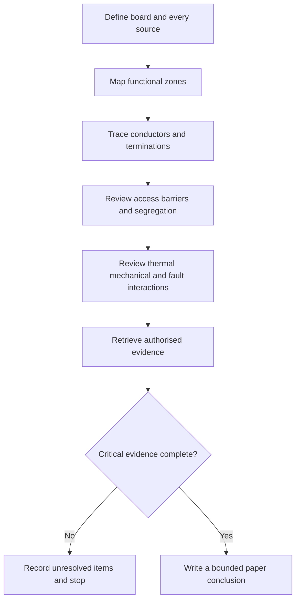
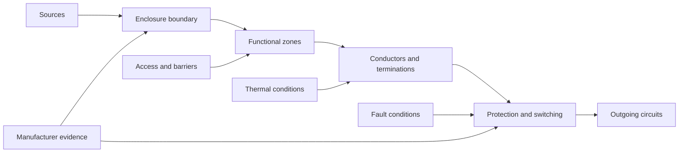
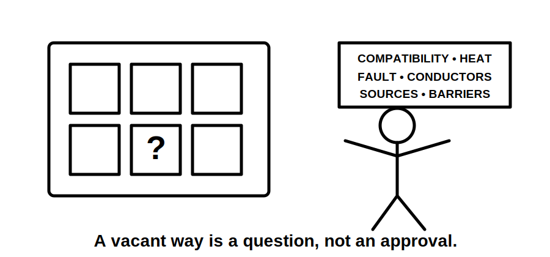

# Day 13B — Switchboard Construction and Arrangements

> **Source and safety notice:** This original module supports paper-based reasoning only. It does not reproduce standards wording, tables, figures, dimensions, ratings or construction instructions. Exact enclosure, barrier, access, segregation, conductor, neutral, earth, thermal, fault, identification and compatibility requirements must be checked against current authorised sources, manufacturer information and qualified review. It is not `technically-reviewed`.

## Navigation

- **Previous:** [Day 13A — Switching, Isolation and Main Switches](./day-13a-switching-isolation-and-main-switches.md)
- **Next:** [Day 13C — Switchboard Defect Inspection](../MASTER_PLAN.md#week-2--circuit-design-cables-and-switchboards)

## 1. Outcome and entry check

### Learning objectives

By the end of this block, the learner should be able to:

1. describe a switchboard as an engineered assembly;
2. map incoming, switching, protection, distribution, neutral, earth and control functions;
3. explain why access, barriers, segregation, heat, fault energy and maintainability affect arrangement;
4. distinguish visible spare space from proven spare capacity;
5. apply the **B-O-A-R-D** workflow to a paper review;
6. identify missing manufacturer and source evidence;
7. write a bounded conclusion without claiming compliance.

### Entry check

1. What functions must a switchboard coordinate besides overcurrent protection?
2. Why can two boards with similar devices require different arrangements?
3. Why do heat and prospective fault energy matter inside an enclosure?
4. What evidence is needed before calling a way suitable for a new circuit?

Mark each response **supported**, **partly supported** or **guess**.

## 2. Why it matters

A switchboard concentrates sources, switching, protection, conductors, neutral connections, protective-earthing connections and terminations. A weak construction or arrangement decision can affect several circuits at once.

The governing mental model is:

**sources → enclosure and zones → devices and conductors → terminations and identity → access and maintenance boundary → evidence-backed conclusion**

## 3. Core concepts and terminology

### Assembly and functional zones

Treat the board as an assembly whose enclosure, devices, conductors, supports, barriers, markings and environment interact. A paper review may map:

- incoming supply and main switching;
- protective devices and outgoing circuits;
- neutral and protective-earthing facilities;
- metering, control and communications;
- alternate-supply interfaces;
- future-work areas.

These are reasoning zones, not a universal physical layout.

### Barrier, separation and segregation

A **barrier** restricts access or contact. **Separation** describes spacing or division. **Segregation** is a deliberate boundary intended to preserve a safety, operational or performance purpose. Exact meanings and construction requirements remain `reference_check_required`.

### Thermal, fault and capacity evidence

Physical space does not prove electrical, thermal or fault capacity. Loading, heat dissipation, device and enclosure compatibility, conductor routing, available fault information and manufacturer combinations may all affect suitability.

### Maintainability

A maintainable arrangement supports identification, inspection and authorised work without unnecessary disturbance of adjacent equipment. It does not replace isolation or safe-work controls.

## 4. Rule-finding workflow

Use **B-O-A-R-D**:

1. **B — Bound the assembly:** identify the board, every source, accessible sides and connected sections.
2. **O — Organise by function:** map incoming, switching, protection, distribution, neutral, earth, control and alternate-supply zones.
3. **A — Assess interactions:** review access, barriers, segregation, conductor routes, heat, fault energy, support, identity and maintenance effects.
4. **R — Retrieve authorised evidence:** check standards, amendments, manufacturer instructions, compatible-device data, drawings, labels and fault information.
5. **D — Decide within evidence:** mark each conclusion confirmed, assumed or missing; stop before an unsupported verdict.

Record board identity, sources, enclosure data, device functions, conductor routes, neutral and earth facilities, barriers, environmental conditions, fault information, compatibility evidence, schedules, warnings and spare-capacity claims.

## 5. Visual model or worked example

### Fictional board extension

A distribution board has two apparently unused spaces, a crowded neutral bar, mixed device brands, unavailable enclosure instructions, a proposed three-phase circuit and no documented fault level.

A learner says: “There are two spare spaces, so the new breaker can be added.”

Using **B-O-A-R-D**, the correct paper conclusion is:

> **Physical space observed; suitability for extension unresolved.**

The unresolved questions include source arrangement, compatible devices, conductor routing, neutral capacity, heat, phase arrangement, barriers, fault conditions, identification and manufacturer approval.

## 6. Practical application

For a fictional commercial board and proposed EV circuit:

1. map normal and alternate sources;
2. sketch functional zones without inventing hidden construction;
3. trace incoming, outgoing, neutral and earth paths;
4. prepare questions on compatibility, capacity, heat, fault conditions, barriers, access and identification;
5. list the authorised drawings, manufacturer data and loading evidence required;
6. conclude under **confirmed**, **unresolved**, **required evidence** and **stop condition**.

## 7. Common errors and safety checkpoint

### Common errors

- treating neatness as compliance;
- treating vacant space as proven capacity;
- mixing device families without compatibility evidence;
- overlooking alternate supplies or control circuits;
- confusing neutral and protective-earthing functions;
- ignoring support, entry and termination constraints;
- relying on an outdated schedule;
- judging the whole assembly from breaker ratings alone.

### Stop conditions

Stop and escalate when a source is unknown, access would require opening the assembly, compatibility or fault evidence is missing, heat or damage is suspected, neutral or earth arrangements are unclear, drawings conflict with labels, or the task exceeds the learner's authority.

## 8. Retrieval and next links

### Closed-note retrieval

1. Why is a switchboard an assembly-level problem?
2. Name six functional zones.
3. Distinguish barrier, separation and segregation.
4. Why does vacant space not prove capacity?
5. Expand **B-O-A-R-D**.
6. Name three stop conditions.

### Exit check

The learner is ready to continue when they can organise a paper review using **B-O-A-R-D**, explain assembly interactions and stop when source, compatibility, thermal or fault evidence is incomplete.

### Knowledge-base links

- [[Day 13A - Switching Isolation and Main Switches]]
- [[Day 13B - Switchboard Construction and Arrangements]]
- [[Day 13C - Switchboard Defect Inspection]]
- [[Wiring Rules and Design]]
- [[Inspection Testing and Verification]]

### Review boundary

This module remains `review-required`, safety-critical and `reference_check_required`. Exact construction and acceptance requirements require current authorised sources and qualified technical review.

<!-- sequence-navigation:start -->
### Sequence navigation

- [← Previous: Day 13A — Switching, Isolation and Main Switches](./day-13a-switching-isolation-and-main-switches.md)
- [Four-week learning plan](../MASTER_PLAN.md)
- [Next: Day 13C — Switchboard Defect Inspection →](./day-13c-switchboard-defect-inspection.md)
<!-- sequence-navigation:end -->
