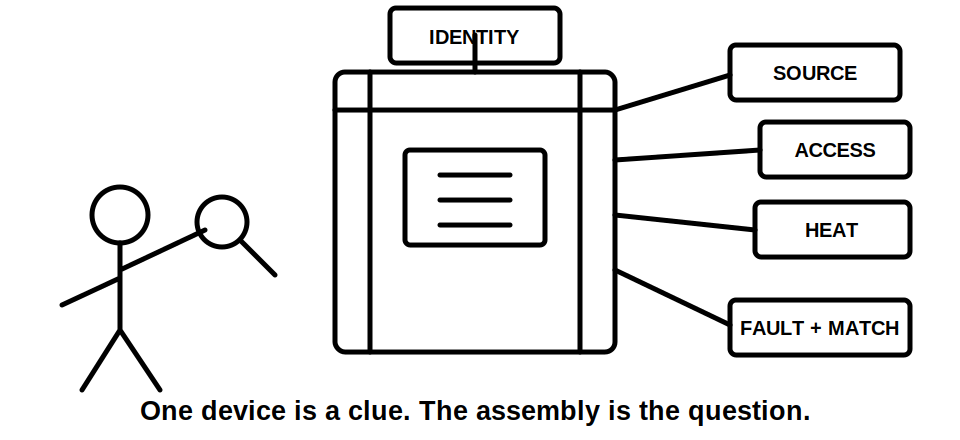
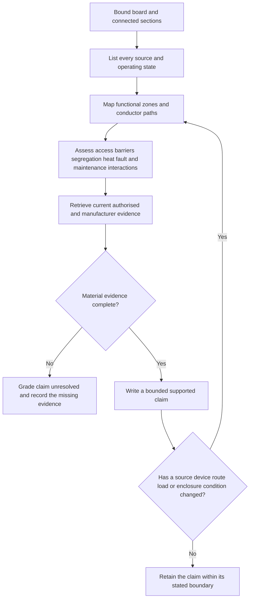
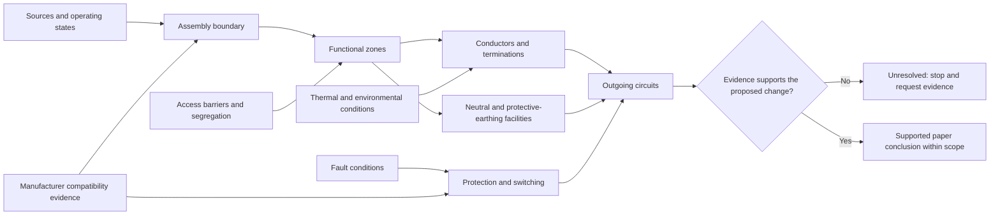

# Day 13B — Switchboard Construction and Arrangements

> **Source and safety notice:** This original module supports paper-based reasoning only. It does not reproduce standards wording, tables, figures, dimensions, ratings or construction instructions. Exact enclosure, barrier, access, segregation, conductor, neutral, earth, thermal, fault, identification and compatibility requirements must be checked against current authorised sources, manufacturer information and qualified review. It is not `technically-reviewed`.

## Navigation

- **Previous:** [Day 13A — Switching, Isolation and Main Switches](./day-13a-switching-isolation-and-main-switches.md)
- **Next:** [Day 13C — Switchboard Defect Inspection](./day-13c-switchboard-defect-inspection.md)

## 1. Outcome and entry check

### Learning objectives

By the end of this block, the learner should be able to:

1. define the boundary of a switchboard assembly from supplied paper evidence;
2. produce a functional-zone map showing sources, switching, protection, distribution, neutral, protective-earthing and control functions;
3. distinguish an observed feature from a documented arrangement, manufacturer-verified compatibility, assumption or missing evidence;
4. explain how access, barriers, segregation, conductor routing, heat, fault conditions and maintainability interact;
5. distinguish visible spare space from demonstrated spare capacity;
6. apply the **B-O-A-R-D-S** workflow without inventing hidden construction;
7. grade a conclusion as **described**, **supported**, **verified** or **unresolved**;
8. reopen affected conclusions when a source, device, route, load or enclosure condition changes.

### Entry check

Without looking back, answer:

1. What makes a switchboard an assembly-level problem rather than a collection of individual devices?
2. Which functional areas must be mapped before judging a proposed extension?
3. Why can an empty module position fail to represent usable capacity?
4. Which evidence would be needed before claiming that a device and enclosure combination is suitable?
5. What new questions arise when an alternate source is added?

Mark each answer **guess**, **unsure**, **reasonably confident** or **certain**. A high-confidence unsupported answer is a priority misconception.

## 2. Why it matters

A switchboard concentrates sources, switching, protection, conductors, neutral connections, protective-earthing connections, terminations and identification. A weak arrangement decision can affect multiple circuits and can also alter access, heat, fault exposure and future maintenance conditions.

The governing mental model is:

**assembly boundary → sources and operating states → functional zones → interactions → authorised evidence → bounded conclusion**

A neat board is evidence of neatness. It is not, by itself, evidence of correct source control, compatibility, thermal performance, fault suitability, segregation or spare capacity.

## 3. Core concepts and terminology

### Assembly boundary

The **assembly boundary** defines which enclosure, connected sections, incoming sources, internal functions and accessible sides are included in the paper review. An undefined boundary makes every later conclusion unstable.

### Functional zone

A **functional zone** is a learner-created reasoning area used to group related functions. Typical paper-review zones include:

- incoming sources and main switching;
- protective devices and outgoing circuits;
- neutral facilities;
- protective-earthing facilities;
- metering, control and communications;
- alternate-supply interfaces;
- spare or future-work areas.

These are reasoning zones, not a universal physical layout.

### Access boundary

The **access boundary** separates what the supplied evidence allows the learner to observe from what would require opening, dismantling, testing or authorised site work. A paper exercise does not grant authority to cross that boundary.

### Barrier, separation and segregation

A **barrier** restricts access or contact. **Separation** describes spacing or division. **Segregation** is a deliberate boundary intended to preserve a safety, operational or performance purpose. Exact definitions and construction requirements remain `reference_check_required`.

### Compatibility and coexistence

**Coexistence** means components appear together. **Compatibility** means authorised evidence supports their use together for the relevant assembly and conditions. Visual coexistence is not proof of compatibility.

### Spare space and spare capacity

**Spare space** is visible physical room. **Spare capacity** is an evidence-backed conclusion that the relevant electrical, thermal, fault, mechanical, termination, identification and manufacturer constraints remain satisfied. Space is only one input.

### Evidence grades

Use five evidence grades:

1. **Observed** — directly visible in the supplied image, drawing or scenario.
2. **Documented** — stated in a current schedule, drawing, label or authorised record.
3. **Manufacturer-verified** — supported by applicable assembly or compatibility information.
4. **Assumed** — plausible but not evidenced.
5. **Missing** — required for the conclusion but unavailable.

### Claim grades

- **Described:** states what the supplied material shows.
- **Supported:** combines applicable evidence into a bounded reasoning statement.
- **Verified:** requires all authorised evidence and qualified confirmation appropriate to the claim.
- **Unresolved:** a material evidence gap prevents the claim.

## 4. Rule-finding workflow

Use **B-O-A-R-D-S**:

1. **B — Bound the assembly:** identify the board, connected sections, accessible sides, every source and every relevant operating state.
2. **O — Outline functions:** map incoming, switching, protection, distribution, neutral, protective-earthing, control and alternate-supply functions.
3. **A — Assess interactions:** review access, barriers, segregation, conductor routes, heat, fault conditions, support, termination, identity and maintainability.
4. **R — Retrieve authorised evidence:** locate current standards references, amendments, manufacturer instructions, compatible-device data, drawings, schedules, labels and fault information.
5. **D — Decide the claim grade:** mark each statement described, supported, verified or unresolved; never promote assumption into fact.
6. **S — Stress-test change:** alter one material condition and reopen every dependent conclusion.

### Evidence record

For each conclusion, record:

- assembly boundary;
- source and operating state;
- observation or document;
- applicable authorised source;
- manufacturer evidence;
- interaction being assessed;
- evidence grade;
- claim grade;
- missing evidence;
- reopening trigger.

## 5. Visual model or worked example

The diagram below shows why a single device cannot be judged independently from the assembly that surrounds it.

### Complete worked example

A fictional distribution board has two apparently unused positions, a crowded neutral facility, mixed device brands, unavailable enclosure instructions, a proposed three-phase circuit and no supplied fault information.

A learner says: “There are two spare spaces, so the new device can be added.”

Apply **B-O-A-R-D-S**:

| Step | Evidence-led response |
|---|---|
| Bound | The supplied drawing identifies one board but does not confirm hidden connected sections or alternate sources. |
| Outline | Incoming, main switching, protection and outgoing functions can be sketched; neutral, earth and control details are incomplete. |
| Assess | Physical room is visible, but compatibility, heat, phase arrangement, terminations, fault conditions and access remain unresolved. |
| Retrieve | Current assembly data, compatible-device information, schedules, source data and authorised fault information are required. |
| Decide | **Physical space described; suitability and spare capacity unresolved.** |
| Stress-test | Discovery of an inverter supply reopens source, switching, identification, fault and isolation conclusions. |

### Worked-example fading

**Faded attempt:** A second fictional board has one empty position, a complete circuit schedule and a matching device label, but no supplied enclosure compatibility data or thermal information.

Complete only these steps:

1. define the assembly boundary;
2. grade each supplied item as observed, documented, manufacturer-verified, assumed or missing;
3. identify three interactions that remain unresolved;
4. write one described claim and one supported or unresolved claim;
5. state one change that would reopen the analysis.

## 6. Practical application

### Scenario

A fictional commercial board is proposed to supply an EV circuit. The supplied dossier includes an exterior photograph, a partial single-line diagram, an old circuit schedule and a device data sheet. Later, a battery inverter is disclosed.

Produce:

1. an assembly-boundary statement;
2. a source and operating-state inventory;
3. a functional-zone sketch without inventing hidden construction;
4. an evidence ledger using the five evidence grades;
5. an interaction review covering access, barriers, segregation, routing, heat, fault conditions, neutral and earth facilities, identification and maintainability;
6. a list of authorised evidence requests;
7. a bounded conclusion using the claim grades;
8. a change-propagation note explaining which conclusions reopen when the inverter is added.

### Assessment rubric

Score each category from **0 to 2**.

| Category | 0 | 1 | 2 |
|---|---|---|---|
| Boundary and sources | Missing or invented | Partial boundary or source list | Complete paper boundary and operating-state inventory |
| Functional mapping | Device list only | Some functions mapped | Functions and paths mapped without invented detail |
| Interaction reasoning | Isolated component judgement | Some interactions named | Access, thermal, fault, compatibility and maintenance interactions connected |
| Evidence discipline | Assumptions presented as facts | Evidence grades used inconsistently | Evidence and claim grades applied consistently |
| Change propagation | Changed condition ignored | Some conclusions reopened | Every dependent conclusion reopened and explained |
| Safety communication | Practical authority implied | General caution only | Clear stop conditions and bounded paper conclusion |

A score of **10/12 or higher** with no critical error indicates readiness for Day 13C. This is an educational threshold, not an official assessment rule.

### Critical errors

Any of the following requires remediation regardless of score:

- treating physical space as proven capacity;
- treating mixed or visible components as compatibility evidence;
- omitting a disclosed source;
- inventing hidden conductors, barriers or terminations;
- claiming compliance or safe access without authorised evidence;
- proposing opening, testing, alteration or energisation outside authority.

## 7. Common errors and safety checkpoint

### Common errors

- treating neatness as compliance;
- treating vacant space as proven capacity;
- judging the assembly from device ratings alone;
- confusing coexistence with compatibility;
- overlooking alternate supplies, stored energy or control circuits;
- confusing neutral and protective-earthing functions;
- ignoring support, entry, termination or thermal constraints;
- relying on an outdated schedule without checking currency;
- failing to reopen conclusions after a material change.

### Safety checkpoint

This module authorises no switchboard access, cover removal, opening, probing, isolation, testing, measurement, alteration, repair, energisation, commissioning or verification.

Stop and escalate when:

- any source or operating state is unknown;
- the task would require crossing the access boundary;
- compatibility, fault, thermal or manufacturer evidence is missing;
- heat, damage, contamination or deterioration is suspected;
- neutral or protective-earthing arrangements are unclear;
- drawings, schedules and labels conflict;
- a changed source or load invalidates earlier assumptions;
- the task exceeds the learner's authority.

## 8. Retrieval and next links

### Closed-note retrieval

1. Define assembly boundary, functional zone and access boundary.
2. Distinguish coexistence from compatibility.
3. Why does spare space not prove spare capacity?
4. Expand **B-O-A-R-D-S**.
5. Name the five evidence grades and four claim grades.
6. List four interactions that can make an apparently simple extension unsuitable.
7. What must happen when an alternate source is discovered?
8. State three stop conditions.

### Changed-scenario transfer

Re-attempt the practical scenario after changing one condition: the proposed circuit is now supplied from a different board section, or a control supply remains energised from another source. Do not reuse the earlier conclusion. Rebuild the boundary, source inventory, interaction map and evidence requests.

### Exit check

The learner is ready to continue when they can:

- apply **B-O-A-R-D-S** without inventing hidden details;
- distinguish evidence grades and claim grades;
- explain why assembly interactions matter;
- reopen affected conclusions after a change;
- stop before unsupported compliance, capacity or safety claims.

### Knowledge-base links

- [[Day 13A - Switching Isolation and Main Switches]]
- [[Day 13B - Switchboard Construction and Arrangements]]
- [[Day 13C - Switchboard Defect Inspection]]
- [[Wiring Rules and Design]]
- [[Inspection Testing and Verification]]
- [[Safety and Electrical Risk]]

### Review boundary

This module remains `review-required`, safety-critical and `reference_check_required`. Exact construction, enclosure, access, segregation, conductor, neutral, earth, thermal, fault, identification, compatibility and acceptance requirements require current authorised sources and qualified technical review.

<!-- sequence-navigation:start -->
### Sequence navigation

- [← Previous: Day 13A — Switching, Isolation and Main Switches](./day-13a-switching-isolation-and-main-switches.md)
- [Four-week learning plan](../MASTER_PLAN.md)
- [Next: Day 13C — Switchboard Defect Inspection →](./day-13c-switchboard-defect-inspection.md)
<!-- sequence-navigation:end -->
