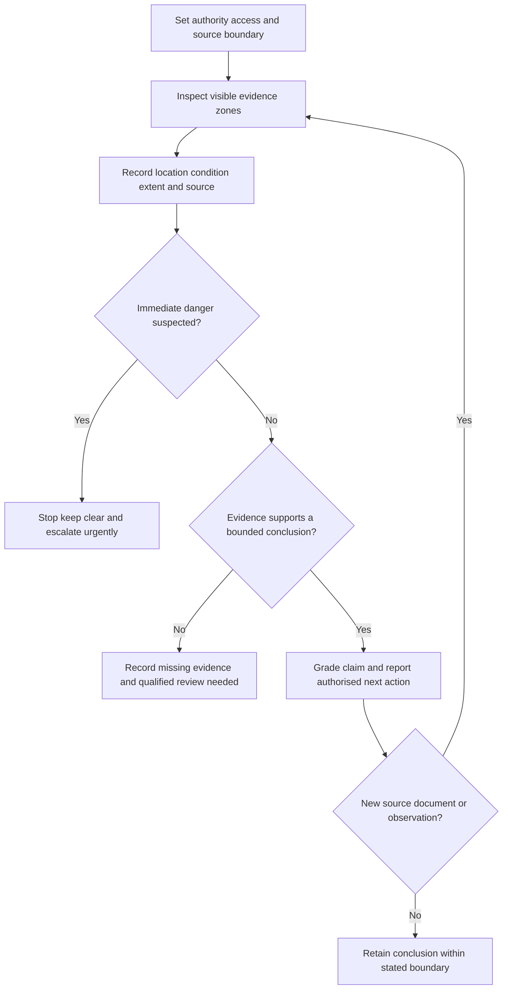
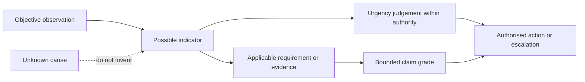

# Day 13C — Switchboard Defect Inspection

> **Source and safety notice:** This original module supports visual and documentary reasoning only. It does not authorise opening, touching, testing, altering, isolating or energising a switchboard. Exact defect classifications, access controls, inspection procedures, emergency responses, acceptance criteria and reporting duties must be checked against current authorised sources, workplace procedures and qualified review. It is not `technically-reviewed`.

## Navigation

- **Previous:** [Day 13B — Switchboard Construction and Arrangements](./day-13b-switchboard-construction-and-arrangements.md)
- **Next:** [Day 14 — Week 2 Integrated Design Exercise](./day-14-week-2-integrated-design-exercise.md)

## 1. Outcome and entry check

### Learning objectives

By the end of this block, the learner should be able to:

1. distinguish observation, indicator, defect conclusion and cause;
2. define an external visual-inspection boundary before reviewing evidence;
3. organise observations by visible evidence zone rather than by first impression;
4. record location, condition, extent and evidence source without inventing hidden detail;
5. distinguish urgency from certainty;
6. apply the **S-I-G-N-S** workflow to a paper or externally visible scenario;
7. produce a structured handover with evidence gaps and next authorised actions;
8. reopen conclusions when a new source, document or observation changes the evidence picture.

### Entry check

Without notes, answer:

1. Why is a switchboard an assembly rather than a collection of breakers?
2. Why does visible spare space not prove spare capacity?
3. What is the difference between an observation and a cause?
4. Can an urgent condition still have an unknown cause?
5. Name three conditions that stop an external inspection.

Rate each answer **guess**, **unsure**, **reasonably confident** or **certain**. A high-confidence unsupported diagnosis is a priority misconception.

## 2. Why it matters

Switchboard observations can indicate risks affecting several circuits, sources and people. Poor reporting creates a second risk: it may understate an urgent condition, overstate certainty, misdirect corrective work or conceal the evidence still needed.

The governing mental model is:

**set boundary → observe without disturbance → locate and describe → separate urgency from certainty → identify evidence gaps → stop, report and escalate**

A visible sign can justify urgent action without proving its hidden cause. Conversely, absence of visible damage does not prove safe internal condition.

## 3. Core concepts and terminology

### Observation, indicator, conclusion and cause

- **Observation:** directly visible or document-supported fact.
- **Indicator:** observation that may point to a safety, performance or documentation concern.
- **Defect conclusion:** evidence-backed statement that an applicable requirement is not met.
- **Cause:** explanation for why the condition occurred; usually needs more evidence than an external observation.

Do not collapse these levels into one sentence.

### Inspection boundary

The **inspection boundary** states the board, visible surfaces, documents, known sources, access limitations and prohibited actions included in the exercise.

### Visible evidence zones

Use these learner-created zones:

- identity, schedules and warnings;
- enclosure and accessible surroundings;
- visible switching and protective-device identification;
- visible openings, covers and barriers;
- cable entries, support and obvious mechanical condition;
- heat, moisture, contamination, corrosion or impact indicators;
- normal, alternate and stored-energy source information;
- access, clearance and housekeeping.

These zones organise reasoning; they are not an authorised inspection checklist.

### Urgency and certainty

**Urgency** asks how quickly control or escalation may be needed. **Certainty** asks how strongly the evidence supports the conclusion. A condition may be urgent while its cause remains unresolved.

### Evidence grades

1. **Observed** — directly visible in the supplied material.
2. **Documented** — stated in a current drawing, schedule, label or record.
3. **Corroborated** — supported by more than one independent item.
4. **Assumed** — plausible but not evidenced.
5. **Missing** — required for the conclusion but unavailable.

### Claim grades

- **Described:** reports the observable condition.
- **Supported:** connects evidence to a bounded concern.
- **Verified:** requires authorised criteria and qualified confirmation.
- **Unresolved:** evidence is insufficient for the claim.

## 4. Rule-finding workflow

Use **S-I-G-N-S**:

1. **S — Set the boundary:** record authority, visible surfaces, known sources, documents and prohibited actions.
2. **I — Inspect by evidence zone:** review systematically rather than following the most dramatic feature.
3. **G — Gather objective signs:** record location, condition, extent, label text, document conflict and authorised images.
4. **N — Name urgency, evidence grade and gap:** distinguish immediate concern, qualified assessment, missing evidence and routine follow-up.
5. **S — Stop, secure and report:** do not disturb equipment; keep clear and escalate through the authorised process.

A useful record includes board identity, date, boundary, known sources, exact location, observable condition, extent, photographs where authorised, document conflicts, immediate controls, evidence requested and person notified.

## 5. Visual model or worked example

### Complete worked example

From outside a closed fictional distribution board, a learner observes:

- a damaged directory pocket;
- a circuit description conflicting with a recent drawing;
- discolouration near a cable-entry area;
- an alternate-supply warning nearby with unclear relationship to the board;
- stored items restricting access.

Weak report:

> “The board has an overheated cable and illegal labelling.”

Evidence-led report:

> “Visible discolouration is present near the upper cable-entry area; cause and internal condition are not established. Circuit identification conflicts with the supplied drawing. The relationship of the alternate-source warning to this board is unclear. Access is obstructed. Stop the external review, keep the area controlled and request qualified assessment plus current source and circuit records.”

### Worked-example fading

A second photograph shows a cracked label window, one missing schedule entry and staining below the enclosure. Complete:

1. the boundary statement;
2. three objective observations in location–condition–extent form;
3. evidence grades for each observation;
4. urgency and certainty as separate judgements;
5. one supported claim and two unresolved claims;
6. the exact authorised evidence required next.

## 6. Practical application

For a fictional workshop switchboard photograph set and document pack:

1. state what the material does and does not show;
2. identify the boundary, known sources and prohibited actions;
3. review every visible evidence zone using **S-I-G-N-S**;
4. write observations in location–condition–extent form;
5. separate document conflicts from suspected physical concerns;
6. grade evidence and claims;
7. assign provisional urgency without claiming an official defect code;
8. prepare a handover under **observed**, **indicator**, **urgency**, **missing evidence**, **immediate control** and **next authorised action**;
9. change one fact—such as discovery of an inverter supply—and reopen all affected conclusions.

### Assessment rubric

Score each category from **0 to 2**.

| Category | 0 | 1 | 2 |
|---|---|---|---|
| Boundary and sources | Missing or unsafe | Partial | Complete external boundary and source inventory |
| Observation quality | Vague or causal guesses | Some objective detail | Consistent location–condition–extent records |
| Evidence discipline | Assumptions treated as facts | Inconsistent grading | Evidence and claim grades applied correctly |
| Urgency reasoning | Urgency confused with certainty | Partly separated | Urgency and certainty clearly separated |
| Handover | No actionable record | Some required fields | Concise, complete and bounded handover |
| Safety communication | Access or intervention implied | General caution | Clear stop, control and escalation statements |

A score of **10/12 or higher** with no critical error indicates readiness for Day 14. This is an educational threshold, not an official assessment rule.

### Critical errors

- opening or touching equipment to obtain more evidence;
- diagnosing a hidden cause from appearance alone;
- omitting a disclosed source;
- treating lack of visible damage as proof of safety;
- assigning an official defect category from memory;
- failing to stop for an immediate danger indicator.

## 7. Common errors and safety checkpoint

### Common errors

- following the most dramatic feature and missing other zones;
- using “looks unsafe” without location or evidence;
- confusing a document conflict with a proven physical defect;
- treating cosmetic condition as equivalent to electrical failure;
- diagnosing a loose termination from discolouration alone;
- ignoring alternate, generated or stored-energy sources;
- failing to record contradictory labels and drawings;
- keeping an old conclusion after new evidence appears.

### Safety checkpoint

Stop and escalate for smoke, burning smell, arcing sound, active water entry, severe damage, accessible exposed conductive parts, uncertain source status, unexpected operation, evidence of recent heat, missing visible barriers or any need to open, touch, test, isolate or alter the assembly. Keep clear and follow workplace emergency and escalation processes through authorised persons.

## 8. Retrieval and next links

### Closed-note retrieval

1. Distinguish observation, indicator, defect conclusion and cause.
2. Name six visible evidence zones.
3. Expand **S-I-G-N-S**.
4. Why can urgency be high while cause certainty is low?
5. Name the five evidence grades and four claim grades.
6. What belongs in a bounded handover?
7. Name four stop conditions.

### Changed-scenario transfer

Repeat the exercise after discovering that a nearby warning relates to an inverter connected to the board. Rebuild the source inventory, urgency judgement, evidence gaps and handover. Do not merely append the new fact to the old conclusion.

### Exit check

The learner is ready to continue when they can inspect a paper or externally visible scenario systematically, record objective observations, separate urgency from certainty, identify evidence gaps, avoid unsupported causes and stop before access or competence boundaries are crossed.

### Knowledge-base links

- [[Day 13B - Switchboard Construction and Arrangements]]
- [[Day 13C - Switchboard Defect Inspection]]
- [[Day 14 - Week 2 Integrated Design Exercise]]
- [[Inspection Testing and Verification]]
- [[Fault Finding and Commissioning]]
- [[Safety and Electrical Risk]]

### Review boundary

This module remains `review-required`, safety-critical and `reference_check_required`. Exact defect categories, inspection procedures, access controls, emergency responses, reporting duties and acceptance criteria require current authorised sources and qualified technical review.

<!-- sequence-navigation:start -->
### Sequence navigation

- [← Previous: Day 13B — Switchboard Construction and Arrangements](./day-13b-switchboard-construction-and-arrangements.md)
- [Four-week learning plan](../MASTER_PLAN.md)
- [Next: Day 14 — Week 2 Integrated Design Exercise →](./day-14-week-2-integrated-design-exercise.md)
<!-- sequence-navigation:end -->
