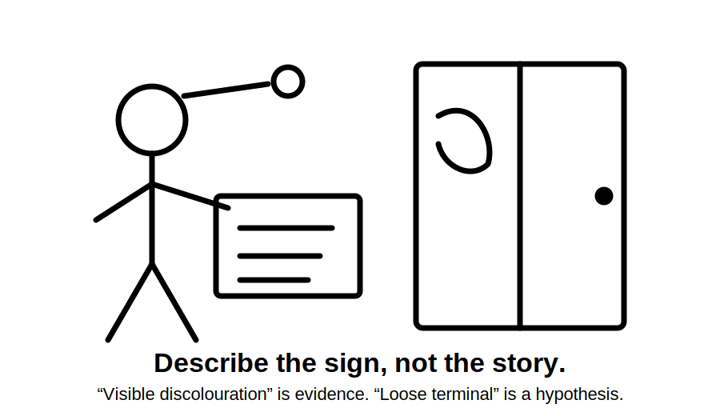
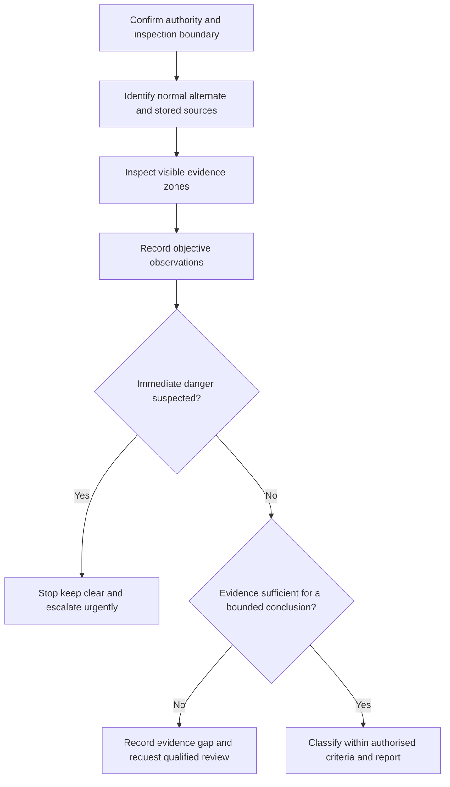
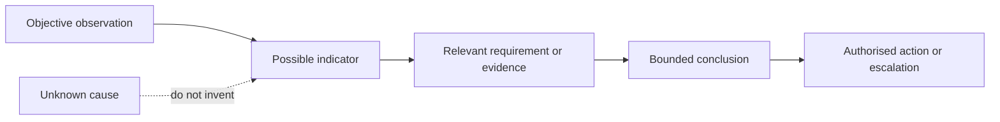
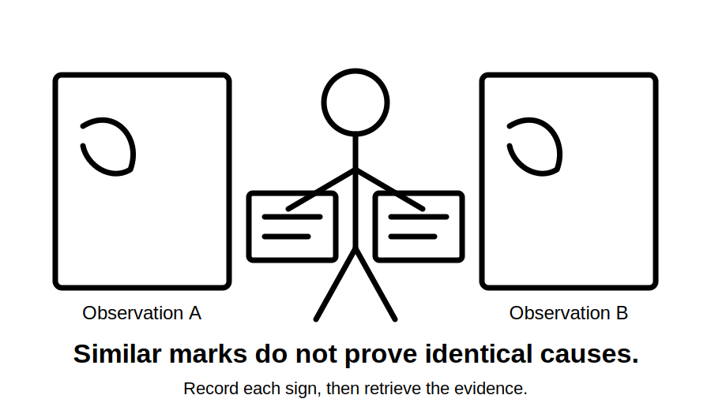

# Day 13C — Switchboard Defect Inspection

> **Source and safety notice:** This original module supports visual and documentary reasoning only. It does not authorise opening, touching, testing, altering or energising a switchboard. Exact defect classifications, access controls, inspection procedures, acceptance criteria and reporting duties must be checked against current authorised sources, workplace procedures and qualified review. It is not `technically-reviewed`.

## Navigation

- **Previous:** [Day 13B — Switchboard Construction and Arrangements](./day-13b-switchboard-construction-and-arrangements.md)
- **Next:** [Day 14 — Week 2 Integrated Design Exercise](../MASTER_PLAN.md#week-2--circuit-design-cables-and-switchboards)

## 1. Outcome and entry check

### Learning objectives

By the end of this block, the learner should be able to:

1. distinguish an observation from a defect conclusion;
2. organise a switchboard inspection by visible evidence zones;
3. recognise indicators of thermal, mechanical, identification, enclosure, source and termination concerns;
4. separate immediate danger indicators from items requiring further evidence;
5. apply the **S-I-G-N-S** workflow to a paper or externally visible inspection scenario;
6. write a factual defect record without inventing causes;
7. stop when access, competence or evidence boundaries are reached.

### Entry check

1. Why is a switchboard an assembly rather than a collection of breakers?
2. What is the difference between spare physical space and proven spare capacity?
3. Why can a correct observation still lead to an unsupported conclusion?
4. Name three conditions that should stop a learner from continuing an inspection.

Mark each answer **supported**, **partly supported** or **guess**.

## 2. Why it matters

A switchboard defect can affect several circuits, expose people to contact or fire risk, conceal an alternate source, or invalidate assumptions used in design and verification. Equally, careless reporting can mislabel normal features as defects or claim a cause that has not been established.

The governing mental model is:

**observe without disturbance → locate the evidence zone → describe the indicator → assess urgency within authority → request missing evidence → record and escalate**

## 3. Core concepts and terminology

### Observation, indicator, defect and cause

- An **observation** is what can be directly seen or supported by records.
- An **indicator** is an observation that may point to a safety, performance or documentation concern.
- A **defect conclusion** states that a requirement is not met and therefore needs authorised evidence.
- A **cause** explains why a condition occurred and usually requires more evidence than a visual observation alone.

Do not collapse these four levels into one sentence.

### Visible evidence zones

A bounded inspection can organise evidence into:

- board identity, schedules and warnings;
- enclosure condition and access boundary;
- visible switching and protective-device identity;
- unused openings, covers and barriers visible without disturbance;
- cable entries, support and obvious mechanical condition;
- signs of heat, moisture, contamination, corrosion or impact;
- normal, alternate and stored-energy source labels;
- housekeeping, clearance and accessibility around the board.

These are reasoning zones, not a substitute for an authorised inspection checklist.

### Urgency categories

Use neutral categories until authorised criteria are checked:

1. **stop and isolate through authorised controls** — an immediate danger is suspected;
2. **urgent qualified assessment** — a serious indicator exists but the condition is not fully established;
3. **evidence required** — records, labels or manufacturer information are missing or conflicting;
4. **maintenance or documentation item** — the issue is bounded and not represented as an immediate hazard.

Exact classifications and response duties remain `reference_check_required`.

## 4. Rule-finding workflow

Use **S-I-G-N-S**:

1. **S — Set the boundary:** identify authority, visible surfaces, every known source and prohibited actions.
2. **I — Inspect by evidence zone:** work systematically rather than following whatever first attracts attention.
3. **G — Gather objective signs:** record location, condition, label text, damage pattern and supporting documents without guessing.
4. **N — Name the evidence gap and urgency:** distinguish immediate concern, qualified assessment, missing evidence and routine follow-up.
5. **S — Stop, secure and report:** do not disturb equipment; escalate through the authorised process.

A useful record includes board identity, date, inspection boundary, known sources, exact location, observable condition, photographs where authorised, document conflicts, immediate controls taken, evidence requested and the person notified.

## 5. Visual model or worked example

### Fictional external inspection

From outside a closed distribution board, a learner observes:

- a damaged directory pocket;
- one circuit description that conflicts with a recent drawing;
- discolouration near a cable-entry area;
- an alternate-supply warning on the adjacent wall but not clearly associated with the board;
- stored items reducing clear access to the board.

A weak report says:

> “The board has an overheated cable and illegal labelling.”

A defensible paper record says:

> “Visible discolouration is present near the upper cable-entry area; cause and internal condition are not established. Circuit identification conflicts with the supplied drawing. Alternate-source relationship is unclear. Access is obstructed. Stop external inspection, keep the area controlled and request qualified assessment plus current source and circuit records.”

## 6. Practical application

For a fictional workshop switchboard photograph set and document pack:

1. state what the images do and do not show;
2. identify the inspection boundary and possible sources;
3. review each visible evidence zone using **S-I-G-N-S**;
4. write observations in location–condition–extent form;
5. separate confirmed document conflicts from suspected physical concerns;
6. assign a provisional urgency category without claiming an official defect code;
7. list the exact records or qualified checks needed next;
8. prepare a concise handover under **observed**, **risk indicator**, **missing evidence**, **immediate control** and **next authorised action**.

## 7. Common errors and safety checkpoint

### Common errors

- opening a cover to “get a better look”;
- treating absence of visible damage as proof of safety;
- diagnosing a loose termination from discolouration alone;
- ignoring alternate, generated or stored-energy sources;
- using vague phrases such as “looks unsafe” without location or evidence;
- copying an old defect code without checking current authorised criteria;
- moving obstructions or touching the enclosure when authority is unclear;
- reporting cosmetic condition as equivalent to an electrical defect;
- failing to record conflicting labels and documents.

### Stop conditions

Stop and escalate when there is smoke, burning smell, arcing sound, active water entry, severe damage, exposed accessible conductive parts, uncertain source status, unexpected operation, evidence of recent heat, missing barriers visible from outside, or any need to open, touch, test or alter the assembly. Keep clear and follow the workplace emergency and isolation process through authorised persons.

## 8. Retrieval and next links

### Closed-note retrieval

1. Distinguish observation, indicator, defect conclusion and cause.
2. Name six visible evidence zones.
3. Expand **S-I-G-N-S**.
4. Why is “discolouration proves a loose termination” unsupported?
5. What should a bounded defect record contain?
6. Name four stop conditions.

### Exit check

The learner is ready to continue when they can inspect a paper or externally visible scenario systematically, write objective observations, identify evidence gaps, avoid unsupported causes and stop before access or competence boundaries are crossed.

### Knowledge-base links

- [[Day 13B - Switchboard Construction and Arrangements]]
- [[Day 13C - Switchboard Defect Inspection]]
- [[Day 14 - Week 2 Integrated Design Exercise]]
- [[Inspection Testing and Verification]]
- [[Fault Finding and Commissioning]]

### Review boundary

This module remains `review-required`, safety-critical and `reference_check_required`. Exact defect categories, inspection procedures, access controls, emergency responses, reporting duties and acceptance criteria require current authorised sources and qualified technical review.

<!-- sequence-navigation:start -->
### Sequence navigation

- [← Previous: Day 13B — Switchboard Construction and Arrangements](./day-13b-switchboard-construction-and-arrangements.md)
- [Four-week learning plan](../MASTER_PLAN.md)
- [Next: Day 14 — Week 2 Integrated Design Exercise →](./day-14-week-2-integrated-design-exercise.md)
<!-- sequence-navigation:end -->
