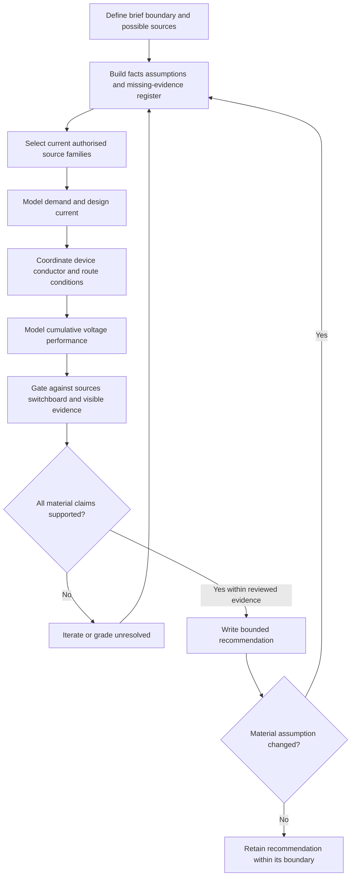
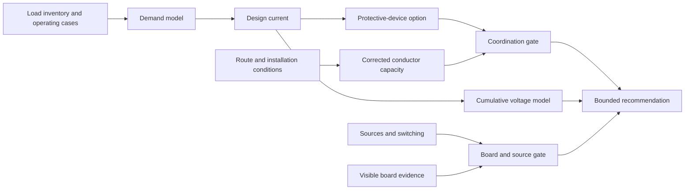

# Day 14 — Week 2 Integrated Design Exercise

> **Source, assessment and safety notice:** This is an original paper-based integration exercise, not an official RTO assessment, compliant design, construction instruction, isolation procedure or field inspection authority. All currents, lengths, factors, capacities and equipment descriptions are fictional. Exact methods, values, classifications, ratings, acceptance criteria, switching arrangements and inspection duties remain `reference_check_required`. This module is not `technically-reviewed`.

## Navigation

- **Previous:** [Day 13C — Switchboard Defect Inspection](./day-13c-switchboard-defect-inspection.md)
- **Next:** [Day 15 — Wiring Systems and Mechanical Protection](./day-15-wiring-systems-and-mechanical-protection.md)

## 1. Outcome and entry check

### Learning objectives

By the end of this block, the learner should be able to:

1. convert a mixed-use brief into facts, assumptions, missing information and source-verification tasks;
2. maintain one consistent design basis across demand, conductor, route, voltage-drop, source and switchboard reasoning;
3. identify the controlling condition rather than reporting only favourable calculations;
4. apply the **D-E-S-I-G-N** workflow to a complete fictional design case;
5. grade inputs as observed, documented, derived, assumed or missing;
6. grade conclusions as described, supported, verified or unresolved;
7. reject an unsupported option without inventing a replacement answer;
8. explain which earlier conclusions reopen when one material assumption changes.

### Entry check — ten minutes, closed note

Write one sentence for each prompt:

1. Connected load versus maximum demand.
2. Design current, device rating and corrected conductor capacity.
3. Why one adverse route section can control a decision.
4. Why voltage drop must be modelled across the full relevant path.
5. Why **off** is not equivalent to **isolated**.
6. Why spare board space does not prove capacity.
7. Observation versus defect cause.
8. Which evidence is needed before using **compliant**, **safe**, **suitable**, **isolated** or **will operate**.

Mark each answer **guess**, **unsure**, **reasonably confident** or **certain**. Correct any high-confidence unsafe assumption before continuing.

## 2. Why it matters

Real design tasks combine loads, route conditions, protection, voltage performance, source arrangements, switchboard constraints and visible evidence. Individually plausible steps can still form an invalid whole when assumptions change between calculations or when a material source or constraint is omitted.

The governing mental model is:

**brief and boundary → evidence register → consistent design basis → calculation chain → physical and source gates → bounded recommendation → change propagation**

A favourable calculation is one branch of evidence, not an approval.

## 3. Core concepts and terminology

### Design brief and design basis

The **design brief** states the task, purpose and constraints. The **design basis** records the operating cases, source arrangement, load assumptions, route, environment, equipment data and authorised references used throughout the reasoning.

### Evidence register

Use five input grades:

1. **Observed** — visible in supplied photographs or drawings.
2. **Documented** — stated in a current schedule, label or authorised record.
3. **Derived** — calculated from stated inputs using a visible method.
4. **Assumed** — plausible but not evidenced.
5. **Missing** — required for the conclusion but unavailable.

### Controlling condition

A **controlling condition** governs the current decision. It may be demand, route conditions, corrected conductor capacity, voltage performance, source topology, board limitations, fault performance or a missing item that prevents a conclusion.

### Integration error

An **integration error** occurs when individually plausible steps do not share one consistent basis—for example, using different unexplained currents or route assumptions in connected calculations.

### Bounded recommendation

A **bounded recommendation** states supported findings, rejected options, unresolved evidence, review flags and the exact next authorised action.

### Claim grades

- **Described** — states supplied facts or observations.
- **Supported** — connects applicable evidence into a bounded conclusion.
- **Verified** — requires complete authorised evidence and qualified confirmation.
- **Unresolved** — a material gap prevents the claim.

## 4. Rule-finding workflow

Use **D-E-S-I-G-N**:

1. **D — Define** the brief, boundary, possible supplies and required outputs.
2. **E — Extract** facts, assumptions, missing evidence and field-action exclusions.
3. **S — Select** current authorised source families and manufacturer information.
4. **I — Integrate** demand, design current, device, conductor, route factors, voltage drop and other required checks using one basis.
5. **G — Gate** the calculation chain against sources, switching, board arrangement, visible condition, route practicality and maintainability.
6. **N — Note** the bounded recommendation, rejected options, unresolved evidence and reopening triggers.

## 5. Visual model or worked example

### Complete fictional example

A training workshop proposes a new three-phase machine and additional single-phase loads. The route includes a ceiling section, grouped riser and warm plant room. An old drawing mentions a generator. The schedule shows spare ways. A photograph shows faded identification and discolouration near an unrelated device.

Trainer-only fictional data gives:

- design current: **48 A**;
- device rating: **50 A**;
- tabulated capacity: **76 A**;
- fictional factors: **0.90**, **0.82**, **0.88**;
- fictional voltage contributions: **1.1 V**, **1.8 V**, **2.4 V**.

Evidence-led response:

1. State the paper-only boundary and unknown generator relationship.
2. Grade every input in the evidence register.
3. Calculate `76 × 0.90 × 0.82 × 0.88 ≈ 49.4 A` only if the trainer's method permits combining those factors.
4. Do not support `48 A ≤ 50 A ≤ 49.4 A`; the fictional device rating exceeds the fictional corrected capacity.
5. Add fictional voltage contributions to **5.3 V** and compare only with the trainer's exercise criterion.
6. Treat spare ways as observed space, not proven board capacity.
7. Treat faded identification and discolouration as observations, not causes.
8. Grade the option unresolved and iterate the design.

### Worked-example fading

Repeat the example with one factor removed, a different route segment controlling the result and a confirmed inverter source. Complete the evidence register, calculation chain, source gate and bounded recommendation without reusing the first conclusion.

## 6. Practical application

### Integrated exercise — 90 to 120 minutes

A community workshop proposes a dust extractor, compressor, socket-outlet group, task lighting and future machine provision. The route crosses a ceiling, service riser, wash-down area and enclosed wall. Documents separately mention rooftop solar and a generator inlet. The board schedule is incomplete and external photographs show spare ways, mixed-age labels and an unused cable entry. No internal access, testing or measurement is authorised.

Produce:

1. a brief and boundary statement;
2. an evidence register;
3. a load inventory and operating-case model;
4. a traceable demand and design-current statement;
5. a route-segment and corrected-capacity chain using trainer-supplied fictional data;
6. a cumulative voltage model;
7. a source, switching and switchboard gate;
8. an observation-versus-cause record;
9. a one-page bounded recommendation;
10. a change-propagation note after replacing the future load with battery storage.

### Assessment rubric

Score each category from **0 to 2**.

| Category | 0 | 1 | 2 |
|---|---|---|---|
| Brief and evidence register | Missing or invented | Partial | Complete facts, assumptions, gaps and exclusions |
| Consistent design basis | Assumptions conflict | Minor inconsistency | One traceable basis across all checks |
| Calculation chain | Disconnected or unsupported | Mostly linked | Demand, device, conductor, route and voltage linked |
| Physical and source gates | Ignored | Partly reviewed | Sources, board and observations fully gated |
| Recommendation and iteration | Approval claimed | Some limits stated | Bounded recommendation with rejected options and reopening triggers |
| Safety and source discipline | Field authority or official values invented | General caution | Clear authority boundary and source verification |

A score of **10/12 or higher** with no critical error indicates readiness for Day 15. This is an educational threshold, not an official assessment rule.

### Critical errors

- omitting a stated or possible source;
- changing an assumption silently between calculations;
- presenting fictional values as official requirements;
- treating board space as proven capacity;
- promoting an observation to a cause;
- claiming approval, compliance, isolation or field authority.

## 7. Common errors and safety checkpoint

### Common errors

- calculating before defining operating cases;
- using connected load as maximum demand without a supported method;
- applying one route condition to every segment;
- combining factors without checking the applicable method;
- checking voltage performance only on the final section;
- using favourable arithmetic to ignore missing source or board evidence;
- failing to reopen earlier steps after one material change.

### Safety checkpoint

Stop and seek authorised guidance when the task drifts into opening, touching, testing, switching, isolation or alteration; a possible source remains unresolved; applicable requirements or manufacturer data are unavailable; immediate-danger indicators appear; fatigue causes repeated assumption changes; or a conclusion requires an invented value, condition, cause or approval.

## 8. Retrieval and next links

### Closed-note retrieval

1. Expand **D-E-S-I-G-N**.
2. Define design basis, controlling condition and integration error.
3. Name the five input grades and four claim grades.
4. Why can a favourable voltage result coexist with an unacceptable option?
5. Why does spare board space not prove suitability?
6. What belongs in a bounded recommendation?
7. Which changes require earlier conclusions to reopen?

### Changed-scenario transfer

Repeat the practical exercise after moving the route outdoors and confirming an alternate supply. Rebuild the route, source, calculation and board gates from the evidence register rather than editing only the final paragraph.

### Exit check

Proceed when you can maintain one consistent basis, identify the controlling condition, reject unsupported options, separate observations from causes, reopen dependent conclusions and state exact evidence required before technical approval.

### Knowledge-base links

- [[Day 13C - Switchboard Defect Inspection]]
- [[Day 14 - Week 2 Integrated Design Exercise]]
- [[Day 15 - Wiring Systems and Mechanical Protection]]
- [[Wiring Rules and Design]]
- [[Safety and Electrical Risk]]
- [[Inspection Testing and Verification]]

### Review boundary

Use current authorised standards, legislation, regulator and network requirements, manufacturer data, workplace procedures and RTO directions. No standards wording, demand tables, cable tables, factor datasets, voltage limits, device curves, switchboard ratings or official defect classifications are reproduced. Publication requires editorial and qualified technical review.

<!-- sequence-navigation:start -->
### Sequence navigation

- [← Previous: Day 13C — Switchboard Defect Inspection](./day-13c-switchboard-defect-inspection.md)
- [Four-week learning plan](../MASTER_PLAN.md)
- [Next: Day 15 — Wiring Systems and Mechanical Protection →](./day-15-wiring-systems-and-mechanical-protection.md)
<!-- sequence-navigation:end -->
