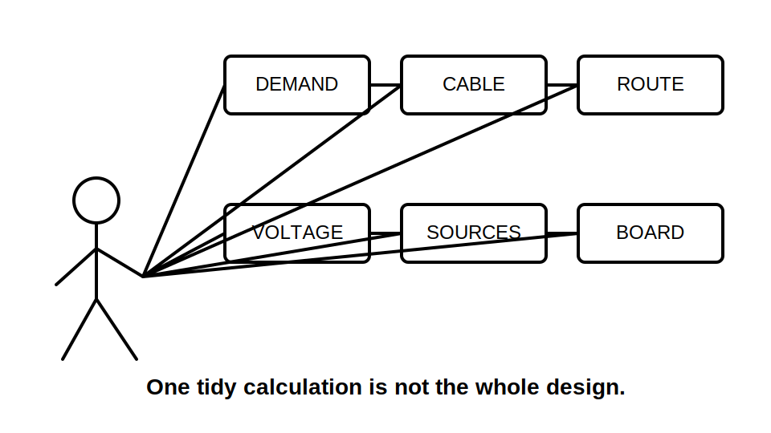
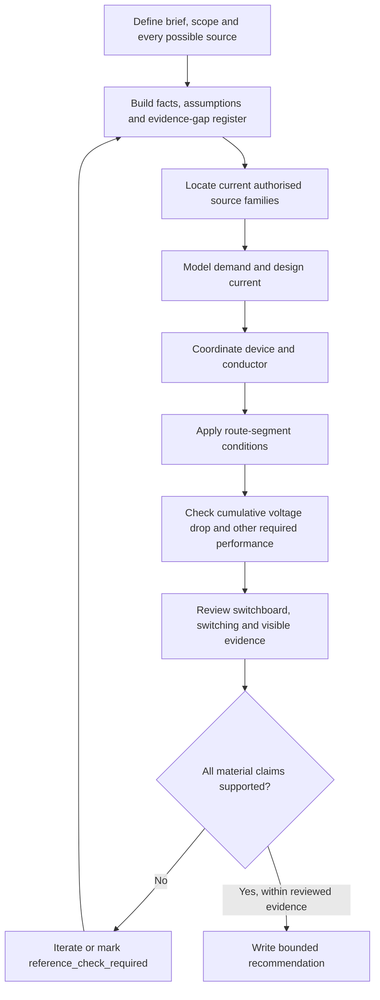
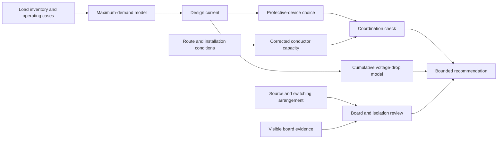
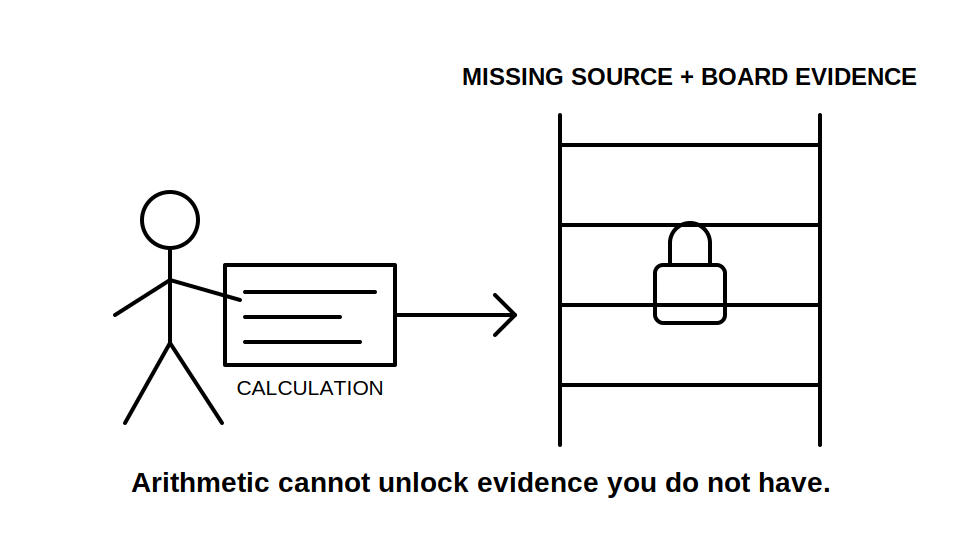

# Day 14 — Week 2 Integrated Design Exercise

> **Source, assessment and safety notice:** This is an original paper-based integration exercise, not an official RTO assessment, compliant design, construction instruction, isolation procedure or field inspection authority. All currents, lengths, factors, capacities and equipment descriptions are fictional. Exact methods, values, classifications, ratings, acceptance criteria, switching arrangements and inspection duties remain `reference_check_required`. This module is not `technically-reviewed`.

## Navigation

- **Previous:** [Day 13C — Switchboard Defect Inspection](./day-13c-switchboard-defect-inspection.md)
- **Next scheduled block:** [Day 15 — Wiring Systems and Mechanical Protection](../MASTER_PLAN.md#week-3--installation-requirements-and-special-locations)

## 1. Outcome and entry check

### Learning objectives

By the end of this block, the learner should be able to:

1. convert a mixed-use installation brief into stated facts, assumptions, missing information and source-verification tasks;
2. construct a load inventory and explain why connected load is not automatically maximum demand;
3. apply a traceable cable-selection chain from design current through protective-device coordination, installation conditions and follow-up checks;
4. divide a route into segments and identify which segment could control corrected current-carrying capacity;
5. prepare a cumulative voltage-drop model without inventing official limits or conductor data;
6. identify every stated or possible source before making switching, isolation or main-switch claims;
7. review switchboard capacity and visible condition as separate evidence questions;
8. produce a bounded design recommendation that clearly separates supported conclusions from unresolved technical review.

### Entry check — ten minutes, closed note

Write one sentence for each prompt:

1. What is the difference between connected load and maximum demand?
2. What relationship should be checked among design current, protective-device rating and corrected conductor capacity?
3. Why can one adverse route section control a cable decision?
4. Why should voltage drop be modelled across the complete supply path?
5. Why is **off** not equivalent to **isolated**?
6. Why does spare switchboard space not prove spare capacity?
7. What is the difference between an observation and a defect cause?
8. Which words require verified evidence before use: **compliant**, **safe**, **suitable**, **isolated**, **will operate**?

Mark each answer **secure**, **partial** or **guess**. Any unsafe assumption—especially omitted supplies, invented values or a field action outside the exercise boundary—must be corrected before continuing.

## 2. Why it matters

Real design and assessment tasks rarely arrive as one clean calculation. A short brief may combine demand, conductor selection, installation conditions, voltage drop, protective-device suitability, source arrangements, switchboard limitations and visible defects.

The risk is not merely arithmetic error. A neat calculation can still be invalid when:

- the wrong operating case was modelled;
- a load or alternate supply was omitted;
- a correction factor was applied to the wrong route segment;
- conductor data came from an unverified source;
- voltage drop ignored an upstream section;
- board space was mistaken for thermal or fault capacity;
- an observation was promoted to a cause without evidence;
- a design conclusion was presented as approval.

The aim of Day 14 is therefore **integration with bounded certainty**. The learner must connect the Week 2 models while preserving the evidence boundary around every technical claim.

## 3. Core concepts and terminology

### Design brief

A **design brief** is the stated task, operating need and constraint set. It may be incomplete. The learner must not silently convert missing information into facts.

### Design basis

The **design basis** records the selected operating cases, source arrangement, load assumptions, environmental conditions, route description, equipment information and authorised references used in the reasoning.

### Evidence register

An **evidence register** separates:

- stated facts;
- derived values;
- assumptions;
- missing information;
- source locations;
- review flags.

### Controlling condition

A **controlling condition** is the condition that governs the current decision. It may be a route segment, protective-device limitation, voltage-drop outcome, switchboard constraint, fault-performance requirement or unresolved source arrangement.

### Design iteration

A **design iteration** is a deliberate return to an earlier step after a later check fails or remains unsupported. Cable selection is not a one-pass lookup.

### Bounded recommendation

A **bounded recommendation** states what the available evidence supports, what remains unresolved and what authorised review is required before approval or field action.

### Integration error

An **integration error** occurs when individually plausible steps do not form one consistent design chain. Examples include using one current for demand, a different unexplained current for voltage drop, and a third device rating for cable coordination.

## 4. Rule-finding workflow

Use the **D-E-S-I-G-N** workflow.

1. **D — Define the brief and boundary.** Record the installation purpose, assessment scope, field-action exclusions, possible supplies and required outputs.
2. **E — Extract facts and evidence gaps.** Build the load, route, source, switchboard and environmental evidence register.
3. **S — Select governing source families.** Identify current authorised standards and amendments, legislation, regulator or network requirements, manufacturer data, workplace procedures and RTO directions.
4. **I — Integrate the calculation chain.** Link maximum demand, design current, protective device, conductor capacity, correction factors, voltage drop and other required checks using consistent assumptions.
5. **G — Gate the design against physical evidence.** Review source switching, board arrangement, visible condition, route practicality, termination constraints and maintainability.
6. **N — Note the bounded conclusion.** State the preferred option, rejected options, unresolved evidence, review flags and exact next authorised action.

The diagram is a study reasoning model, not a universal field sequence or approval process.

## 5. Visual model or worked example

### Integrated dependency model

No branch is sufficient alone. The final recommendation depends on a consistent set of load, route, conductor, source and board assumptions.

### Fictional worked integration

**Scenario:** A training workshop proposes a new three-phase machine, two single-phase socket-outlet groups and lighting. The fictional design pack states:

- an existing main switchboard supplies a distribution board;
- the proposed circuit route includes a ceiling section, a grouped riser section and a warmer plant-room section;
- a standby generator connection is shown on an old drawing but its present relationship to the board is unclear;
- the board schedule shows spare ways;
- a photograph shows one faded circuit label and a discoloured area near an unrelated device;
- fictional calculation data supplied by the trainer gives a proposed design current of **48 A**, a device rating of **50 A**, a tabulated conductor capacity of **76 A**, fictional route factors of **0.90**, **0.82** and **0.88**, and fictional voltage contributions of **1.1 V**, **1.8 V** and **2.4 V**.

A traceable paper response is:

1. **Brief boundary:** the task is to compare design options on paper. It does not authorise opening the board, testing, isolation or installation work.
2. **Evidence register:** record the loads, operating assumptions, route segments, old generator drawing, board schedule and photograph. Mark generator topology, present board condition, conductor data source and official criteria as unresolved.
3. **Demand model:** use the trainer-supplied fictional maximum-demand result only for the exercise. Do not treat its factors as standards data.
4. **Coordination model:** calculate the fictional corrected capacity as `76 × 0.90 × 0.82 × 0.88 ≈ 49.4 A` only if the supplied method permits those factors to be combined in that manner. The result would not support a confident `48 A ≤ 50 A ≤ 49.4 A` coordination statement because the device rating exceeds the fictional corrected capacity.
5. **Iteration:** options may include revisiting conductor size, installation arrangement, device choice, load model or route. No option is approved without verified data and all required checks.
6. **Voltage model:** total fictional contribution is `1.1 + 1.8 + 2.4 = 5.3 V`. Compare it only with the trainer's stated exercise criterion; do not invent an official limit.
7. **Source and board gate:** spare ways do not establish thermal, fault, enclosure, device-compatibility or maintainability capacity. The unclear generator relationship prevents a complete switching or isolation conclusion.
8. **Visible evidence:** faded labelling and discolouration are observations requiring bounded reporting and authorised follow-up. They do not establish a cause or prove the proposed circuit is unacceptable.
9. **Conclusion:** the first option is not presently supported by the fictional capacity chain, and the source and board evidence is incomplete. Iterate the design and escalate the unresolved generator and board evidence for authorised review.

The example demonstrates integration and rejection logic. It does not provide a real design value, compliance result or field instruction.

## 6. Practical application

### Integrated design exercise — 90 to 120 minutes

Use the following fictional brief.

A community workshop wants to add:

- one three-phase dust extractor;
- one single-phase compressor;
- a bank of general socket-outlets;
- task lighting;
- provision for a future machine.

The proposed route runs from an existing main switchboard through a ceiling space, a shared service riser and an enclosed workshop wall. A rooftop solar system and a portable generator inlet are mentioned in different documents. The switchboard schedule is incomplete. External photographs show spare ways, mixed-age labels and one unused cable entry. No internal access, testing or measurements are authorised.

The trainer provides a separate fictional data sheet for arithmetic. Treat every figure as exercise-only.

#### Part A — brief and evidence register, 15 minutes

Create six headings:

1. stated facts;
2. operating cases;
3. assumptions;
4. missing information;
5. source families to verify;
6. field-action exclusions and stop conditions.

Include normal supply, solar, generator, future load, route sections and board evidence.

#### Part B — load and demand model, 15 minutes

1. Build a load inventory.
2. Separate connected load from the selected maximum-demand method.
3. Identify simultaneous and mutually exclusive operating cases.
4. Record which demand factors or methods require authorised-source verification.
5. Produce one design-current statement with its assumptions visible.

#### Part C — cable-selection and derating chain, 20 minutes

For each candidate option, record:

- design current;
- proposed protective-device rating and characteristic source;
- conductor construction and installation method;
- tabulated capacity source;
- each route segment and applicable condition;
- factor source and combination method;
- corrected capacity;
- coordination result;
- unresolved follow-up checks.

Reject any option whose evidence chain is incomplete, even when the arithmetic appears favourable.

#### Part D — voltage-drop model, 15 minutes

1. Draw the complete path from supply point to the final load.
2. Record the operating current used for each section.
3. identify conductor data, route length and phase assumptions.
4. Calculate each fictional section contribution.
5. Add contributions and compare only with the exercise criterion supplied by the trainer.
6. Record starting or other operating cases that may require a separate review.

#### Part E — sources, switching and switchboard gate, 15 minutes

Prepare a paper review covering:

- every normal, alternate, generated, stored or feedback source mentioned or reasonably indicated by the documents;
- the intended main-switch and switching relationships requiring verification;
- board identity, spare ways, enclosure, equipment compatibility, thermal considerations, fault-rating evidence, conductor facilities, labels and maintainability;
- objective visual observations;
- evidence that cannot be established from photographs or schedules.

Do not write an isolation sequence or infer internal condition from external appearance.

#### Part F — recommendation and challenge, 10 to 20 minutes

Write a one-page recommendation containing:

1. preferred design option;
2. reason for rejecting alternatives;
3. controlling condition;
4. consistent calculation chain;
5. unresolved source and board evidence;
6. `reference_check_required` items;
7. exact next authorised review action;
8. a sentence limiting the conclusion to the paper exercise.

Then challenge the response:

- Did one assumption change between calculations?
- Was any source omitted?
- Was spare space treated as capacity?
- Was an observation treated as a cause?
- Was an exercise value presented as an official requirement?
- Was any field action implied without authority?

## 7. Common errors and safety checkpoint

### Common integration errors

- calculating before defining operating cases;
- using connected load as maximum demand without a supported method;
- selecting a conductor before documenting the installation method;
- applying one correction factor to an entire route without segment evidence;
- multiplying factors without verifying the permitted method;
- checking only the final circuit for voltage drop;
- changing current, length or power-factor assumptions without recording why;
- assuming device rating below tabulated capacity proves final suitability;
- treating spare switchboard ways as proof of capacity;
- omitting solar, generator, storage or feedback paths from the source model;
- converting discolouration, noise, smell or damaged labelling directly into a cause;
- writing **compliant**, **safe**, **isolated** or **will operate** without sufficient evidence.

### Safety checkpoint

Stop the exercise and seek authorised guidance when:

- the task drifts from paper review into opening, touching, testing, switching or altering equipment;
- any possible supply or feedback path is unresolved;
- the applicable standard, amendment, jurisdiction or network requirement is unknown;
- conductor, device, enclosure or assembly data cannot be traced to an authorised source;
- the switchboard evidence suggests immediate danger or requires access beyond the approved boundary;
- fatigue causes repeated assumption changes or arithmetic mistakes;
- the only way to reach a conclusion is to invent a value, condition, cause or approval.

A technically neat answer does not override competence, access, isolation, supervision or source-verification requirements.

## 8. Retrieval and next links

### Retrieval questions

1. What are the six stages of D-E-S-I-G-N?
2. Why is a design basis necessary?
3. What makes a condition controlling rather than merely relevant?
4. Why is cable selection iterative?
5. How can a favourable voltage-drop result coexist with an unacceptable design?
6. Why does spare board space not prove suitability?
7. What is the evidence difference between discolouration and its cause?
8. Which unresolved supply detail can invalidate switching and isolation reasoning?
9. What belongs in a bounded recommendation?
10. Which statements in your exercise remain `reference_check_required`?

### Readiness check

Proceed to Day 15 only when you can:

- keep one consistent assumption set across demand, cable and voltage-drop reasoning;
- identify the controlling route or equipment condition;
- list every possible source without asserting an isolation outcome;
- separate visible evidence from defect cause;
- reject an unsupported option without replacing it with an invented answer;
- state the exact evidence required before technical approval.

### Next links

- **Previous module:** [Day 13C — Switchboard Defect Inspection](./day-13c-switchboard-defect-inspection.md)
- **Next module:** [Day 15 — Wiring Systems and Mechanical Protection](../MASTER_PLAN.md#week-3--installation-requirements-and-special-locations)
- **Knowledge note:** [Day 14 — Week 2 Integrated Design Exercise](../../../knowledge-base/Day%2014%20-%20Week%202%20Integrated%20Design%20Exercise.md)

## References and review boundary

Use only current authorised versions applicable to the task, including:

- AS/NZS 3000 and current amendments;
- applicable legislation, regulator and network requirements;
- relevant cable, protective-device, switchboard and equipment manufacturer data;
- workplace design, isolation, inspection and escalation procedures;
- RTO assessment directions and supervised practical requirements.

No standards wording, demand tables, cable tables, correction-factor datasets, voltage-drop limits, device curves, switchboard ratings or official defect classifications are reproduced here. Publication requires editorial review and qualified technical review.