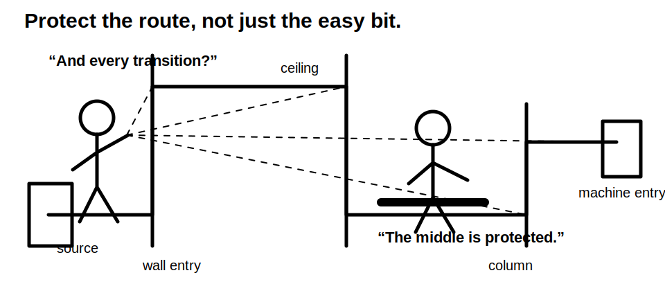
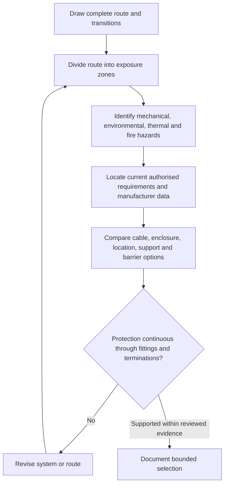
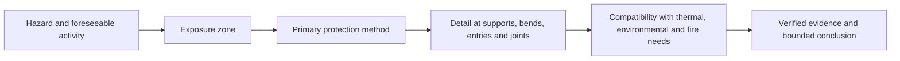
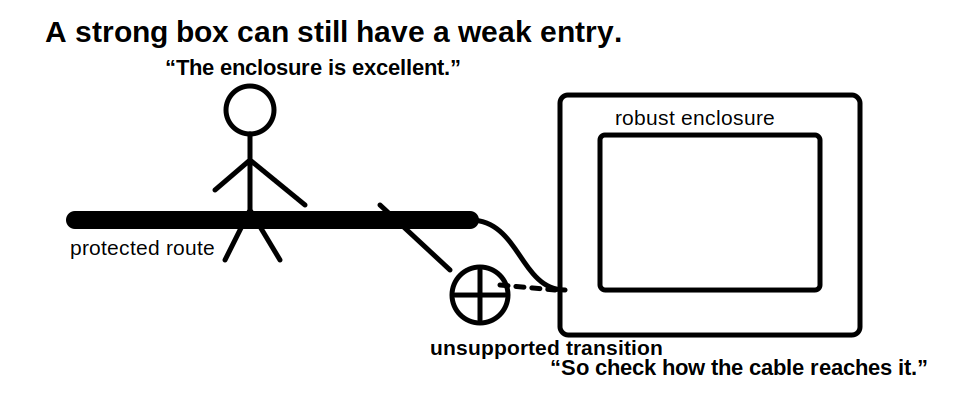

# Day 15 — Wiring Systems and Mechanical Protection

> **Source and safety notice:** This original learning module explains a reasoning framework for selecting and reviewing wiring systems. It does not reproduce standards tables, prescribe a field installation method or approve work. Exact wiring-system classifications, permitted locations, depth or spacing requirements, impact classifications, fire and environmental requirements, support methods, segregation rules and jurisdiction-specific obligations remain `reference_check_required`. This module is not `technically-reviewed`.

## Navigation

- **Previous:** [Day 14 — Week 2 Integrated Design Exercise](./day-14-week-2-integrated-design-exercise.md)
- **Next scheduled block:** [Day 16 — Consumer Mains, Submains and Final Subcircuits](../MASTER_PLAN.md#week-3--installation-requirements-and-special-locations)

## 1. Outcome and entry check

### Learning objectives

By the end of this block, the learner should be able to:

1. distinguish a cable from the complete wiring system that supports and protects it;
2. identify mechanical, environmental, thermal, fire, access and interference hazards along a route;
3. divide a route into exposure zones rather than applying one protection assumption to the whole run;
4. compare concealment, enclosure, armouring, location, barriers and warning measures as different control types;
5. explain why protection must continue through entries, bends, joints, transitions and terminations;
6. use current authorised sources and manufacturer information without reproducing protected tables or diagrams;
7. document a bounded wiring-system selection with assumptions and unresolved evidence visible;
8. stop when the route, substrate, services, equipment compatibility or field conditions are not known.

### Entry check — five minutes, closed note

Answer in one sentence each:

1. Why is conductor current-carrying capacity only one part of cable selection?
2. What could damage a cable before it is energised?
3. Why might a concealed route be more exposed to later damage than a visible route?
4. What route details can change at a wall, ceiling, floor, enclosure or underground transition?
5. Why does a protective enclosure not automatically solve heat, water, chemical or fire concerns?

Mark each answer **secure**, **partial** or **guess**. Revisit Day 9 or Day 10 if you cannot separate electrical capacity from physical installation suitability.

## 2. Why it matters

A conductor may be electrically adequate yet installed in a way that exposes it to crushing, penetration, abrasion, tension, vibration, heat, moisture, chemicals, ultraviolet radiation, pests, fire spread or later building work. Damage can arise during installation, normal use, maintenance or an unrelated trade activity years later.

The design question is therefore not merely **Which cable?** It is:

> Which complete wiring system remains suitable through every route segment, transition and foreseeable exposure?

A strong answer connects cable construction, support, enclosure, route position, entries, joints, terminations, accessibility, environment and future work. A weak answer names one product and assumes the route is uniform.

## 3. Core concepts and terminology

### Wiring system

A **wiring system** is the combined arrangement used to carry, contain, support, route and protect conductors. It may include cable construction, conduit, trunking, ducting, tray, supports, barriers, fittings, glands, entries, joints and termination arrangements.

### Mechanical damage

**Mechanical damage** is physical harm that can reduce insulation integrity, conductor continuity, enclosure performance or safe separation. Relevant mechanisms include impact, crushing, penetration, abrasion, excessive bending, pulling stress, vibration and movement.

### Exposure zone

An **exposure zone** is a route segment with a distinct hazard profile. A single circuit can pass through accessible wall cavities, ceiling spaces, plant areas, outdoor locations, underground sections and equipment entries. Each zone needs its own evidence review.

### Protection by position

**Protection by position** relies on the route being located where foreseeable contact or damage is sufficiently controlled. It is not a universal claim that concealed, elevated or inaccessible always means protected.

### Protection by construction or enclosure

Protection may be provided by the cable construction or by a separate system such as a suitable enclosure, barrier or guard. Compatibility, continuity, entries, bends and terminations still require review.

### Foreseeable activity

A **foreseeable activity** includes normal use, cleaning, storage, maintenance, fixing items to surfaces, excavation, pest activity, equipment movement and work by other trades. The assessment should not be limited to the moment of installation.

### Transition point

A **transition point** is where the wiring system changes direction, environment, support, enclosure or termination. These points often concentrate stress and are easy to omit from a route sketch.

## 4. Rule-finding workflow

Use the **R-O-U-T-E** workflow.

1. **R — Record the complete route.** Mark source, destination, each physical segment, change of level, entry, bend, joint and termination.
2. **O — Observe the exposure profile.** Identify impact, penetration, crushing, abrasion, movement, heat, water, chemicals, ultraviolet exposure, pests, fire conditions, access and nearby services.
3. **U — Use authorised source families.** Check current standards and amendments, legislation, regulator or network requirements, manufacturer instructions, equipment data, building/fire requirements, workplace procedures and RTO directions.
4. **T — Test each proposed control.** Ask what hazard it controls, where it begins and ends, whether it creates another problem, and whether every fitting and transition preserves the intended protection.
5. **E — Evidence the bounded selection.** Record supported decisions, assumptions, unresolved details, rejected options and the exact review needed before approval or work.

This is a study model, not a field installation sequence.

## 5. Visual model or worked example

### Layered protection model

A protection method is incomplete when the route detail breaks the protection chain.

### Fictional route review

A fictional circuit runs:

- from a distribution board through an accessible storeroom wall;
- above a suspended ceiling shared with other services;
- down a workshop column near mobile equipment;
- into a vibrating machine enclosure.

A sound paper review would:

1. split the route into at least four exposure zones;
2. identify fixing or penetration risk in the wall zone;
3. check support, access, service interaction and heat conditions above the ceiling;
4. consider impact and crushing near mobile equipment;
5. consider movement, vibration, entry and termination strain at the machine;
6. verify that the proposed wiring-system components are compatible with one another and the environment;
7. record unresolved dimensions, classifications and manufacturer requirements rather than inventing them.

The result is not one generic statement such as **install in conduit**. It is a route-specific evidence record.

## 6. Practical application

### Workshop route comparison — 25 minutes

A training facility proposes a new circuit from an existing board to equipment on the opposite side of a workshop. The preliminary sketch mentions:

- a plasterboard wall used for shelving;
- a ceiling space with maintenance access;
- a wash-down area;
- a short outdoor section;
- a steel equipment frame subject to vibration;
- an uncertain crossing with communications and pipework.

No opening, drilling, testing or physical inspection is authorised.

#### Part A — exposure map

Create a route table with these original headings:

| Segment | Known condition | Foreseeable hazard | Missing evidence | Source family to check |
|---|---|---|---|---|
| Board to wall entry |  |  |  |  |
| Wall section |  |  |  |  |
| Ceiling section |  |  |  |  |
| Wash-down transition |  |  |  |  |
| Outdoor section |  |  |  |  |
| Equipment entry |  |  |  |  |

Do not enter official classifications or minimum values from memory.

#### Part B — option comparison

Compare three conceptual options:

1. route change to reduce exposure;
2. cable construction selected for the environment;
3. added enclosure, guarding or barrier protection.

For each option, state:

- which hazard it addresses;
- where the control starts and ends;
- what transitions remain vulnerable;
- possible thermal, moisture, corrosion, fire, support or maintainability consequences;
- evidence required before selection.

#### Part C — bounded recommendation

Write no more than 150 words. Use this structure:

- **Supported:** what the current sketch establishes.
- **Not established:** route, substrate, service, environment or equipment details still missing.
- **Preferred direction:** the option that best reduces exposure without claiming compliance.
- **Required review:** authorised sources, manufacturer data and competent inspection needed before approval.

## 7. Common errors and safety checkpoint

### Common errors

- choosing a cable solely from current-carrying capacity;
- treating the full route as one environment;
- assuming concealed means protected;
- naming conduit, armouring or a barrier without identifying the hazard it controls;
- protecting the straight run while ignoring entries, bends, joints and terminations;
- overlooking installation damage caused by pulling, bending, fastening or poor support;
- solving impact risk while creating heat, moisture, corrosion or maintainability problems;
- assuming one product description proves compatibility with every fitting and enclosure;
- inventing official depths, distances, zones or classifications from memory;
- writing **compliant** when material evidence remains unresolved.

### Safety checkpoint and stop conditions

Stop the exercise or escalate when:

- the actual route, substrate or nearby services are unknown;
- the proposal involves opening, drilling, excavation, penetration or access outside the authorised learning boundary;
- damage, exposed conductive parts, overheating, moisture ingress or an immediate hazard is observed;
- the suitability or compatibility of cable, enclosure, fittings, glands, supports or equipment entries cannot be verified;
- a fire-rated, hazardous, medical, explosive, corrosive or otherwise specialised environment may apply;
- current authorised requirements, manufacturer instructions or competent supervision are unavailable.

This module does not authorise physical work, live access, testing, repair or alteration.

## 8. Retrieval and next links

### Recall check — closed note

1. Define a wiring system in your own words.
2. Name six mechanical or environmental exposure mechanisms.
3. Why should a route be divided into exposure zones?
4. What does each letter in **R-O-U-T-E** represent?
5. Why can protection by position fail over the life of an installation?
6. Which route details commonly break a protection chain?
7. Why can an added enclosure create new design questions?
8. What evidence must be visible before using the word **suitable**?

### Applied retrieval

Sketch a route from a switchboard to a fixed outdoor appliance. Mark five exposure zones and one transition risk at each boundary. Then exchange the appliance for indoor vibrating equipment and identify which assumptions change.

### Confidence calibration

For each answer, record **guessing**, **unsure**, **reasonably confident** or **certain**. Prioritise any high-confidence answer that omitted transitions, foreseeable later work or an authorised-source check.

### Related topics

- [Day 9 — Complete Cable-Selection Workflow](./day-09-complete-cable-selection-workflow.md)
- [Day 10 — Installation Conditions and Derating](./day-10-installation-conditions-and-derating.md)
- [Day 14 — Week 2 Integrated Design Exercise](./day-14-week-2-integrated-design-exercise.md)
- [[Day 15 - Wiring Systems and Mechanical Protection]]
- [[Wiring Rules and Design]]
- [[Safety and Electrical Risk]]

### Next block

Continue to **Day 16 — Consumer Mains, Submains and Final Subcircuits**.

## References and currency notice

- AS/NZS 3000:2018 and current amendments — topic reference only; use authorised access and verify the applicable wiring-system and mechanical-protection requirements.
- Applicable legislation, regulator, network, building/fire and workplace requirements.
- Current manufacturer instructions and compatibility data for cables, enclosures, fittings, supports, entries and connected equipment.
- RTO-approved learning and assessment material.

Capstone Ready is an independent educational resource. It is not affiliated with or endorsed by Standards Australia, Standards New Zealand, an electrical regulator or a registered training organisation. Always use current authorised standards, legislation, regulator guidance and your RTO's approved procedures.

**Review state:** `review-required`; `reference_check_required`; safety-critical; not `technically-reviewed`.

<!-- sequence-navigation:start -->
### Sequence navigation

- [← Previous: Day 14 — Week 2 Integrated Design Exercise](./day-14-week-2-integrated-design-exercise.md)
- [Four-week learning plan](../MASTER_PLAN.md)
- [Next: Day 16 — Consumer Mains, Submains and Final Subcircuits →](./day-16-consumer-mains-submains-and-final-subcircuits.md)
<!-- sequence-navigation:end -->
