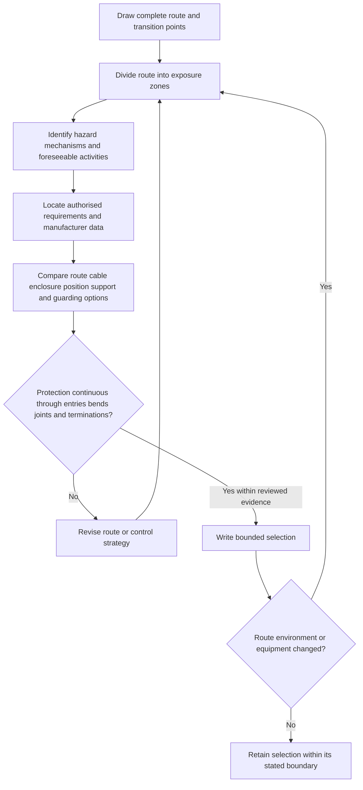
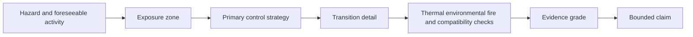

# Day 15 — Wiring Systems and Mechanical Protection

> **Source and safety notice:** This original module teaches a paper-based selection and review framework. It does not reproduce standards tables, prescribe a field installation method or approve work. Exact classifications, permitted locations, dimensions, impact levels, fire and environmental requirements, support methods, segregation rules and jurisdiction-specific obligations remain `reference_check_required`. This module is not `technically-reviewed`.

## Navigation

- **Previous:** [Day 14 — Week 2 Integrated Design Exercise](./day-14-week-2-integrated-design-exercise.md)
- **Next:** [Day 16 — Consumer Mains, Submains and Final Subcircuits](./day-16-consumer-mains-submains-and-final-subcircuits.md)

## 1. Outcome and entry check

### Learning objectives

By the end of this block, the learner should be able to:

1. distinguish a cable from the complete wiring system that carries, supports and protects it;
2. divide a route into exposure zones and transition points;
3. identify mechanical, environmental, thermal, fire, access and interference hazards;
4. compare route change, cable construction, enclosure, guarding and position as different control strategies;
5. explain why protection must remain continuous through supports, bends, entries, joints and terminations;
6. apply the **R-O-U-T-E** workflow using authorised source families;
7. grade route evidence and write a bounded selection without inventing official dimensions or classifications;
8. reopen the analysis when route, substrate, nearby service, environment or connected equipment changes.

### Entry check — five minutes, closed note

1. Why is current-carrying capacity only one part of cable selection?
2. What can damage a wiring system before and after energisation?
3. Why can a concealed route remain exposed to foreseeable damage?
4. What often changes at a wall, ceiling, floor, enclosure or underground transition?
5. Why can an enclosure solve one hazard while creating another?

Rate each answer **guess**, **unsure**, **reasonably confident** or **certain**. Revisit Day 9 or Day 10 when electrical capacity is being confused with physical installation suitability.

## 2. Why it matters

A conductor may be electrically adequate yet exposed to penetration, crushing, abrasion, tension, vibration, heat, moisture, chemicals, ultraviolet radiation, pests, fire spread or later building work. Risk often concentrates at route changes rather than along the obvious straight section.

The governing mental model is:

**complete route → exposure zones → hazard mechanisms → control options → transition continuity → authorised evidence → bounded selection**

The question is not simply **Which cable?** It is **Which complete wiring system remains supportable through every route segment, transition and foreseeable activity?**

## 3. Core concepts and terminology

### Wiring system

A **wiring system** is the combined arrangement used to carry, contain, support, route and protect conductors. It may include cable construction, conduit, trunking, ducting, tray, supports, barriers, fittings, glands, entries, joints and terminations.

### Exposure zone

An **exposure zone** is a route segment with a distinct hazard profile. One circuit may pass through accessible walls, ceiling spaces, plant areas, outdoor locations, underground sections and equipment entries.

### Transition point

A **transition point** is where direction, environment, support, enclosure, movement or termination changes. These points often concentrate stress and break otherwise plausible protection strategies.

### Foreseeable activity

A **foreseeable activity** includes installation work, normal use, cleaning, storage, maintenance, fixing to surfaces, excavation, pests, equipment movement and work by other trades.

### Protection strategies

- **Route avoidance:** remove or reduce exposure.
- **Protection by position:** locate the system where foreseeable contact or damage is controlled.
- **Protection by construction:** use cable or assembly characteristics suited to the hazard.
- **Protection by enclosure or guarding:** add a compatible physical control.
- **Administrative warning:** communicate a residual risk; it does not automatically replace physical suitability.

### Evidence grades

1. **Observed** — visible in the supplied route material.
2. **Documented** — stated in current drawings, schedules or product information.
3. **Manufacturer-verified** — supported by applicable compatibility or installation data.
4. **Assumed** — plausible but not evidenced.
5. **Missing** — required for the selection but unavailable.

### Claim grades

- **Described** — states the route or supplied condition.
- **Supported** — connects hazard, control and evidence within a bounded scenario.
- **Verified** — requires complete authorised evidence and qualified confirmation.
- **Unresolved** — a material gap prevents the selection claim.

## 4. Rule-finding workflow

Use **R-O-U-T-E**:

1. **R — Record the complete route:** mark source, destination, segments, changes of level, entries, bends, joints and terminations.
2. **O — Observe each exposure profile:** identify impact, penetration, crushing, abrasion, movement, heat, water, chemicals, ultraviolet exposure, pests, fire conditions, access and nearby services.
3. **U — Use authorised source families:** check current standards, legislation, regulator or network requirements, manufacturer instructions, building/fire requirements, workplace procedures and RTO directions.
4. **T — Test each proposed control:** ask what hazard it controls, where it begins and ends, what new problem it may create, and whether every fitting and transition preserves the protection.
5. **E — Evidence the bounded selection:** record supported decisions, rejected options, assumptions, missing evidence, claim grade and reopening triggers.

## 5. Visual model or worked example

### Complete fictional example

A circuit route passes:

- through an accessible storeroom wall;
- above a suspended ceiling shared with other services;
- down a workshop column near mobile equipment;
- into a vibrating machine enclosure.

Apply **R-O-U-T-E**:

1. Record four exposure zones plus every entry and transition.
2. Identify penetration risk in the wall, support and service interaction above the ceiling, impact near mobile equipment, and movement or strain at the machine.
3. Locate authorised requirements and applicable manufacturer information.
4. Compare route change, suitable cable construction and added guarding rather than naming one generic product.
5. Check whether entries, bends, supports and terminations preserve the intended control.
6. Mark unknown substrate, dimensions, classifications and compatibility as missing.
7. Write: **The route hazards are described; final wiring-system suitability is unresolved pending authorised route and compatibility evidence.**

### Worked-example fading

Repeat the example after moving the final equipment outdoors and adding a wash-down transition. Complete only the changed exposure zones, new evidence requests, affected control boundaries and revised claim grade.

## 6. Practical application

A training facility proposes a circuit crossing:

- a plasterboard wall used for shelving;
- a ceiling space with maintenance access;
- a wash-down area;
- a short outdoor section;
- a vibrating steel frame;
- an uncertain crossing with communications and pipework.

No opening, drilling, excavation, testing or physical inspection is authorised.

Produce:

1. a route sketch with exposure zones and transitions;
2. an evidence table with **segment**, **known condition**, **hazard**, **control option**, **missing evidence** and **source family**;
3. a comparison of route avoidance, cable construction and added physical protection;
4. a continuity review for supports, bends, entries, joints and terminations;
5. a bounded recommendation under **supported**, **not established**, **preferred direction**, **required review** and **reopening trigger**;
6. a changed-scenario review after adding regular forklift traffic.

### Assessment rubric

Score each category from **0 to 2**.

| Category | 0 | 1 | 2 |
|---|---|---|---|
| Route and zones | Incomplete route | Main segments only | Complete route, zones and transitions |
| Hazard mechanisms | Generic labels | Some mechanisms linked | Foreseeable activities and mechanisms linked by zone |
| Control comparison | Product named without purpose | Limited comparison | Route, construction and guarding options compared |
| Transition continuity | Ignored | Some transitions checked | Supports, entries, bends, joints and terminations checked |
| Evidence discipline | Official values invented | Gaps partly recorded | Evidence and claim grades used consistently |
| Safety communication | Physical work implied | General caution | Clear boundary, stop conditions and authorised next action |

A score of **10/12 or higher** with no critical error indicates readiness for Day 16. This is an educational threshold, not an official assessment rule.

### Critical errors

- selecting from current capacity alone;
- treating concealed location as automatic protection;
- ignoring a transition point;
- prescribing official dimensions or classifications from memory;
- claiming compatibility from physical fit or product coexistence;
- proposing drilling, excavation, access or alteration outside authority.

## 7. Common errors and safety checkpoint

### Common errors

- treating the route as one environment;
- naming conduit, armouring or a barrier without stating the hazard controlled;
- protecting the straight run while entries remain vulnerable;
- solving impact risk while creating heat, moisture, corrosion, fire or maintenance problems;
- overlooking installation damage from pulling, bending, fastening or poor support;
- assuming one product description proves compatibility with every fitting and enclosure;
- failing to reopen the selection after a route change.

### Safety checkpoint

Stop and escalate when the route, substrate or nearby services are unknown; the proposal requires opening, drilling, excavation, penetration or access outside the learning boundary; damage, exposed conductive parts, overheating or moisture ingress is observed; component compatibility cannot be verified; a specialised environment may apply; or authorised requirements and supervision are unavailable.

This module authorises no physical work, live access, testing, repair or alteration.

## 8. Retrieval and next links

### Closed-note retrieval

1. Define wiring system, exposure zone and transition point.
2. Expand **R-O-U-T-E**.
3. Name five hazard mechanisms and five control strategies.
4. Why can protection by position fail over the installation life?
5. Which details commonly break the protection chain?
6. Why can an enclosure create new design questions?
7. Name the evidence and claim grades.
8. State four stop conditions.

### Changed-scenario transfer

Sketch a route to a fixed outdoor appliance, then replace it with indoor vibrating equipment. Rebuild the exposure map and evidence requests rather than changing only the product label.

### Exit check

Proceed when you can map the complete route, connect hazards to controls, inspect transitions, grade evidence, write a bounded selection and stop before unsupported physical or compliance claims.

### Knowledge-base links

- [[Day 14 - Week 2 Integrated Design Exercise]]
- [[Day 15 - Wiring Systems and Mechanical Protection]]
- [[Day 16 - Consumer Mains Submains and Final Subcircuits]]
- [[Wiring Rules and Design]]
- [[Safety and Electrical Risk]]

### Review boundary

Use current authorised standards, legislation, regulator, network, building/fire and workplace requirements, manufacturer instructions and RTO material. No protected tables, diagrams, systematic clause wording, official dimensions or classification datasets are reproduced. Exact requirements remain `reference_check_required` and require qualified review.

<!-- sequence-navigation:start -->
### Sequence navigation

- [← Previous: Day 14 — Week 2 Integrated Design Exercise](./day-14-week-2-integrated-design-exercise.md)
- [Four-week learning plan](../MASTER_PLAN.md)
- [Next: Day 16 — Consumer Mains, Submains and Final Subcircuits →](./day-16-consumer-mains-submains-and-final-subcircuits.md)
<!-- sequence-navigation:end -->
