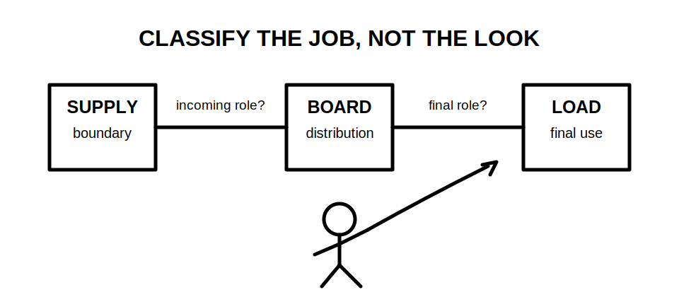
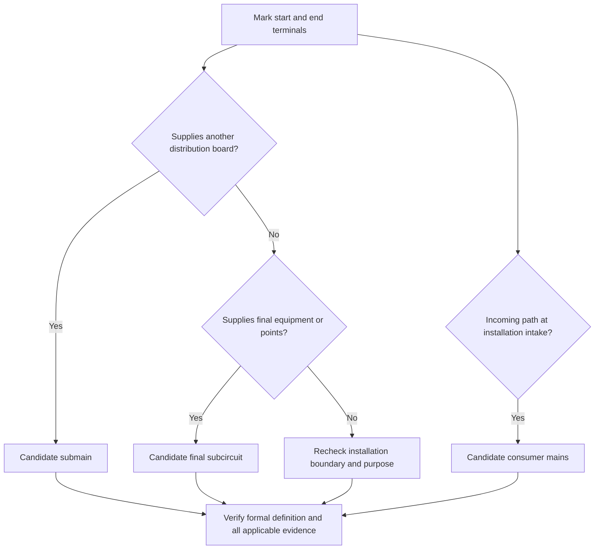
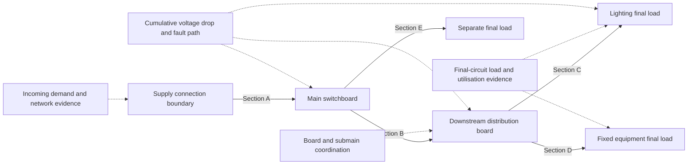
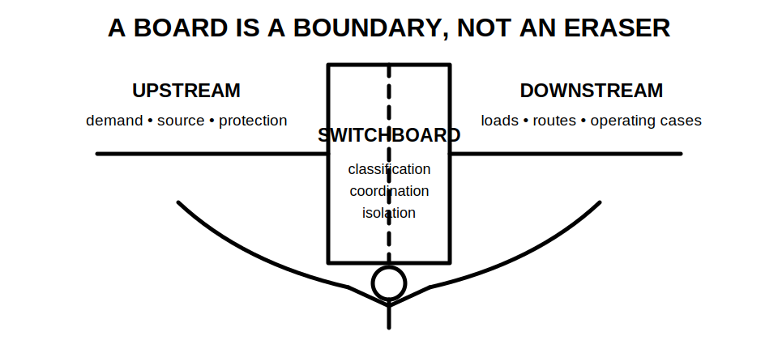

# Day 16 — Consumer Mains, Submains and Final Subcircuits

> **Source and currency notice:** This is original educational material. It teaches classification and evidence reasoning, not a substitute for current authorised standards, legislation, network requirements, manufacturer instructions or RTO procedures. Exact definitions, permitted arrangements, conductor requirements, protection, isolation, labelling and verification obligations require current-source checking and qualified technical review.

## Beat 1 — Outcome and entry check

### What you will learn

By the end of this block, you should be able to:

1. classify a conductor route as consumer mains, a submain or a final subcircuit from its source, destination and function;
2. explain why the classification affects the evidence that must be checked;
3. trace load, protection, isolation, earthing and voltage-drop responsibilities through a multi-board installation;
4. identify where a circuit boundary changes and avoid treating the whole installation as one undifferentiated cable run;
5. produce a bounded design review that separates confirmed facts, assumptions and unresolved source checks.

### Entry check

Answer without notes:

1. What is the difference between a cable and a circuit function?
2. Why can two conductors of similar size require different design evidence?
3. Where would you look for the upstream contribution to voltage drop?
4. What sources might remain energised after a main switch is opened?
5. Why does a route transition matter even when the conductor size does not change?

Record confidence beside each answer. A high-confidence error is a priority for correction.

## Beat 2 — Why it matters

The labels **consumer mains**, **submain** and **final subcircuit** are not decorative names. They describe where electrical energy enters, how it is distributed and where it is finally delivered to equipment or points of utilisation.

Incorrect classification can lead to an incomplete review. Common consequences include:

- checking only the downstream cable while ignoring upstream demand or voltage-drop contribution;
- assuming one protective device covers a conductor segment that is actually supplied or protected differently;
- overlooking a board, source or isolation boundary;
- applying a final-circuit assumption to a distribution circuit;
- missing neutral, earthing, fault-level, enclosure or labelling implications at a transition;
- documenting a result that cannot be traced from source to load.

In an assessment, the strongest answer is not merely a correct label. It is a defensible explanation based on **source, destination, function and boundary**.

*Caption: The cable may look familiar. Its job still needs identification.*

## Beat 3 — Core concepts and terminology

### Function before appearance

Classify the circuit by asking four questions:

1. **Where does it begin?** Identify the supply point, source, switchboard or protective device.
2. **Where does it end?** Identify the board, equipment, outlet or point supplied.
3. **What does it supply?** Determine whether it distributes energy onward or supplies final utilisation points.
4. **What boundary changes occur?** Note changes in source, board, protection, isolation, route, ownership or operating case.

### Working mental model

Use these conceptual descriptions only as study prompts; verify formal definitions in current authorised sources:

- **Consumer mains** form the incoming supply path between the relevant supply connection boundary and the main switchboard or installation intake arrangement.
- **Submains** distribute supply from one switchboard or distribution point to another downstream board or distribution assembly.
- **Final subcircuits** leave a switchboard or distribution point to supply final equipment, outlets or points of utilisation rather than another general distribution board.

The physical conductor does not announce its category. Similar-looking cables may perform different functions in different installations.

### The hierarchy is an evidence chain

For each section, keep five linked records:

- **load basis** — what demand or operating case drives the section;
- **protection basis** — what device or arrangement protects the section and under what conditions;
- **conductor and route basis** — construction, installation conditions, derating and mechanical/environmental suitability;
- **voltage and fault basis** — cumulative voltage drop, prospective fault conditions and required protective performance;
- **control and identification basis** — switching, isolation, source labelling and board/circuit identification.

A satisfactory downstream result does not repair an unsupported upstream assumption.

## Beat 4 — Rule-finding workflow: T-R-A-C-E

Use **T-R-A-C-E** to review each circuit section without reproducing standards content.

1. **T — Terminals:** mark the exact start and end points.
2. **R — Role:** classify what the section does in the supply hierarchy.
3. **A — Applicable sources:** identify the current standard, legislation, network, manufacturer and RTO source families that govern it.
4. **C — Coordination:** check load, protection, conductor, route, voltage, fault, neutral, earthing and isolation interactions.
5. **E — Evidence:** record the source used, assumptions made, unresolved items and the bounded conclusion.

The diagram produces a **candidate classification**, not an authoritative compliance conclusion. Confirm the formal definition and arrangement in current authorised material.

### Source-search sequence

For a paper exercise:

1. identify the installation boundary and all sources on the drawing;
2. mark each board and protective device;
3. draw one line per conductor section;
4. assign a provisional function label;
5. locate the authorised definition and topic requirements;
6. check network-specific requirements for the incoming arrangement;
7. check manufacturer information for devices and assemblies;
8. record edition, amendment, jurisdiction and date accessed;
9. leave any unsupported value or arrangement as unresolved.

Do not infer an official requirement from an old worksheet, memory, a product catalogue alone or another learner’s notes.

## Beat 5 — Visual model and worked example

### Source-to-load dependency map

### Fictional worked classification

A fictional community workshop drawing shows:

- an incoming conductor set from a supply connection boundary to the main switchboard;
- a protected feeder from the main switchboard to a detached training-room board;
- one circuit from that board supplying lighting points;
- another circuit supplying a fixed training machine;
- a separate circuit from the main switchboard supplying an outdoor sign.

Apply T-R-A-C-E:

| Section | Terminals | Provisional role | Key evidence still required |
|---|---|---|---|
| A | Supply boundary → main switchboard | Consumer mains candidate | Formal boundary definition, network arrangement, demand, conductor/protection, isolation and intake requirements |
| B | Main switchboard → training-room board | Submain candidate | Board demand, upstream/downstream coordination, route derating, voltage drop, fault performance and board ratings |
| C | Training-room board → lighting points | Final subcircuit candidate | Load characteristics, switching, protection, conductor route and special-location conditions |
| D | Training-room board → fixed machine | Final subcircuit candidate | Equipment data, starting/operating case, local isolation, protection and manufacturer requirements |
| E | Main switchboard → outdoor sign | Final subcircuit candidate | Outdoor exposure, control, maintenance isolation, route protection and equipment data |

The labels are useful, but the real learning is the dependency chain. Section C’s voltage at the load depends on contributions through Sections A, B and C. Section D may impose a different operating case from Section C. Section B must be suitable for the board demand and for the fault and protection conditions at both ends.

No numerical result is calculated because official values and project data have not been supplied.

## Beat 6 — Practical application

### Scenario: small commercial tenancy with detached store

You receive a fictional single-line sketch containing:

- one main switchboard;
- a tenancy distribution board;
- a detached-store distribution board;
- lighting and socket-outlet circuits from each downstream board;
- a fixed water heater supplied from the main switchboard;
- a photovoltaic inverter connected at the tenancy board;
- incomplete labels on two conductor routes.

### Task A — Build the hierarchy

Create a schedule with these columns:

1. section ID;
2. start terminal or board;
3. end terminal, board or load;
4. candidate classification;
5. normal source;
6. possible alternative or feedback source;
7. upstream protective device;
8. downstream device or load;
9. route zones and transitions;
10. evidence missing.

### Task B — Review three operating cases

For each section, consider:

- normal daytime operation;
- high-load operation with both downstream boards active;
- alternative-generation present while the normal supply state changes.

Do not invent switching or protection behaviour. Record unknowns requiring current diagrams, manufacturer instructions or authorised-source review.

### Task C — Write a bounded conclusion

Use this pattern:

> Section B is provisionally classified as a submain because it distributes supply from the main switchboard to a downstream distribution board. A design conclusion cannot be completed until demand, route conditions, protective-device data, cumulative voltage drop, fault conditions, neutral/earthing arrangements, board ratings and all-source isolation evidence are verified against current authorised information.

A good answer makes the uncertainty visible rather than hiding it behind a confident cable-size statement.

## Beat 7 — Common errors and safety checkpoint

### Common errors

- classifying by cable size or number of conductors rather than function;
- calling every outgoing circuit a final subcircuit;
- treating a feeder to a downstream board as though it supplies only one connected load;
- checking voltage drop for only the last section;
- assuming the upstream device automatically proves downstream coordination;
- ignoring neutral loading, harmonics or phase allocation where relevant;
- overlooking alternate or feedback sources at downstream boards;
- treating the main switch as proof that every conductor is de-energised;
- assuming a circuit name proves the physical route and termination points;
- copying a formal definition or table instead of explaining the reasoning.

*Caption: A switchboard is a boundary, not an eraser.*

### Safety checkpoint

Stop the exercise and escalate when:

- the source, installation boundary or conductor destination is uncertain;
- drawings conflict with labels or visible arrangements;
- alternate, generated, stored or feedback supply may be present;
- protective-device, fault-level, board-rating or manufacturer data is missing;
- the task would require opening, touching, testing, switching, isolation, installation or alteration;
- an exact requirement cannot be verified in a current authorised source;
- the scenario is being treated as approval for real work.

This module does not provide a field isolation procedure or authorise work on electrical equipment. Physical work must follow applicable law, supervision, competency, safe-work systems and approved procedures.

## Beat 8 — Retrieval, practice and next links

### Recall check

1. What four questions establish a circuit section’s function?
2. Why is cable appearance an unreliable classifier?
3. What does each letter in T-R-A-C-E represent?
4. Why must voltage drop be considered cumulatively?
5. What evidence links protection to a submain?
6. How can a downstream source change isolation reasoning?
7. What is the difference between a candidate classification and a verified conclusion?
8. Name three stop conditions from this module.

### Applied practice

Draw a fictional installation with one incoming section, two downstream boards and four final loads. Then:

1. assign section IDs;
2. classify each section provisionally;
3. mark every board and protection boundary;
4. trace one normal and one alternative-source operating case;
5. list the evidence required before a design conclusion;
6. exchange the drawing with another learner and challenge one unsupported assumption.

### Reflection

Write one sentence for each prompt:

- I previously classified circuits by…
- I now classify them by…
- The upstream fact I am most likely to forget is…
- The source evidence I still need practice finding is…

### Previous and next

- Previous: [Day 15 — Wiring Systems and Mechanical Protection](./day-15-wiring-systems-and-mechanical-protection.md)
- Knowledge note: [[Day 16 - Consumer Mains Submains and Final Subcircuits]]
- Next: Day 17 — Bathrooms, Showers and Other Wet Areas

## References and review state

- AS/NZS 3000:2018 and current amendments — topic reference only; use authorised access.
- Applicable electrical-safety legislation, regulator, network-service-provider and RTO requirements.
- Current manufacturer instructions for protective devices, switchboards, generation equipment, cables and connected equipment.

**Review state:** `review-required`; `reference_check_required`; safety-critical; not `technically-reviewed`.

Before publication, a qualified reviewer must verify formal circuit classifications, supply boundaries, consumer-mains requirements, submain and final-subcircuit arrangements, protection, neutral and earthing treatment, voltage-drop and fault-performance methods, switching/isolation, labelling, board ratings, alternative supplies and jurisdiction-specific obligations against current authorised sources.