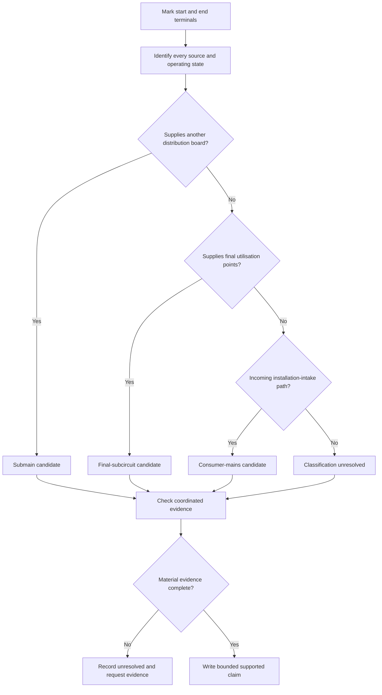
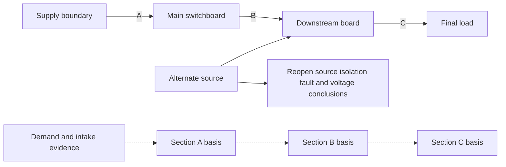

# Day 16 — Consumer Mains, Submains and Final Subcircuits

> **Source and safety notice:** This original module teaches paper-based classification and evidence reasoning. Exact formal definitions, supply boundaries, conductor arrangements, protection, neutral and earthing treatment, voltage-drop and fault methods, switching, isolation, labelling and verification obligations require current authorised sources and qualified review. It is not `technically-reviewed`.

## Navigation

- **Previous:** [Day 15 — Wiring Systems and Mechanical Protection](./day-15-wiring-systems-and-mechanical-protection.md)
- **Next:** [Day 17 — Bathrooms, Showers and Other Wet Areas](./day-17-bathrooms-showers-and-other-wet-areas.md)

## 1. Outcome and entry check

### Learning objectives

By the end of this block, the learner should be able to:

1. classify a conductor section provisionally from its source, destination, function and boundary;
2. map consumer-mains, submain and final-subcircuit dependencies across several boards;
3. distinguish observed, documented, derived, assumed and missing evidence;
4. trace load, protection, route, voltage-drop, fault, neutral, earthing and isolation dependencies;
5. identify where a changed source, board or operating state reopens earlier conclusions;
6. apply **T-R-A-C-E** without classifying by cable appearance;
7. write described, supported, verified or unresolved claims;
8. stop before unsupported design or energisation conclusions.

### Entry check

Without notes, answer:

1. Why can identical-looking cables perform different circuit functions?
2. What evidence establishes a circuit section's start and end?
3. Why can a downstream result depend on an upstream assumption?
4. How can a downstream generation source alter isolation reasoning?
5. What makes a classification provisional rather than verified?

Mark confidence. A high-confidence unsupported answer is a priority misconception.

## 2. Why it matters

Circuit labels describe an energy-distribution role, not an appearance. Misclassification can hide upstream demand, cumulative voltage drop, fault conditions, protection boundaries, alternative supplies or isolation dependencies.

The governing model is:

**terminals → function → operating state → coordination evidence → bounded claim**

## 3. Core concepts and terminology

### Circuit section

A **circuit section** is the bounded conductor path being reviewed between identified terminals or distribution points.

### Working classifications

These are study descriptions only; formal definitions remain `reference_check_required`:

- **Consumer mains candidate:** an incoming supply section associated with the installation intake and main switchboard boundary.
- **Submain candidate:** a section distributing supply from one switchboard or distribution point to another.
- **Final-subcircuit candidate:** a section supplying final equipment, outlets or utilisation points rather than another general distribution board.

### Evidence grades

- **Observed:** visible in the supplied drawing, photograph or scenario.
- **Documented:** stated in a current schedule, label or authorised record.
- **Derived:** reasoned from complete applicable evidence.
- **Assumed:** plausible but unsupported.
- **Missing:** required but unavailable.

### Claim grades

- **Described:** states what the evidence shows.
- **Supported:** gives a bounded conclusion from applicable evidence.
- **Verified:** requires complete authorised evidence and qualified confirmation.
- **Unresolved:** a material gap prevents the conclusion.

### Dependency chain

For every section, retain a traceable basis for load, protection, conductor and route, voltage and fault conditions, neutral and earthing, switching and isolation, source identity and board compatibility.

## 4. Rule-finding workflow

Use **T-R-A-C-E**:

1. **T — Terminals:** mark exact start and end points.
2. **R — Role:** assign a candidate function from source, destination and purpose.
3. **A — Applicable sources:** locate current standards, network, regulator, manufacturer and RTO evidence.
4. **C — Coordination:** test load, protection, route, voltage, fault, neutral, earth, switching and all-source interactions.
5. **E — Evidence and escalation:** grade the evidence and claim, record gaps and reopen dependencies after change.

## 5. Visual model or worked example

### Worked example

A fictional workshop has an incoming section, a feeder to a detached board, two final circuits and an inverter connected at the detached board.

| Section | Candidate role | Evidence needed | Initial claim |
|---|---|---|---|
| Supply boundary → main board | Consumer mains | Boundary, network, demand, protection and intake evidence | Unresolved pending authorised evidence |
| Main board → detached board | Submain | Demand, route, coordination, voltage, fault and board evidence | Supported classification only |
| Detached board → lighting | Final subcircuit | Load, protection, switching and route evidence | Described and provisionally classified |
| Inverter connection | Source interface | Manufacturer, switching, fault, isolation and labelling evidence | Reopens upstream and downstream claims |

### Worked-example fading

A second drawing shows a feeder from a main board to a labelled distribution board, but the schedule is old and no source diagram is supplied. Complete only:

1. the terminal statement;
2. evidence grades;
3. candidate classification;
4. three unresolved coordination questions;
5. one change that reopens the analysis.

## 6. Practical application

For a fictional site with two downstream boards, final circuits and a photovoltaic source, produce:

1. a section schedule;
2. a source and operating-state inventory;
3. provisional classifications;
4. an evidence ledger using the five grades;
5. cumulative dependency notes for load, voltage and fault conditions;
6. all-source switching and isolation questions;
7. a bounded conclusion for each section;
8. a change-propagation note after moving one source or load.

### Assessment rubric

Score each category from **0 to 2**.

| Category | 0 | 1 | 2 |
|---|---|---|---|
| Terminals and boundaries | Missing or invented | Partial | Complete and evidence-based |
| Functional classification | Appearance-based | Some correct labels | Source-destination-function reasoning |
| Coordination | Isolated cable check | Some dependencies | Full upstream/downstream chain |
| Evidence discipline | Assumptions as facts | Inconsistent grading | Evidence and claims graded consistently |
| Change propagation | Change ignored | Some reopening | Every dependent conclusion reopened |
| Safety communication | Practical authority implied | General caution | Clear stop conditions and bounded claims |

A score of **10/12 or higher** with no critical error indicates readiness for Day 17. This is an educational threshold, not an official assessment rule.

## 7. Common errors and safety checkpoint

Common errors include classifying by cable size, calling every outgoing section a final subcircuit, ignoring cumulative voltage drop, assuming one device proves coordination, overlooking alternate sources and treating labels as proof of physical routing.

Critical errors include inventing a supply boundary, omitting a disclosed source, claiming safe isolation from one switch position, or proposing opening, testing, alteration or energisation outside authority.

This module authorises no opening, touching, testing, switching, isolation, installation, alteration, verification or energisation. Stop when sources, destinations, drawings, protective-device data, fault information, board ratings or formal definitions are uncertain.

## 8. Retrieval and next links

### Closed-note retrieval

1. Expand **T-R-A-C-E**.
2. Name the five evidence grades and four claim grades.
3. Why is function stronger evidence than appearance?
4. Why is voltage drop cumulative?
5. How can a downstream source reopen upstream conclusions?
6. State three stop conditions.

### Changed-scenario transfer

Move the inverter from the downstream board to the main board, or add a second supply to the detached building. Rebuild the source inventory, classifications and every dependent conclusion; do not reuse the earlier answer.

### Knowledge-base links

- [[Day 15 - Wiring Systems and Mechanical Protection]]
- [[Day 16 - Consumer Mains Submains and Final Subcircuits]]
- [[Day 17 - Bathrooms Showers and Other Wet Areas]]
- [[Wiring Rules and Design]]
- [[Safety and Electrical Risk]]

## Review boundary

Formal classifications, supply boundaries, consumer-mains requirements, conductor and protection arrangements, neutral and earthing treatment, voltage-drop and fault methods, switching, isolation, labelling, board ratings and alternative-supply obligations remain `reference_check_required`. This module is not `technically-reviewed`.

<!-- sequence-navigation:start -->
### Sequence navigation

- [← Previous: Day 15 — Wiring Systems and Mechanical Protection](./day-15-wiring-systems-and-mechanical-protection.md)
- [Four-week learning plan](../MASTER_PLAN.md)
- [Next: Day 17 — Bathrooms, Showers and Other Wet Areas →](./day-17-bathrooms-showers-and-other-wet-areas.md)
<!-- sequence-navigation:end -->
