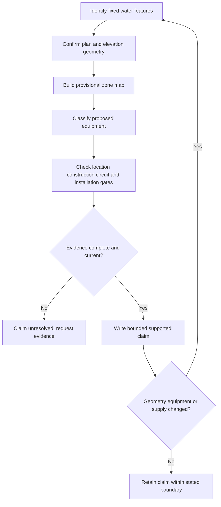
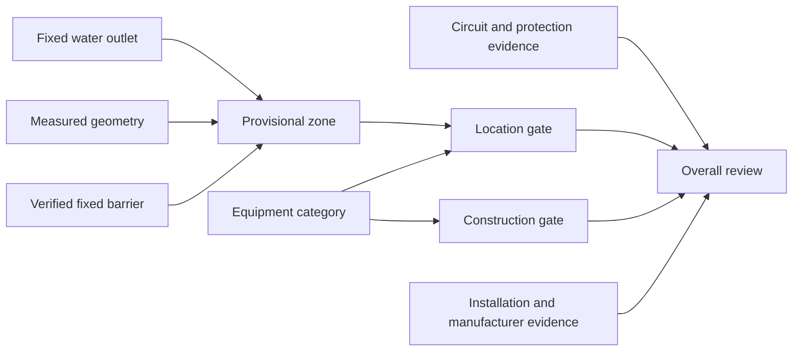

# Day 17 — Bathrooms, Showers and Other Wet Areas

> **Source and safety notice:** This original paper-based module does not reproduce standards diagrams, dimensions or permissions. Exact zone geometry, reference points, equipment categories, ingress requirements, additional protection, switching, isolation, earthing, bonding, wiring and verification obligations require current authorised sources and qualified review. It is not `technically-reviewed`.

## Navigation

- **Previous:** [Day 16 — Consumer Mains, Submains and Final Subcircuits](./day-16-consumer-mains-submains-and-final-subcircuits.md)
- **Next:** [Day 18 — Other Special Installations and Locations](./day-18-other-special-installations-and-locations.md)

## 1. Outcome and entry check

By the end of this block, the learner should be able to:

1. identify fixed water features and geometry evidence before classifying a wet area;
2. produce a provisional plan-and-elevation zone map without inventing dimensions;
3. distinguish location, construction, circuit and installation suitability gates;
4. grade evidence as observed, documented, manufacturer-verified, assumed or missing;
5. grade claims as described, supported, verified or unresolved;
6. apply **W-A-T-E-R** to each proposed item;
7. reopen conclusions when geometry, equipment, water outlets or supply details change;
8. state stop conditions without implying field authority.

### Entry check

1. Why is a room boundary not automatically a zone boundary?
2. Why can an IP marking fail to prove installation permission?
3. When are both plan and elevation views necessary?
4. Which facts about a screen or barrier must be verified?
5. What evidence gap prevents a final placement conclusion?

## 2. Why it matters

Wet locations can combine water, wet skin, grounded surfaces, restricted movement and closely accessible equipment. The assessment task is not to recall one diagram; it is to derive the correct evidence question from fixed geometry and equipment function.

The governing model is:

**water feature → verified geometry → provisional zone → equipment category → four gates → bounded claim**

## 3. Core concepts and terminology

### Provisional zone

A **provisional zone** is a learner-created spatial classification based on supplied geometry and current authorised definitions. It is not a verified compliance result.

### Fixed geometry

**Fixed geometry** includes the water outlet, vessel, enclosure, barrier and reference surfaces whose position and construction affect the classification.

### Four suitability gates

1. **Location:** is this equipment category permitted at the classified position?
2. **Construction:** is its environmental and ingress suitability supported?
3. **Circuit:** are supply, additional protection, switching, isolation and earthing suitable?
4. **Installation:** are wiring, mounting, entries, supports and manufacturer conditions suitable?

### Evidence grades

- **Observed:** visible in the supplied plan, elevation or scenario.
- **Documented:** stated in a current drawing, schedule or authorised record.
- **Manufacturer-verified:** supported by applicable product information.
- **Assumed:** plausible but unsupported.
- **Missing:** required but unavailable.

### Claim grades

- **Described:** states what is shown.
- **Supported:** gives a bounded conclusion from applicable evidence.
- **Verified:** requires complete authorised evidence and qualified confirmation.
- **Unresolved:** a material gap prevents the claim.

## 4. Rule-finding workflow

Use **W-A-T-E-R**:

1. **W — Water features:** identify every fixed outlet, vessel and relevant enclosure.
2. **A — Area geometry:** verify reference points, dimensions and fixed boundaries.
3. **T — Type of equipment:** classify function, supply and intended use.
4. **E — Evidence gates:** check location, construction, circuit and installation requirements.
5. **R — Record and reopen:** grade evidence and claims, record gaps and repeat after change.

## 5. Visual model or worked example

A fictional renovation shows a shower outlet, partial screen, fan, luminaire and socket-outlet, but omits screen construction, key dimensions, product data and circuit details.

| Evidence item | Grade | Consequence |
|---|---|---|
| Fixed outlet position | Observed | Can anchor provisional reasoning |
| Screen construction | Missing | Its effect on geometry is unresolved |
| Equipment symbols | Observed | Categories still require confirmation |
| Product suitability | Missing | Construction gate remains open |
| Circuit protection | Missing | Circuit gate remains open |

**Bounded conclusion:** the drawing supports an evidence request, not a final zone or placement verdict.

### Worked-example fading

A second plan includes complete dimensions but no elevation and no product schedule. Identify:

1. what can be described;
2. what remains unresolved;
3. which gate fails first for one item;
4. one changed feature that forces the map to be rebuilt.

## 6. Practical application

For a fictional accessible bathroom with a shower, bath, screen, towel rail, fan, luminaires, cabinet and socket-outlet, produce:

1. an original plan and elevation;
2. a fixed-feature and missing-dimension register;
3. a provisional zone map without numerical limits;
4. an evidence ledger for each item;
5. a four-gate review;
6. authorised-source and manufacturer evidence requests;
7. a bounded claim for each item;
8. a change-propagation note after moving the outlet or changing the screen.

### Assessment rubric

Score each category from **0 to 2**.

| Category | 0 | 1 | 2 |
|---|---|---|---|
| Water features and geometry | Missing or invented | Partial | Complete evidence-led map |
| Equipment classification | Generic labels | Some categories | Each item classified separately |
| Four-gate reasoning | One factor only | Some gates | All gates connected |
| Evidence discipline | Assumptions as facts | Inconsistent | Evidence and claims graded consistently |
| Change propagation | Change ignored | Some reopening | Map and dependent claims rebuilt |
| Safety communication | Field authority implied | General caution | Clear stop conditions and bounded claims |

A score of **10/12 or higher** with no critical error indicates readiness for Day 18. This is not an official assessment rule.

## 7. Common errors and safety checkpoint

Common errors include measuring from the wrong feature, assuming any screen changes a boundary, treating an IP rating as universal permission, using plan view alone, applying one rule to all equipment and quoting remembered dimensions.

Critical errors include inventing dimensions, copying a standards diagram, declaring compliance from an IP label, omitting a supply or proposing opening, testing, isolation or installation outside authority.

This module authorises no opening, touching, testing, switching, isolation, installation, alteration, verification or energisation. Stop when geometry, current definitions, product data, circuit details or source arrangements are uncertain, or when damage, ingress or immediate danger is observed.

## 8. Retrieval and next links

### Closed-note retrieval

1. Expand **W-A-T-E-R**.
2. Name the four suitability gates.
3. Name the five evidence grades and four claim grades.
4. Why can an IP marking be necessary but insufficient?
5. Why can both plan and elevation be required?
6. State three stop conditions.

### Changed-scenario transfer

Replace the fixed screen with a movable screen, change the shower outlet position, or add equipment supplied from another source. Rebuild the geometry, evidence ledger and dependent claims.

### Knowledge-base links

- [[Day 16 - Consumer Mains Submains and Final Subcircuits]]
- [[Day 17 - Bathrooms Showers and Other Wet Areas]]
- [[Day 18 - Other Special Installations and Locations]]
- [[Safety and Electrical Risk]]
- [[Wiring Rules and Design]]

## Review boundary

Exact wet-area definitions, geometry, reference points, dimensions, barrier effects, equipment permissions, ingress requirements, protection, supply, switching, isolation, earthing, bonding, wiring and verification obligations remain `reference_check_required`. This module is not `technically-reviewed`.

<!-- sequence-navigation:start -->
### Sequence navigation

- [← Previous: Day 16 — Consumer Mains, Submains and Final Subcircuits](./day-16-consumer-mains-submains-and-final-subcircuits.md)
- [Four-week learning plan](../MASTER_PLAN.md)
- [Next: Day 18 — Other Special Installations and Locations →](./day-18-other-special-installations-and-locations.md)
<!-- sequence-navigation:end -->
