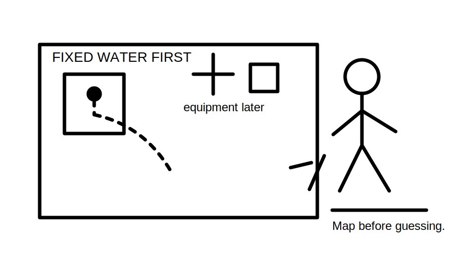
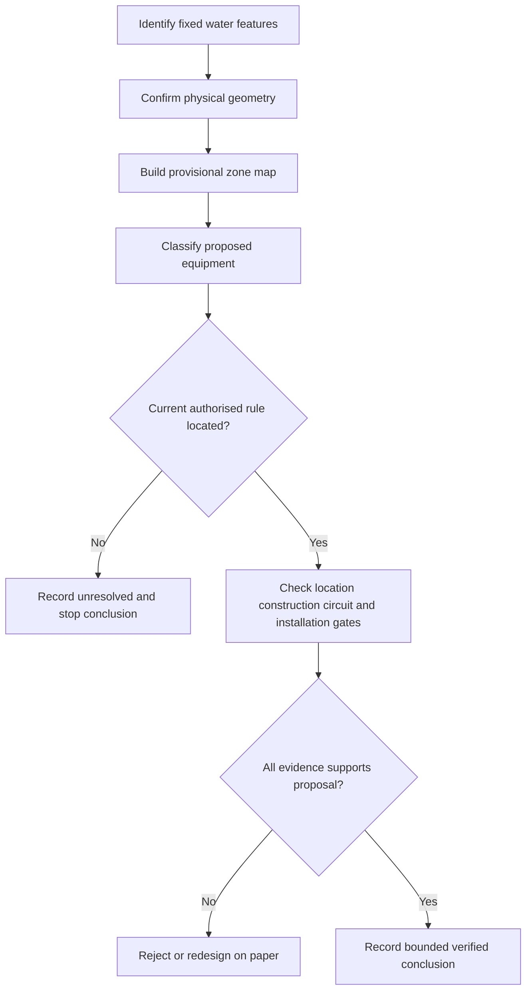
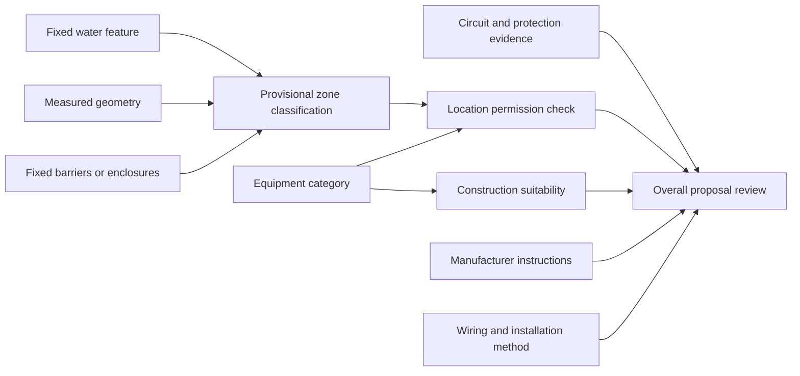
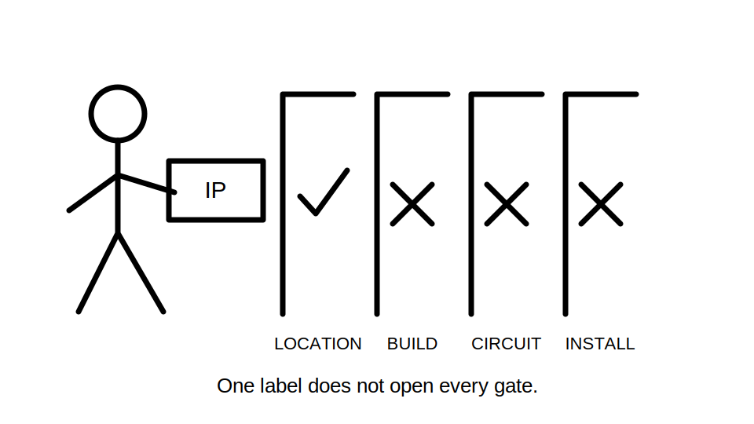

# Day 17 — Bathrooms, Showers and Other Wet Areas

> **Source and currency notice:** This is original educational material about evidence-based reasoning in wet locations. It is not a substitute for current authorised standards, legislation, regulator guidance, manufacturer instructions or RTO procedures. Exact zone boundaries, dimensions, equipment permissions, ingress-protection ratings, protection requirements, bonding arrangements and verification methods require current-source checking and qualified technical review.

## Beat 1 — Outcome and entry check

### What you will learn

By the end of this block, you should be able to:

1. explain why the presence and movement of water change electrical risk;
2. build a provisional wet-area zone map from fixed installation features without inventing dimensions;
3. separate equipment location, equipment suitability, circuit protection and installation-method questions;
4. use current authorised sources to verify a proposed arrangement;
5. write a bounded conclusion that clearly identifies assumptions and unresolved evidence.

### Entry check

Answer without notes:

1. Why can wet skin increase electric-shock consequence?
2. What is the difference between a room boundary and an electrical zone boundary?
3. Why is an equipment IP marking not, by itself, proof that installation is permitted?
4. What protection questions should be asked before considering equipment placement?
5. When should a drawing be treated as insufficient for a compliance decision?

Record confidence beside each answer. Correct high-confidence errors before continuing.

## Beat 2 — Why it matters

Bathrooms, showers and similar locations combine conductive water, wet skin, grounded surfaces, restricted movement and equipment that may be touched at close range. A design error can reduce the separation between a person and an energised part or place unsuitable equipment where splashing, spray, condensation or cleaning water is foreseeable.

Assessment errors commonly arise when a learner:

- memorises one diagram but does not identify the actual fixed water outlet or enclosure geometry;
- treats the entire room as one zone;
- selects equipment from an IP label alone;
- checks location but forgets circuit protection, wiring method, switching or manufacturer limits;
- assumes a portable screen or movable fitting changes a fixed boundary;
- quotes a remembered dimension without verifying the current source.

*Caption: Place the water source first. The equipment can wait its turn.*

## Beat 3 — Core concepts and terminology

### Hazard model

Wet-area reasoning begins with four interacting questions:

- **Where can water originate?** Identify fixed outlets, vessels, shower fittings and foreseeable spray or overflow paths.
- **Where can a person be exposed?** Consider standing, bathing, reaching and normal use without inventing behaviour.
- **What electrical equipment is proposed?** Identify its function, supply, construction, location and accessibility.
- **What safeguards apply together?** Consider location restrictions, equipment suitability, additional protection, wiring systems, isolation, earthing and verification.

### Zones are evidence boundaries

A wet-area zone is not simply “near water.” It is a defined spatial classification derived from the relevant installation geometry and the current authorised rules. The classification may depend on features such as:

- the type and position of a bath, shower or fixed water outlet;
- whether an enclosure or fixed barrier satisfies the applicable definition;
- the relevant vertical and horizontal reference surfaces;
- whether a feature is fixed, movable, open or enclosed;
- the exact point from which a boundary is measured.

Do not insert remembered dimensions into an exercise unless they have been checked against current authorised material.

### Four separate suitability gates

A proposed item must pass all relevant gates:

1. **Location gate** — is this equipment category permitted in the classified position?
2. **Construction gate** — does the equipment have the required environmental and ingress suitability?
3. **Circuit gate** — are supply, additional protection, switching, isolation and earthing arrangements suitable?
4. **Installation gate** — are wiring method, mounting, entries, supports and manufacturer conditions suitable?

Passing one gate does not imply the others pass.

## Beat 4 — Rule-finding workflow: W-A-T-E-R

Use **W-A-T-E-R** to avoid jumping from a room sketch directly to an equipment verdict.

1. **W — Water features:** identify every fixed water source, vessel, outlet and relevant enclosure.
2. **A — Area geometry:** build a provisional map from verified reference points and fixed boundaries.
3. **T — Type of equipment:** classify the proposed equipment, supply arrangement and intended use.
4. **E — Evidence checks:** verify location, protection, construction, wiring and manufacturer requirements.
5. **R — Record:** document the source, edition, assumptions, unresolved facts and bounded conclusion.

### Source-search sequence

For a paper exercise:

1. mark every fixed bath, shower fitting, water outlet and enclosure;
2. identify missing dimensions and ambiguous construction details;
3. locate the current wet-area definitions and diagrams in authorised material;
4. reproduce only your own simplified reasoning sketch, not the source figure;
5. locate the rule for the proposed equipment category;
6. check ingress, environmental and manufacturer requirements;
7. check circuit protection, switching, isolation, earthing and wiring-system requirements;
8. record edition, amendment, jurisdiction and date accessed;
9. leave unsupported details unresolved.

## Beat 5 — Visual model and worked example

### Evidence dependency model

### Fictional worked review

A fictional renovation drawing shows a fixed shower outlet, a partial screen, a wall-mounted fan, a luminaire and a socket-outlet symbol. Several dimensions and the screen construction are missing.

Apply W-A-T-E-R:

| Step | Finding | Consequence |
|---|---|---|
| Water features | Fixed shower outlet is shown | It becomes a primary geometry reference, subject to current definitions |
| Area geometry | Screen height, permanence and key distances are missing | No final zone map can be asserted |
| Type of equipment | Fan, luminaire and socket-outlet are different categories | Each requires a separate rule and suitability review |
| Evidence checks | Product data and circuit-protection details are absent | IP, location and protection compliance remain unresolved |
| Record | Drawing is incomplete | Request dimensions, construction details, circuit data and authorised-source verification |

The correct result is not a guessed zone diagram. It is a clear statement that the available evidence cannot support a final placement decision.

## Beat 6 — Practical application

### Scenario: accessible bathroom refurbishment

A fictional plan contains:

- an open shower area with a fixed outlet;
- a bath on an adjacent wall;
- a fixed glass screen of unspecified dimensions;
- a heated towel rail;
- an exhaust fan;
- two luminaires;
- a mirror cabinet with an internal electrical function;
- a socket-outlet proposed near the vanity;
- a switch proposed inside the room;
- no product schedules or circuit details.

### Task A — Build the evidence sketch

Create an original plan and elevation sketch. Mark:

1. fixed water features;
2. fixed and movable boundaries;
3. every missing dimension;
4. candidate zone reference surfaces without adding numerical limits;
5. each proposed electrical item;
6. the supply and switching information still required.

### Task B — Apply the four gates

For every item, prepare a table with:

- candidate location classification;
- equipment category;
- location rule to verify;
- construction or ingress evidence required;
- circuit and additional-protection evidence required;
- switching or isolation evidence required;
- manufacturer information required;
- conclusion: supported, unsupported or unresolved.

### Task C — Write a bounded conclusion

Use this pattern:

> The proposed item cannot yet be accepted or rejected because the zone geometry, equipment category, product suitability and circuit protection have not all been verified. Obtain the missing fixed dimensions and product/circuit evidence, then check each gate against current authorised sources.

## Beat 7 — Common errors and safety checkpoint

### Common errors

- measuring from the room wall instead of the defined water feature or reference surface;
- assuming any screen changes a zone boundary;
- treating a vanity or basin as equivalent to a bath or shower without checking the applicable topic;
- assuming a high IP rating permits equipment in any location;
- applying one equipment rule to all fans, luminaires, heaters, controls and socket-outlets;
- ignoring equipment supplied from another room or concealed source;
- forgetting additional protection, isolation, earthing or manufacturer limitations;
- using a plan view when an elevation is also required;
- copying a standards diagram or relying on an old training sketch;
- presenting a provisional zone as a verified compliance result.

*Caption: An IP label is useful evidence, not a universal passport.*

### Safety checkpoint

Stop the exercise and escalate when:

- fixed geometry, enclosure construction or water-outlet position is uncertain;
- current authorised zone definitions or equipment rules are unavailable;
- product markings, instructions or supply details cannot be verified;
- multiple or concealed sources may be present;
- the task would require opening, touching, testing, switching, isolation, installation or alteration;
- damaged equipment, exposed parts, water ingress or immediate danger is observed;
- a paper exercise is being treated as permission for real work.

This module does not provide a field isolation, testing or installation procedure. Physical work must follow applicable law, supervision, competency, safe-work systems and approved procedures.

## Beat 8 — Retrieval, practice and next links

### Recall check

1. What five steps make up W-A-T-E-R?
2. Why is a room boundary different from a zone boundary?
3. What information establishes the provisional geometry?
4. What are the four suitability gates?
5. Why is an IP rating insufficient by itself?
6. Why may both plan and elevation views be required?
7. What makes a barrier relevant to zone reasoning?
8. Name three stop conditions from this module.

### Applied practice

Draw a fictional room containing a shower, bath, fan, light, heater and socket-outlet. Deliberately omit three critical details. Exchange it with another learner and require them to:

1. identify the missing evidence before classifying zones;
2. list the authorised source topics needed;
3. apply all four suitability gates to one item;
4. write a bounded conclusion without guessing any dimension or permission.

### Reflection

Write one sentence for each prompt:

- The assumption I am most likely to make too early is…
- The evidence gate I most often forget is…
- The condition that should make me stop is…

### Navigation

- **Previous:** [Day 16 — Consumer Mains, Submains and Final Subcircuits](./day-16-consumer-mains-submains-and-final-subcircuits.md)
- **Knowledge note:** [[Day 17 - Bathrooms Showers and Other Wet Areas]]
- **Next:** Day 18 — Other Special Installations and Locations

## Technical-review flags

Before publication or operational use, a qualified reviewer must verify against current authorised sources:

- wet-area definitions, zone geometry, reference points and dimensions;
- the effect of fixed screens, barriers, enclosures and room construction;
- equipment categories and location permissions;
- ingress-protection and environmental requirements;
- additional protection, supply, switching, isolation, earthing and bonding requirements;
- wiring systems, cable routes, entries, mounting and verification;
- manufacturer instructions and jurisdiction-specific obligations.

**Review state:** `review-required`; `reference_check_required`; safety-critical; not `technically-reviewed`.
