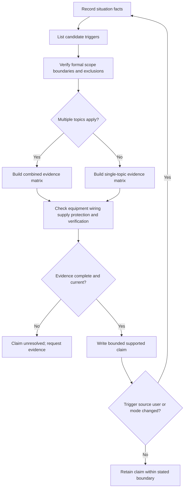
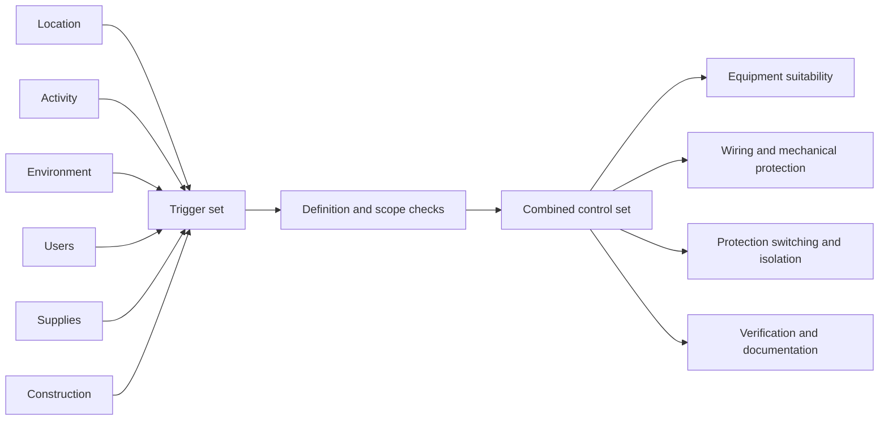

# Day 18 — Other Special Installations and Locations

> **Source and safety notice:** This original paper-based module teaches trigger recognition and evidence planning. Exact definitions, scope boundaries, equipment permissions, protection measures, separation requirements, testing and acceptance criteria require current authorised sources and qualified review. It is not `technically-reviewed`.

## Navigation

- **Previous:** [Day 17 — Bathrooms, Showers and Other Wet Areas](./day-17-bathrooms-showers-and-other-wet-areas.md)
- **Next:** [Day 19 — Rest, Retrieval and Catch-Up](./day-19-rest-retrieval-and-catch-up.md)

## 1. Outcome and entry check

By the end of this block, the learner should be able to:

1. identify location, activity, environment, supply, user and construction triggers;
2. distinguish a site label from a verified special-installation classification;
3. identify overlapping topic scopes without discarding general requirements;
4. grade evidence as observed, documented, manufacturer-verified, assumed or missing;
5. grade claims as described, supported, verified or unresolved;
6. apply **S-C-O-P-E** to unfamiliar scenarios;
7. reopen the evidence plan when a trigger, source, user group or operating mode changes;
8. state stop conditions without implying field authority.

### Entry check

1. Why is a location name insufficient for classification?
2. How can one site trigger several topic checks?
3. Why does product suitability not prove installation permission?
4. What must be verified before detailed requirements are applied?
5. When must a paper review stop without a verdict?

## 2. Why it matters

Special installations combine ordinary electrical hazards with unusual exposure, users, construction or supply conditions. The principal error is often not forgetting one requirement, but failing to recognise the complete trigger set.

The governing model is:

**situation facts → trigger set → verified scope → combined controls → evidence-led claim**

## 3. Core concepts and terminology

### Trigger categories

- **Location:** the physical setting or defined installation type.
- **Activity:** how people, animals, machinery or processes use the area.
- **Environment:** water, dust, corrosion, heat, cold, impact, vibration, fire or chemicals.
- **Supply:** temporary, generated, stored, multiple-source or unusual distribution arrangements.
- **User:** public access, children, patients, restricted movement or other vulnerability.
- **Construction:** conductive structures, transportable structures, confined spaces or unusual wiring conditions.

### Candidate topic

A **candidate topic** is a plausible special-installation subject requiring scope verification. It is not a final classification.

### Combined control set

A **combined control set** is the evidence-backed interaction of general and special requirements applying to the same scenario.

### Evidence grades

- **Observed:** directly shown.
- **Documented:** stated in a current authorised record.
- **Manufacturer-verified:** supported by applicable product information.
- **Assumed:** plausible but unsupported.
- **Missing:** required but unavailable.

### Claim grades

- **Described:** states what is shown.
- **Supported:** gives a bounded conclusion from applicable evidence.
- **Verified:** requires complete authorised evidence and qualified confirmation.
- **Unresolved:** a material gap prevents the claim.

## 4. Rule-finding workflow

Use **S-C-O-P-E**:

1. **S — Situation facts:** record arrangement, users, activity, environment, equipment and every source.
2. **C — Candidate triggers:** list every plausible topic without stopping at the first.
3. **O — Official scope:** verify definitions, boundaries, exclusions and interactions.
4. **P — Protection set:** identify equipment, wiring, supply, switching, protection and verification evidence.
5. **E — Evidence and escalation:** grade evidence and claims, record gaps and reopen after change.

## 5. Visual model or worked example

A fictional community facility includes an outdoor therapy pool, pump enclosure, battery-backed control system, public access, temporary outlet and nearby chemical store.

| Trigger | Evidence grade | Consequence |
|---|---|---|
| Water and public use | Observed | Several topic scopes may apply |
| Battery backup | Documented only by note | Source diagram still required |
| Boundary dimensions | Missing | Final scope cannot be asserted |
| Equipment schedules | Missing | Suitability and permission unresolved |
| Temporary supply | Assumed from symbol | Must be confirmed before conclusions |

**Bounded conclusion:** the scenario supports a candidate-topic and evidence plan, not an installation approval.

### Worked-example fading

A second site contains a transportable office, wash-down area and generator inlet, but no operating-mode description. Identify the six trigger categories, grade the evidence, build one matrix row and state what change would reopen the review.

## 6. Practical application

For a fictional mixed-use rural service area, produce:

1. a situation-fact register;
2. a six-category trigger register;
3. a candidate-topic list;
4. an authorised-source scope plan;
5. a combined evidence matrix;
6. source and operating-mode questions;
7. bounded claims using the four grades;
8. a change-propagation note after adding public access, a battery or temporary supply.

### Assessment rubric

Score each category from **0 to 2**.

| Category | 0 | 1 | 2 |
|---|---|---|---|
| Situation facts | Missing or invented | Partial | Complete and bounded |
| Trigger recognition | Site label only | Some triggers | All relevant categories considered |
| Scope and overlap | One topic assumed | Some scope checks | General and special topics integrated |
| Evidence discipline | Assumptions as facts | Inconsistent | Evidence and claims graded consistently |
| Change propagation | Change ignored | Some reopening | Evidence plan fully rebuilt |
| Safety communication | Field authority implied | General caution | Clear stop conditions and bounded claims |

A score of **10/12 or higher** with no critical error indicates readiness for Day 19. This is not an official assessment rule.

## 7. Common errors and safety checkpoint

Common errors include selecting a topic from the site name, stopping after one trigger, overlooking temporary or stored-energy supplies, treating environmental suitability as permission, ignoring general requirements and inventing dimensions or ratings.

Critical errors include omitting a disclosed source, asserting a formal scope without evidence, copying standards tables or figures, or proposing opening, testing, isolation, installation or energisation outside authority.

This module authorises no opening, touching, testing, switching, isolation, installation, alteration, verification or energisation. Stop when scope, boundaries, source arrangements, environmental risks, user risks, product data or current authorised sources are uncertain, or when immediate danger is observed.

## 8. Retrieval and next links

### Closed-note retrieval

1. Expand **S-C-O-P-E**.
2. Name the six trigger categories.
3. Why is a candidate topic not a verified classification?
4. Why can general and special requirements both apply?
5. Name the five evidence grades and four claim grades.
6. State three stop conditions.

### Changed-scenario transfer

Add a temporary event supply, public access, a battery or corrosive process to the worked scenario. Rebuild the trigger set, scope plan, combined matrix and dependent claims.

### Knowledge-base links

- [[Day 17 - Bathrooms Showers and Other Wet Areas]]
- [[Day 18 - Other Special Installations and Locations]]
- [[Day 19 - Rest Retrieval and Catch-Up]]
- [[Safety and Electrical Risk]]
- [[Wiring Rules and Design]]

## Review boundary

Formal definitions, scopes, boundaries, exclusions, equipment permissions, environmental suitability, wiring, mechanical protection, segregation, supply, switching, isolation, earthing, bonding, testing and acceptance criteria remain `reference_check_required`. This module is not `technically-reviewed`.

<!-- sequence-navigation:start -->
### Sequence navigation

- [← Previous: Day 17 — Bathrooms, Showers and Other Wet Areas](./day-17-bathrooms-showers-and-other-wet-areas.md)
- [Four-week learning plan](../MASTER_PLAN.md)
- [Next: Day 19 — Rest, Retrieval and Catch-Up →](./day-19-rest-retrieval-and-catch-up.md)
<!-- sequence-navigation:end -->
