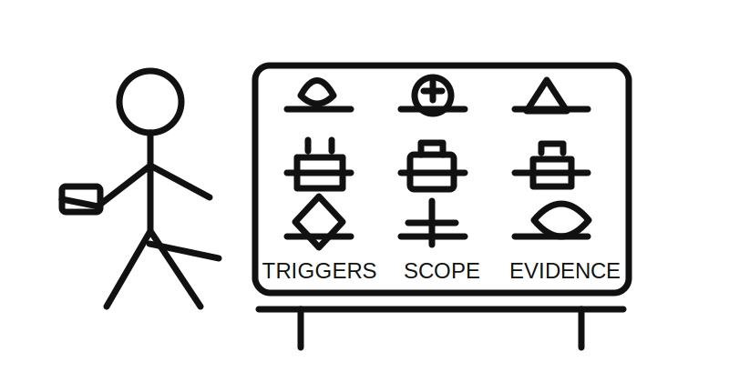
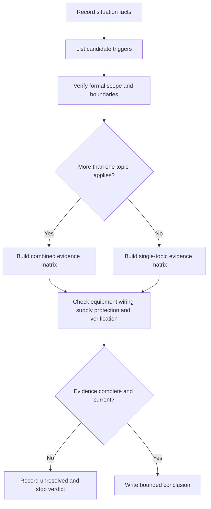
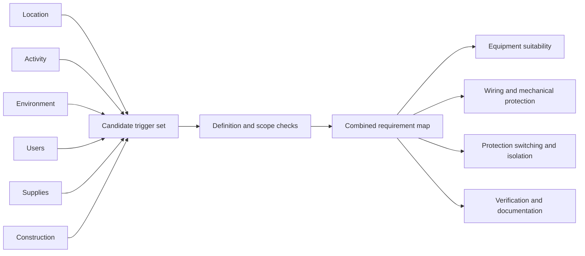
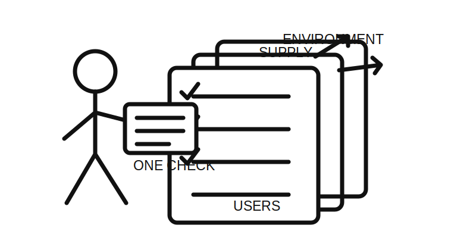

# Day 18 — Other Special Installations and Locations

> **Source and currency notice:** This is original educational material about recognising special-installation triggers and building an evidence plan. It is not a substitute for current authorised standards, legislation, regulator guidance, network requirements, manufacturer instructions or RTO procedures. Exact definitions, boundaries, equipment permissions, protection measures, separation distances, test requirements and acceptance criteria require current-source checking and qualified technical review.

## Beat 1 — Outcome and entry check

### What you will learn

By the end of this block, you should be able to:

1. recognise when an installation has conditions that may trigger special requirements;
2. separate location, activity, environment, supply and user-risk triggers;
3. classify a scenario without assuming that one remembered rule covers it;
4. build a current-source search plan for each identified trigger;
5. write a bounded conclusion that distinguishes confirmed facts from unresolved requirements.

### Entry check

Answer without notes:

1. What makes a location “special” for electrical design purposes?
2. Why can two installations in similar buildings require different controls?
3. What evidence is needed before deciding that a general installation rule is sufficient?
4. Why should several special-location topics sometimes be checked for one site?
5. When must a paper review stop without a compliance verdict?

Record confidence. Correct any high-confidence answer that relies only on a remembered label or rule.

## Beat 2 — Why it matters

Some installations combine ordinary electrical hazards with unusual exposure, restricted movement, conductive surroundings, public access, vulnerable users, harsh environmental conditions, temporary arrangements or multiple supplies. The mistake is not merely forgetting a detail. It is failing to recognise that a different evidence set may apply.

Common assessment and workplace failures include:

- treating a location name as the full classification;
- checking only water exposure while ignoring corrosion, heat, impact or public access;
- applying one special-location rule where several topics overlap;
- assuming portable, temporary or transportable equipment follows the same evidence path as fixed equipment;
- accepting product markings without checking installation, supply and protection requirements;
- quoting remembered dimensions or permissions without current authorised evidence.

*Caption: The sign on the door is not the whole classification.*

## Beat 3 — Core concepts and terminology

### A special location is a trigger set

Do not begin with a memorised list of places. Begin with the conditions that may alter risk or installation requirements:

- **location trigger** — the physical setting or defined installation type;
- **activity trigger** — how people, animals, machinery or processes use the area;
- **environment trigger** — water, dust, corrosion, heat, cold, vibration, impact, fire or chemical exposure;
- **supply trigger** — temporary supply, generation, storage, multiple sources, extra-low voltage or unusual distribution;
- **user trigger** — public access, children, patients, people with restricted movement or other vulnerable users;
- **construction trigger** — conductive structures, confined spaces, transportable structures or unusual mounting and wiring conditions.

One scenario may have several triggers. Each trigger can lead to a separate source check.

### Classification before permission

A sound review follows this order:

1. establish the facts;
2. identify possible special-location topics;
3. verify formal definitions and scope;
4. classify equipment, wiring and supply arrangements;
5. locate the applicable requirements;
6. combine overlapping controls;
7. record what remains unresolved.

The name of a site—such as “pool,” “caravan,” “construction site” or “medical room”—does not by itself prove the exact scope, boundaries or permitted arrangement.

### Overlap is normal

A single installation may require simultaneous consideration of:

- wet or corrosive conditions;
- additional protection;
- mechanical protection;
- switching and isolation;
- alternative or temporary supplies;
- public or vulnerable-user access;
- fire and emergency arrangements;
- inspection, testing and documentation.

Do not discard a general requirement merely because a special-location topic also applies. Determine how the requirements interact using current authorised sources.

## Beat 4 — Rule-finding workflow: S-C-O-P-E

Use **S-C-O-P-E** to prevent a location label from becoming an unsupported conclusion.

1. **S — Situation facts:** record the physical arrangement, users, activity, environment, equipment and supplies.
2. **C — Candidate triggers:** list every plausible special-location or special-installation topic.
3. **O — Official scope:** verify definitions, boundaries, exclusions and interactions in current authorised sources.
4. **P — Protection set:** identify the location, equipment, wiring, supply, switching, protection and verification evidence required.
5. **E — Evidence record:** document sources, assumptions, unresolved details and the bounded result.

### Source-search sequence

For a paper scenario:

1. describe the site without using a compliance label;
2. mark fixed and temporary features, users, activities and environmental exposures;
3. identify every supply source and operating mode;
4. search authorised material for definitions and scope before requirements;
5. check whether multiple special topics overlap;
6. locate equipment, wiring, protection, switching, isolation and verification requirements;
7. check regulator, network, manufacturer and RTO requirements where relevant;
8. record edition, amendment, jurisdiction and date accessed;
9. leave unsupported dimensions, ratings and permissions unresolved.

## Beat 5 — Visual model and worked example

### Trigger-to-evidence model

### Fictional worked review

A fictional community facility includes an outdoor therapy pool, a pump enclosure, a small battery-backed control system, public access, a temporary event outlet and a nearby corrosive chemical store. The drawing omits boundary dimensions, equipment schedules and supply details.

Apply S-C-O-P-E:

| Step | Finding | Consequence |
|---|---|---|
| Situation facts | Water, public users, chemicals, pumps, battery backup and temporary supply are present | Several risk dimensions must be reviewed |
| Candidate triggers | Wet-area, pool-related, corrosive-environment, motor, alternative-supply and temporary-supply topics may apply | One topic cannot be assumed to cover the site |
| Official scope | Definitions, physical boundaries and exclusions are not available in the drawing | Final classification cannot be asserted |
| Protection set | Equipment, wiring, additional protection, isolation, source interaction and verification evidence are missing | No installation permission can be concluded |
| Evidence record | Scenario remains incomplete | Request geometry, equipment schedules, supply diagrams and current-source verification |

The correct result is a structured evidence request, not an improvised list of remembered special-location rules.

## Beat 6 — Practical application

### Scenario: mixed-use rural service area

A fictional site includes:

- an animal-wash bay;
- a refrigerated produce room;
- an outdoor public charging point;
- a transportable site office;
- a generator connection point;
- a battery system;
- a chemical-cleaning area;
- a temporary event marquee supplied from the site;
- underground wiring between buildings;
- no complete single-line diagram or equipment schedule.

### Task A — Build the trigger register

For each area, list:

1. situation facts;
2. likely location, activity, environment, supply, user and construction triggers;
3. missing geometry or operating information;
4. candidate authorised-source topics;
5. possible overlaps with general requirements.

### Task B — Build an evidence matrix

Use these headings:

- formal scope or definition to verify;
- equipment category and suitability evidence;
- wiring-system and mechanical-protection evidence;
- supply, protection, switching and isolation evidence;
- earthing or bonding evidence;
- environmental and manufacturer evidence;
- inspection, testing and documentation evidence;
- conclusion: supported, unsupported or unresolved.

### Task C — Write a bounded conclusion

Use this pattern:

> The scenario contains multiple potential special-installation triggers. The available information supports a candidate-topic list but not a final classification or compliance conclusion. Verify each topic's current scope, resolve overlaps and obtain the missing geometry, supply and equipment evidence before accepting any arrangement.

## Beat 7 — Common errors and safety checkpoint

### Common errors

- selecting a special-location rule from the site name alone;
- stopping after the first plausible trigger;
- overlooking temporary, portable, generated or stored-energy supplies;
- treating environmental suitability as equivalent to installation permission;
- ignoring general wiring, protection and verification requirements;
- assuming a product certification resolves location, circuit and mounting questions;
- copying an old training diagram or table;
- inventing a distance, rating or equipment permission;
- presenting a candidate classification as a verified result.

*Caption: One checklist can be correct and still be incomplete.*

### Safety checkpoint

Stop the exercise and escalate when:

- the formal scope, boundary or installation type cannot be established;
- current authorised sources are unavailable;
- more than one supply may energise equipment and the source arrangement is unclear;
- environmental, public-access or vulnerable-user risks are not defined;
- equipment markings or manufacturer instructions cannot be verified;
- the task would require opening, touching, testing, switching, isolation, installation or alteration;
- damaged equipment, exposed parts, water ingress, chemical damage or immediate danger is observed;
- a paper exercise is being treated as authority for real work.

This module does not provide field isolation, testing, installation or emergency procedures. Physical work must follow applicable law, supervision, competency, safe-work systems and approved procedures.

## Beat 8 — Retrieval, practice and next links

### Recall check

1. What five steps make up S-C-O-P-E?
2. Name the six trigger categories used in this module.
3. Why is a location name insufficient for classification?
4. Why can several special-location topics apply at once?
5. What must be verified before checking detailed requirements?
6. What belongs in a combined evidence matrix?
7. Why is product suitability only one part of the decision?
8. Name three stop conditions.

### Applied practice

Create a fictional site with at least four overlapping triggers. Deliberately omit three critical facts. Require another learner to:

1. identify the missing facts before giving a verdict;
2. list all plausible topic triggers;
3. build a source-search sequence;
4. complete one evidence-matrix row;
5. write a bounded conclusion without guessing requirements.

### Reflection

Complete these prompts:

- The trigger I am most likely to overlook is…
- The site label I am most likely to trust too quickly is…
- The missing evidence that should stop my conclusion is…

### Navigation

- **Previous:** [Day 17 — Bathrooms, Showers and Other Wet Areas](./day-17-bathrooms-showers-and-other-wet-areas.md)
- **Knowledge note:** [[Day 18 - Other Special Installations and Locations]]
- **Next:** Day 19 — Rest, Retrieval and Catch-Up

## Technical-review flags

Before publication or operational use, a qualified reviewer must verify against current authorised sources:

- formal definitions, scope, boundaries and exclusions for each special installation or location;
- interactions between general requirements and multiple special topics;
- equipment categories, location permissions and environmental suitability;
- wiring systems, mechanical protection, segregation and mounting;
- additional protection, supply, switching, isolation, earthing and bonding;
- temporary, alternative, generated and stored-energy supply arrangements;
- inspection, testing, documentation and jurisdiction-specific obligations;
- current manufacturer, regulator, network and RTO requirements.

**Review state:** `review-required`; `reference_check_required`; safety-critical; not `technically-reviewed`.

<!-- sequence-navigation:start -->
### Sequence navigation

- [← Previous: Day 17 — Bathrooms, Showers and Other Wet Areas](./day-17-bathrooms-showers-and-other-wet-areas.md)
- [Four-week learning plan](../MASTER_PLAN.md)
- [Next: Day 19 — Rest, Retrieval and Catch-Up →](./day-19-rest-retrieval-and-catch-up.md)
<!-- sequence-navigation:end -->
