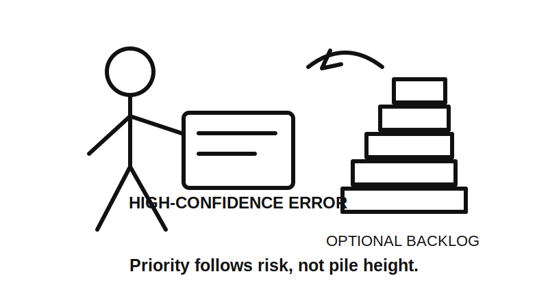
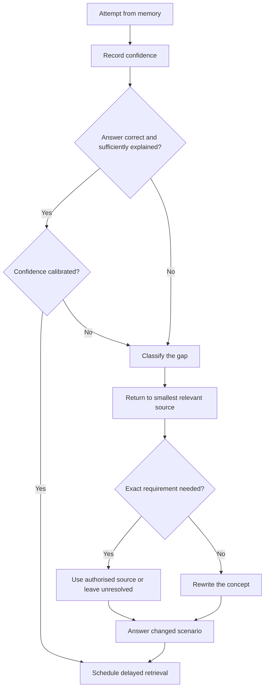
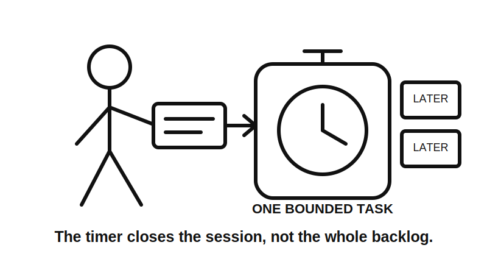

# Day 19 — Rest, Retrieval and Catch-Up

> **Purpose and currency notice:** This recovery block introduces no new electrical rule, value, dimension, permission or field procedure. Technical answers retain the source and review status of Days 15–18. Exact claims still require current authorised sources and qualified review where those modules require it.

## Navigation

- **Previous:** [Day 18 — Other Special Installations and Locations](./day-18-other-special-installations-and-locations.md)
- **Next:** [Day 20A — Fixed Appliances and Local Isolation](./day-20a-fixed-appliances-and-local-isolation.md)

## 1. Outcome and entry check

### Learning objectives

By the end of this block, the learner should be able to:

1. reconstruct the R-O-U-T-E, T-R-A-C-E, W-A-T-E-R and S-C-O-P-E workflows without rereading first;
2. classify an error as a concept gap, evidence gap, transfer gap or confidence-calibration gap;
3. select one blocking misconception using explicit priority criteria;
4. correct it with **R-E-S-E-T** and answer a changed scenario;
5. stop at 30 minutes or earlier when attention becomes unreliable;
6. produce a scored readiness statement for Day 20A.

### Entry check

Before opening notes, rate energy and concentration as **poor**, **workable** or **strong**. Then answer one question from each prior module and record confidence as **guess**, **unsure**, **reasonably confident** or **certain**.

If concentration is poor, record a recovery-only decision, prepare Day 20A materials and stop. Recovery is a valid completion path.

## 2. Why it matters

Recognition can conceal weak retrieval. Fatigue can also turn catch-up into repeated guessing. This block therefore prioritises one high-value correction over broad rereading.

The governing model is:

**retrieve → calibrate → classify → correct → transfer → stop → schedule**



*Caption: The biggest pile is not automatically the highest priority.*

## 3. Core concepts and terminology

- **Concept gap:** the learner cannot explain the governing idea.
- **Evidence gap:** the reasoning structure is sound, but an exact requirement needs an authorised source.
- **Transfer gap:** the learner succeeds only when the scenario resembles the worked example.
- **Calibration gap:** confidence does not match answer quality.
- **Blocking task:** a safety misconception or prerequisite needed for Day 20A.
- **Useful task:** improves fluency but does not prevent progression.
- **Defer task:** cannot be completed safely or meaningfully inside the time box.

A high-confidence incorrect answer is prioritised because it is both wrong and likely to be repeated without checking.

## 4. Rule-finding workflow

Use **R-E-S-E-T**:

1. **R — Retrieve first:** answer before opening notes.
2. **E — Expose the gap:** classify concept, evidence, transfer or calibration failure.
3. **S — Source-return:** revisit the smallest relevant module section and its source notice.
4. **E — Explain again:** rewrite the corrected idea in original words.
5. **T — Test transfer:** answer a materially changed scenario and schedule delayed retrieval.



## 5. Visual model or worked example

A learner confidently states that a weather-resistant cover proves an outdoor outlet arrangement is acceptable.

Apply R-E-S-E-T:

- **Retrieve:** record the statement and confidence.
- **Expose:** classify a concept gap and an evidence gap; one product feature has been treated as the whole installation decision.
- **Source-return:** revisit Days 17 and 18, then identify which exact matters still require authorised sources.
- **Explain again:** separate product feature, location, wiring, protection, supply and installation evidence.
- **Test transfer:** analyse a changed fictional location with public access, temporary supply and chemical exposure.

The correction succeeds only when the learner avoids both the original shortcut and an invented replacement rule.


## 6. Practical application

### Maximum 30-minute protocol

- **Minutes 0–3:** state check and recovery decision.
- **Minutes 3–12:** closed-note retrieval across Days 15–18.
- **Minutes 12–19:** correct one blocking or high-confidence error.
- **Minutes 19–26:** answer one changed scenario.
- **Minutes 26–30:** score readiness and schedule one delayed retrieval item.

Record:

```text
Original answer and confidence:
Gap category:
Why the reasoning failed:
Corrected explanation:
Authorised-source need:
Changed scenario result:
Delayed review date:
```

### Readiness rubric

Score each category from **0 to 2**.

| Category | 0 | 1 | 2 |
|---|---|---|---|
| Retrieval | Cannot reconstruct workflows | Partial reconstruction | Four workflows reconstructed accurately |
| Gap classification | Gap hidden or misclassified | Broad category identified | Concept, evidence, transfer and calibration separated |
| Correction quality | Rereading only | Corrected explanation | Explanation plus changed-scenario success |
| Confidence calibration | Confidence omitted | Recorded inconsistently | Confidence compared with performance |
| Safety and source discipline | Guesses become claims | General caution | Exact claims left unresolved without authorised evidence |
| Time-box discipline | Session expands | Stops late or incompletely | Stops at 30 minutes or earlier with clear next action |

A score of **10/12 or higher**, with no critical error, indicates readiness for Day 20A. This is an educational threshold, not an official assessment rule.



*Caption: A time box is a boundary, not a challenge to overfill.*

## 7. Common errors and safety checkpoint

Common errors include rereading before retrieval, treating all backlog as urgent, correcting wording instead of reasoning, inventing an exact rule, and continuing after concentration falls.

A critical error occurs when the learner:

- records a guess as an authoritative technical claim;
- attempts to inspect, open, touch, switch, isolate, test, install or alter equipment;
- continues after the 30-minute limit or a fatigue stop condition;
- begins new technical content instead of completing recovery.

This block authorises no electrical work.

## 8. Retrieval and next links

### Closed-note retrieval

1. Expand R-E-S-E-T.
2. Distinguish concept, evidence, transfer and calibration gaps.
3. Why are high-confidence errors prioritised?
4. What makes unfinished work blocking?
5. State the maximum study period and three earlier stop conditions.
6. What score and critical-error rule indicate readiness?

### Delayed retrieval

Within 24–72 hours, answer the changed scenario again without viewing the correction. A correct immediate answer alone is not treated as mastery.

### Knowledge-base links

- [[Day 15 - Wiring Systems and Mechanical Protection]]
- [[Day 16 - Consumer Mains Submains and Final Subcircuits]]
- [[Day 17 - Bathrooms Showers and Other Wet Areas]]
- [[Day 18 - Other Special Installations and Locations]]
- [[Day 19 - Rest Retrieval and Catch-Up]]
- [[Day 20A - Fixed Appliances and Local Isolation]]
- [[Learning and Memory System]]

### Review boundary

Day 19 is `review-required` as educational content, non-safety-critical as a recovery workflow and not `technically-reviewed`. It introduces no technical requirements. Retrieved technical claims retain the flags of their source modules.

<!-- sequence-navigation:start -->
### Sequence navigation

- [← Previous: Day 18 — Other Special Installations and Locations](./day-18-other-special-installations-and-locations.md)
- [Four-week learning plan](../MASTER_PLAN.md)
- [Next: Day 20A — Fixed Appliances and Local Isolation →](./day-20a-fixed-appliances-and-local-isolation.md)
<!-- sequence-navigation:end -->
