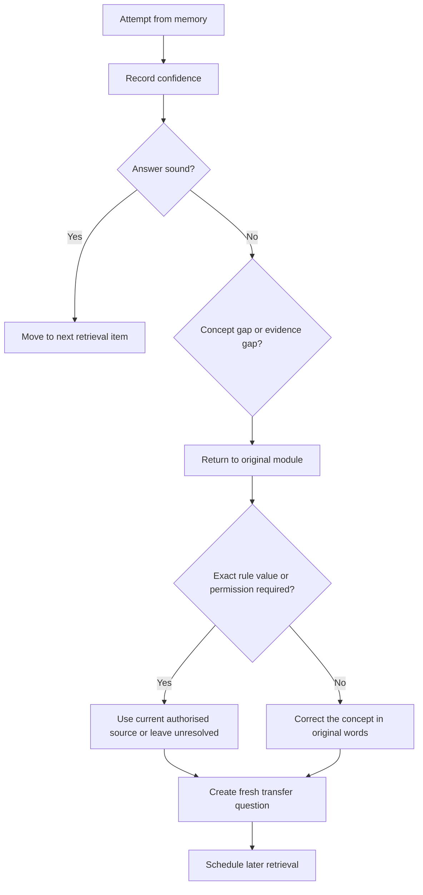
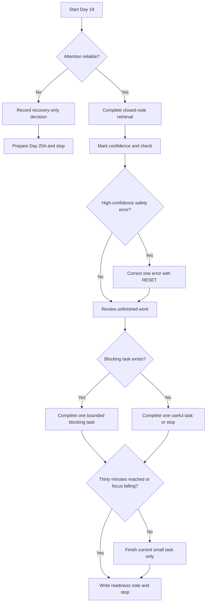

# Day 19 — Rest, Retrieval and Catch-Up

> **Purpose and currency notice:** This planned recovery block introduces no new electrical rules, values, dimensions, permissions or field procedures. It retrieves and corrects learning from Days 15–18. Any technical answer checked here retains the review status and source requirements of its original module. Use current authorised sources and qualified review for exact technical claims.

## Beat 1 — Outcome and entry check

### What you will learn

By the end of this block, you should be able to:

1. retrieve the main reasoning workflows from Days 15–18 without rereading first;
2. distinguish a knowledge gap from a source-verification gap;
3. prioritise one high-confidence safety misconception for correction;
4. triage unfinished work as **blocking**, **useful** or **defer**;
5. apply a maximum 30-minute study limit and stop when attention is unreliable;
6. write an evidence-based readiness statement for Day 20A.

### Entry check

Before opening notes, answer **yes** or **no**:

1. Can I explain why a cable route must be assessed as a whole system rather than only by conductor type?
2. Can I classify a circuit by source, destination and function without relying only on its label?
3. Can I explain why wet-area equipment suitability is not proved by one product marking?
4. Can I identify multiple special-location triggers in one scenario?
5. Am I alert enough to compare answers accurately?

If question 5 is **no**, record a recovery-only decision, prepare Day 20A materials and stop. Recovery is the correct completion path when concentration is poor.

## Beat 2 — Why it matters

Week 3 has introduced several topics where incomplete reasoning can look convincing. A learner may remember a route, circuit name, product marking or location label yet miss the interaction between environment, protection, isolation, supply and verification.

This block protects against three risks:

- **familiarity without retrieval** — recognising a diagram but being unable to reconstruct the reasoning;
- **confident oversimplification** — treating one feature as the complete decision;
- **fatigue-driven backlog clearing** — attempting too much and reinforcing errors.

The goal is not to reread four modules. It is to expose weak links, correct one important error and preserve enough attention for the next technical block.


*Caption: The biggest pile is not automatically the highest priority.*

## Beat 3 — Core concepts and terminology

### Retrieval before review

**Retrieval** means producing an explanation, diagram or decision from memory before checking the source. Opening notes first tests recognition instead.

### Technical gap

A **technical gap** exists when the learner cannot explain the concept or apply the workflow even at a general level.

### Evidence gap

An **evidence gap** exists when the reasoning structure is sound but an exact definition, boundary, rating, permission, dimension or procedure still needs a current authorised source.

Do not “correct” an evidence gap by inventing a value from memory.

### High-confidence misconception

A **high-confidence misconception** is an incorrect answer given with strong confidence. It receives priority because it is likely to be repeated without checking.

### Catch-up triage

Classify unfinished work as:

- **Blocking:** a safety misconception or prerequisite needed for Day 20A.
- **Useful:** practice that improves fluency but does not prevent progression.
- **Defer:** optional expansion, note formatting or work too large for the time box.

### Readiness evidence

Readiness is supported by successful retrieval, accurate confidence calibration, correction of blocking errors and a clear plan for unresolved source checks. It is not supported by time spent alone.

## Beat 4 — Source-return workflow: R-E-S-E-T

Use **R-E-S-E-T** when an answer is wrong, incomplete or uncertain.

1. **R — Retrieve first:** write the answer and confidence before checking notes.
2. **E — Expose the gap:** identify whether the problem is conceptual, evidentiary or both.
3. **S — Source-return:** revisit the original module and its authorised-source notice.
4. **E — Explain again:** rewrite the smallest corrected idea in original words.
5. **T — Test transfer:** answer one fresh scenario that requires the corrected reasoning.



The workflow prevents broad searching and copied clause notes. Return to the smallest relevant learning item, preserve source boundaries and test the corrected reasoning in a changed context.

## Beat 5 — Visual model and worked example

### Thirty-minute recovery decision



### Fictional correction example

A learner confidently states: “Because an outdoor outlet has a weather-resistant cover, its location and circuit arrangement are acceptable.”

Apply R-E-S-E-T:

1. **Retrieve:** record the statement and high confidence.
2. **Expose:** the answer collapses environmental suitability, location permission, circuit protection, mounting and supply conditions into one product feature.
3. **Source-return:** revisit Days 17 and 18 and their source notices.
4. **Explain again:** a product feature is one evidence item; the complete arrangement still needs location, equipment, wiring, protection, supply and installation evidence.
5. **Test transfer:** assess a covered outlet in a different fictional area with public access, temporary supply and chemical exposure. The learner must list the separate evidence gates without giving an unsupported verdict.

No official product rating or location permission is inferred.

## Beat 6 — Practical application

### Maximum 30-minute protocol

#### Minutes 0–3: state and setup

Record:

```text
Energy: low / workable / strong
Concentration: poor / workable / strong
Existing stop condition: yes / no
Decision: recovery only / retrieval plus limited catch-up
```

#### Minutes 3–13: closed-note retrieval

Answer without notes and rate confidence:

1. What five steps make up R-O-U-T-E from Day 15?
2. Why must entries, supports and transitions be reviewed as part of a wiring system?
3. What five steps make up T-R-A-C-E from Day 16?
4. How do source, destination and function improve circuit classification?
5. Why is an equipment marking only one evidence gate in a wet area?
6. What five steps make up S-C-O-P-E from Day 18?
7. Name four trigger categories that may overlap in a special installation.
8. What information should stop a compliance conclusion when it is missing?

#### Minutes 13–20: correct one priority error

Choose using this order:

1. high-confidence safety misconception;
2. weak prerequisite for fixed-appliance isolation;
3. repeated reasoning error;
4. missing source-verification flag;
5. minor wording omission.

Complete:

```text
Original answer:
Confidence:
Gap type: concept / evidence / both
Why the reasoning failed:
Corrected explanation:
Module and authorised source checked:
Fresh transfer question:
Next review date:
```

#### Minutes 20–27: one catch-up task

Choose only one:

- redraw one route or classification workflow from memory;
- complete one unresolved evidence matrix row;
- correct one circuit-boundary explanation;
- create one comparison card for product suitability versus installation permission;
- prepare a fixed-appliance and isolation vocabulary list for Day 20A.

Do not begin a task that cannot be left in a clear state when the timer ends.

#### Minutes 27–30: readiness note

```text
Strongest retained workflow:
Highest-priority corrected error:
Unresolved authorised-source check:
Blocking work remaining:
Ready for Day 20A: yes / yes with support / not yet
First action next session:
```


*Caption: A time box is a boundary, not a challenge to overfill.*

## Beat 7 — Common errors and safety checkpoint

### Common errors

- rereading before attempting recall;
- treating all unfinished work as equally urgent;
- correcting wording without identifying the failed reasoning;
- inventing an exact rule to fill an evidence gap;
- spending the session reorganising notes instead of retrieving;
- attempting to clear the entire Week 3 backlog;
- starting Day 20A early and turning recovery into new-content study;
- ignoring fatigue because the timer has not yet expired.

### Safety checkpoint

Stop immediately when:

- attention is too poor to compare an answer accurately;
- guesses are being recorded as facts;
- correction requires an unavailable current authorised source;
- the learner is tempted to inspect, open, touch, switch, isolate, test, install or alter electrical equipment;
- a scenario reveals damaged equipment, exposed parts, water ingress, burning, unusual heat or other immediate danger;
- 30 minutes has elapsed;
- the current task has expanded beyond one bounded correction.

This block authorises no electrical work. Practical activity remains subject to law, competency, supervision, safe-work systems, manufacturer instructions and approved procedures.

## Beat 8 — Retrieval, readiness and next links

### Final recall check

1. What does R-E-S-E-T stand for?
2. How does a technical gap differ from an evidence gap?
3. Why should high-confidence errors be corrected first?
4. What makes unfinished work blocking?
5. What is the maximum catch-up period?
6. Name four stop conditions.
7. Why must exact requirements retain the source status of their original module?
8. What evidence supports readiness for Day 20A?

### Day 20A readiness check

You are ready to begin Day 20A when you can:

- distinguish equipment function, supply path and isolation purpose conceptually;
- explain why “off” does not by itself prove isolation;
- trace a circuit boundary through boards and loads without relying only on labels;
- identify environmental and mechanical evidence that may affect appliance installation;
- stop and seek authorised evidence rather than inventing a rule or procedure;
- begin without an unresolved high-confidence safety misconception from Days 15–18.

A **yes with support** learner may proceed with their error log and prerequisite notes open. A **not yet** learner should schedule one named prerequisite correction, not repeat all four modules.

### Navigation

- **Previous:** [Day 18 — Other Special Installations and Locations](./day-18-other-special-installations-and-locations.md)
- **Knowledge note:** [[Day 19 - Rest Retrieval and Catch-Up]]
- **Next:** Day 20A — Fixed Appliances and Local Isolation

## Review state

Day 19 is `draft-unverified`, non-safety-critical as a recovery workflow and not `technically-reviewed`. It adds no new technical requirements. Technical statements retrieved from Days 15–18 retain their original `review-required` and `reference_check_required` flags.

<!-- sequence-navigation:start -->
### Sequence navigation

- [← Previous: Day 18 — Other Special Installations and Locations](./day-18-other-special-installations-and-locations.md)
- [Four-week learning plan](../MASTER_PLAN.md)
- [Next: Day 20A — Fixed Appliances and Local Isolation →](./day-20a-fixed-appliances-and-local-isolation.md)
<!-- sequence-navigation:end -->
