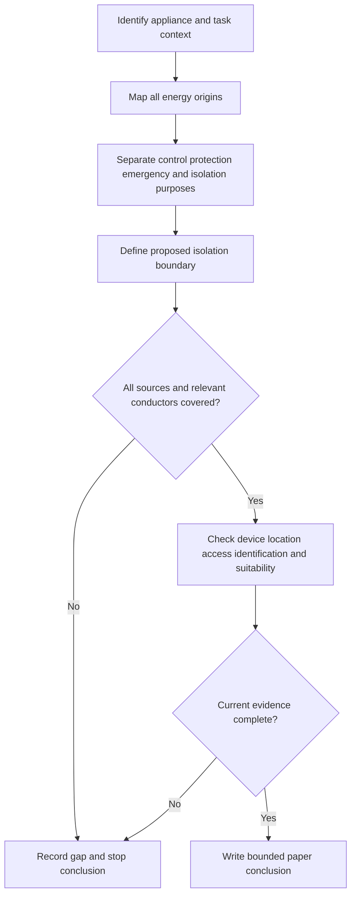
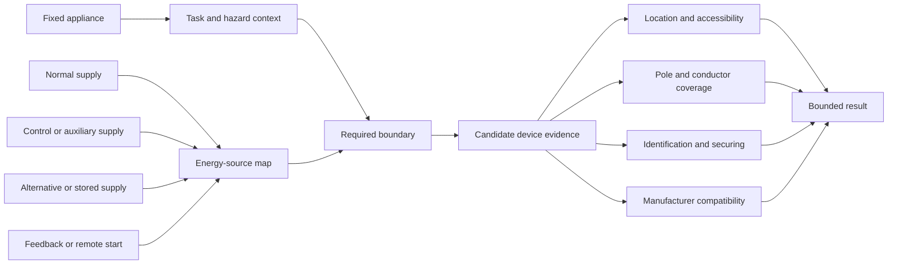

# Day 20A — Fixed Appliances and Local Isolation

> **Source and currency notice:** This is original educational material about analysing fixed appliances and planning evidence for local isolation. It is not a field isolation procedure and is not a substitute for current authorised standards, legislation, regulator guidance, network requirements, manufacturer instructions or RTO procedures. Exact equipment classifications, device requirements, locations, accessibility, pole arrangements, neutral treatment, labelling and verification methods require current-source checking and qualified technical review.

## Beat 1 — Outcome and entry check

### What you will learn

By the end of this block, you should be able to:

1. distinguish a fixed appliance from its circuit, controller, protective device and isolating device;
2. explain the separate purposes of functional control, maintenance isolation and emergency action;
3. map every plausible source that could energise an appliance;
4. use appliance, location, circuit and manufacturer evidence to build an isolation requirement search;
5. write a bounded paper-based conclusion without turning “off” into an unsupported claim of safe isolation.

### Entry check

Answer without notes:

1. Why is an appliance control not automatically an isolator?
2. What information is needed to define the equipment boundary?
3. Why can a nearby switch still be unsuitable for isolation?
4. How could an appliance remain energised after one circuit is opened?
5. When must a paper review stop without recommending a device or field action?

Record confidence. Treat a high-confidence claim that “the switch is off, therefore it is isolated” as a priority misconception.

## Beat 2 — Why it matters

Fixed appliances often combine power circuits, controls, auxiliaries, remote commands, stored energy and sometimes alternative supplies. A familiar wall switch or labelled breaker may control operation without establishing a complete, secure and verifiable isolation boundary.

Common assessment and workplace failures include:

- confusing functional switching with isolation;
- reviewing only the main power conductors while overlooking controls, heaters, pumps, fans or auxiliaries;
- assuming proximity proves accessibility, suitability or correct identification;
- treating a manufacturer control as authority for maintenance isolation;
- ignoring reconnection, remote-start or feedback risks;
- recommending a device before checking equipment, circuit, location and supply evidence;
- describing a paper exercise as a practical isolation instruction.

*Caption: “Off” describes an observation; isolation requires an evidence chain.*

## Beat 3 — Core concepts and terminology

### Separate the objects

A sound review identifies at least five distinct objects:

- **fixed appliance** — equipment intended to remain installed or secured in a defined position;
- **final subcircuit** — the circuit supplying the appliance or associated equipment;
- **functional control** — a means used to start, stop or regulate normal operation;
- **protective device** — equipment intended to respond to defined abnormal conditions;
- **isolating device** — a device intended to establish an isolation boundary when selected, installed and used in accordance with applicable requirements.

One device may perform more than one function, but that must be demonstrated rather than assumed.

### Purpose changes the evidence

Ask what the action is intended to achieve:

- **normal control** — routine operation;
- **maintenance isolation** — preventing energisation while work is undertaken;
- **emergency action** — rapidly removing or controlling a danger;
- **protective operation** — automatic response to a fault or abnormal condition.

These purposes are related but not interchangeable.

### Define the complete energy boundary

The appliance boundary may include:

- normal supply conductors;
- separately supplied controls or auxiliaries;
- generated, stored or alternative supplies;
- feedback through interconnected equipment;
- remote-control or automatic-start paths;
- non-electrical stored energy requiring separate controls.

This module addresses the electrical evidence model only. It does not provide procedures for releasing stored mechanical, thermal, hydraulic, pneumatic or chemical energy.

### Local does not mean “nearest”

“Local isolation” should be treated as an evidence question involving:

- relationship to the appliance;
- identification and visibility;
- accessibility and operating conditions;
- prevention of unintended operation where required;
- suitability for the circuit and equipment;
- coverage of all relevant conductors and sources;
- environmental and mechanical suitability;
- manufacturer and jurisdictional requirements.

Do not invent a distance, mounting position or device type.

## Beat 4 — Rule-finding workflow: L-O-C-K

Use **L-O-C-K** to structure the review.

1. **L — Load and location:** identify the appliance, function, environment, users and maintenance context.
2. **O — Origins of energy:** trace every normal, control, auxiliary, alternative, stored and feedback source.
3. **C — Control purposes:** separate normal control, protection, emergency action and maintenance isolation.
4. **K — Keep evidence:** verify device capability, conductor coverage, accessibility, identification, securing, manufacturer instructions and current authorised requirements; record unresolved items.

### Current-source search sequence

For a paper scenario:

1. identify the appliance and intended work context;
2. obtain the single-line diagram, circuit schedule and equipment documentation;
3. list all supplies, controls, auxiliaries and automatic operating modes;
4. establish the purpose of each switch or device;
5. consult current authorised material for the relevant equipment and isolation topics;
6. check manufacturer instructions and product limitations;
7. verify environmental, access, identification and securing evidence;
8. record edition, amendment, jurisdiction and date accessed;
9. leave unsupported device choices, distances and operating procedures unresolved.

## Beat 5 — Visual model and worked example

### Appliance-to-isolation evidence model

### Fictional worked review

A fictional commercial dishwasher is hard-wired. A nearby wall control stops the wash cycle. The appliance also has a separate control supply from a building-management panel and can start automatically after a remote command. The drawing shows a protective device at the distribution board but does not identify a local isolating device or conductor arrangement.

Apply L-O-C-K:

| Step | Finding | Consequence |
|---|---|---|
| Load and location | Fixed appliance in a wet, service-access environment | Environmental and access evidence matter |
| Origins of energy | Main supply, separate control supply and remote-start path are shown | One wall control cannot be assumed to cover the boundary |
| Control purposes | Wall control appears to perform normal control; board device performs protection | Neither function alone proves maintenance isolation |
| Keep evidence | Device capability, conductor coverage, identification, securing and manufacturer instructions are missing | No device recommendation or isolation conclusion is supportable |

The correct result is an evidence request and a bounded conclusion, not an improvised switching sequence.

## Beat 6 — Practical application

### Scenario: mixed-service kitchen plant

A fictional site contains:

- a hard-wired combi oven;
- a rangehood with an interlocked fan;
- a dishwasher with a dosing pump;
- a hot-water unit with a separate control circuit;
- a refrigeration condensing unit outside;
- a building-management system capable of remote commands;
- a battery-backed control panel;
- incomplete labels and no verified single-line diagram.

### Task A — Build the equipment register

For each appliance, record:

1. normal function and location;
2. final subcircuit and protective device evidence;
3. normal controls;
4. auxiliaries, interlocks and remote commands;
5. alternative, stored or feedback sources;
6. maintenance access context;
7. manufacturer documents required;
8. unresolved facts.

### Task B — Build the purpose matrix

Use these columns:

| Device or control | Normal control | Protection | Emergency action | Maintenance isolation | Evidence status |
|---|---:|---:|---:|---:|---|
| Example only | possible | unknown | unknown | unverified | incomplete |

Do not award a function because a device is nearby or labelled informally.

### Task C — Write the bounded conclusion

Use this pattern:

> The available evidence identifies the appliance and several possible energisation paths, but it does not demonstrate a complete maintenance-isolation boundary. Verify every normal, auxiliary, alternative and feedback source, then confirm the candidate device's function, conductor coverage, location, accessibility, identification, securing provisions and manufacturer compatibility against current authorised requirements before approving an arrangement or performing work.

## Beat 7 — Common errors and safety checkpoint

### Common errors

- treating “off” as equivalent to isolated;
- assuming the protective device is automatically the required local isolator;
- checking only the main power supply;
- overlooking control transformers, dosing pumps, fans, heaters, interlocks or communications;
- assuming a device is local because it is in the same room;
- recommending a switch type, pole arrangement or mounting distance from memory;
- ignoring automatic restart or remote commands;
- treating labels as proof without tracing the circuit;
- writing a practical sequence from an incomplete drawing;
- using a paper exercise to authorise real work.

*Caption: The label names a device; the source map defines the boundary.*

### Safety checkpoint

Stop the exercise and escalate when:

- any source, auxiliary, feedback path or automatic operating mode is unclear;
- current authorised sources or manufacturer instructions are unavailable;
- the proposed device function or conductor coverage cannot be verified;
- labels conflict with diagrams or observed equipment;
- the task would require opening, touching, switching, isolating, testing, locking, proving de-energised, installing or altering equipment;
- damaged equipment, exposed parts, water ingress, burning, unusual heat or immediate danger is observed;
- a learner is about to convert this conceptual model into a field procedure.

This module does not provide a safe-isolation sequence, lockout procedure, test method or permission to work. Physical work must follow applicable law, competency, supervision, safe-work systems, manufacturer instructions and approved procedures.

## Beat 8 — Retrieval, practice and next links

### Recall check

1. What four steps make up L-O-C-K?
2. Name the five distinct objects that should be separated in the review.
3. Why can one device perform several functions only when evidence supports it?
4. What sources belong in the energy-source map?
5. Why does “local” require more evidence than proximity?
6. What information belongs in the purpose matrix?
7. Why is manufacturer documentation part of the evidence chain?
8. Name four stop conditions.

### Applied practice

Create a fictional fixed appliance with:

- one normal supply;
- one auxiliary supply;
- one automatic-start path;
- one nearby functional control;
- one incompletely labelled board device.

Require another learner to:

1. draw the energy-source map;
2. classify each device purpose;
3. identify the missing boundary evidence;
4. write a current-source search sequence;
5. produce a bounded conclusion without proposing a field procedure.

### Reflection

Complete these prompts:

- The control I am most likely to mistake for an isolator is…
- The hidden source I am most likely to overlook is…
- The evidence that should stop my conclusion is…

### Navigation

- **Previous:** [Day 19 — Rest, Retrieval and Catch-Up](./day-19-rest-retrieval-and-catch-up.md)
- **Knowledge note:** [[Day 20A - Fixed Appliances and Local Isolation]]
- **Next:** Day 20B — Motors and Associated Protection

## Technical-review flags

Before publication or operational use, a qualified reviewer must verify against current authorised sources:

- fixed-appliance and equipment classifications;
- when isolation, local isolation, emergency switching or other control functions are required;
- device suitability, ratings and manufacturer compatibility;
- conductor and pole coverage, including neutral treatment;
- location, visibility, accessibility, identification and securing requirements;
- automatic restart, remote control, interlocks and multiple-source arrangements;
- environmental, mechanical, wet-area and special-location interactions;
- inspection, testing, documentation and jurisdiction-specific obligations.

**Review state:** `review-required`; `reference_check_required`; safety-critical; not `technically-reviewed`.

<!-- sequence-navigation:start -->
### Sequence navigation

- [← Previous: Day 19 — Rest, Retrieval and Catch-Up](./day-19-rest-retrieval-and-catch-up.md)
- [Four-week learning plan](../MASTER_PLAN.md)
- [Next: Day 20B — Motors and Associated Protection →](./day-20b-motors-and-associated-protection.md)
<!-- sequence-navigation:end -->
