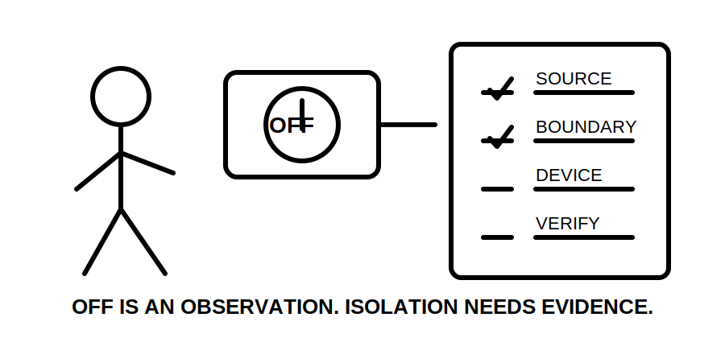
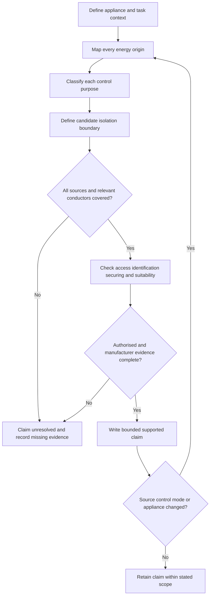
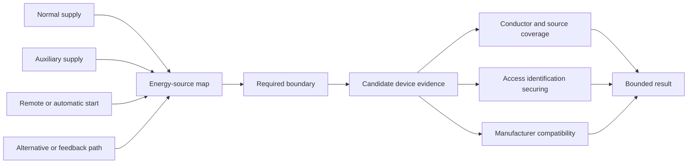
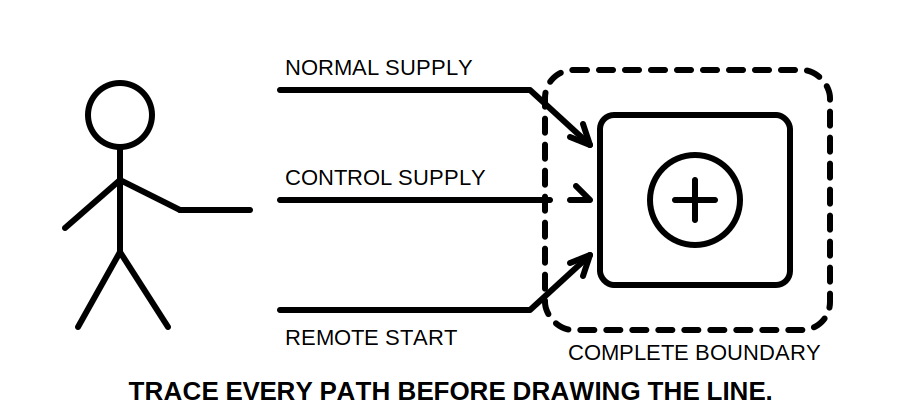

# Day 20A — Fixed Appliances and Local Isolation

> **Source and safety notice:** This original module teaches paper-based evidence analysis only. It is not a field isolation, lockout or test procedure. Exact equipment classifications, device requirements, locations, accessibility, conductor coverage, neutral treatment, labelling and verification methods require current authorised sources, manufacturer information and qualified review. It is not `technically-reviewed`.

## Navigation

- **Previous:** [Day 19 — Rest, Retrieval and Catch-Up](./day-19-rest-retrieval-and-catch-up.md)
- **Next:** [Day 20B — Motors and Associated Protection](./day-20b-motors-and-associated-protection.md)

## 1. Outcome and entry check

### Learning objectives

By the end of this block, the learner should be able to:

1. distinguish the appliance, supply circuit, protective device, functional control and isolating means;
2. define the complete electrical energy boundary from supplied evidence;
3. separate normal control, emergency action, protection and maintenance isolation purposes;
4. apply **L-O-C-K** without treating proximity or an OFF state as proof;
5. grade evidence as observed, documented, manufacturer-verified, assumed or missing;
6. grade conclusions as described, supported, verified or unresolved;
7. reopen affected conclusions when a source, control path, operating mode or appliance changes.

### Entry check

Without notes, answer:

1. Why is a normal control not automatically an isolator?
2. Which energy paths may remain after one circuit is switched off?
3. What evidence is needed before calling a device local and suitable?
4. Why can a labelled device still fail to establish the required boundary?
5. Which facts would force the paper review to stop?

Record confidence. A high-confidence statement that “off means isolated” is a critical misconception.

## 2. Why it matters

A fixed appliance may include main power, control supplies, auxiliaries, remote commands, feedback paths and stored energy. A familiar nearby switch can control operation while leaving other energisation paths available.

The governing model is:

**equipment boundary → all energy origins → purpose of each control → candidate isolation boundary → authorised evidence → bounded claim**

*Caption: “Off” is an observation; isolation is an evidence-backed boundary.*

## 3. Core concepts and terminology

### Separate the objects

- **Fixed appliance:** equipment intended to remain installed or secured in a defined position.
- **Functional control:** starts, stops or regulates normal operation.
- **Protective device:** responds to defined abnormal conditions.
- **Emergency action:** rapidly controls or removes a danger.
- **Isolating means:** establishes an isolation boundary when correctly selected, installed and used.
- **Energy boundary:** every source and path capable of energising the equipment or associated control system.

One device may perform more than one function only where applicable evidence demonstrates those functions.

### Evidence grades

1. **Observed** — visible in the supplied image, drawing or scenario.
2. **Documented** — stated in a current schedule, label, drawing or record.
3. **Manufacturer-verified** — supported by applicable product or assembly information.
4. **Assumed** — plausible but not evidenced.
5. **Missing** — required for the conclusion but unavailable.

### Claim grades

- **Described:** states what the supplied material shows.
- **Supported:** combines applicable evidence into a bounded reasoning statement.
- **Verified:** requires complete authorised evidence and qualified confirmation.
- **Unresolved:** a material gap prevents the claim.

### Local is not merely nearest

A local-isolation claim may depend on relationship to the appliance, accessibility, identification, operating conditions, prevention of unintended operation, conductor and source coverage, environmental suitability and manufacturer requirements. Do not invent a distance, position or device type.

## 4. Rule-finding workflow

Use **L-O-C-K**:

1. **L — Load and location:** identify the appliance, function, environment, users and maintenance context.
2. **O — Origins of energy:** trace normal, auxiliary, alternative, feedback, remote-start and stored-energy paths.
3. **C — Control purposes:** separate normal control, protection, emergency action and maintenance isolation.
4. **K — Keep evidence:** verify device capability, conductor coverage, access, identification, securing, compatibility and current requirements; record unresolved items.

For every claim, record the equipment boundary, source map, device purpose, evidence grade, claim grade, missing evidence and reopening trigger.

## 5. Visual model or worked example

A fictional commercial dishwasher is hard-wired. A wall control stops the wash cycle. A separate control supply comes from a building-management panel, and remote start is possible. The drawing shows an upstream protective device but no verified local isolating arrangement.

Apply L-O-C-K:

| Step | Evidence-led response |
|---|---|
| Load and location | Fixed appliance in a wet service-access environment; environmental and access evidence matter. |
| Origins | Main supply, separate control supply and remote-start path are documented. |
| Control purposes | Wall control appears to provide normal control; upstream device appears protective. Neither proves maintenance isolation. |
| Keep evidence | Device capability, conductor coverage, identification, securing and manufacturer compatibility are missing. |

Result: **appliance and some energisation paths described; complete maintenance-isolation boundary unresolved.**

### Worked-example fading

A second appliance has a nearby labelled switch and a complete circuit schedule, but no control diagram or manufacturer isolation information. The learner must:

1. grade each item;
2. identify two unresolved energisation paths;
3. write one described and one unresolved claim;
4. state which conclusions reopen if a battery-backed controller is disclosed.

## 6. Practical application

### Scenario

A fictional kitchen contains a combi oven, rangehood fan, dishwasher with dosing pump, hot-water unit, refrigeration unit, building-management controls and a battery-backed panel. Labels and diagrams are incomplete.

Produce:

1. an equipment register;
2. a complete source and operating-mode inventory;
3. a purpose matrix for control, protection, emergency action and isolation;
4. an evidence ledger using the five evidence grades;
5. a list of current authorised and manufacturer evidence requests;
6. a bounded conclusion using the four claim grades;
7. a change-propagation note for the later discovery of an alternate control supply.

### Assessment rubric

Score each category from **0 to 2**.

| Category | 0 | 1 | 2 |
|---|---|---|---|
| Equipment boundary | Missing or invented | Partial boundary | Appliance and associated systems bounded |
| Energy origins | One obvious supply only | Some sources mapped | All supplied source and control paths mapped |
| Purpose separation | Functions conflated | Some separation | Control, protection, emergency and isolation distinguished |
| Evidence discipline | Assumptions treated as fact | Grades inconsistent | Evidence and claim grades applied consistently |
| Change propagation | New source ignored | Some reopening | Every dependent conclusion reopened |
| Safety communication | Field authority implied | General caution | Clear unresolved claim and stop boundary |

A score of **10/12 or higher** with no critical error indicates readiness for Day 20B. This is an educational threshold, not an official assessment rule.

## 7. Common errors and safety checkpoint

Common errors include treating OFF as isolated, assuming a protective device is the required isolator, checking only main power, treating proximity as suitability, overlooking remote restart and inventing device or pole requirements.

Critical errors include:

- omitting a disclosed source or operating mode;
- presenting assumption as verified evidence;
- prescribing a switching, lockout or test sequence;
- claiming safe isolation or compliance without authorised evidence;
- proposing opening, touching, switching, testing, installing or altering equipment.

*Caption: The label names a device; the source map defines the boundary.*

This module authorises no electrical work.

## 8. Retrieval and next links

### Closed-note retrieval

1. Expand L-O-C-K.
2. Name the five evidence grades and four claim grades.
3. Distinguish functional control from maintenance isolation.
4. Why is local not equivalent to nearest?
5. Which energy origins belong in the boundary review?
6. What change triggers reopening of the analysis?
7. State four critical errors.

### Changed-scenario transfer

Re-attempt the practical application after disclosing either a battery-backed controller or a separately supplied dosing pump. Rebuild the source map and conclusion rather than editing one sentence.

### Knowledge-base links

- [[Day 13A - Switching Isolation and Main Switches]]
- [[Day 19 - Rest Retrieval and Catch-Up]]
- [[Day 20A - Fixed Appliances and Local Isolation]]
- [[Day 20B - Motors and Associated Protection]]
- [[Day 20C - Alternative and Multiple Supplies Awareness]]
- [[Switching and Isolation]]
- [[Safety and Electrical Risk]]

### Review boundary

Day 20A remains `review-required`, `reference_check_required`, safety-critical and not `technically-reviewed`. Exact classifications, isolation requirements, device capability, conductor coverage, neutral treatment, access, identification, securing and verification requirements require authorised current sources and qualified review.

<!-- sequence-navigation:start -->
### Sequence navigation

- [← Previous: Day 19 — Rest, Retrieval and Catch-Up](./day-19-rest-retrieval-and-catch-up.md)
- [Four-week learning plan](../MASTER_PLAN.md)
- [Next: Day 20B — Motors and Associated Protection →](./day-20b-motors-and-associated-protection.md)
<!-- sequence-navigation:end -->
