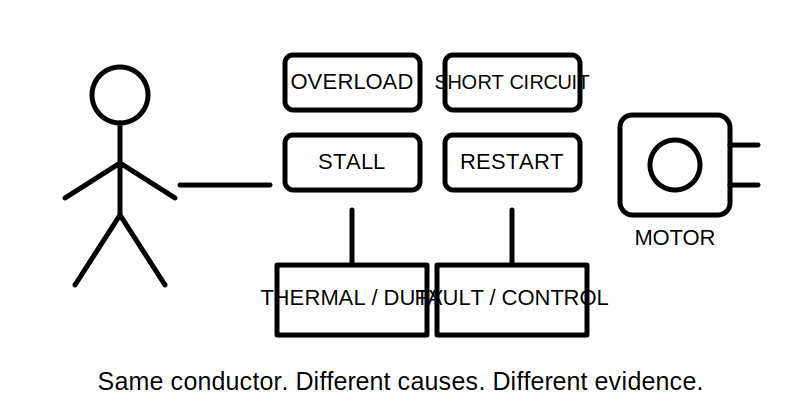
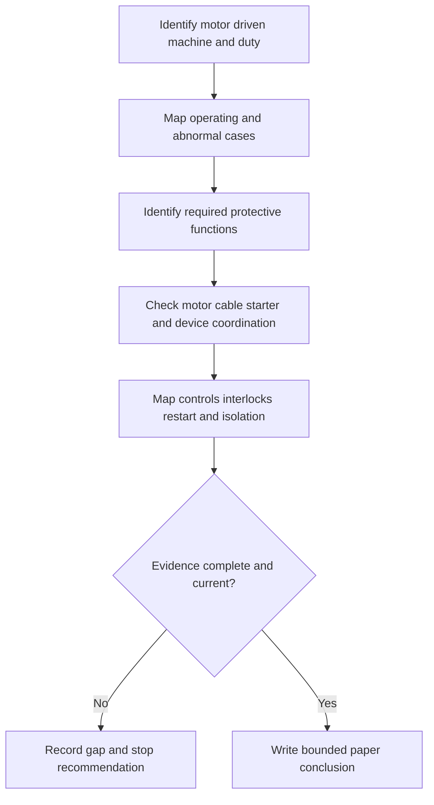
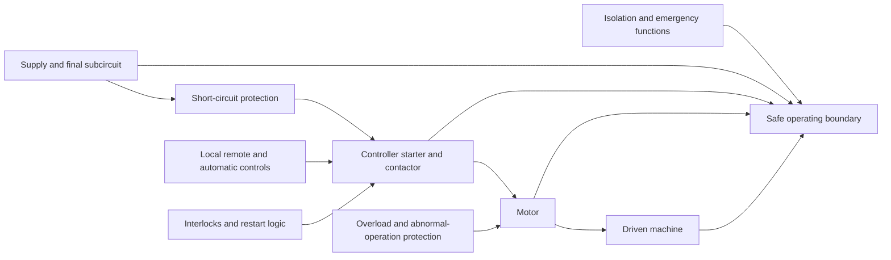
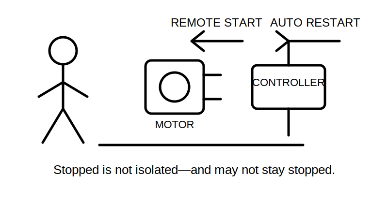

# Day 20B — Motors and Associated Protection

> **Source and currency notice:** This is original educational material for analysing motor circuits and planning evidence. It does not prescribe motor protection settings, starting methods, conductor sizes, isolation arrangements, test values or field procedures. Exact requirements depend on the motor, driven machine, control system, supply, manufacturer data, current authorised standards, legislation, regulator guidance and RTO procedures. Qualified technical review is required before publication or operational use.

## Beat 1 — Outcome and entry check

### What you will learn

By the end of this block, you should be able to:

1. separate the motor, driven machine, final subcircuit, controller, starter, protective functions and isolating means;
2. explain why overload, short-circuit, loss-of-phase, stall and unintended restart are different hazards;
3. map the operating states and energy paths that affect a motor installation;
4. use the **M-O-T-O-R** workflow to assemble a defensible evidence plan;
5. write a bounded paper-based conclusion without selecting settings or authorising physical work.

### Entry check

Answer without notes:

1. Why is a circuit breaker alone not necessarily complete motor protection?
2. What is the difference between starting current and overload?
3. Why must the driven machine be considered with the motor?
4. How can a stopped motor still present an electrical or mechanical hazard?
5. Which missing documents should prevent a protection recommendation?

Record confidence. A high-confidence answer that “the nameplate current is the protection setting” is a priority misconception.

## Beat 2 — Why it matters

Motor circuits combine electrical, thermal and mechanical behaviour. A design that appears adequate during normal running may fail during starting, repeated starts, stall, phase imbalance, locked-rotor conditions, poor ventilation or abnormal mechanical loading.

Common assessment and workplace failures include:

- treating every high current as a fault of the same type;
- using full-load current as a universal setting without checking the device function or manufacturer data;
- coordinating the motor but ignoring the cable, starter, contactor, enclosure or upstream device;
- ignoring duty cycle, starting frequency, acceleration time or driven-load characteristics;
- assuming a stop button establishes isolation;
- overlooking automatic restart, remote control or stored mechanical energy;
- selecting a starting method without checking supply effects and equipment compatibility;
- converting a conceptual exercise into a commissioning or adjustment instruction.

*Caption: The ammeter sees current; the protection plan must identify why it is flowing.*

## Beat 3 — Core concepts and terminology

### Separate the system objects

A motor installation may include:

- **motor** — the electrical machine converting electrical energy into mechanical motion;
- **driven machine** — the pump, fan, compressor, conveyor or other load;
- **final subcircuit** — conductors and associated equipment supplying the motor system;
- **controller or starter** — equipment that starts, stops or regulates operation;
- **contactor or switching element** — equipment used to make or break the operating circuit;
- **protective functions** — responses to specific abnormal conditions;
- **control circuit** — local, remote, automatic or interlocked command paths;
- **isolating means** — equipment intended to establish a verified boundary when correctly selected and used.

One device may provide several functions, but the evidence must show which functions, under what conditions and with what limitations.

### Distinguish the abnormal conditions

- **overload** — current above normal operating demand over time, often associated with excessive mechanical load or abnormal operation;
- **short circuit** — a low-impedance fault path producing a rapid and potentially severe current;
- **stall or locked rotor** — the rotor cannot accelerate or continue turning while energised;
- **loss of phase or phase imbalance** — an abnormal supply condition that can increase heating or reduce torque;
- **excessive starting duty** — repeated or prolonged starts causing thermal stress;
- **unintended restart** — automatic or remote re-energisation when people or equipment are not prepared.

These conditions can overlap, but they are not interchangeable.

### Starting is an operating case, not a defect by definition

Motor starting may involve current, torque and acceleration behaviour that differs substantially from steady running. The design review must therefore establish:

- motor and driven-load characteristics;
- intended starting method;
- expected acceleration and starting frequency;
- supply-system constraints;
- controller and protective-device compatibility;
- cable and voltage-performance implications;
- manufacturer limits.

Do not invent a current multiple, time, setting or permissible voltage effect.

### Protection is a coordinated system

A defensible review considers the relationship among:

- motor thermal capability;
- conductor current-carrying and fault withstand;
- overload protective function;
- short-circuit protective function;
- starter, contactor and enclosure ratings;
- upstream and downstream devices;
- control logic and restart behaviour;
- isolation and emergency-action requirements.

## Beat 4 — Rule-finding workflow: M-O-T-O-R

Use **M-O-T-O-R** to structure the evidence review.

1. **M — Machine and mission:** identify the motor, driven equipment, duty, environment, users and consequences of failure.
2. **O — Operating cases:** document start, run, stop, jam, stall, repeated start, abnormal supply, remote command and maintenance states.
3. **T — Thermal and fault protection:** identify each protective function and the evidence needed to coordinate motor, conductors, starter and supply.
4. **O — Operating controls and isolation:** separate normal control, interlocks, emergency action, automatic restart prevention and maintenance isolation.
5. **R — Records and review:** verify drawings, nameplate data, manufacturer instructions, device characteristics, settings evidence, calculations and current authorised requirements; record unresolved items.

### Current-source search sequence

For a paper scenario:

1. obtain the motor nameplate record, manufacturer instructions and driven-machine information;
2. confirm the supply arrangement, circuit diagram, control diagram and equipment schedule;
3. list normal and abnormal operating cases;
4. identify each claimed protective and control function;
5. consult current authorised material for motor circuits, conductors, protection, switching and isolation;
6. obtain device characteristics and compatibility evidence from authorised manufacturer sources;
7. verify duty, environment, ventilation, enclosure, starting and restart assumptions;
8. record edition, amendment, jurisdiction, source and date accessed;
9. leave settings, ratings, device selections and field actions unresolved where evidence is incomplete.

## Beat 5 — Visual model and worked example

### Motor-system evidence model

### Fictional worked review

A fictional extract fan uses a three-phase motor. The drawing shows an upstream circuit breaker, a contactor and a local stop button. The fan can also be commanded by a building-management system. The motor nameplate is available, but the driven-load duty, overload-device characteristics, contactor utilisation data, starting frequency, phase-loss response and local isolation arrangement are not documented.

Apply M-O-T-O-R:

| Step | Finding | Consequence |
|---|---|---|
| Machine and mission | Extract fan serving an occupied process area | Loss of operation and unintended restart both matter |
| Operating cases | Local and remote start are shown; duty and starting frequency are unknown | Starting and restart assumptions cannot be verified |
| Thermal and fault protection | Breaker, contactor and an unspecified overload function are shown | Coordination and function coverage remain unproven |
| Operating controls and isolation | Stop button and remote command exist; isolation evidence is absent | “Stopped” cannot be treated as isolated |
| Records and review | Several manufacturer and design records are missing | No setting, device or compliance recommendation is supportable |

The correct result is a targeted evidence request and a bounded conclusion, not a guessed setting or switching instruction.

## Beat 6 — Practical application

### Scenario: workshop air-compressor motor

A fictional workshop has an air compressor with:

- a motor-driven compressor and pressure-switch control;
- an upstream protective device;
- a starter enclosure with a contactor and overload function;
- automatic restart after pressure falls;
- a remote enable input;
- a local stop control;
- incomplete cable-route information;
- no verified starting study, protection schedule or isolation drawing.

### Task A — Build the operating-case register

Record:

1. normal start and run;
2. normal stop;
3. repeated starts;
4. compressor jam or motor stall;
5. abnormal supply or phase condition;
6. remote enable and automatic restart;
7. maintenance state;
8. loss and restoration of supply.

### Task B — Build the function map

Use these columns:

| Equipment or function | Normal control | Overload response | Short-circuit response | Abnormal-supply response | Restart control | Isolation | Evidence status |
|---|---:|---:|---:|---:|---:|---:|---|
| Example only | possible | unverified | upstream claim | unknown | automatic | unverified | incomplete |

Do not infer a function from a label, enclosure position or device appearance.

### Task C — Write the evidence request

Request only what is needed to close the gaps, such as:

- current motor and driven-machine data;
- duty and starting information;
- single-line and control diagrams;
- cable and route evidence;
- protective-device and starter characteristics;
- manufacturer compatibility information;
- control, interlock and restart logic;
- isolation and emergency-function evidence;
- authorised design calculations and records.

### Task D — Write the bounded conclusion

Use this pattern:

> The available information identifies the motor system and several control and protection components, but it does not demonstrate complete coordination across starting, running, overload, fault, abnormal-supply, restart and maintenance conditions. Verify the missing motor, driven-load, circuit, device, control and isolation evidence against current authorised requirements and manufacturer instructions before selecting settings, approving the arrangement or undertaking physical work.

## Beat 7 — Common errors and safety checkpoint

### Common errors

- using nameplate current as an automatic protection setting;
- assuming an upstream breaker covers overload, stall, phase loss and restart hazards;
- checking the motor but not the driven machine;
- ignoring starting duty and acceleration;
- treating a contactor, stop button or software command as isolation;
- overlooking remote enable, automatic restart or supply restoration;
- recommending device types or settings from memory;
- ignoring cable, starter, contactor, enclosure and upstream coordination;
- treating manufacturer data as optional;
- writing a commissioning sequence from an incomplete paper scenario.

*Caption: A stationary shaft is an observation, not a promise about the next command.*

### Safety checkpoint

Stop the exercise and escalate when:

- motor, driven-machine, supply or duty data are incomplete;
- any control, auxiliary, remote, automatic or alternative source is unclear;
- device functions, characteristics, compatibility or settings cannot be verified;
- current authorised sources or manufacturer instructions are unavailable;
- the task would require opening, touching, switching, isolating, testing, adjusting, resetting, commissioning, installing or altering equipment;
- mechanical, thermal, pneumatic, hydraulic or stored-energy hazards are not controlled by an approved system;
- damaged equipment, exposed parts, abnormal heat, smoke, noise, vibration or immediate danger is observed;
- a learner is about to convert the evidence model into a field procedure.

This module does not provide a motor-isolation sequence, lockout procedure, setting method, test method, commissioning process or permission to work.

## Beat 8 — Retrieval, practice and next links

### Recall check

1. What five steps make up M-O-T-O-R?
2. Why must the driven machine be included in the review?
3. Distinguish overload, short circuit and stall.
4. Why is starting current not automatically a fault?
5. Which components must be coordinated in a motor circuit?
6. Why does a stop control not prove isolation?
7. Which restart paths should be mapped?
8. Name four stop conditions.

### Applied practice

Create a fictional motor system with:

- one driven load;
- one normal starter;
- one upstream protective device;
- one automatic-start condition;
- one remote command;
- one missing manufacturer document;
- one unclear isolation boundary.

Require another learner to:

1. complete the M-O-T-O-R review;
2. draw the operating-case map;
3. classify each device or control function;
4. identify the first blocking evidence gap;
5. write a bounded conclusion without selecting settings or describing field work.

### Reflection

Complete these prompts:

- The motor-protection function I am most likely to merge with another is…
- The operating case I am most likely to overlook is…
- The evidence that should stop my recommendation is…

### Navigation

- **Previous:** [Day 20A — Fixed Appliances and Local Isolation](./day-20a-fixed-appliances-and-local-isolation.md)
- **Knowledge note:** [[Day 20B - Motors and Associated Protection]]
- **Next:** Day 20C — Alternative and Multiple Supplies Awareness

## Technical-review flags

Before publication or operational use, a qualified reviewer must verify against current authorised sources:

- motor-circuit scope, definitions and classifications;
- conductor selection and coordination;
- overload, short-circuit, stall, phase-failure and abnormal-operation protection;
- device ratings, characteristics, settings and combination rules;
- starter, contactor, enclosure and manufacturer compatibility;
- starting methods, duty, frequency, acceleration and supply effects;
- control, interlock, emergency action, automatic restart and supply-restoration behaviour;
- isolation, switching, earthing, testing, documentation and jurisdiction-specific requirements.

**Review state:** `review-required`; `reference_check_required`; safety-critical; not `technically-reviewed`.

<!-- sequence-navigation:start -->
### Sequence navigation

- [← Previous: Day 20A — Fixed Appliances and Local Isolation](./day-20a-fixed-appliances-and-local-isolation.md)
- [Four-week learning plan](../MASTER_PLAN.md)
- [Next: Day 20C — Alternative and Multiple Supplies Awareness →](./day-20c-alternative-and-multiple-supplies-awareness.md)
<!-- sequence-navigation:end -->
