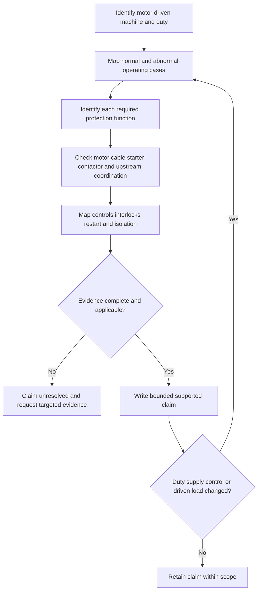
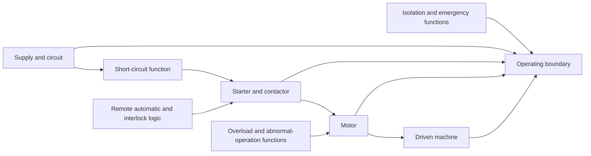

# Day 20B — Motors and Associated Protection

> **Source and safety notice:** This original module supports paper-based reasoning only. It does not prescribe motor settings, starting methods, conductor sizes, isolation arrangements, test values, adjustment sequences or commissioning procedures. Exact requirements require current authorised sources, manufacturer information and qualified technical review. It is not `technically-reviewed`.

## Navigation

- **Previous:** [Day 20A — Fixed Appliances and Local Isolation](./day-20a-fixed-appliances-and-local-isolation.md)
- **Next:** [Day 20C — Alternative and Multiple Supplies Awareness](./day-20c-alternative-and-multiple-supplies-awareness.md)

## 1. Outcome and entry check

### Learning objectives

By the end of this block, the learner should be able to:

1. separate the motor, driven machine, supply circuit, starter, controls, protective functions and isolating means;
2. distinguish starting, running, overload, short circuit, stall, abnormal supply and unintended restart cases;
3. apply **M-O-T-O-R** to build an evidence plan;
4. grade evidence as observed, documented, manufacturer-verified, derived, assumed or missing;
5. grade conclusions as described, supported, verified or unresolved;
6. explain coordination across motor, cable, starter, contactor, enclosure and upstream protection;
7. reopen affected conclusions when duty, starting method, supply, control logic or driven load changes.

### Entry check

Without notes, answer:

1. Why is one upstream breaker not necessarily complete motor protection?
2. Why is starting current not automatically a defect?
3. How can a stationary motor remain hazardous?
4. Why must the driven machine be included?
5. Which missing records should stop a settings or suitability recommendation?

A high-confidence statement that the nameplate current is automatically the correct setting is a critical misconception.

## 2. Why it matters

Motor circuits combine electrical, thermal, mechanical and control behaviour. A design adequate during steady running may fail during starting, repeated starts, stall, phase abnormality, poor ventilation, excessive load or automatic restart.

The governing model is:

**machine and duty → operating cases → protection functions → coordination → control and isolation → evidence-backed conclusion**

*Caption: Current magnitude is evidence; the operating case explains what it means.*

## 3. Core concepts and terminology

### System objects

- **Motor:** converts electrical energy into mechanical motion.
- **Driven machine:** the pump, fan, compressor, conveyor or other load.
- **Starter or controller:** starts, stops or regulates operation.
- **Contactor or switching element:** makes or breaks an operating circuit.
- **Protective function:** responds to a defined abnormal condition.
- **Control circuit:** local, remote, automatic or interlocked command path.
- **Isolation boundary:** the verified energy boundary required for the intended task.

### Operating and abnormal cases

- **Starting:** expected acceleration case with different current and torque behaviour from steady running.
- **Overload:** sustained demand above normal operating conditions.
- **Short circuit:** low-impedance fault path with potentially severe current.
- **Stall or locked rotor:** energised motor cannot accelerate or continue turning.
- **Abnormal supply:** loss of phase, imbalance or other unsuitable supply condition.
- **Excessive starting duty:** repeated or prolonged starts causing thermal stress.
- **Unintended restart:** automatic, remote or supply-restoration operation when not expected.

### Evidence grades

1. **Observed** — visible in supplied material.
2. **Documented** — stated in current drawings, schedules or records.
3. **Manufacturer-verified** — supported by applicable product data.
4. **Derived** — calculated from verified inputs using an authorised method.
5. **Assumed** — plausible but not evidenced.
6. **Missing** — required but unavailable.

### Claim grades

- **Described** — reports supplied information.
- **Supported** — connects applicable evidence within a stated boundary.
- **Verified** — requires complete authorised evidence and qualified confirmation.
- **Unresolved** — a material gap prevents the claim.

## 4. Rule-finding workflow

Use **M-O-T-O-R**:

1. **M — Machine and mission:** identify motor, driven equipment, duty, environment, users and consequences of failure.
2. **O — Operating cases:** map start, run, stop, repeated start, jam, stall, abnormal supply, remote command, supply restoration and maintenance states.
3. **T — Thermal and fault protection:** identify each claimed protective function and coordination evidence.
4. **O — Operating controls and isolation:** separate normal control, interlocks, emergency action, restart prevention and maintenance isolation.
5. **R — Records and review:** verify drawings, manufacturer data, device characteristics, calculations and current requirements; record gaps and reopening triggers.

For each conclusion, record operating case, affected component, claimed function, evidence grade, claim grade, missing evidence and reopening trigger.

## 5. Visual model or worked example

A fictional extract fan uses a three-phase motor. The drawing shows an upstream breaker, contactor and local stop button. A building-management system can also command the fan. Motor nameplate information is available, but driven-load duty, overload characteristics, starting frequency, phase-abnormality response and local isolation evidence are absent.

Apply M-O-T-O-R:

| Step | Evidence-led response |
|---|---|
| Machine and mission | Extract fan serving an occupied process area; loss of operation and restart matter. |
| Operating cases | Local and remote start shown; duty and starting frequency missing. |
| Thermal and fault protection | Breaker, contactor and unspecified overload function shown; coordination unresolved. |
| Operating controls and isolation | Stop button and remote command documented; stopped is not isolated. |
| Records and review | Manufacturer and design evidence incomplete; no setting or approval claim is supportable. |

### Worked-example fading

A second motor has complete nameplate data and a documented overload device, but no driven-load duty, control diagram or cable-route evidence. The learner must:

1. grade every input;
2. identify four operating cases that remain unresolved;
3. write one described and one unresolved claim;
4. explain which conclusions reopen if the motor begins frequent reversing duty.

## 6. Practical application

### Scenario

A fictional workshop air compressor includes a pressure-switch control, upstream protective device, starter enclosure, overload function, automatic restart, remote enable, local stop, incomplete cable-route information and no verified starting study or isolation drawing.

Produce:

1. an operating-case register;
2. a function map for control, overload, short circuit, abnormal supply, restart and isolation;
3. an evidence ledger using the six evidence grades;
4. a coordination map across supply, cable, starter, contactor, motor and driven machine;
5. a targeted evidence request;
6. a bounded conclusion using the four claim grades;
7. a change-propagation note for a later driven-load or starting-method change.

### Assessment rubric

Score each category from **0 to 2**.

| Category | 0 | 1 | 2 |
|---|---|---|---|
| System boundary | Motor only | Some components included | Motor, driven machine, circuit, controls and isolation bounded |
| Operating cases | Running only | Several cases listed | Normal, abnormal, restart and maintenance cases connected |
| Protection reasoning | One device assumed complete | Functions partly separated | Distinct functions and coordination evidence identified |
| Evidence discipline | Settings or facts invented | Grades inconsistent | Evidence and claim grades applied consistently |
| Change propagation | Changed duty ignored | Some reopening | Every dependent conclusion reopened and explained |
| Safety communication | Adjustment or field authority implied | General caution | Clear unresolved claim and stop boundary |

A score of **10/12 or higher** with no critical error indicates readiness for Day 20C. This is an educational threshold, not an official assessment rule.

## 7. Common errors and safety checkpoint

Common errors include using nameplate current as an automatic setting, assuming one breaker covers every motor hazard, ignoring the driven machine, treating a stop command as isolation, overlooking automatic restart and inventing settings or starting methods.

Critical errors include:

- prescribing a protection setting, adjustment or test method without authorised evidence;
- omitting a disclosed remote, automatic or alternative control path;
- treating a stationary motor as safely isolated;
- ignoring mechanical or stored-energy hazards;
- proposing opening, switching, resetting, testing, commissioning, installing or altering equipment.

*Caption: Stationary describes now; the control map explains what may happen next.*

This module authorises no electrical or mechanical work.

## 8. Retrieval and next links

### Closed-note retrieval

1. Expand M-O-T-O-R.
2. Distinguish starting, overload, short circuit and stall.
3. Name the six evidence grades and four claim grades.
4. Why must the driven machine be included?
5. Which components require coordination evidence?
6. Why does a stop control not prove isolation?
7. What changes reopen the analysis?
8. State four critical errors.

### Changed-scenario transfer

Re-attempt the practical application after changing the driven load, introducing frequent reversing duty or adding a remote restart source. Rebuild operating cases and coordination claims rather than carrying forward the earlier conclusion.

### Knowledge-base links

- [[Day 03 - Overcurrent Protection]]
- [[Day 09 - Complete Cable-Selection Workflow]]
- [[Day 20A - Fixed Appliances and Local Isolation]]
- [[Day 20B - Motors and Associated Protection]]
- [[Day 20C - Alternative and Multiple Supplies Awareness]]
- [[Overcurrent Protection]]
- [[Fault Finding and Commissioning]]
- [[Safety and Electrical Risk]]

### Review boundary

Day 20B remains `review-required`, `reference_check_required`, safety-critical and not `technically-reviewed`. Exact motor classifications, settings, coordination methods, starting performance, controls, restart behaviour, isolation, testing and acceptance criteria require current authorised sources and qualified review.

<!-- sequence-navigation:start -->
### Sequence navigation

- [← Previous: Day 20A — Fixed Appliances and Local Isolation](./day-20a-fixed-appliances-and-local-isolation.md)
- [Four-week learning plan](../MASTER_PLAN.md)
- [Next: Day 20C — Alternative and Multiple Supplies Awareness →](./day-20c-alternative-and-multiple-supplies-awareness.md)
<!-- sequence-navigation:end -->
