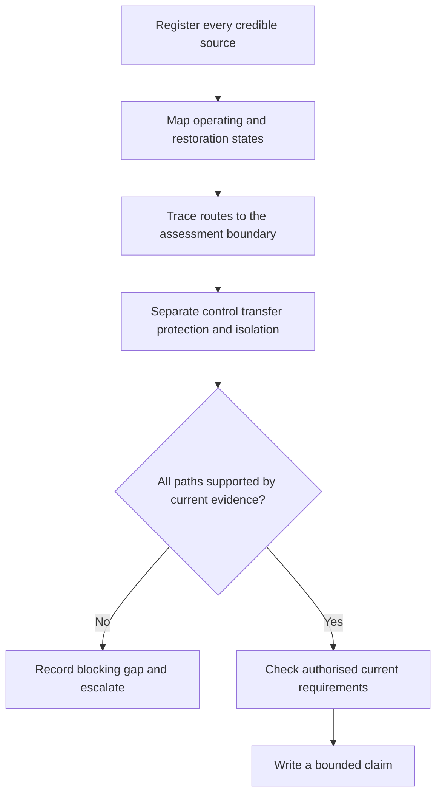

# Day 20C — Alternative and Multiple Supplies Awareness

> **Boundary:** Original paper-based learning material only. It does not provide switching, isolation, testing, commissioning or energisation instructions. Exact classifications and requirements remain `reference_check_required` and require authorised current sources and qualified technical review.

## Beat 1 — Outcome and entry check

By the end of this block, the learner can:

1. classify credible normal, alternative, generated, stored, auxiliary and feedback-capable energy paths in a fictional scenario;
2. construct a source-and-state map that includes automatic restoration and remote operation;
3. distinguish transfer, control, protection, interlocking, isolation and verification claims;
4. identify the first evidence gap that blocks a defensible conclusion; and
5. produce a bounded written finding without prescribing field action.

**Entry check:** Explain why opening a normal-supply switch does not prove all energy paths are controlled. Record confidence and identify the evidence needed to verify the answer.

## Beat 2 — Why it matters

Multiple-source installations defeat single-arrow reasoning. Generation, storage, auxiliary control supplies and feedback-capable equipment may energise a boundary from unexpected directions or at unexpected times. Assessment quality depends on finding every credible path before making claims about transfer, isolation or safety.

*Alternative text: A learner notices several arrows entering a board instead of focusing only on the normal supply.*

## Beat 3 — Core concepts and terminology

- **Source:** something capable of containing or delivering energy.
- **Operating state:** a defined combination of source availability, controls and connected loads.
- **Feedback-capable path:** a route that may energise conductors opposite to the assumed load-flow direction.
- **Transfer:** controlled movement of supply responsibility between sources.
- **Interlock:** a feature intended to prevent an incompatible operating state.
- **Isolation boundary:** the defined subject for which all relevant energy paths must be addressed.
- **Evidence grade:** direct record, corroborated record, single unverified record, inference, or unknown.
- **Claim grade:** observed, supported, provisional, or blocked.

A transfer device may coordinate sources without proving isolation. A protective device may respond to faults without performing control or isolation functions.

## Beat 4 — Rule-finding workflow

Use **S-O-U-R-C-E**:

1. **Sources** — list every credible electrical, stored, auxiliary and feedback path.
2. **Operating states** — map normal, outage, transfer, restoration, maintenance, remote-command and fault states.
3. **Users and boundaries** — define supplied equipment, affected people and the exact assessment boundary.
4. **Routes and relationships** — trace source, conversion, conductor, transfer and load relationships.
5. **Controls and coordination** — separate control, transfer, interlocking, protection, emergency action and isolation claims.
6. **Evidence and escalation** — grade evidence, record conflicts and stop at the first blocking gap.

## Beat 5 — Visual model or worked example

A fictional facility has network supply, a standby generator, photovoltaic conversion equipment, battery storage and a separately supplied controller. The single-line predates the battery installation.

| Evidence question | Finding | Claim grade |
|---|---|---|
| Sources | Five credible paths are identified | supported |
| States | Battery and restoration states are incomplete | blocked |
| Transfer | Network-generator transfer is shown | provisional |
| Feedback | PV and battery relationships are unclear | blocked |
| Conclusion | Complete isolation or compliance cannot be established | supported |

The correct response is to request a current consolidated source model, not infer switch positions.

## Beat 6 — Practical application

For a fictional workshop, produce:

1. a source register with role, supplied boundary, automatic behaviour, storage or feedback potential, and evidence grade;
2. a state map covering normal supply, loss, alternative availability, restoration, remote command and failure;
3. three blocking evidence gaps ranked by safety consequence;
4. one changed scenario in which the normal source is unavailable but two other paths remain credible; and
5. a six-sentence bounded handover.

**Assessment rubric — 12 points:** source completeness 0–2; state completeness 0–2; functional distinctions 0–2; evidence grading 0–2; transfer to changed scenario 0–2; bounded communication 0–2. Any invented switching or isolation procedure is a critical error.

## Beat 7 — Common errors and safety checkpoint

Common errors include starting at the main switch, overlooking auxiliary or stored energy, treating interlocking as isolation, trusting an outdated diagram, and converting awareness into a field sequence.

Stop and escalate when a source, automatic state, feedback path, neutral or earthing relationship, drawing revision, or isolation boundary is unclear. This module grants no authority to open, touch, switch, isolate, test, adjust, commission, install, alter or energise equipment.

*Alternative text: A learner chooses a complete source map instead of a shortcut labelled one switch.*

## Beat 8 — Retrieval and next links

Without notes, reconstruct S-O-U-R-C-E, define feedback-capable path, and explain why transfer and isolation are different claims. After a delay, repeat using a scenario with a newly added battery and an outdated drawing.

- **Previous:** [Day 20B — Motors and Associated Protection](./day-20b-motors-and-associated-protection.md)
- **Knowledge note:** [[Day 20C - Alternative and Multiple Supplies Awareness]]
- **Next:** [Day 21 — Week 3 Simulated Visual Inspection](./day-21-week-3-simulated-visual-inspection.md)
- **Plan:** [Four-week learning plan](../MASTER_PLAN.md)

## Technical-review flags

A qualified reviewer must verify formal source classifications; transfer and interlocking requirements; conductor, neutral and earthing arrangements; fault and protection implications; labelling; isolation; testing; commissioning; and jurisdiction-specific obligations. **Review state:** `review-required`; `reference_check_required`; safety-critical; not `technically-reviewed`.

<!-- sequence-navigation:start -->
### Sequence navigation

- [← Previous: Day 20B — Motors and Associated Protection](./day-20b-motors-and-associated-protection.md)
- [Four-week learning plan](../MASTER_PLAN.md)
- [Next: Day 21 — Week 3 Simulated Visual Inspection →](./day-21-week-3-simulated-visual-inspection.md)
<!-- sequence-navigation:end -->
