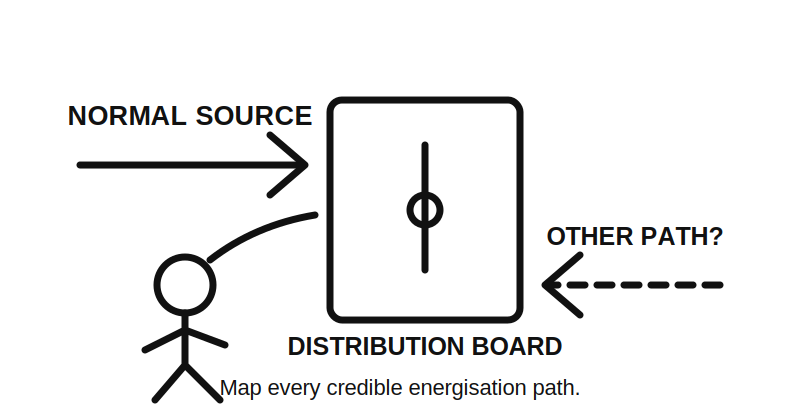
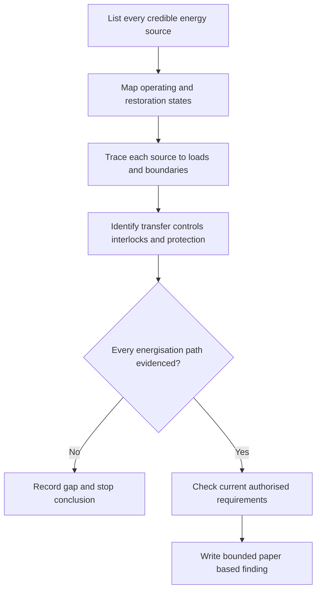
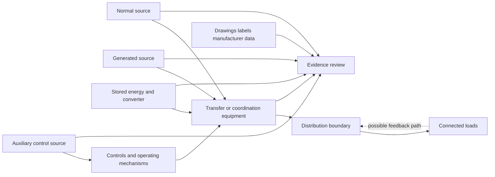
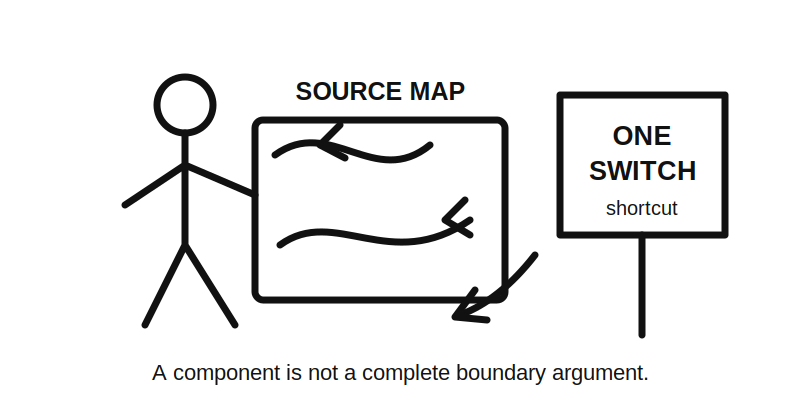

# Day 20C — Alternative and Multiple Supplies Awareness

> **Source and currency notice:** This is original educational material for paper-based source mapping and evidence planning. It does not prescribe transfer arrangements, switching sequences, isolation methods, neutral or earthing configurations, test values, signage, commissioning steps or field procedures. Exact requirements depend on the supply types, equipment, manufacturer instructions, current authorised standards, legislation, network rules, regulator guidance and RTO procedures. Qualified technical review is required before publication or operational use.

## Beat 1 — Outcome and entry check

### What you will learn

By the end of this block, you should be able to:

1. distinguish normal, alternative, supplementary, generated, stored-energy and feedback-capable sources;
2. map every credible path by which an installation or item of equipment may become energised;
3. separate supply availability, transfer control, source interlocking, isolation and verification as different evidence questions;
4. use the **S-O-U-R-C-E** workflow to review a multiple-supply scenario;
5. write a bounded conclusion without proposing switching, isolation, testing or commissioning actions.

### Entry check

Answer without notes:

1. Why can opening the normal-supply main switch be insufficient in a multiple-source installation?
2. What is the difference between an alternative supply and stored energy?
3. How can equipment feed energy back toward an upstream point?
4. Why is an automatic transfer device not, by itself, proof of a safe isolation boundary?
5. Which documents would you request before accepting a source diagram?

Record confidence. Treat a high-confidence claim that “the grid is off, so the installation is dead” as a priority misconception.

## Beat 2 — Why it matters

An installation may remain energised, become re-energised automatically or contain hazardous stored energy after the expected normal source is disconnected. Examples can include generating sets, photovoltaic systems, batteries, uninterruptible power supplies, electric vehicles, regenerative drives, control supplies and interconnected equipment.

Common assessment and workplace failures include:

- noticing the normal supply but missing an alternative or auxiliary source;
- assuming a labelled switch controls every source and every conductor;
- overlooking automatic transfer, remote start or restoration of supply;
- treating a battery as harmless because its output is not the normal mains voltage;
- ignoring feedback through power-conversion equipment or interconnected circuits;
- confusing prevention of parallel operation with establishment of isolation;
- relying on a single-line diagram that is outdated or incomplete;
- turning an awareness exercise into a field switching sequence.

*Caption: The obvious arrow is not necessarily the only arrow.*

## Beat 3 — Core concepts and terminology

### Classify sources by role and behaviour

Use broad functional categories before seeking formal definitions in authorised material:

- **normal source** — the source ordinarily intended to supply the installation or load;
- **alternative source** — a source intended to supply when the normal source is unavailable or intentionally not used;
- **supplementary source** — a source that may operate with another source under a designed arrangement;
- **generated source** — energy produced locally, whether continuously, intermittently or on demand;
- **stored-energy source** — energy retained in batteries, capacitors, mechanical systems or other storage;
- **auxiliary or control source** — a separate source serving controls, monitoring, communications or operating mechanisms;
- **feedback-capable path** — a path through which equipment can energise conductors from a direction not assumed in the basic load flow.

These categories may overlap. The evidence must identify the actual operating arrangement rather than forcing equipment into one label.

### Separate five evidence questions

1. **Availability:** Which sources can contain or deliver energy?
2. **Connection:** Which conductors, devices and loads can each source energise?
3. **Transfer or coordination:** How are source states controlled and incompatible states prevented?
4. **Isolation boundary:** Which source paths must be addressed for the intended boundary?
5. **Verification and records:** What current evidence demonstrates the arrangement and its limitations?

A transfer device may coordinate source selection without proving that every energy path is isolated. A protective device may respond to faults without providing the required control or isolation function.

### Operating states matter

Map at least the credible paper-based states:

- normal supply available;
- normal supply lost;
- alternative source starting or becoming available;
- transfer in progress;
- alternative supply carrying load;
- normal supply restored;
- maintenance mode;
- remote or automatic command;
- stored energy present;
- fault or failed-transfer condition.

Do not invent transfer times, switching sequences, permissible parallel conditions or device positions.

## Beat 4 — Rule-finding workflow: S-O-U-R-C-E

Use **S-O-U-R-C-E** to organise the evidence review.

1. **S — Sources:** list every normal, alternative, supplementary, generated, stored, auxiliary and feedback-capable source.
2. **O — Operating states:** map normal, loss-of-supply, transfer, restoration, maintenance, remote-command and fault states.
3. **U — Users and boundaries:** identify who may interact with the system, what equipment is supplied and which boundary is being assessed.
4. **R — Routes and relationships:** trace conductors, conversion equipment, transfer devices, interlocks, protective devices and possible backfeed paths.
5. **C — Controls and coordination:** separate functional control, automatic transfer, prevention of incompatible source states, emergency action and isolation claims.
6. **E — Evidence and escalation:** verify drawings, schedules, labels, manufacturer data, settings records and current authorised requirements; stop where evidence is incomplete.

### Current-source search sequence

For a paper scenario:

1. obtain the current single-line, source schedule and equipment schedule;
2. obtain manufacturer instructions for generation, storage, conversion and transfer equipment;
3. identify normal, alternative, auxiliary and stored-energy sources;
4. map operating states and control dependencies;
5. consult current authorised material for supply arrangements, switching, isolation, protection, earthing, neutral treatment, labelling and verification;
6. confirm network, regulator and jurisdiction-specific obligations where applicable;
7. compare labels and diagrams with the documented design scope;
8. record edition, amendment, source, jurisdiction and date accessed;
9. leave device selection, conductor treatment, switching, testing and approval unresolved where evidence is incomplete.

## Beat 5 — Visual model and worked example

### Multiple-source evidence model

### Fictional worked review

A fictional small community facility has a normal network supply, a standby generator, rooftop photovoltaic equipment and a battery system. A transfer device is shown between the network and generator. The battery supplies selected circuits through conversion equipment. A monitoring controller has a separate low-voltage supply. The available single-line does not show whether the photovoltaic and battery paths are disconnected during generator operation, and its revision predates the battery installation.

Apply S-O-U-R-C-E:

| Step | Finding | Consequence |
|---|---|---|
| Sources | Network, generator, photovoltaic, battery and control supply are identified | More than one electrical and stored-energy path exists |
| Operating states | Normal, outage and generator states are partly shown; battery and restoration states are incomplete | The full state model is unproven |
| Users and boundaries | Facility distribution and selected circuits are identified | The exact maintenance boundaries still need definition |
| Routes and relationships | Network-generator transfer is shown; photovoltaic and battery relationships are unclear | Backfeed and incompatible-state claims cannot be assessed |
| Controls and coordination | A transfer device and controller exist | Their functions and limitations require current evidence |
| Evidence and escalation | Diagram revision and manufacturer records are incomplete | No switching, isolation or compliance conclusion is supportable |

The correct response is to request an updated source model and supporting records, not to infer device positions or propose an operating sequence.

## Beat 6 — Practical application

### Scenario: workshop with several energy paths

A fictional workshop includes:

- a normal network supply;
- a generator inlet and changeover assembly;
- photovoltaic generation connected through conversion equipment;
- a battery-backed communications cabinet;
- a variable-speed drive that may retain internal energy;
- remotely controlled doors and ventilation;
- incomplete source labels at one distribution board;
- no current consolidated single-line diagram.

### Task A — Build the source register

For each source, record:

| Source | Energy form | Normal role | Equipment or boundary supplied | Automatic or remote behaviour | Stored or feedback potential | Evidence status |
|---|---|---|---|---|---|---|
| Example only | electrical | auxiliary | control cabinet | remote | possible | incomplete |

Do not classify a source as harmless merely because it is small, intermittent, indirect or normally inactive.

### Task B — Build the state map

Describe, without field actions:

1. normal operation;
2. normal-source loss;
3. generator availability;
4. photovoltaic production during outage;
5. battery operation;
6. restoration of normal supply;
7. remote-command state;
8. maintenance state;
9. failed-control or unclear state.

### Task C — Identify blocking evidence gaps

Prioritise gaps that prevent understanding of:

- every source and conversion stage;
- conductor and neutral relationships;
- transfer and interlock functions;
- protective-device coordination;
- earthing arrangements;
- automatic and remote operation;
- labelling and diagram currency;
- isolation boundaries and verification responsibilities.

### Task D — Write the bounded conclusion

Use this pattern:

> The available information identifies several normal, generated, stored and auxiliary energy paths, but it does not establish a complete current source map or demonstrate the relationships among transfer, control, protection, earthing and isolation functions. Obtain the missing drawings, manufacturer information and authorised requirements before approving the arrangement or undertaking switching, isolation, testing or alteration.

## Beat 7 — Common errors and safety checkpoint

### Common errors

- starting with the main switch instead of the source register;
- assuming a transfer device removes every possible energisation path;
- overlooking auxiliary supplies, batteries, capacitors or mechanical stored energy;
- ignoring photovoltaic, regenerative or interconnected feedback paths;
- treating prevention of parallel operation as equivalent to isolation;
- trusting labels or an old single-line without checking revision and scope;
- assuming a source that is not currently operating cannot start automatically;
- inventing neutral, earthing, pole or interlock arrangements;
- recommending a switching sequence from an incomplete diagram;
- describing physical verification from memory.

*Caption: One switch is a component; the source map is the argument.*

### Safety checkpoint

Stop the exercise and escalate when:

- any source, feedback path, stored-energy element or automatic-start condition is unclear;
- drawings, labels, schedules or manufacturer instructions conflict or are outdated;
- transfer, interlock, protection, neutral, earthing or isolation functions cannot be verified;
- current authorised standards, network rules, regulator guidance or jurisdictional requirements are unavailable;
- the task would require opening, touching, switching, operating, isolating, locking, testing, proving de-energised, commissioning, installing, repairing or altering equipment;
- exposed parts, damaged equipment, smoke, heat, arcing, unusual noise or immediate danger is observed;
- a learner is about to convert the awareness model into a field procedure.

This module does not provide a switching schedule, transfer sequence, isolation procedure, lockout method, test method, commissioning process or permission to work.

## Beat 8 — Retrieval, practice and next links

### Recall check

1. What six steps make up S-O-U-R-C-E?
2. Name six categories of credible energy source or path.
3. Why is a transfer device not automatic proof of isolation?
4. Which operating states should be mapped?
5. What is a feedback-capable path?
6. Why must auxiliary and stored-energy sources be recorded?
7. Which evidence gaps should stop a conclusion?
8. Name four prohibited transitions from paper review to field work.

### Applied practice

Create a fictional installation containing:

- one normal source;
- one generated source;
- one stored-energy source;
- one auxiliary control source;
- one automatic restoration state;
- one possible feedback path;
- one outdated drawing;
- one unclear isolation boundary.

Require another learner to:

1. complete the S-O-U-R-C-E review;
2. draw the source and state maps;
3. distinguish control, transfer, protection and isolation claims;
4. identify the first blocking evidence gap;
5. write a bounded conclusion without describing field actions.

### Reflection

Complete these prompts:

- The source type I am most likely to overlook is…
- The operating state I am most likely to omit is…
- The evidence conflict that should stop my conclusion is…

### Navigation

- **Previous:** [Day 20B — Motors and Associated Protection](./day-20b-motors-and-associated-protection.md)
- **Knowledge note:** [[Day 20C - Alternative and Multiple Supplies Awareness]]
- **Next:** Day 21 — Week 3 Simulated Visual Inspection

## Technical-review flags

Before publication or operational use, a qualified reviewer must verify against current authorised sources:

- formal supply classifications, scope and definitions;
- transfer, changeover, interlocking and incompatible-state requirements;
- conductor, pole, neutral and earthing arrangements;
- protection and fault-current implications for every operating state;
- generation, storage, conversion, auxiliary and feedback-capable equipment requirements;
- switching, isolation, emergency action, labelling and accessibility;
- network-service-provider, regulator and jurisdiction-specific obligations;
- inspection, testing, commissioning, documentation and maintenance requirements.

**Review state:** `review-required`; `reference_check_required`; safety-critical; not `technically-reviewed`.

<!-- sequence-navigation:start -->
### Sequence navigation

- [← Previous: Day 20B — Motors and Associated Protection](./day-20b-motors-and-associated-protection.md)
- [Four-week learning plan](../MASTER_PLAN.md)
- Next: no later module has been created yet
<!-- sequence-navigation:end -->
