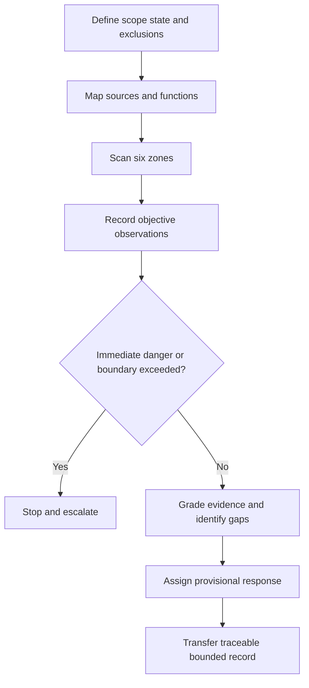

# Day 21 — Week 3 Simulated Visual Inspection

> **Boundary:** This is an original image- and document-based simulation. It is not an official checklist, defect code, access method, repair instruction or authority to inspect live equipment. Exact requirements remain `reference_check_required`.

## Beat 1 — Outcome and entry check

By the end of this block, the learner can define a simulated inspection boundary; record objective observations; distinguish gaps, concerns and verified conclusions; scan six functional zones; prioritise escalation; and produce a traceable handover.

**Entry check:** Given one photograph, write one observation, one unsupported inference and one missing-evidence statement. Explain why “no visible defect” does not establish conformity.

## Beat 2 — Why it matters

Visual inspection is structured evidence gathering, not a search for dramatic defects. A neat installation may still be unsuitable, incorrectly documented or incompletely shown. Strong performance depends on maintaining scope and resisting diagnosis beyond the evidence.

*Alternative text: A planned route covers the whole installation while one obvious defect is deliberately not allowed to dominate.*

## Beat 3 — Core concepts and terminology

- **Observation:** directly visible or explicitly documented evidence.
- **Evidence gap:** information required but unavailable.
- **Potential concern:** a condition requiring authorised comparison or review.
- **Verified conclusion:** a judgement supported by sufficient evidence and current authorised criteria.
- **Inspection boundary:** included locations, evidence, states, exclusions and prohibited actions.
- **Provisional response:** stop and escalate, blocking gap, priority concern, or routine clarification.
- **Traceability:** the ability to link a finding to a location, image, drawing or record.

Use six zones: supply and sources; switchboard; wiring systems; equipment; special locations; and documentation.

## Beat 4 — Rule-finding workflow

Use **I-N-S-P-E-C-T**:

1. **Identify scope** — define boundary, evidence, state, exclusions and prohibited actions.
2. **Note sources and functions** — map energy paths and area purposes.
3. **Scan by zone** — follow the six-zone route in a fixed order.
4. **Pinpoint observations** — record location, object and visible condition.
5. **Evaluate evidence** — separate direct evidence, conflicts and gaps.
6. **Classify provisionally** — choose a bounded response without official defect codes.
7. **Transfer the record** — cite evidence and state the exact authorised verification need.

## Beat 5 — Visual model or worked example

A fictional workshop pack shows an exterior board, a cable route near vehicle movement, a remote-start compressor, an incomplete wash-area drawing and a generator inlet label.

| Record field | Example |
|---|---|
| Observation | Cable guarding appears interrupted at image W-04 |
| Gap | Route construction and scale are not established |
| Concern | Mechanical exposure may require qualified review |
| Response | Priority concern; no official defect class assigned |
| Limitation | Internal condition and electrical performance are not shown |

The worked example fades on the second finding: the learner must supply the observation and gap without a model answer.

## Beat 6 — Practical application

Produce a scope statement, a complete six-zone scan, and three finding records. Each record must include identifier, location, observation, evidence source, gap, requirement topic, provisional response, limitation and authorised next need.

Then complete a transfer task: one photograph is removed and a conflicting schedule is added. Re-grade the affected claims and explain what changed.

**Assessment rubric — 12 points:** scope 0–2; zone coverage 0–2; objective wording 0–2; evidence discipline 0–2; response proportionality 0–2; handover traceability 0–2. Invented causes, official defect codes or field instructions are critical errors.

## Beat 7 — Common errors and safety checkpoint

Common errors include checklist-first inspection, diagnosing cause from appearance, treating absence of a photograph as absence of a condition, trusting stale records, ignoring alternative supplies, and inferring wet-area geometry from perspective.

Stop when immediate-danger indicators appear; access or action would exceed the simulation; sources or operating state are unclear; records conflict; geometry is insufficient; or current authorised material is unavailable. No opening, touching, operating, isolation, testing, repair or alteration is authorised.

*Alternative text: A learner writes an observation on one card and keeps the unknown cause on another.*

## Beat 8 — Retrieval and next links

Reconstruct I-N-S-P-E-C-T from memory. Classify five statements as observation, gap, concern or verified conclusion. After a delay, repeat with one changed source state and explain which records must be reopened.

- **Previous:** [Day 20C — Alternative and Multiple Supplies Awareness](./day-20c-alternative-and-multiple-supplies-awareness.md)
- **Knowledge note:** [[Day 21 - Week 3 Simulated Visual Inspection]]
- **Next:** [Day 22 — Verification Principles and Visual Inspection](./day-22-verification-principles-and-visual-inspection.md)
- **Plan:** [Four-week learning plan](../MASTER_PLAN.md)

## Technical-review flags

Qualified review must verify formal inspection scope, required items, access preconditions, response classifications, reporting duties, acceptance criteria and the relationship between inspection and testing. **Review state:** `review-required`; `reference_check_required`; safety-critical; not `technically-reviewed`.

<!-- sequence-navigation:start -->
### Sequence navigation

- [← Previous: Day 20C — Alternative and Multiple Supplies Awareness](./day-20c-alternative-and-multiple-supplies-awareness.md)
- [Four-week learning plan](../MASTER_PLAN.md)
- [Next: Day 22 — Verification Principles and Visual Inspection →](./day-22-verification-principles-and-visual-inspection.md)
<!-- sequence-navigation:end -->
