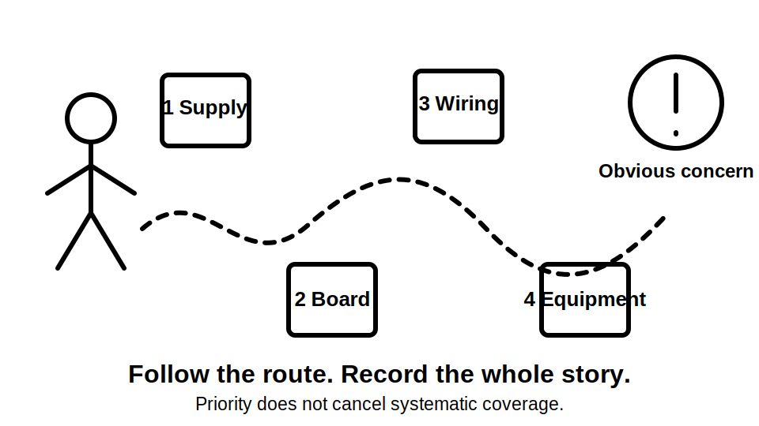
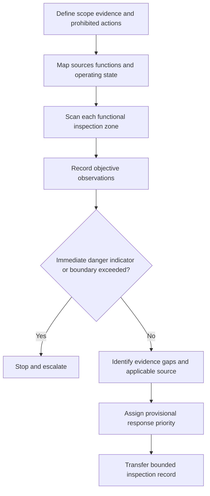
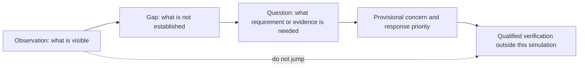
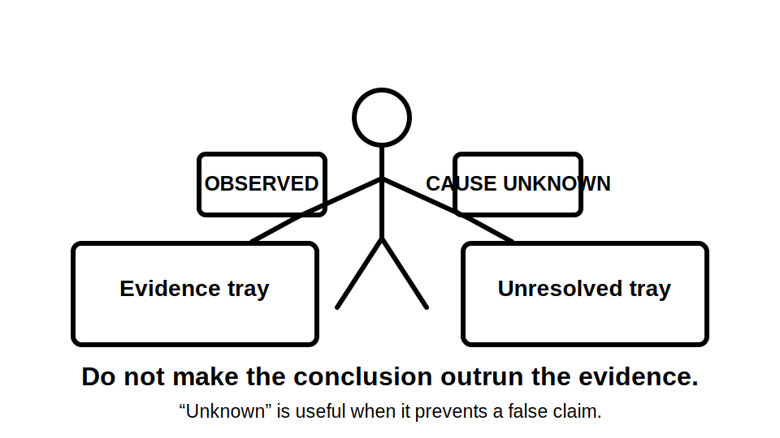

# Day 21 — Week 3 Simulated Visual Inspection

> **Source and currency notice:** This is original educational material for a simulated, paper- and image-based visual inspection. It does not prescribe an official inspection checklist, defect classification, access method, isolation sequence, test procedure, acceptance value or repair action. Exact requirements depend on the installation, equipment, current authorised standards, legislation, regulator guidance, manufacturer instructions and RTO procedures. Qualified technical review is required before publication or operational use.

## Beat 1 — Outcome and entry check

### What you will learn

By the end of this block, you should be able to:

1. define the boundary of a simulated visual inspection before recording findings;
2. distinguish an observation, an evidence gap, a potential defect and a verified compliance conclusion;
3. inspect a fictional installation systematically across supply, switchboard, wiring-system, equipment and special-location zones;
4. use the **I-N-S-P-E-C-T** workflow to create a traceable inspection record;
5. prioritise immediate-danger indicators without inventing causes, classifications or repairs;
6. write a bounded handover that identifies what requires authorised verification.

### Entry check

Answer without notes:

1. What is the difference between seeing damage and proving why it occurred?
2. Why is an unreadable label an evidence problem even when the equipment appears intact?
3. Which Week 3 topics should be interleaved during a whole-installation visual review?
4. Why can a photograph fail to prove accessibility, enclosure integrity or isolation suitability?
5. What finding would make you stop the simulation and escalate rather than continue classifying details?

Record confidence. A high-confidence claim that “no visible defect means the installation complies” is a priority misconception.

## Beat 2 — Why it matters

Visual inspection is not a casual search for obvious damage. It is a disciplined evidence-gathering activity that checks whether the observed installation is consistent with the documented design, environment, equipment purpose and expected protective arrangements.

Common assessment and workplace failures include:

- inspecting isolated components without understanding the circuit or supply context;
- treating neat workmanship as proof of suitability;
- describing an assumed cause instead of the visible evidence;
- overlooking wiring-system entries, supports, barriers, labels and environmental exposure;
- missing alternative supplies, automatic operation or stored energy;
- applying wet-area or special-location conclusions without verified geometry and scope;
- recording “pass” or “fail” where the evidence only supports “not demonstrated”;
- continuing toward opening, touching or testing equipment when the activity is limited to simulation.

*Caption: The loudest defect should not erase the rest of the installation.*

## Beat 3 — Core concepts and terminology

### Four levels of statement

Keep each record at the correct evidence level:

1. **Observation** — what is directly visible in the supplied image, drawing or scenario.
2. **Evidence gap** — information needed to assess the observation but not available.
3. **Potential concern** — a condition that may conflict with an applicable requirement or create risk.
4. **Verified conclusion** — a judgement supported by current authorised requirements and sufficient evidence.

Automated learning content should normally stop at the first three levels. It must not manufacture a verified conclusion.

### Inspection boundaries

Before starting, define:

- the installation or sub-installation included;
- the images, drawings, schedules and records available;
- viewpoints or areas not shown;
- whether equipment is closed, open, energised, isolated or unknown;
- which environmental and operating states are represented;
- which actions are prohibited;
- who receives unresolved findings.

A simulated visual inspection may use photographs, diagrams and fictional records. It does not establish the condition of concealed work, internal components, protective-device operation or electrical test results.

### Inspection zones

Use functional zones rather than a random component list:

- **supply and source zone** — normal, alternative, generated, stored and auxiliary sources;
- **switchboard zone** — enclosure, access, barriers, identification, visible arrangement and capacity evidence;
- **wiring-system zone** — route, support, entries, joints, mechanical protection and environmental exposure;
- **equipment zone** — suitability, mounting, connection, local control and isolation evidence;
- **special-location zone** — wet, harsh, public, temporary or otherwise triggered conditions;
- **documentation zone** — diagrams, labels, schedules, manufacturer information and inspection records.

### Finding priority is provisional

A simulated review can distinguish:

- **stop and escalate** — an immediate-danger indicator or condition outside the safe activity boundary;
- **blocking evidence gap** — no defensible conclusion can be reached;
- **priority concern** — prompt qualified assessment is warranted;
- **routine clarification** — information should be corrected or confirmed through the normal review process.

Do not assign official defect codes, legal classifications or repair deadlines without the authorised source and competent reviewer.

## Beat 4 — Rule-finding workflow: I-N-S-P-E-C-T

Use **I-N-S-P-E-C-T** to organise the simulated inspection.

1. **I — Identify scope:** define the installation boundary, available evidence, operating state and prohibited actions.
2. **N — Note sources and functions:** map normal, alternative, stored, auxiliary and feedback-capable paths plus the function of each area.
3. **S — Scan by zone:** inspect supply, switchboard, wiring-system, equipment, special-location and documentation zones in a fixed order.
4. **P — Pinpoint observations:** record location, object and visible condition without diagnosing beyond the evidence.
5. **E — Evaluate evidence:** separate what is shown, what is missing and which current authorised requirement must be checked.
6. **C — Classify response provisionally:** choose stop-and-escalate, blocking gap, priority concern or routine clarification without using official defect codes.
7. **T — Transfer the record:** provide traceable references, limitations, photographs or scenario identifiers and the exact next verification need.

### Current-source search sequence

For each finding:

1. identify the installation function and environmental context;
2. locate the current authorised requirement by topic rather than copying a checklist;
3. confirm definitions, scope, exceptions and referenced requirements;
4. check manufacturer instructions where product suitability or installation conditions matter;
5. check regulator, network and jurisdiction-specific requirements where applicable;
6. record the source title, edition or version, jurisdiction and access date;
7. state whether the available visual evidence is sufficient;
8. leave classification, testing and corrective action unresolved where evidence is incomplete.

## Beat 5 — Visual model and worked example

### Evidence ladder

### Fictional worked inspection record

A fictional small workshop package contains exterior photographs, a partial single-line diagram, one distribution-board schedule and equipment images. The images show a cable route beside a loading area, a board with a damaged directory cover, a fixed compressor with remote-start control, a wash area with incomplete dimensional information and a generator inlet label. No internal views or electrical test results are provided.

Apply I-N-S-P-E-C-T:

| Step | Example finding | Bounded consequence |
|---|---|---|
| Identify scope | External and closed-equipment views only; operating state unknown | Internal condition and de-energised state are not established |
| Note sources and functions | Network supply and generator inlet are shown; remote-start compressor is identified | Source and automatic-operation evidence must be included |
| Scan by zone | Loading-area route, board, compressor, wash area and records are reviewed | The review is systematic rather than defect-led |
| Pinpoint observations | Cable guarding appears interrupted near a vehicle path; directory cover is cracked | Record visible location and condition, not cause or compliance verdict |
| Evaluate evidence | Route construction, board enclosure integrity, wash-area geometry and source diagram are incomplete | Several conclusions remain blocked |
| Classify response provisionally | Damaged enclosure and exposed-route concerns receive priority review; incomplete geometry is a blocking gap | No official defect class is assigned |
| Transfer the record | Findings cite image numbers, missing documents and required qualified checks | The handover is traceable and limited |

The correct output is an evidence-based inspection record. It is not a repair list and does not authorise closer physical access.

## Beat 6 — Practical application

### Scenario: community workshop and amenities block

Review a fictional evidence pack containing:

- a site sketch and partial single-line diagram;
- photographs of the service position and main switchboard exterior;
- photographs of a submain route and final-subcircuit wiring systems;
- a fixed motor-driven exhaust system;
- a kitchenette appliance and local control point;
- a bathroom and accessible shower area with one missing dimension;
- a rooftop photovoltaic warning label and battery-cabinet exterior;
- an outdated circuit schedule;
- no test results and no authority to open equipment.

### Task A — Define the inspection boundary

Write a scope statement that identifies:

- included areas and evidence;
- excluded or concealed areas;
- known and unknown operating states;
- prohibited actions;
- escalation contact or role.

### Task B — Complete the zone scan

For every zone, record at least one of the following:

| Zone | Observation | Evidence gap | Relevant prior module | Provisional response |
|---|---|---|---|---|
| Supply and sources |  |  | Day 20C |  |
| Switchboard |  |  | Days 13B–13C |  |
| Wiring systems |  |  | Day 15 |  |
| Circuit hierarchy |  |  | Day 16 |  |
| Fixed appliances and motors |  |  | Days 20A–20B |  |
| Wet or special location |  |  | Days 17–18 |  |
| Documentation |  |  | Days 1 and 20C |  |

### Task C — Produce three finding records

Each record must contain:

1. unique identifier and precise location;
2. objective observation;
3. evidence source, such as image or drawing number;
4. missing information;
5. requirement topic to verify in current authorised material;
6. provisional response priority;
7. explicit limitation;
8. next qualified verification action stated as a need, not a procedure.

### Task D — Write the bounded handover

Use this pattern:

> The simulated evidence review identified observable conditions and document gaps across the supply, switchboard, wiring-system, equipment and special-location zones. The supplied material does not establish concealed condition, internal construction, electrical test performance, complete source isolation or final compliance. Immediate-danger indicators require escalation, and all remaining concerns require verification by an authorised and competent person using current requirements and approved procedures.

## Beat 7 — Common errors and safety checkpoint

### Common errors

- starting with a favourite checklist instead of defining scope;
- inspecting only the visually dramatic defect;
- treating absence of a photograph as absence of a condition;
- writing “non-compliant” without identifying the governing source and evidence;
- diagnosing cause from staining, damage or discolouration alone;
- assuming a circuit schedule or single-line is current;
- overlooking source labels, remote operation, stored energy or automatic restart;
- treating an ingress-protection marking as the whole suitability decision;
- inferring wet-area geometry from perspective-distorted photographs;
- converting a simulated inspection into instructions to open, touch, isolate or test.

*Caption: A careful record leaves room for facts that have not arrived yet.*

### Safety checkpoint

Stop the exercise and escalate when:

- exposed live parts, smoke, heat, arcing, burning odour, severe damage or another immediate-danger indicator is shown or described;
- any person would need to approach, open, remove a cover, touch, operate, isolate, lock, test, prove de-energised, repair or alter equipment;
- the energy-source map or automatic operating state is unclear;
- photographs, drawings, labels or schedules conflict materially;
- the location, scale or geometry is insufficient for a safety-critical conclusion;
- current authorised standards, legislation, regulator guidance, manufacturer instructions or RTO procedures are unavailable;
- the learner is about to assign an official defect class or corrective method from memory.

This module does not provide an inspection procedure for live or installed equipment, a safe-isolation method, a test sequence, an official defect code, a compliance certificate or permission to perform electrical work.

## Beat 8 — Retrieval, practice and next links

### Recall check

1. What seven steps make up I-N-S-P-E-C-T?
2. Distinguish observation, evidence gap, potential concern and verified conclusion.
3. Name the six functional inspection zones.
4. Why is a neat installation not automatically suitable or compliant?
5. What information belongs in a traceable finding record?
6. When should a simulated review stop immediately?
7. Why must source and operating-state mapping precede some visual conclusions?
8. Which conclusions cannot be supported by photographs alone?

### Applied practice

Create a fictional six-image evidence pack description containing:

- one supply-source ambiguity;
- one switchboard exterior concern;
- one wiring-system route concern;
- one fixed-equipment or motor concern;
- one wet- or special-location evidence gap;
- one outdated document.

Require another learner to:

1. define the inspection boundary;
2. complete the I-N-S-P-E-C-T workflow;
3. write three objective finding records;
4. identify one stop-and-escalate condition and one blocking evidence gap;
5. produce a bounded handover without official classifications or repair instructions.

### Reflection

Complete these prompts:

- The observation I am most likely to over-interpret is…
- The inspection zone I am most likely to skip is…
- The evidence gap that should most quickly stop my conclusion is…

### Navigation

- **Previous:** [Day 20C — Alternative and Multiple Supplies Awareness](./day-20c-alternative-and-multiple-supplies-awareness.md)
- **Knowledge note:** [[Day 21 - Week 3 Simulated Visual Inspection]]
- **Next:** Day 22 — Verification Principles and Visual Inspection

## Technical-review flags

Before publication or operational use, a qualified reviewer must verify against current authorised sources:

- the formal scope and sequence of visual inspection;
- required inspection items and documentation;
- access, energisation and isolation preconditions;
- official defect, danger and reporting classifications;
- switchboard, wiring-system, equipment and special-location acceptance criteria;
- alternative-supply, stored-energy and automatic-operation considerations;
- inspection records, responsibilities and jurisdiction-specific obligations;
- the relationship between visual inspection, electrical testing and certification.

**Review state:** `review-required`; `reference_check_required`; safety-critical; not `technically-reviewed`.

<!-- sequence-navigation:start -->
### Sequence navigation

- [← Previous: Day 20C — Alternative and Multiple Supplies Awareness](./day-20c-alternative-and-multiple-supplies-awareness.md)
- [Four-week learning plan](../MASTER_PLAN.md)
- Next: no later module has been created yet
<!-- sequence-navigation:end -->
