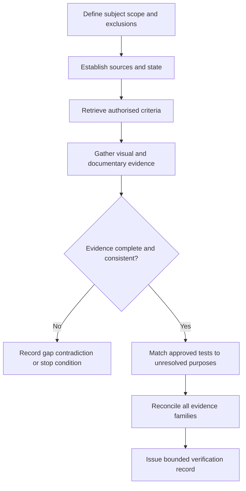

# Day 22 — Verification Principles and Visual Inspection

> **Boundary:** This original learning module explains verification as an evidence process. It does not provide an official checklist, test method, sequence, acceptance value, certification instruction or authority to access equipment. Exact duties remain `reference_check_required`.

## Beat 1 — Outcome and entry check

By the end of this block, the learner can explain verification as a bounded evidence judgement; distinguish design, construction, visual, test and documentary evidence; define scope and state; reconcile contradictions; match test purpose to an unresolved question; and issue a limited conclusion.

**Entry check:** Explain why a satisfactory test result cannot by itself prove correct equipment selection or location. State what additional evidence would be needed.

## Beat 2 — Why it matters

Verification fails when one favourable result is allowed to stand in for the whole evidence chain. A circuit can be continuous but misidentified; equipment can look intact but be unsuitable; and complete records can describe a different installation state. Scope, state, criteria and evidence must converge.

*Alternative text: A learner combines design, inspection, test and record cards rather than relying on one card.*

## Beat 3 — Core concepts and terminology

- **Defined subject:** the exact installation, alteration, circuit or equipment included.
- **Known state:** source availability, energisation, isolation, storage, automation and environment.
- **Applicable criteria:** current authorised requirements and approved procedures.
- **Sufficient evidence:** evidence adequate for the scope and conclusion claimed.
- **Evidence convergence:** independent evidence families support the same bounded conclusion.
- **Contradiction:** two records or observations cannot both support the same claim without clarification.
- **Not demonstrated:** evidence is insufficient; this is not automatically a failure.

Evidence families are design, construction, visual inspection, electrical test and documentation. They complement rather than automatically substitute for one another.

## Beat 4 — Rule-finding workflow

Use **V-E-R-I-F-Y**:

1. **Verify the scope** — define subject, completed work, exclusions and responsibility.
2. **Establish the state** — map all sources, automation, stored energy and environmental conditions.
3. **Retrieve the criteria** — locate current authorised requirements and approved procedures by topic.
4. **Inspect before inference** — gather objective visual and documentary evidence.
5. **Fit tests to purpose** — identify which approved test purpose addresses each unresolved question.
6. **Yield a bounded record** — reconcile evidence, grade claims and record limitations.

## Beat 5 — Visual model or worked example

A fictional alteration pack includes a design sketch, exterior images, equipment data and incomplete result fields. Rooftop generation is noted but the source diagram is missing.

| Verification element | Evidence grade | Claim grade |
|---|---|---|
| Defined alteration scope | corroborated | supported |
| Existing upstream boundary | incomplete | provisional |
| Alternative-source state | unknown | blocked |
| Visible route and labels | direct | observed |
| Final verification conclusion | insufficient | blocked |

The correct conclusion states what is supported and why completion remains blocked; it does not force a pass/fail outcome.

## Beat 6 — Practical application

Build an evidence matrix for a fictional small commercial alteration. For five verification questions, record visual evidence, documentary evidence, test purpose if required, evidence grade, claim grade and limitation.

Reconcile one contradiction between a label and a design sketch. Then repeat after the sketch is revised and identify every downstream claim that must be reopened.

**Assessment rubric — 12 points:** scope 0–2; state model 0–2; evidence-family coverage 0–2; contradiction handling 0–2; test-purpose matching 0–2; bounded conclusion 0–2. Invented methods, values, certification claims or unauthorised actions are critical errors.

## Beat 7 — Common errors and safety checkpoint

Common errors include calling inspection complete verification, treating a test sheet as proof it belongs to the observed installation, testing around unresolved source ambiguity, confusing inaccessible with not observed, and allowing a checklist to replace reasoning.

Stop when source state is unclear; records conflict materially; access or testing exceeds authority; authorised requirements are unavailable; a test method or value would need to be invented; or the proposed conclusion exceeds the inspected and tested scope.

*Alternative text: A learner stops at a missing bridge between inspection evidence and a final conclusion.*

## Beat 8 — Retrieval and next links

Reconstruct V-E-R-I-F-Y and the five evidence families. Distinguish not observed, not accessible and not demonstrated. After a delay, apply the workflow to a changed source state and explain which conclusions are invalidated.

- **Previous:** [Day 21 — Week 3 Simulated Visual Inspection](./day-21-week-3-simulated-visual-inspection.md)
- **Knowledge note:** [[Day 22 - Verification Principles and Visual Inspection]]
- **Next:** [Day 23 — Mandatory Electrical Tests and Purposes](./day-23-mandatory-electrical-tests-and-purposes.md)
- **Plan:** [Four-week learning plan](../MASTER_PLAN.md)

## Technical-review flags

Qualified review must verify formal verification responsibilities, required records, visual-inspection items, approved test purposes and sequence, acceptance criteria, certification duties and jurisdiction-specific requirements. **Review state:** `review-required`; `reference_check_required`; safety-critical; not `technically-reviewed`.