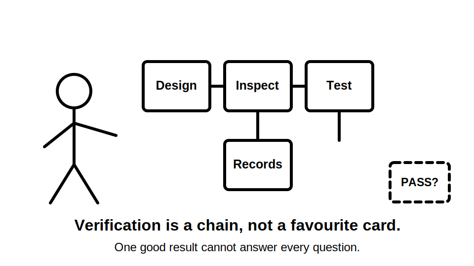
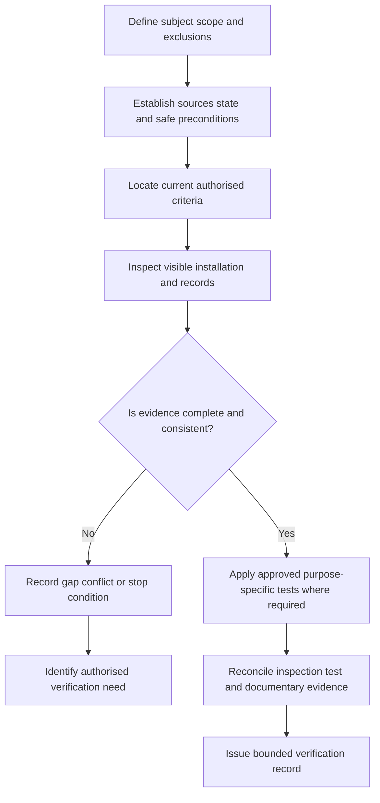
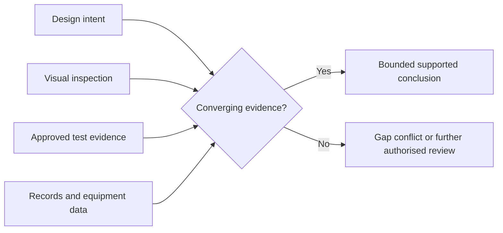
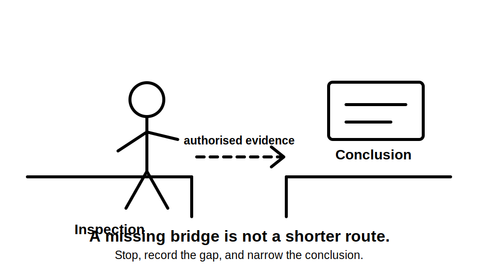

# Day 22 — Verification Principles and Visual Inspection

> **Source and currency notice:** This original educational module explains verification as an evidence process and places visual inspection within that process. It does not provide an official verification checklist, test sequence, instrument method, acceptance value, certification instruction or authority to access electrical equipment. Exact duties and procedures require current authorised standards, legislation, regulator guidance, manufacturer instructions and approved RTO or workplace procedures. Qualified technical review is required before publication or operational use.

## Beat 1 — Outcome and entry check

### What you will learn

By the end of this block, you should be able to:

1. explain verification as a chain of evidence rather than a single inspection or test;
2. distinguish design evidence, construction evidence, visual inspection, electrical testing and documentation;
3. define the limits of visual inspection before drawing a conclusion;
4. use the **V-E-R-I-F-Y** workflow to organise a fictional verification task;
5. identify conflicts, missing evidence and unsafe assumptions that block completion;
6. state why verification conclusions must match the installation state, scope and authorised criteria.

### Entry check

Answer without notes:

1. Can a satisfactory test result prove that equipment is correctly selected and located?
2. Can a neat visual appearance prove protective-device operation?
3. What evidence is needed before a verification conclusion can apply to an installation?
4. Why must alternative supplies and automatic operation be included in the scope?
5. When is “not demonstrated” more accurate than “failed”?

Record confidence. Treat a high-confidence belief that “testing replaces inspection” as a priority misconception.

## Beat 2 — Why it matters

Verification protects against several different failure types. A circuit may be electrically continuous yet incorrectly identified. Equipment may appear undamaged yet be unsuitable for its environment. Documents may be complete yet describe a different installation state. A single favourable observation cannot replace the whole evidence chain.

Verification failures commonly arise when a learner:

- begins testing before scope, source state and safe preconditions are established;
- assumes visual inspection and electrical testing are interchangeable;
- treats one result as proof of the complete installation;
- ignores design records, equipment information or modifications;
- records a pass without naming the requirement and evidence;
- overlooks inaccessible, concealed or excluded areas;
- fails to reconcile contradictions between drawings, labels, observations and results;
- continues when the task exceeds authority, competence or safe access conditions.

*Caption: One good card does not complete the deck.*

## Beat 3 — Core concepts and terminology

### Verification is a bounded evidence judgement

A defensible verification record needs four things:

1. **Defined subject** — the installation, alteration, circuit or equipment included.
2. **Known state** — energisation, isolation, source availability and operating conditions.
3. **Applicable criteria** — current authorised requirements and approved procedures.
4. **Sufficient evidence** — inspection, test, records and competent interpretation appropriate to the conclusion.

If one element is missing, narrow the conclusion or stop.

### Evidence families

- **Design evidence:** intended loads, circuit arrangement, protective coordination, environmental assumptions and equipment selection.
- **Construction evidence:** installed products, workmanship, identification, connections, routes and departures from design.
- **Visual-inspection evidence:** observable condition, arrangement, suitability indicators, labels and accessible documentation.
- **Electrical-test evidence:** instrument observations produced under an approved procedure for a defined purpose.
- **Documentary evidence:** schedules, diagrams, certificates, manufacturer information, previous results and change records.

These evidence families overlap but do not substitute automatically for one another.

### Visual inspection has positive and negative limits

Visual inspection can establish that a condition is visibly present. It can also identify that evidence is missing or inconsistent. It usually cannot establish concealed condition, internal connection quality, protective-device operation or electrical performance.

Use precise statements:

- **Observed:** directly visible or documented.
- **Not observed:** looked for within scope but not seen.
- **Not accessible:** outside the permitted or available view.
- **Not demonstrated:** evidence is insufficient for the proposed conclusion.
- **Requires authorised verification:** further competent work is needed, without prescribing the method here.

### Verification is not fault finding

Verification asks whether sufficient evidence supports conformity for a defined subject and state. Fault finding starts from an abnormal condition and searches systematically for its cause. A failed or conflicting verification item may trigger fault finding, but the two activities should not be merged casually.

## Beat 4 — Rule-finding workflow: V-E-R-I-F-Y

Use **V-E-R-I-F-Y** before making a verification conclusion.

1. **V — Verify the scope:** identify the exact installation boundary, work completed, exclusions and responsible parties.
2. **E — Establish the state:** map all sources, energisation, isolation, stored energy, automatic operation and environmental conditions.
3. **R — Retrieve the criteria:** locate current authorised requirements, approved procedures and manufacturer information by topic.
4. **I — Inspect before inference:** gather objective visual and documentary evidence without assuming concealed condition.
5. **F — Fit tests to purpose:** identify which approved tests are required to answer unresolved questions; do not improvise methods or values.
6. **Y — Yield a bounded record:** reconcile evidence, record limitations and make only conclusions supported by the complete evidence set.

### Source-record pattern

For every requirement used, record:

- source title and edition or version;
- jurisdiction and applicability;
- topic, clause or official procedure reference;
- access date;
- evidence type required;
- whether the evidence is available, conflicting or incomplete;
- reviewer or competent role responsible for final acceptance.

Do not turn references into copied standards content.

## Beat 5 — Visual model and worked example

### Evidence convergence model

### Fictional worked example

A fictional training package describes a new final subcircuit supplying fixed equipment. It includes a circuit schedule, exterior photographs, a product data sheet and selected test-result placeholders. The equipment is near a wash-down area, has automatic control and may receive auxiliary control energy. No authority to open equipment or conduct testing is provided.

Apply V-E-R-I-F-Y:

| Step | Fictional evidence | Bounded response |
|---|---|---|
| Verify scope | New circuit, isolating device, wiring route and fixed equipment are included | Existing upstream equipment and concealed sections are excluded unless separately evidenced |
| Establish state | Normal supply is shown; auxiliary control source is unclear | Verification cannot assume one device removes every energy path |
| Retrieve criteria | Current installation, equipment, isolation and verification topics are required | Exact duties remain reference-check items |
| Inspect | Route support, labels, enclosure and equipment location are visible | Internal connections and protective operation are not established |
| Fit tests | Test purposes can be identified from authorised procedures | No method, sequence or acceptance value is invented |
| Yield record | Several observations support progress, but source mapping is incomplete | Final verification remains blocked until the source conflict is resolved by an authorised person |

The correct conclusion is not “pass” or “fail.” It is that the supplied evidence supports specified observations while the complete verification conclusion remains blocked.

## Beat 6 — Practical application

### Scenario: small commercial alteration

A fictional alteration adds lighting, socket outlets and one fixed motor-driven appliance to an existing tenancy. Available evidence includes:

- an updated design sketch;
- a partial circuit schedule;
- exterior switchboard and equipment images;
- cable-route photographs;
- manufacturer information for the appliance;
- a note that rooftop generation exists;
- no confirmed source diagram;
- blank fields for electrical test evidence.

### Task A — Write the verification scope

State:

- included work and installation boundaries;
- excluded existing equipment and concealed work;
- known and unknown source states;
- documents and images available;
- prohibited actions;
- role responsible for unresolved technical decisions.

### Task B — Build an evidence matrix

| Verification question | Visual evidence | Documentary evidence | Test purpose, if required | Gap or limitation |
|---|---|---|---|---|
| Does the installed work match the defined alteration? |  |  |  |  |
| Are wiring routes and visible protection consistent with the environment? |  |  |  |  |
| Are equipment identity, location and controls established? |  |  |  |  |
| Are all supply and automatic-operation paths represented? |  |  |  |  |
| Is the evidence sufficient for a bounded conclusion? |  |  |  |  |

### Task C — Reconcile one contradiction

Choose one contradiction, such as a label that conflicts with the design sketch. Record:

1. both evidence sources;
2. why they cannot both support the same conclusion without clarification;
3. the safety or verification consequence;
4. what authorised evidence is needed next;
5. why guessing is unacceptable.

### Task D — Produce a bounded handover

Write a six-sentence handover that identifies scope, available evidence, supported observations, blocking gaps, prohibited assumptions and the competent next review.

## Beat 7 — Common errors and safety checkpoint

### Common errors

- calling visual inspection “verification complete”;
- treating a test sheet as proof that the sheet belongs to the observed installation;
- testing around an unresolved source or isolation ambiguity;
- using “not seen” when the item was actually inaccessible;
- declaring failure where evidence is merely absent;
- treating manufacturer information as proof of installed suitability;
- ignoring modifications made after drawings or certificates were produced;
- allowing a checklist to replace reasoning about scope and purpose;
- interpreting results without confirming instrument, procedure, state and acceptance source;
- beginning fault finding inside a verification task without a controlled transition.

*Caption: A missing bridge is not a shorter route.*

### Safety checkpoint

Stop and escalate when:

- the installation state, all energy sources or automatic operation cannot be established;
- exposed live parts, smoke, heat, arcing, burning odour or severe damage is indicated;
- access, isolation, testing or operation would exceed authority, competence or approved procedure;
- required current standards, regulator guidance, manufacturer information or RTO procedure is unavailable;
- records conflict materially with the observed installation;
- an instrument method, test sequence or acceptance value would need to be invented;
- the proposed conclusion extends beyond the inspected and tested scope;
- the learner is about to treat absence of evidence as proof of conformity.

## Beat 8 — Retrieval, practice and next links

### Recall check

1. What six steps make up V-E-R-I-F-Y?
2. Name the five evidence families.
3. Why can visual inspection neither replace testing nor be replaced by testing?
4. Distinguish “not observed,” “not accessible” and “not demonstrated.”
5. What four elements support a bounded verification judgement?
6. When does a contradiction become a blocking evidence problem?
7. Why must a test be matched to a defined purpose?
8. How does verification differ from fault finding?

### Applied practice

Create a fictional verification pack with one design record, three images, one equipment document and two incomplete result fields. Then:

1. define scope and state;
2. apply V-E-R-I-F-Y;
3. identify three visual observations;
4. identify two documentary gaps;
5. name the purpose of one authorised test without describing its procedure;
6. produce one supported conclusion and one deliberately unresolved conclusion.

### Reflection

Complete:

- The evidence type I most often over-trust is…
- The phrase I should use when evidence is incomplete is…
- The source or state ambiguity that should stop me fastest is…

### Navigation

- **Previous:** [Day 21 — Week 3 Simulated Visual Inspection](./day-21-week-3-simulated-visual-inspection.md)
- **Knowledge note:** [[Day 22 - Verification Principles and Visual Inspection]]
- **Next:** Day 23 — Mandatory Electrical Tests and Purposes

## Technical-review flags

Before publication or operational use, a qualified reviewer must verify against current authorised sources:

- formal verification scope, responsibilities and required records;
- required visual-inspection items and timing;
- access, isolation, energisation and safe-test preconditions;
- mandatory electrical tests and their purposes;
- approved test sequence, instruments and methods;
- acceptance criteria and result interpretation;
- treatment of alterations, existing installations and excluded work;
- alternative supplies, stored energy and automatic operation;
- certification, reporting and jurisdiction-specific obligations.

**Review state:** `review-required`; `reference_check_required`; safety-critical; not `technically-reviewed`.

<!-- sequence-navigation:start -->
### Sequence navigation

- [← Previous: Day 21 — Week 3 Simulated Visual Inspection](./day-21-week-3-simulated-visual-inspection.md)
- [Four-week learning plan](../MASTER_PLAN.md)
- Next: no later module has been created yet
<!-- sequence-navigation:end -->
