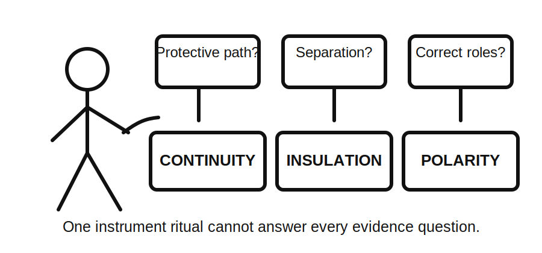
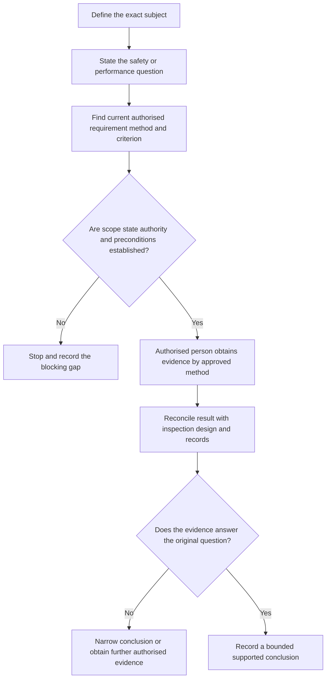
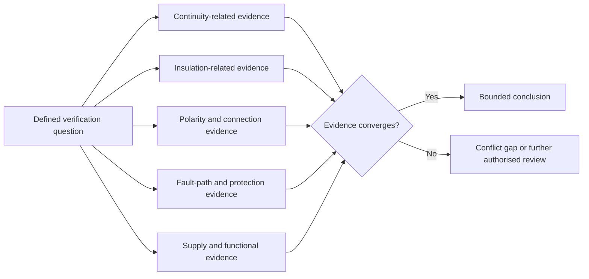
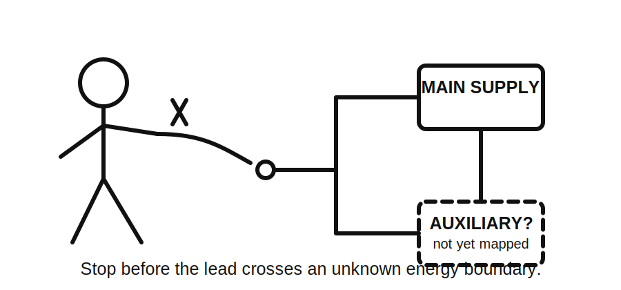

# Day 23 — Mandatory Electrical Tests and Purposes

> **Source and currency notice:** This original educational module explains the purposes and evidence boundaries of commonly required electrical verification tests. It does not provide an official mandatory-test list, test sequence, instrument setup, connection method, test voltage, acceptance value, pass criterion, energisation instruction or certification procedure. Exact requirements must be checked against current authorised standards, legislation, regulator guidance, manufacturer instructions and approved RTO or workplace procedures. Qualified technical review is required before publication or operational use.

## Beat 1 — Outcome and entry check

### What you will learn

By the end of this block, you should be able to:

1. explain why each verification test must answer a defined safety or performance question;
2. distinguish continuity, insulation, polarity, circuit-connection, protective-device and supply-related evidence at a conceptual level;
3. separate a test purpose from its approved method, sequence and acceptance criterion;
4. use the **P-U-R-P-O-S-E** workflow to plan a fictional evidence review;
5. identify when a favourable reading does not support the proposed conclusion;
6. recognise source-state, automatic-operation and scope ambiguities that block testing.

### Entry check

Answer without notes:

1. Does one continuity result prove correct polarity?
2. Can a favourable insulation result prove that every conductor is correctly connected?
3. Why must the installation state be known before interpreting a result?
4. What is the difference between “a test was performed” and “the required property was demonstrated”?
5. Why can alternative or stored-energy sources invalidate a testing assumption?

Record confidence. Treat any high-confidence belief that “one good result proves the circuit” as a priority misconception.

## Beat 2 — Why it matters

Electrical verification tests are not a collection of instrument rituals. Each test exists to gather evidence about a specific hazard, connection, protective path or operating condition. Confusing purposes can produce false confidence: the learner may obtain a plausible reading while answering the wrong question.

Weak verification commonly occurs when a learner:

- chooses a familiar test before defining the property to be demonstrated;
- assumes one test substitutes for another;
- ignores disconnected equipment, parallel paths, electronic components or multiple supplies;
- records a number without installation identity, state, method or criterion;
- treats a favourable result as proof beyond the tested scope;
- interprets results before contradictions with visual or documentary evidence are resolved;
- continues where authority, competence, safe access or approved procedure is absent.

*Caption: A precise answer still fails when it answers the wrong question.*

## Beat 3 — Core concepts and terminology

### Test purpose comes before test method

A defensible test record connects five elements:

1. **Subject** — the circuit, conductor, device, equipment or installation boundary being examined.
2. **Property** — the safety or performance characteristic the test is intended to demonstrate.
3. **State** — source availability, isolation, disconnections, switching positions and environmental or operating conditions.
4. **Approved method and criterion** — the authorised procedure, instrument requirements and acceptance basis.
5. **Bounded conclusion** — a statement no broader than the evidence supports.

This module teaches the second element and its relationship to the others. It deliberately does not teach field procedures.

### Conceptual evidence families

The exact required list and terminology must be verified from current authorised material. At a conceptual level, verification may require evidence concerning:

- **Protective-path continuity:** whether intended protective conductors and bonding paths form the required continuous connection.
- **Circuit continuity and connection:** whether required conductors form the intended path and whether unwanted breaks or cross-connections are indicated.
- **Insulation integrity:** whether conductors and connected parts are sufficiently separated for the authorised test conditions.
- **Polarity and conductor identity:** whether active, neutral, protective and switched conductors are connected in their intended roles.
- **Earthing and fault-path performance:** whether the protective arrangement can support the intended fault response under the applicable system conditions.
- **Protective-device operation:** whether relevant devices perform the required protective function under an approved test.
- **Supply characteristics and phase relationships:** whether the available supply and conductor relationships support the intended installation operation.
- **Functional operation:** whether controls, interlocks, indicators and equipment operate as intended after safety evidence and approved preconditions are established.

These families overlap, but none should be treated as automatic proof of another.

### A result needs context

A test value without context is incomplete evidence. A useful record identifies:

- what was tested;
- why it was tested;
- installation and source state;
- approved method and instrument identity;
- criterion source;
- result and units where applicable;
- limitations, exclusions and abnormal observations;
- competent person responsible for interpretation and acceptance.

## Beat 4 — Rule-finding workflow: P-U-R-P-O-S-E

Use **P-U-R-P-O-S-E** before selecting or interpreting a test.

1. **P — Pin down the subject:** define the exact circuit, conductor, device, equipment and boundary.
2. **U — Understand the hazard or property:** state the question the evidence must answer.
3. **R — Retrieve the authorised requirement:** locate the current mandatory test, approved method and acceptance source.
4. **P — Prove the preconditions:** establish sources, isolation, disconnections, equipment constraints, authority and safe access.
5. **O — Obtain evidence by the approved method:** testing is performed only by an authorised competent person using the required procedure.
6. **S — Scrutinise context and conflicts:** compare the result with inspection, design, equipment and documentary evidence.
7. **E — Express a bounded conclusion:** record only what the complete evidence demonstrates.

### Requirement-record pattern

For each test purpose, record:

- official source title, edition or version and jurisdiction;
- applicable topic, clause or approved procedure reference;
- property or hazard addressed;
- subject and installation state;
- method and criterion owner;
- equipment or manufacturer constraints;
- evidence produced and limitations;
- technical reviewer responsible for final approval.

Do not reproduce standards tables, sequences or values in place of authorised access.

## Beat 5 — Visual model and worked example

### Evidence-to-purpose map

### Fictional worked example

A fictional training pack describes a new final subcircuit supplying fixed equipment with a local control, protective conductor, automatic restart capability and an auxiliary control source. The pack contains exterior photographs, a diagram, equipment information and blank verification fields. No test access or field authority is provided.

Apply P-U-R-P-O-S-E:

| Step | Fictional evidence | Bounded response |
|---|---|---|
| Pin down subject | New circuit, local control and fixed equipment | Existing upstream installation is excluded unless separately evidenced |
| Understand property | Protective path, conductor roles, insulation separation, protective operation and functional control require distinct evidence | No single test is nominated as universal proof |
| Retrieve requirement | Current authorised verification and equipment sources are required | Exact mandatory list, sequence and criteria remain review items |
| Prove preconditions | Auxiliary source and automatic restart are noted but not fully mapped | Testing is blocked until all energy and operating states are established |
| Obtain evidence | Blank fields identify intended evidence categories only | No method or value is invented |
| Scrutinise conflicts | Diagram and equipment note disagree about control supply | The contradiction must be resolved before interpretation |
| Express conclusion | Some visual and documentary evidence is available | Complete verification is not demonstrated |

The correct learning outcome is a test-purpose plan and a list of blocked assumptions, not a fabricated result sheet.

## Beat 6 — Practical application

### Scenario: fictional training-room alteration

A small training room receives:

- a new lighting circuit;
- socket outlets;
- one fixed motor-driven appliance;
- a distribution-board schedule;
- rooftop generation noted on an older site drawing;
- equipment data for the appliance;
- exterior photographs only;
- an incomplete verification form.

### Task A — Build a purpose matrix

Complete this without methods or values:

| Verification question | Property to demonstrate | Evidence family | Source or state dependency | Current limitation |
|---|---|---|---|---|
| Is the intended protective path represented? |  |  |  |  |
| Are conductor roles and switching connections supported? |  |  |  |  |
| Is separation between conductors adequately evidenced? |  |  |  |  |
| Is protective operation demonstrated for the defined state? |  |  |  |  |
| Are supply relationships and automatic operation understood? |  |  |  |  |

### Task B — Detect invalid substitution

For each statement, explain why it is unsafe or incomplete:

1. “Continuity was satisfactory, so polarity must be correct.”
2. “Insulation was satisfactory, so the circuit is ready for service.”
3. “The main switch was off, so every source was removed.”
4. “The device operated once, so all protective requirements are met.”
5. “The form has a number, so the evidence is complete.”

### Task C — Write a bounded evidence request

Write five short requests that name:

- the exact subject;
- the property to be demonstrated;
- the authorised source or procedure required;
- the source-state or equipment constraint;
- the competent role needed to complete or review the evidence.

### Task D — Produce a handover

Write a six-sentence handover covering scope, known sources, required evidence purposes, blocking gaps, prohibited assumptions and the next authorised review.

## Beat 7 — Common errors and safety checkpoint

### Common errors

- memorising test names without understanding their purpose;
- treating an official minimum list as the complete response to a complex installation;
- selecting a method before defining subject and property;
- assuming de-energised equipment has no alternative, stored or control energy;
- overlooking electronic equipment or manufacturer limitations;
- confusing conductor continuity with correct conductor identity;
- treating operation as proof of safety;
- interpreting a result without its criterion, units, instrument or installation state;
- widening a conclusion beyond the tested boundary;
- filling missing records with expected or typical values.

*Caption: The unseen source does not become safer by being left off the sketch.*

### Safety checkpoint

Stop and escalate when:

- all normal, alternative, stored, auxiliary or feedback-capable sources are not established;
- exposed live parts, heat, smoke, arcing, damage or unsafe access is indicated;
- testing would exceed authority, competence or approved procedure;
- current standards, regulator guidance, manufacturer instructions or RTO procedures are unavailable;
- the required method, sequence, instrument setting or acceptance criterion would need to be invented;
- equipment constraints or required disconnections are unclear;
- automatic operation or restart cannot be controlled under the approved process;
- records, labels, diagrams and observed installation materially conflict;
- a result is being used to support a broader conclusion than its purpose permits.

## Beat 8 — Retrieval, practice and next links

### Recall check

1. What seven steps form P-U-R-P-O-S-E?
2. Name five elements that connect a test to a defensible conclusion.
3. Why must a test purpose be defined before a method is selected?
4. Give three examples of evidence families that cannot automatically substitute for each other.
5. Why is installation state part of every result interpretation?
6. What information makes a recorded result traceable?
7. When should a favourable result still leave verification incomplete?
8. Why must Day 24 address sequence and interpretation separately?

### Applied practice

Create a fictional verification evidence pack for one circuit. Then:

1. identify four properties requiring evidence;
2. map each property to an evidence family;
3. list source-state and equipment constraints;
4. identify one invalid substitution;
5. write one supported observation and two unresolved conclusions;
6. state which current authorised sources and competent reviews are required next.

### Reflection

Complete:

- The test name I most often confuse with its purpose is…
- The evidence substitution I need to stop making is…
- The source-state ambiguity that should block progress fastest is…

### Navigation

- **Previous:** [Day 22 — Verification Principles and Visual Inspection](./day-22-verification-principles-and-visual-inspection.md)
- **Knowledge note:** [[Day 23 - Mandatory Electrical Tests and Purposes]]
- **Next:** Day 24 — Test Sequence and Result Interpretation

## Technical-review flags

Before publication or operational use, a qualified reviewer must verify against current authorised sources:

- the formal mandatory-test list and terminology;
- which tests apply to new work, alterations, repairs and existing installations;
- required order, preconditions, disconnections and installation states;
- approved instruments, methods, test parameters and acceptance criteria;
- protective-conductor, insulation, polarity, fault-path, device-operation, supply and functional-test requirements;
- equipment and manufacturer constraints;
- alternative supplies, stored energy and automatic operation;
- result recording, certification and jurisdiction-specific obligations.

This module is `review-required`, `reference_check_required`, safety-critical and not `technically-reviewed`.

## References and currency notice

- [[Learning Design]]
- [[Inspection Testing and Verification]]
- [[Safety and Electrical Risk]]
- [[AS-NZS-3000-2018-Index]]
- Current authorised standards, legislation, regulator guidance, manufacturer instructions and approved RTO or workplace procedures.

This module contains original educational structure, scenarios, tables and diagrams. It reproduces no standards wording, official test list, table, figure, procedure, value or acceptance criterion.