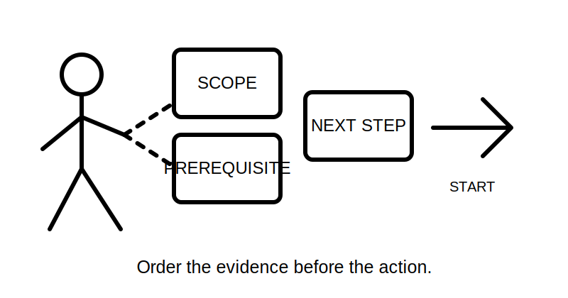
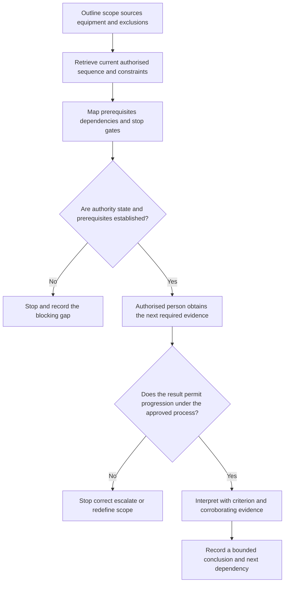
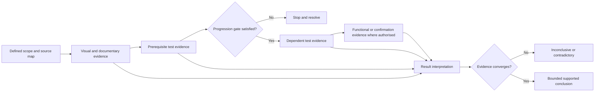
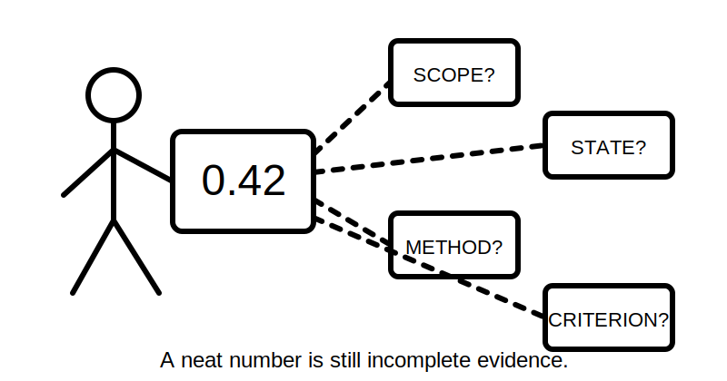

# Day 24 — Test Sequence and Result Interpretation

> **Source and currency notice:** This original educational module explains why verification tests require an authorised sequence and why results must be interpreted within a defined scope, state, method and criterion. It does not provide an official test order, instrument setup, connection method, test parameter, acceptance value, energisation instruction, live-testing procedure or certification process. Exact requirements must be checked against current authorised standards, legislation, regulator guidance, manufacturer instructions and approved RTO or workplace procedures. Qualified technical review is required before publication or operational use.

## Beat 1 — Outcome and entry check

### What you will learn

By the end of this block, you should be able to:

1. explain why a verification sequence is an evidence-control system rather than a memorised list;
2. distinguish prerequisite evidence, dependent evidence and confirmation evidence;
3. identify when an earlier result changes whether a later test may proceed;
4. interpret a fictional result using scope, state, method, criterion and corroborating evidence;
5. use the **O-R-D-E-R** workflow to review a proposed verification sequence;
6. recognise contradictions, invalid comparisons and stop conditions.

### Entry check

Answer without notes:

1. Why can a later test depend on an earlier test being satisfactory?
2. Does a result inside a stated limit always prove the installation is acceptable?
3. What information is missing from a number without units, method or installation state?
4. Why can connected equipment affect both test sequence and interpretation?
5. What should happen when visual evidence conflicts with a favourable test result?

Record confidence. Treat any high-confidence belief that “the number passed, therefore the installation passed” as a priority misconception.

## Beat 2 — Why it matters

A safe verification sequence controls hazards, protects equipment, preserves the meaning of results and prevents one incomplete result from being treated as permission to continue. Sequence matters because tests are not independent events: one test may establish a precondition, expose a defect, require equipment to be disconnected or determine whether a later energised state is permissible under an approved procedure.

Poor sequence or interpretation can lead to:

- continuing after evidence indicates an unsafe condition;
- damaging electronic or sensitive equipment;
- accepting a result produced by an unintended parallel path;
- comparing a reading with the wrong criterion;
- missing alternative, stored or automatically connected sources;
- treating an expected value as an observed result;
- widening a conclusion beyond the tested circuit or operating state;
- recording a pass despite contradictory inspection or documentary evidence.

*Caption: A test list becomes a sequence only when each step has a reason for being next.*

## Beat 3 — Core concepts and terminology

### Sequence is dependency management

A defensible sequence answers five questions before each stage:

1. **What must already be known?**
2. **What hazard or equipment constraint controls this stage?**
3. **What evidence will this stage produce?**
4. **What result prevents progression?**
5. **What later conclusion may rely on this evidence?**

The exact authorised order must come from current approved sources. Conceptually, evidence may include:

- **prerequisite evidence** — establishes identity, scope, source state, continuity or another condition needed before later work;
- **dependent evidence** — is meaningful only after defined prerequisites are established;
- **corroborating evidence** — supports or challenges a conclusion when combined with inspection, design and records;
- **blocking evidence** — reveals a condition that requires stopping, correcting, escalating or redefining scope;
- **confirmation evidence** — checks intended operation only after safety and procedural preconditions are satisfied.

### A result is not self-interpreting

Interpretation requires a complete evidence sentence:

> For **this subject**, in **this documented state**, using **this authorised method and instrument**, the observed result was compared with **this current criterion**, with **these limitations and corroborating observations**.

A bare value cannot show:

- whether the correct points were examined;
- whether parallel paths or connected equipment influenced it;
- whether the installation state matched the method;
- whether the instrument was suitable and verified;
- whether the criterion applied to that circuit, device or operating condition;
- whether another source or automatic function remained available;
- whether contradictory evidence was ignored.

### Result categories for learning records

Use cautious categories until qualified review is complete:

- **supported within stated scope**;
- **not demonstrated**;
- **inconclusive because context is incomplete**;
- **contradictory evidence requires resolution**;
- **stop condition identified**.

Do not invent official pass/fail classifications.

## Beat 4 — Rule-finding workflow: O-R-D-E-R

Use **O-R-D-E-R** to review any proposed sequence or result.

1. **O — Outline the scope and sources:** identify the installation boundary, circuits, equipment, normal and alternative sources, automatic operation and exclusions.
2. **R — Retrieve the authorised sequence:** locate the current standard, approved procedure, manufacturer constraints and jurisdictional requirements.
3. **D — Define dependencies and stop gates:** record what each stage relies on, what it proves and what blocks progression.
4. **E — Evaluate each result in context:** check subject, state, method, instrument, criterion, units, limitations and conflicting evidence.
5. **R — Record a bounded conclusion:** state only what the complete evidence supports and identify unresolved work.

### Sequence-record pattern

For each stage, record:

- stage purpose;
- prerequisite evidence;
- installation and source state;
- approved method owner;
- equipment and manufacturer constraints;
- stop condition;
- evidence produced;
- later decision that relies on it;
- criterion source and technical reviewer.

Do not reproduce an official test sequence or values in place of authorised access.

## Beat 5 — Visual model and worked example

### Evidence dependency model

### Fictional worked example

A fictional training pack describes an altered final subcircuit supplying a fixed motor-driven appliance. The pack includes an exterior photograph, a marked-up circuit diagram, manufacturer information, an incomplete result sheet and a note that rooftop generation may remain connected elsewhere. No field access or authority is provided.

| O-R-D-E-R step | Fictional evidence | Bounded response |
|---|---|---|
| Outline | New altered circuit is identified; upstream system and generation boundary are incomplete | Scope and source map are not yet sufficient for field verification |
| Retrieve | The pack names no approved test sequence or equipment-specific procedure | Current authorised sources and manufacturer constraints are required |
| Define | One recorded result depends on an earlier prerequisite field that is blank | Later evidence cannot be treated as validly sequenced |
| Evaluate | A numerical entry has units but no instrument, method, state or criterion | The number is not interpretable as satisfactory evidence |
| Record | Visual and documentary information are partial and internally inconsistent | Verification is not demonstrated; sequence and source gaps require qualified resolution |

The correct output is an evidence-gap and dependency review, not a reconstructed procedure or assumed pass result.

## Beat 6 — Practical application

### Scenario: fictional small commercial alteration

The evidence pack contains:

- a new lighting circuit and one relocated socket outlet;
- an existing distribution board with an updated handwritten schedule;
- a battery system shown on one drawing but absent from another;
- equipment with electronic controls;
- visual inspection notes;
- a result sheet containing several values and two blank stages;
- no record of the approved sequence used.

### Task A — Build a dependency map

For each proposed evidence stage, complete:

| Evidence purpose | Required prerequisite | Source or equipment constraint | Stop gate | Later decision supported |
|---|---|---|---|---|
| Protective-path evidence |  |  |  |  |
| Insulation-related evidence |  |  |  |  |
| Polarity or connection evidence |  |  |  |  |
| Protective-operation evidence |  |  |  |  |
| Functional confirmation |  |  |  |  |

Do not add methods, settings or acceptance values.

### Task B — Interpret incomplete records

Classify each statement as supported, not demonstrated, inconclusive or contradictory:

1. “A value is recorded, but the tested circuit is not identified.”
2. “The result sheet says satisfactory, but the diagram shows an unresolved conductor-role conflict.”
3. “A prerequisite field is blank, while a dependent stage is marked complete.”
4. “The equipment operated, but protective evidence is incomplete.”
5. “The result applies to one circuit, but the conclusion claims the whole installation.”

Explain the missing context for each.

### Task C — Write a stop-gate review

Write five concise stop-gate statements. Each must identify:

- the unresolved condition;
- why it blocks progression or interpretation;
- the authorised source or competent role required;
- the bounded status of existing evidence.

### Task D — Produce a handover

Write a seven-sentence handover covering scope, known sources, sequence authority, prerequisite gaps, result limitations, contradictions and the next qualified review.

## Beat 7 — Common errors and safety checkpoint

### Common errors

- memorising an order without understanding dependencies;
- assuming every installation uses an identical sequence without checking applicability;
- continuing because a result “looks normal”;
- treating a later result as valid when an earlier prerequisite is absent;
- comparing results with remembered or unofficial criteria;
- ignoring equipment disconnection or manufacturer constraints;
- overlooking parallel paths, alternate supplies or automatic operation;
- treating instrument display precision as evidence quality;
- recording expected values instead of observed evidence;
- converting a partial result into a whole-installation conclusion;
- resolving contradictions by choosing the more convenient record.

*Caption: A tidy number cannot carry missing scope, state and criterion on its back.*

### Safety checkpoint

Stop and escalate when:

- the authorised sequence, method, criterion or responsible role is unavailable;
- normal, alternative, stored, auxiliary or feedback-capable sources are not established;
- exposed live parts, heat, smoke, arcing, damage or unsafe access is indicated;
- a prerequisite result is absent, contradictory or outside the approved progression condition;
- equipment constraints, required disconnections or automatic operation are unclear;
- the instrument, method, installation state or result identity cannot be confirmed;
- visual, documentary and test evidence materially conflict;
- progression would exceed authority, competence, supervision or approved procedure;
- an energised or live-test stage would need to be inferred or improvised;
- a conclusion would be broader than the tested subject and state.

This module does not authorise approaching, opening, touching, operating, isolating, energising, testing, proving de-energised, repairing, certifying or altering electrical equipment.

## Beat 8 — Retrieval, practice and next links

### Recall check

1. What five steps form O-R-D-E-R?
2. Why is a test sequence a dependency system rather than a list?
3. Name three types of evidence dependency.
4. What seven context elements are needed to interpret a result?
5. Why can a favourable result still block a complete conclusion?
6. What should happen when a prerequisite is absent?
7. Why must visual, documentary and test evidence be reconciled?
8. How does Day 24 prepare for systematic fault finding?

### Applied practice

Create a fictional result pack for one altered circuit. Then:

1. define the exact scope and exclusions;
2. identify every stated or possible energy source;
3. map five evidence stages and their dependencies;
4. mark two progression gates;
5. create one incomplete, one contradictory and one properly bounded result record;
6. state which current authorised sources and qualified roles are required.

### Reflection

Complete:

- The sequence dependency I most often overlook is...
- The result context I tend to omit is...
- One conclusion I previously made too broadly was...
- Before Day 25, I need to retrieve...

### Related topics

- [[Day 23 - Mandatory Electrical Tests and Purposes]]
- [[Day 22 - Verification Principles and Visual Inspection]]
- [[Day 20C - Alternative and Multiple Supplies Awareness]]
- [[Day 25 - Systematic Fault-Finding Workflow]]
- [[Inspection Testing and Verification]]
- [[Fault Finding and Commissioning]]

### Navigation

- [← Day 23 — Mandatory Electrical Tests and Purposes](./day-23-mandatory-electrical-tests-and-purposes.md)
- [Four-week master plan](../MASTER_PLAN.md)
- Day 25 — Systematic Fault-Finding Workflow *(next block; module not yet created)*

### References and currency notice

- AS/NZS 3000:2018 — verification topic reference only; use authorised current access.
- Current applicable legislation, regulator guidance and jurisdictional requirements.
- Approved RTO or workplace verification procedures.
- Applicable manufacturer instructions and instrument documentation.
- [Learning design](../../../LEARNING_DESIGN.md)
- [Content and copyright policy](../../../CONTENT_AND_COPYRIGHT.md)

This module contains original educational explanations, fictional scenarios and independently created diagrams. It does not reproduce standards wording, tables, official figures, test sequence, test parameters, acceptance values or field procedures. Technical review remains pending.

<!-- sequence-navigation:start -->
### Sequence navigation

- [← Previous: Day 23 — Mandatory Electrical Tests and Purposes](./day-23-mandatory-electrical-tests-and-purposes.md)
- [Four-week learning plan](../MASTER_PLAN.md)
- Next: no later module has been created yet
<!-- sequence-navigation:end -->
