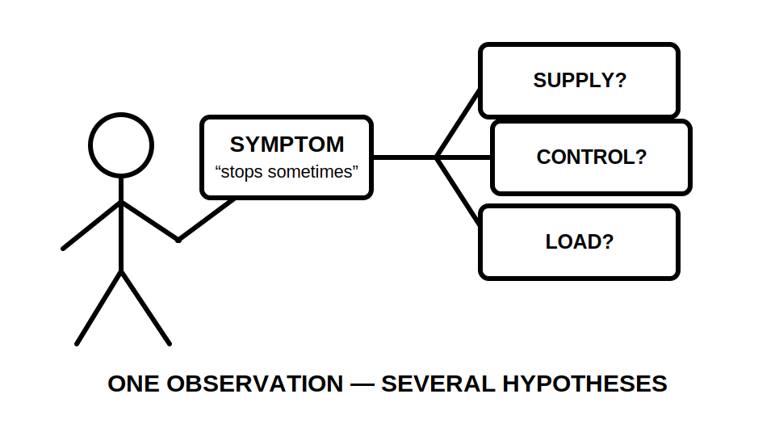
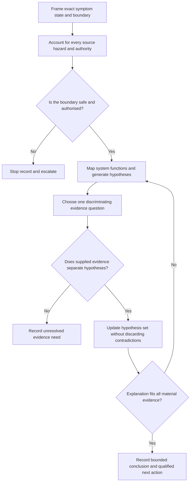
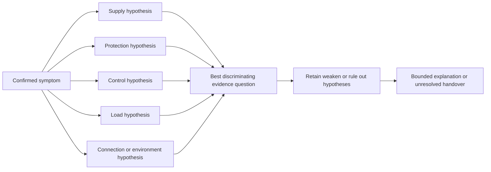
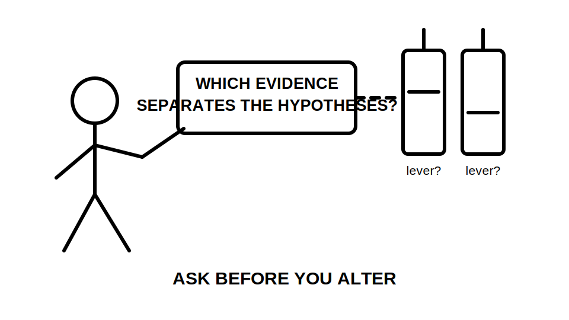

# Day 25 — Systematic Fault-Finding Workflow

> **Source and currency notice:** This original educational module teaches a bounded reasoning method for analysing fictional electrical faults from supplied evidence. It does not provide a live fault-finding procedure, test sequence, instrument setup, connection method, isolation process, energisation instruction, repair method, acceptance value or authority to work on electrical equipment. Current authorised standards, legislation, regulator guidance, manufacturer instructions and approved RTO or workplace procedures must control any real work. Qualified technical review is required before publication or operational use.

## Beat 1 — Outcome and entry check

### What you will learn

By the end of this block, you should be able to:

1. define the fault symptom without turning it into an assumed cause;
2. establish scope, operating state, sources and safety boundaries before diagnosis;
3. separate facts, missing evidence, hypotheses and ruled-out explanations;
4. use the **F-A-U-L-T** workflow to choose the next highest-value evidence question;
5. explain why one observation can support several possible causes;
6. record a bounded diagnostic conclusion and handover.

### Entry check

Answer without notes:

1. What is the difference between a symptom and a cause?
2. Why is “the breaker is faulty” usually an unsafe starting conclusion?
3. What should happen when a possible alternative supply is not accounted for?
4. Why should a diagnostic step discriminate between hypotheses rather than merely collect more data?
5. What makes a fault-finding conclusion too broad?

Record confidence. A high-confidence answer that jumps directly from symptom to component replacement is a priority misconception.

## Beat 2 — Why it matters

Fault finding is controlled uncertainty reduction. A disciplined process protects people, avoids equipment damage, prevents unnecessary replacement and preserves evidence that may reveal a wider system problem.

Poor fault-finding practice can lead to:

- treating a visible symptom as proof of one cause;
- overlooking normal, alternative, stored or automatic energy sources;
- changing several variables at once and losing the original evidence;
- replacing a component without establishing why it operated or failed;
- masking an upstream design, installation or environmental problem;
- applying a result from one operating state to every state;
- continuing beyond authority, competence or an approved procedure;
- declaring success because the symptom temporarily disappears.

*Caption: A symptom points to a search area, not directly to the spare-parts shelf.*

## Beat 3 — Core concepts and terminology

### The diagnostic evidence ladder

Keep these categories separate:

- **reported symptom** — what someone says happened;
- **confirmed observation** — what the supplied evidence directly demonstrates;
- **operating condition** — the load, source, control and environmental state when the symptom occurred;
- **hypothesis** — a plausible explanation that remains unproven;
- **discriminating evidence** — information that makes one hypothesis more or less likely than another;
- **contradiction** — evidence that does not fit the current explanation;
- **root condition** — the underlying condition that created or enabled the fault;
- **bounded conclusion** — a statement limited to the examined subject, state and available evidence.

### Fault domains

A symptom may arise from one or more domains:

- supply availability or quality;
- protection operation;
- conductor or connection condition;
- control logic, interlock or automatic operation;
- load or driven-equipment condition;
- environmental or mechanical influence;
- installation arrangement or compatibility;
- documentation, identification or configuration error.

These domains are prompts for investigation, not a substitute for current authorised procedures.

### One change at a time

A useful diagnostic action should answer a defined question. Changing multiple settings, connections or components at once destroys the ability to attribute the outcome. In this module, practical work is replaced by paper-based evidence comparison.

## Beat 4 — Rule-finding workflow: F-A-U-L-T

Use **F-A-U-L-T** for every fault scenario.

1. **F — Frame the symptom and boundary:** state exactly what failed, when, under which operating condition, and what remains outside scope.
2. **A — Account for hazards and sources:** identify normal, alternative, stored, auxiliary, feedback and automatic sources; confirm authority and stop conditions.
3. **U — Understand the system and generate hypotheses:** map supply, protection, conductors, controls and load, then list plausible causes without selecting a favourite.
4. **L — Locate discriminating evidence:** choose the safest authorised evidence question that best separates the leading hypotheses; preserve contradictions and provenance.
5. **T — Test the explanation on paper and transfer the result:** check whether the complete evidence supports the explanation, state limitations, and hand over unresolved work.

### Diagnostic record pattern

For each cycle, record:

- symptom and timestamp or operating state;
- installation boundary and exclusions;
- known and possible energy sources;
- direct observations and their provenance;
- hypotheses still open;
- evidence question and why it discriminates;
- result supplied by the fictional pack;
- hypotheses strengthened, weakened or unchanged;
- contradiction or uncertainty retained;
- stop condition, responsible role and next authorised action.

## Beat 5 — Visual model and worked example

### Hypothesis funnel

### Fictional worked example

A training pack describes an extract fan that stops intermittently. The pack contains a circuit diagram, controller event log, photographs, maintenance notes and fictional observations. No physical access or testing authority is provided.

| F-A-U-L-T step | Fictional evidence | Bounded response |
|---|---|---|
| Frame | Fan stops only after extended high-temperature operation; controller remains powered | Symptom is intermittent loss of fan operation in one documented state, not “failed fan” |
| Account | Normal supply is shown; an automatic controller and stored mechanical energy are noted | Real intervention would require approved source, restart and movement controls |
| Understand | Plausible domains include controller command, protective operation, motor thermal condition, connection condition and mechanical loading | Keep several hypotheses open |
| Locate | Event log records a stop command before each event, while no protective-operation record is supplied | Evidence weakens a simple supply-loss hypothesis but does not prove controller failure |
| Transfer | Diagram revision and controller configuration record conflict | Cause remains unverified; configuration and authorised diagnostic evidence require qualified review |

The correct output is a structured evidence handover, not a component replacement recommendation.

## Beat 6 — Practical application

### Scenario: fictional workshop circuit

A machine is reported to “trip the breaker when it starts.” The evidence pack contains:

- a single-line diagram with one revision missing;
- an operator statement that the event occurs “mostly on cold mornings”;
- a protective-device label and a separate schedule entry that do not match;
- a maintenance note describing recent mechanical work;
- a control-system event log;
- no approved diagnostic procedure or verified test results.

### Task A — Frame the symptom

Write one sentence containing:

- the observed or reported event;
- the operating state;
- the exact circuit or equipment boundary;
- what is not yet known.

Avoid naming a cause.

### Task B — Build a hypothesis matrix

| Hypothesis domain | Evidence supporting | Evidence contradicting | Missing discriminating evidence | Status |
|---|---|---|---|---|
| Supply |  |  |  |  |
| Protection |  |  |  |  |
| Control |  |  |  |  |
| Load or mechanical |  |  |  |  |
| Connection or environment |  |  |  |  |

Use only the fictional pack. Do not invent readings, settings or procedures.

### Task C — Rank evidence questions

Propose three evidence questions and rank them by:

1. safety and authority;
2. ability to distinguish between leading hypotheses;
3. risk of disturbing the original condition;
4. dependence on missing records or manufacturer information.

### Task D — Write the handover

Produce an eight-sentence handover covering symptom, boundary, source awareness, evidence quality, leading hypotheses, contradictions, stop condition and exact qualified next action.

## Beat 7 — Common errors and safety checkpoint

### Common errors

- starting with a favourite cause;
- trusting an equipment label over conflicting system evidence;
- replacing the operated protective device without investigating why it operated;
- treating correlation with weather, load or time as proof of cause;
- using a successful restart as proof of repair;
- ignoring automatic restart, remote control or stored energy;
- collecting evidence that cannot distinguish between hypotheses;
- changing several variables at once;
- discarding contradictory evidence;
- assuming a fault is local because the symptom appears local;
- extending a conclusion from one state, circuit or event to the whole installation;
- failing to preserve records before configuration changes.

*Caption: The fastest route is usually the question that removes the most uncertainty, not the lever nearest your hand.*

### Safety checkpoint

Stop and escalate when:

- the installation boundary, circuit identity or operating state is uncertain;
- any normal, alternative, stored, auxiliary, feedback or automatic source is not accounted for;
- exposed live parts, heat, smoke, arcing, damage, movement or unsafe access is indicated;
- isolation, energisation, test or restart would need to be inferred or improvised;
- an approved procedure, suitable instrument, manufacturer constraint or competent role is missing;
- the symptom cannot be reproduced without increasing risk or exceeding authority;
- supplied records conflict materially;
- a protective device has operated and the reason is not established;
- a proposed action would erase logs, settings or other diagnostic evidence;
- the conclusion depends on remembered values or unofficial acceptance criteria.

This module does not authorise approaching, opening, touching, operating, isolating, energising, testing, proving de-energised, restarting, repairing, resetting, configuring, certifying or altering electrical equipment.

## Beat 8 — Retrieval, practice and next links

### Recall check

1. What five steps form F-A-U-L-T?
2. Why is a symptom not a cause?
3. What is discriminating evidence?
4. Why should contradictions remain visible?
5. Name five fault domains.
6. What makes an evidence question high value?
7. Why is a temporary return to operation not proof of repair?
8. What belongs in a bounded diagnostic handover?

### Applied practice

Create a fictional fault pack for one circuit or item of equipment. Include:

1. one reported symptom and one confirmed observation;
2. two operating states;
3. one source or control ambiguity;
4. five competing hypotheses across at least three domains;
5. three evidence questions, only one of which strongly discriminates;
6. one contradiction;
7. one bounded conclusion and one stop condition.

Exchange the pack with another learner. They must identify whether your evidence genuinely supports the conclusion.

### Reflection

Complete:

- The cause I tend to assume too early is...
- The contradiction I am most likely to dismiss is...
- The evidence question that would most improve my reasoning is...
- The safety boundary I must state more explicitly is...

### Related topics

- [Day 24 — Test Sequence and Result Interpretation](./day-24-test-sequence-and-result-interpretation.md)
- [Day 26 — Rest and Final Catch-Up](./day-26-rest-and-final-catch-up.md)
- [Day 27 — Full Mock Examination](./day-27-full-mock-examination.md)
- [Four-Week Capstone Learning Plan](../MASTER_PLAN.md)
- [Fault Finding and Commissioning](../../../knowledge-base/Fault%20Finding%20and%20Commissioning.md)
- [Inspection Testing and Verification](../../../knowledge-base/Inspection%20Testing%20and%20Verification.md)

### References and technical-review queue

Use current authorised sources to verify:

- formal fault-finding responsibilities, scope and safe-work boundaries;
- approved isolation, testing, energisation and diagnostic procedures;
- instrument suitability, verification and connection methods;
- protective-device operation, reset and replacement requirements;
- equipment-specific diagnostic and manufacturer constraints;
- automatic restart, stored energy and remote-control hazards;
- acceptance criteria, records, certification and jurisdiction-specific obligations.

No standards wording, official values, diagnostic sequence, instrument procedure, live-testing process or repair instruction is reproduced here.

<!-- sequence-navigation:start -->
### Sequence navigation

- [← Previous: Day 24 — Test Sequence and Result Interpretation](./day-24-test-sequence-and-result-interpretation.md)
- [Four-week learning plan](../MASTER_PLAN.md)
- Next: no later module has been created yet
<!-- sequence-navigation:end -->
