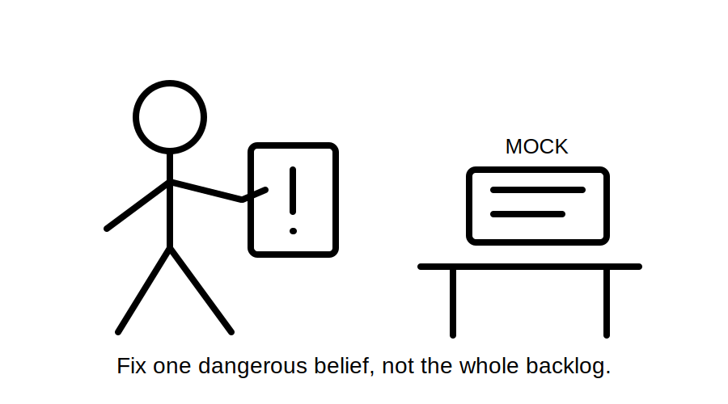
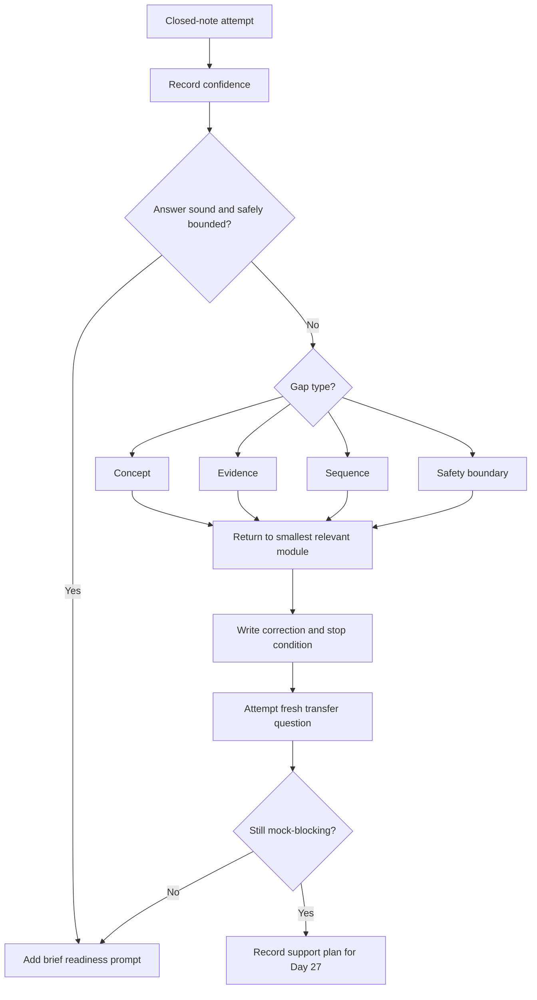
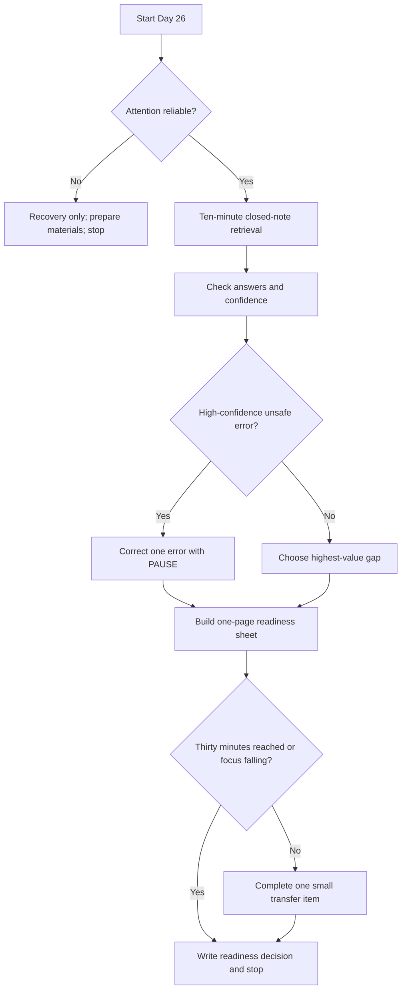
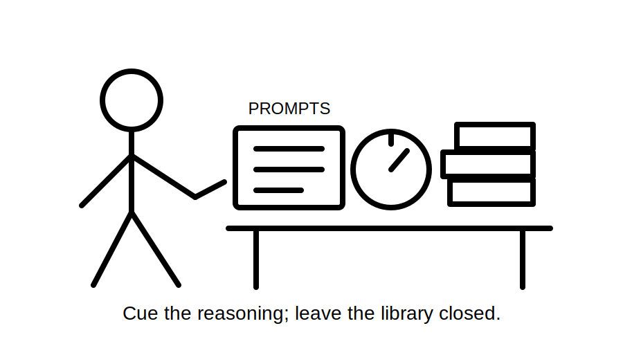

# Day 26 — Rest and Final Catch-Up

> **Purpose and currency notice:** This planned recovery block introduces no new electrical rules, test methods, values, acceptance criteria or field procedures. It retrieves and corrects learning from Days 22–25 before the full mock examination. Any technical answer retains the review status and source requirements of its originating module. Use current authorised sources and qualified review for exact technical claims.

## Beat 1 — Outcome and entry check

### What you will learn

By the end of this block, you should be able to:

1. retrieve the Week 4 evidence workflows without opening notes first;
2. identify whether an error is conceptual, evidentiary, sequencing-related or caused by unsafe overreach;
3. correct one high-confidence misconception using a bounded source return;
4. triage unfinished work as **mock-blocking**, **useful after the mock** or **defer**;
5. assemble a one-page mock-exam readiness sheet without copying standards content;
6. stop after 30 minutes or earlier when concentration is unreliable.

### Entry check

Before opening notes, answer **yes**, **no** or **uncertain**:

1. Can I distinguish visual, documentary and test evidence?
2. Can I explain why a test name does not prove its purpose, method or acceptance criterion?
3. Can I explain why test sequence depends on prerequisites and installation state?
4. Can I separate a reported symptom from a confirmed cause?
5. Can I state at least three reasons to stop rather than infer a procedure?
6. Am I alert enough to compare my answers accurately?

If question 6 is **no**, record a recovery-only decision, prepare the Day 27 materials and stop. Rest is a valid completion outcome.

## Beat 2 — Why it matters

The final technical week contains closely related ideas that are easy to blur together under exam pressure. A learner may remember the words *inspection*, *test*, *sequence* and *fault finding* yet still:

- use one evidence type as a substitute for another;
- quote a result without its context;
- choose a next action before confirming prerequisites;
- treat a symptom as proof of cause;
- fill an authorised-source gap from memory.

Day 26 is not a second mock examination. Its purpose is to reduce avoidable errors while preserving attention for Day 27.



*Caption: Do not spend tomorrow’s concentration clearing yesterday’s entire backlog.*

## Beat 3 — Core concepts and terminology

### Closed-note retrieval

Produce the answer before checking the module. This reveals retrieval strength; rereading first reveals only familiarity.

### Mock-blocking gap

A **mock-blocking gap** is one that prevents a safe, coherent attempt at Day 27. Examples include:

- confusing evidence categories;
- inventing a test procedure or acceptance value;
- ignoring alternative or stored energy;
- treating equipment operation as proof of safety;
- being unable to state a stop condition.

### Useful-after-mock gap

A gap may matter but not justify consuming the recovery block. Detailed note formatting, extra examples and broad source indexing can wait until the mock exposes whether they are genuinely needed.

### Confidence-weighted correction

Prioritise errors using both consequence and confidence. A confident unsafe misconception outranks several low-confidence omissions.

### Readiness sheet

A **readiness sheet** is a one-page prompt aid containing original headings, workflows, stop conditions and source-check reminders. It must not reproduce standards tables, clauses, official test sequences or acceptance criteria.

## Beat 4 — Correction workflow: P-A-U-S-E

Use **P-A-U-S-E** for the final catch-up decision:

1. **P — Produce from memory:** answer first and record confidence.
2. **A — Analyse the gap:** classify it as concept, evidence, sequence or safety-boundary failure.
3. **U — Use the smallest source return:** revisit only the relevant module and its references notice.
4. **S — State the correction:** rewrite one original explanation and one stop condition.
5. **E — Examine transfer:** answer a fresh question and decide whether the gap still blocks the mock.



P-A-U-S-E prevents the learner from turning a recovery session into an uncontrolled review of every Week 4 topic.

## Beat 5 — Visual model and worked example

### Thirty-minute readiness gate



### Fictional correction example

A learner states with high confidence:

> “If the equipment operates correctly after restoration, the fault is cleared and the verification is complete.”

Apply P-A-U-S-E:

1. **Produce:** retain the original answer and confidence.
2. **Analyse:** this confuses functional observation with fault diagnosis, corrective evidence and complete verification.
3. **Use:** revisit Days 22, 24 and 25, without searching for an invented universal procedure.
4. **State:** correct operation in one state is one observation. It does not prove that the cause was identified, the installation meets all applicable criteria or every relevant operating state is safe.
5. **Examine:** in a fresh fictional scenario, the equipment operates normally but a contradictory record shows intermittent protective-device operation. The learner must preserve the contradiction and state a bounded handover rather than declare completion.

No test method, reset action, acceptance value or energisation instruction is inferred.

## Beat 6 — Practical application

### Maximum 30-minute protocol

#### Minutes 0–3: state and scope

Record:

```text
Energy: low / workable / strong
Concentration: poor / workable / strong
Recovery-only required: yes / no
One outcome for this block:
Hard stop time:
```

#### Minutes 3–13: closed-note retrieval

Answer without notes and mark confidence:

1. What does V-E-R-I-F-Y protect against?
2. Name four evidence categories that may contribute to verification.
3. Why must a test be matched to a purpose and installation state?
4. What does P-U-R-P-O-S-E stand for?
5. Why can one result not be interpreted without context?
6. What does O-R-D-E-R stand for?
7. Why should prerequisite evidence control sequence?
8. What does F-A-U-L-T stand for?
9. Why is a symptom not a cause?
10. Name four Week 4 stop conditions.

#### Minutes 13–21: correct one priority error

Select in this order:

1. high-confidence unsafe misconception;
2. confusion between evidence types;
3. invented sequence, procedure or criterion;
4. repeated context or interpretation error;
5. missing source-verification flag.

Complete:

```text
Original answer:
Confidence:
Gap type: concept / evidence / sequence / safety boundary
Why it failed:
Smallest module returned to:
Corrected explanation:
Stop condition:
Fresh transfer question:
Transfer result:
Still mock-blocking: yes / no
```

#### Minutes 21–27: build the readiness sheet

Use only original prompts such as:

```text
SCOPE — What work, state and boundary are being assessed?
SOURCES — What normal, alternative, stored or automatic energy exists?
EVIDENCE — What is observed, documented, tested, missing or contradictory?
PURPOSE — What question must this evidence answer?
DEPENDENCY — What must be established before the next conclusion?
BOUNDARY — What may not be inferred or performed?
SOURCE CHECK — Which exact requirement needs authorised current material?
HANDOVER — What is known, unresolved and required next?
```

Do not add official values, tables, test sequences or copied clause wording.

#### Minutes 27–30: readiness note

```text
Strongest Week 4 workflow:
Highest-priority corrected misconception:
Remaining mock-blocking gap:
Authorised-source checks parked for later:
Ready for Day 27: yes / yes with support / not yet
Support allowed during mock setup:
First action next session:
```



*Caption: A readiness sheet should cue reasoning, not smuggle in the library.*

## Beat 7 — Common errors and safety checkpoint

### Common errors

- opening all four modules before attempting retrieval;
- repeating technical study because rest feels unproductive;
- treating every unfinished item as mock-blocking;
- copying standards wording or official sequences onto the readiness sheet;
- correcting several minor omissions while leaving one confident unsafe belief untouched;
- starting the mock early and calling it catch-up;
- continuing after the hard stop because the final task is “nearly finished”;
- converting a fictional evidence exercise into real inspection or testing activity.

### Safety checkpoint

Stop immediately when:

- attention is too poor to compare answers accurately;
- an exact rule, value, method or acceptance criterion is being guessed;
- a correction requires unavailable authorised material;
- the learner is tempted to approach, open, touch, operate, isolate, energise, test, reset, repair or alter electrical equipment;
- a scenario indicates exposed parts, heat, smoke, arcing, damage, unexpected movement or unsafe access;
- the task expands beyond one bounded correction and one readiness sheet;
- 30 minutes has elapsed.

This block authorises no electrical work. Practical activity remains subject to law, competency, supervision, safe-work systems, manufacturer instructions and approved procedures.

## Beat 8 — Retrieval, readiness and next links

### Final recall check

1. What five steps form P-A-U-S-E?
2. What makes a gap mock-blocking?
3. Why are confidence and consequence considered together?
4. What belongs on the readiness sheet?
5. What must be excluded from it?
6. Why is correct operation not proof of complete verification?
7. Name four stop conditions.
8. What is the maximum duration of this block?

### Day 27 readiness check

You are ready to begin the full mock examination when you can:

- attempt Week 4 reasoning without opening notes first;
- distinguish evidence, purpose, sequence, interpretation and diagnosis;
- identify alternative, stored and automatic energy as unresolved hazards when relevant;
- state uncertainty and contradictions rather than force a conclusion;
- avoid inventing official values, methods or criteria;
- use the readiness sheet only as permitted by the planned mock conditions;
- complete a sustained timed session without an unresolved high-confidence safety misconception.

A **yes with support** learner may begin with a named support plan, such as an error log to review after the mock. A **not yet** learner should schedule one specific prerequisite correction rather than repeat all Week 4 modules.

### Related topics

- [Day 25 — Systematic Fault-Finding Workflow](./day-25-systematic-fault-finding-workflow.md)
- [Day 27 — Full Mock Examination](./day-27-full-mock-examination.md)
- [Four-Week Capstone Learning Plan](../MASTER_PLAN.md)
- [Learning and Memory System](../../../knowledge-base/Learning%20and%20Memory%20System.md)
- [Inspection Testing and Verification](../../../knowledge-base/Inspection%20Testing%20and%20Verification.md)
- [Fault Finding and Commissioning](../../../knowledge-base/Fault%20Finding%20and%20Commissioning.md)

### Review state

Day 26 is `draft-unverified`, non-safety-critical as a recovery workflow and not `technically-reviewed`. It introduces no independent electrical requirements. Technical statements retrieved from Days 22–25 retain their originating `review-required` and `reference_check_required` flags.

<!-- sequence-navigation:start -->
### Sequence navigation

- [← Previous: Day 25 — Systematic Fault-Finding Workflow](./day-25-systematic-fault-finding-workflow.md)
- [Four-week learning plan](../MASTER_PLAN.md)
- Next: no later module has been created yet
<!-- sequence-navigation:end -->
