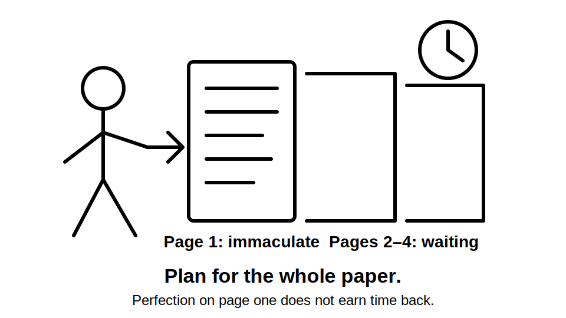
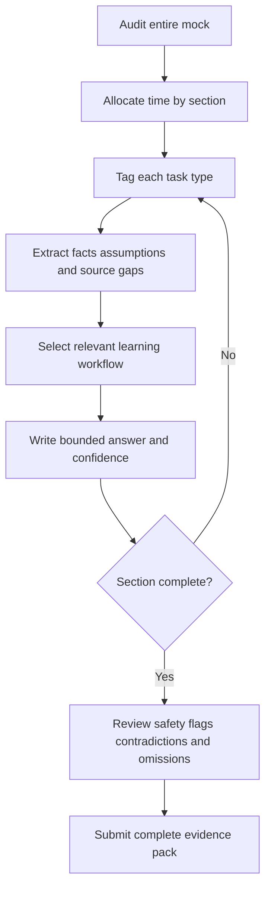
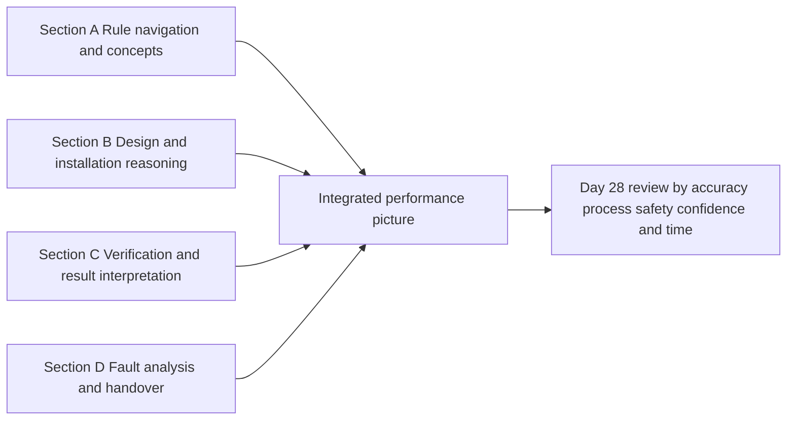
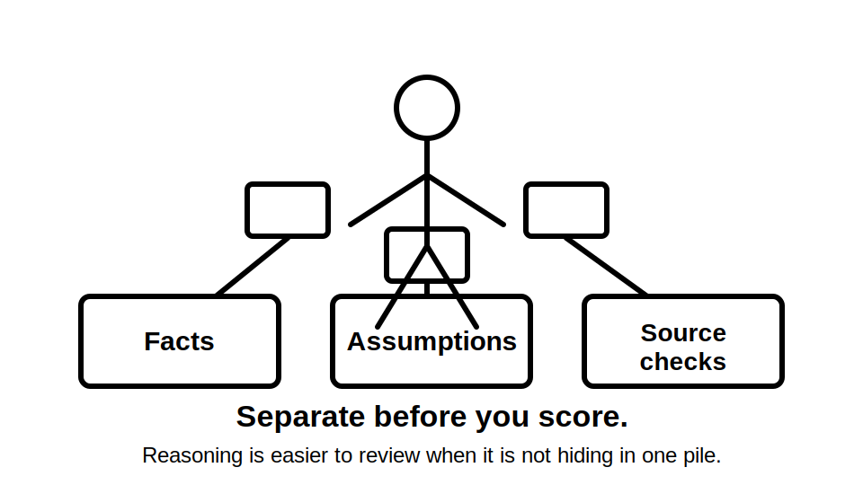

# Day 27 — Full Mock Examination

> **Purpose and currency notice:** This is an original, fictional assessment exercise. It does not reproduce an RTO examination, standards wording, official tables, test values, acceptance criteria or field procedures. Use current authorised standards, legislation, regulator guidance and the approved instructions of the learner's RTO. Technical answers remain `review-required` until checked by a qualified reviewer.

## Beat 1 — Outcome and entry check

### What you will demonstrate

By the end of this block, you should be able to:

1. complete a sustained, integrated paper-based mock under declared conditions;
2. classify each task before selecting a rule, calculation, evidence type or diagnostic approach;
3. show reasoning, source needs, assumptions and stop conditions rather than unsupported conclusions;
4. separate technical accuracy, process quality, safety boundaries and confidence;
5. preserve unresolved authorised-source checks instead of inventing values or procedures;
6. produce an evidence pack suitable for structured review on Day 28.

### Entry check

Do not begin until you can answer **yes** to all of these:

- I have a clear start time, finish time and interruption plan.
- I know which aids are permitted for this mock.
- I will not approach, operate, open, isolate, energise, test, reset, repair or alter real electrical equipment.
- I will mark an authorised-source gap rather than guess an exact rule, value, sequence or criterion.
- I am alert enough to complete and review a sustained attempt.

If fatigue, distraction or unsafe intent is present, record the reason and reschedule the mock. An incomplete but honest attempt is more useful than fabricated evidence.

## Beat 2 — Why it matters

Capstone performance requires more than recalling isolated facts. The learner must recognise the task type, retrieve the relevant mental model, locate authoritative evidence, apply it to the stated facts and communicate a safely bounded conclusion.

A full mock exposes problems that short drills hide:

- slow task classification;
- weak transitions between design, installation, verification and fault finding;
- overconfidence when exact source material is unavailable;
- correct answers produced by unsafe or untraceable reasoning;
- poor time allocation;
- failure to preserve contradictions and assumptions.



*Caption: A perfect first page is an unusual way to finish an examination.*

## Beat 3 — Core concepts and assessment language

### Declared mock conditions

Record the duration, permitted resources, break rule and marking approach before starting. Do not silently change conditions during the attempt.

### Evidence trail

Every substantial answer should make visible:

- **task type** — navigation, design, inspection, verification, interpretation or diagnosis;
- **known facts** — information provided by the fictional scenario;
- **assumptions** — necessary but unverified premises;
- **source need** — where current authorised material is required;
- **reasoning** — the link between evidence and conclusion;
- **boundary** — what is not established or authorised.

### Safety override

A technically plausible answer is not acceptable when it depends on an unsafe action, invented procedure or ignored energy source.

### Confidence calibration

Mark confidence as **guessing**, **unsure**, **reasonably confident** or **certain**. High-confidence errors receive priority during Day 28 review.

### Deferred source check

Use a visible marker such as `[SOURCE CHECK]` when an exact rule, value, table, method or acceptance criterion requires current authorised material. State what must be verified; do not fill the gap from memory.

## Beat 4 — Examination workflow: A-T-T-E-M-P-T

Use **A-T-T-E-M-P-T** across the paper:

1. **A — Audit the paper:** identify sections, marks, dependencies and safety-critical tasks.
2. **T — Time-box the sections:** reserve time for every domain and a final review.
3. **T — Tag the task type:** decide what capability the question actually tests.
4. **E — Extract facts and assumptions:** distinguish stated evidence from inference.
5. **M — Map the reasoning:** choose the relevant workflow, calculation structure or evidence chain.
6. **P — Produce a bounded answer:** show process, source needs, conclusion and stop conditions.
7. **T — Triage and review:** return to flagged items, check contradictions and record confidence.



The workflow prevents the mock becoming a sequence of unplanned reactions to whichever question looks familiar first.

## Beat 5 — Visual model and mock architecture

### Assessment architecture

This mock uses four original sections. It is not intended to imitate a specific RTO paper.



### Suggested time allocation

Use percentages rather than fixed minutes so the exercise can be adapted to the time available:

- **10%** — paper audit and planning;
- **20%** — Section A;
- **25%** — Section B;
- **25%** — Section C;
- **15%** — Section D;
- **5%** — whole-paper review.

The allocation is an original study recommendation, not an official assessment rule.

### Marking dimensions

Score each major response separately for:

1. **result** — is the conclusion supportable from the fictional evidence?
2. **process** — is the reasoning traceable and complete?
3. **safety** — are energy sources, stop conditions and competence boundaries respected?
4. **source discipline** — are exact requirements verified or clearly flagged?
5. **communication** — are assumptions, contradictions and handover needs clear?

## Beat 6 — Practical application: the full mock

### Setup record

```text
Date and start time:
Planned finish time:
Permitted aids:
Break rule:
Readiness sheet used: yes / no
Real equipment excluded: confirmed
```

### Section A — Navigation and concepts

Answer without copying standards wording:

1. Explain how you would locate and verify an exact requirement when the scenario may involve a general rule and a special-location rule.
2. Distinguish functional switching, isolation, protective operation and emergency action using one original example for each.
3. Explain why an RCD and overcurrent protective device answer different risk questions.
4. Draw an original high-level MEN fault-current path and label which details require authorised verification.
5. State how confidence should affect review priority when two answers are wrong.

### Section B — Design and installation reasoning

**Fictional scenario:** A small community workshop is being altered. A new distribution board supplies lighting, socket-outlet circuits, a fixed water heater and a motor-driven extraction system. Part of one route passes through a warm ceiling space; another section is exposed to possible mechanical impact. A future battery system is shown on an unapproved concept sketch but is not part of the current installation scope.

Prepare a design-review response that:

1. maps consumer mains, submains and final subcircuits at a functional level;
2. identifies the inputs needed for maximum demand, conductor selection, derating and voltage-drop review;
3. divides the route into relevant exposure segments;
4. distinguishes protection, switching, isolation and control needs without prescribing devices or ratings;
5. records how the future battery concept affects assumptions, boundaries and documentation;
6. identifies every exact item requiring current authorised sources, manufacturer data or qualified approval.

Do not invent load values, cable capacities, correction factors, voltage-drop limits, device ratings or installation dimensions.

### Section C — Verification and interpretation

**Fictional evidence pack:**

- scope statement for an alteration;
- incomplete circuit schedule;
- visual note stating that one enclosure label is unclear;
- three unnamed test-result rows with units and context deliberately omitted;
- manufacturer note indicating that connected electronic equipment may affect an approved test method;
- drawing showing a normal supply and a possible auxiliary source;
- handover note claiming “all tests passed.”

Produce a verification review that:

1. separates design, construction, visual, documentary and test evidence;
2. explains why the three result rows cannot yet support acceptance conclusions;
3. identifies prerequisite, dependent and corroborating evidence;
4. lists contradictions and missing context;
5. states what must be established before any energisation or completion conclusion;
6. rewrites the handover note using bounded language.

Do not name an official test sequence, procedure, setting or acceptance value from memory.

### Section D — Fault analysis and handover

**Fictional symptom report:** The extraction system sometimes fails to start after a power interruption. At other times it starts later without a local command. No physical inspection or testing is permitted in this exercise.

Prepare a diagnostic reasoning note that:

1. separates symptoms, observations and possible causes;
2. maps normal, control, automatic-start and alternative-energy possibilities;
3. proposes at least three competing hypotheses;
4. identifies the safest discriminating evidence for each hypothesis without giving a field test procedure;
5. records stop conditions;
6. produces a concise handover stating what is known, unknown and required next.

### Submission pack

Include:

```text
Completed sections:
Unattempted items and reason:
SOURCE CHECK markers:
Assumptions:
Contradictions preserved:
Safety stops stated:
Confidence by section:
Time used by section:
First three items for Day 28 review:
```



*Caption: The marker should not need detective training to find your reasoning.*

## Beat 7 — Common errors and safety checkpoint

### Common errors

- spending too long on familiar opening questions;
- treating a remembered phrase as an authorised requirement;
- inserting realistic-looking values to make an incomplete scenario calculable;
- collapsing observation, interpretation and conclusion into one sentence;
- accepting “all tests passed” without scope, method, context or criteria;
- proposing one fault cause and then searching only for confirming evidence;
- ignoring alternative supply, stored energy, remote control or automatic restart;
- changing mock conditions after seeing difficult questions;
- self-marking solely on the final answer;
- converting a paper exercise into real equipment activity.

### Safety checkpoint

Stop the mock and record the reason when:

- the task is drifting toward real inspection, isolation, energisation, testing, reset, repair or alteration;
- an exact procedure, sequence, value or acceptance criterion is being guessed;
- the scenario indicates danger that would require immediate real-world escalation;
- fatigue prevents reliable reading or safe judgement;
- an unapproved source or copied standards content is being used;
- the learner cannot distinguish a hypothetical action from an authorised practical procedure.

This module authorises no electrical work. Real activity remains subject to law, competency, supervision, safe-work systems, manufacturer instructions and approved RTO or workplace procedures.

## Beat 8 — Retrieval, submission and next links

### Final review questions

Before ending the session, answer:

1. Did every section receive a genuine attempt or an explicit omission reason?
2. Which answer has the highest combination of confidence and safety consequence?
3. Where did I confuse a fact, assumption and conclusion?
4. Which exact claims remain `[SOURCE CHECK]` items?
5. Did I preserve contradictions rather than force agreement?
6. Did any answer depend on an unsafe or unauthorised action?
7. Where did time allocation fail?
8. What are the first three review targets for Day 28?

### Completion rule

Day 27 is complete when the evidence pack is closed and preserved. Do not correct every answer immediately. Record only obvious administrative omissions; Day 28 is the dedicated review and readiness block.

### Related topics

- [Day 26 — Rest and Final Catch-Up](./day-26-rest-and-final-catch-up.md)
- [Day 28 — Mock Review and Final Readiness Check](./day-28-mock-review-and-final-readiness-check.md)
- [Four-Week Capstone Learning Plan](../MASTER_PLAN.md)
- [Capstone Assessment](../../../knowledge-base/Capstone%20Assessment.md)
- [Inspection Testing and Verification](../../../knowledge-base/Inspection%20Testing%20and%20Verification.md)
- [Fault Finding and Commissioning](../../../knowledge-base/Fault%20Finding%20and%20Commissioning.md)

### Review state

Day 27 is `review-required`, safety-critical, `reference_check_required` and not `technically-reviewed`. The assessment structure and scenarios are original. Qualified review is required for technical marking guidance, source expectations, jurisdiction-specific duties and any future answer key.

<!-- sequence-navigation:start -->
### Sequence navigation

- [← Previous: Day 26 — Rest and Final Catch-Up](./day-26-rest-and-final-catch-up.md)
- [Four-week learning plan](../MASTER_PLAN.md)
- [Next: Day 28 — Mock Review and Final Readiness Check →](./day-28-mock-review-and-final-readiness-check.md)
<!-- sequence-navigation:end -->
