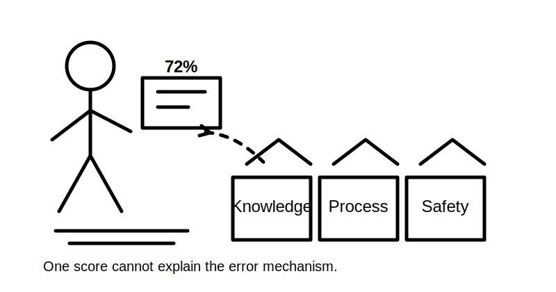
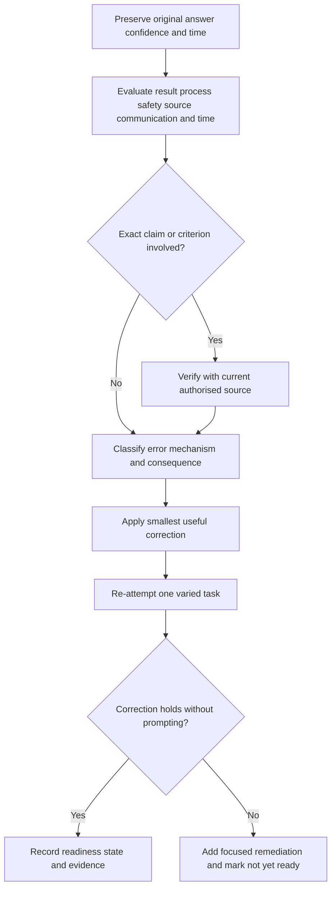
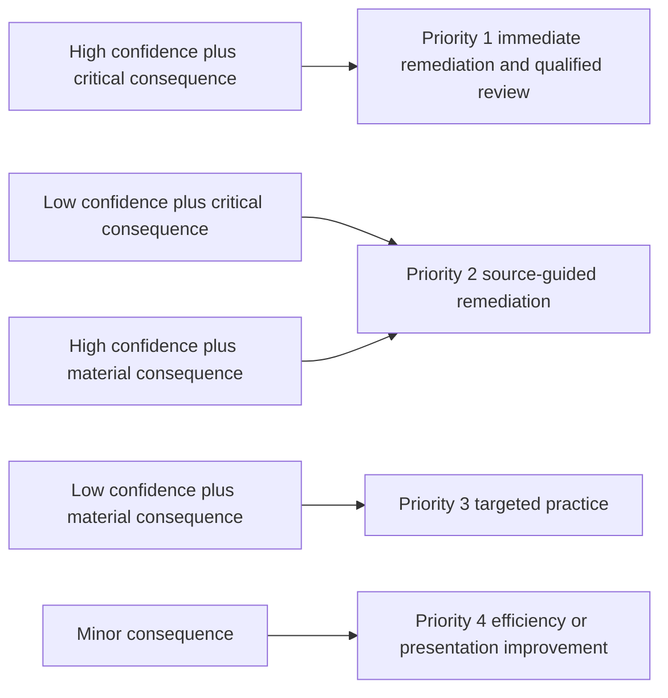
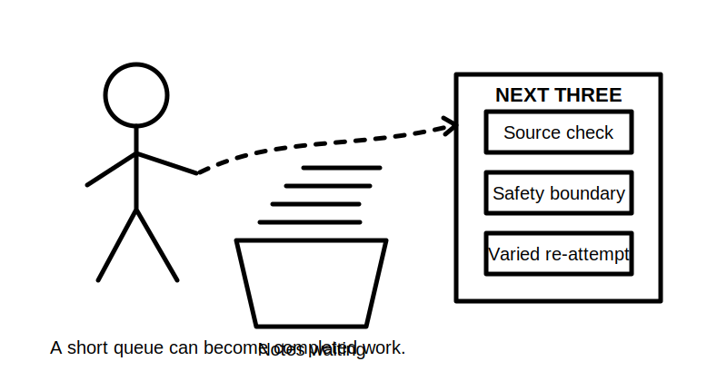

# Day 28 — Mock Review and Final Readiness Check

> **Purpose and currency notice:** This is an original review and readiness activity. It does not provide an official answer key, RTO marking guide, standards wording, test procedure, value or acceptance criterion. Technical conclusions remain `review-required` until checked against current authorised sources by a qualified reviewer.

## Beat 1 — Outcome and entry check

### What you will demonstrate

By the end of this block, you should be able to:

1. review the Day 27 evidence pack without rewriting the entire mock;
2. distinguish knowledge errors, process errors, source gaps, safety-boundary errors and communication errors;
3. prioritise high-confidence and high-consequence errors;
4. correct reasoning using authorised evidence without copying protected material;
5. decide whether each capability is ready, conditionally ready or not yet ready;
6. produce a bounded final readiness record with a short remediation queue.

### Entry check

Begin only when:

- the Day 27 submission pack is preserved in its original form;
- mock conditions, time use and confidence ratings are available;
- corrections can be visually separated from original answers;
- authorised sources are available for any exact technical claim being checked;
- no real electrical equipment will be approached, operated, opened, isolated, energised, tested, reset, repaired or altered;
- concentration is sufficient for careful review.

If the original attempt has been overwritten, first reconstruct what was submitted from the evidence pack. A polished replacement is not evidence of initial performance.

## Beat 2 — Why it matters

A mock examination has limited value unless its errors change subsequent behaviour. Simply counting correct answers can hide unsafe reasoning, accidental success, poor source discipline and confidence that is badly calibrated.

The final review should answer three different questions:

- **What was correct?**
- **Why was it correct or incorrect?**
- **What should happen next?**

A learner may be technically knowledgeable but not yet assessment-ready because time, communication or task classification is weak. Conversely, a low raw score may reflect a small number of repeated process failures rather than broad knowledge loss.



*Caption: One large score is excellent at hiding several small problems.*

## Beat 3 — Core concepts and review language

### Preserve the attempt

Keep original answers intact. Add corrections beside them using a different heading, annotation method or review sheet. This allows comparison between first performance and corrected understanding.

### Error classes

Use these categories:

- **knowledge error** — the underlying concept or relationship is wrong or missing;
- **navigation error** — the learner looked in the wrong source area or could not locate the required evidence;
- **process error** — relevant facts, assumptions, dependencies or steps were omitted;
- **interpretation error** — evidence was read correctly but an unsupported conclusion followed;
- **safety-boundary error** — the answer ignored competence, isolation, energy-source or stop conditions;
- **source-discipline error** — an exact requirement was guessed, copied without justification or treated as current without checking;
- **communication error** — the reasoning, boundary or handover was unclear;
- **time-management error** — effort was allocated poorly across the paper.

### Error consequence

Classify consequence as:

- **critical** — unsafe reasoning, invented procedure, missed source or energy path, or an unbounded conclusion;
- **material** — likely to change the answer, design, verification judgement or assessment result;
- **minor** — presentation or efficiency issue that does not alter the supported conclusion.

### Readiness states

- **Ready** — the learner can perform the capability consistently, safely and with traceable evidence.
- **Conditionally ready** — the core method is sound but a narrow source, speed or communication gap remains.
- **Not yet ready** — a critical misconception, repeated process failure or unsafe boundary remains.

Readiness is capability-specific. Do not average a critical weakness into a comfortable overall score.

## Beat 4 — Review workflow: R-E-V-I-E-W

Use **R-E-V-I-E-W**:

1. **R — Retain the original:** freeze the submitted answer, confidence and time evidence.
2. **E — Evaluate by dimension:** review result, process, safety, source discipline, communication and time separately.
3. **V — Verify exact claims:** use current authorised material and record what source resolved each flagged item.
4. **I — Identify the error mechanism:** name the misconception or process failure, not only the topic.
5. **E — Establish the smallest correction:** write one corrected rule, workflow cue or practice task.
6. **W — Write the readiness decision:** mark the capability ready, conditionally ready or not yet ready and state the evidence.



A corrected answer alone is not enough. The learner should complete one varied retrieval or application task to show that the correction transferred.

## Beat 5 — Visual model and priority system

### Priority is not simply marks lost

Review errors using both confidence and consequence:



High-confidence critical errors are the most important because the learner is least likely to self-correct during real work or assessment.

### Review record

For each substantial item, record:

```text
Item:
Original conclusion:
Original confidence:
Time used:
Result: supportable / partly supportable / unsupported / not attempted
Error class:
Consequence: critical / material / minor
Authorised source check required: yes / no
Source checked and date:
Corrected reasoning:
Smallest remediation task:
Re-attempt result:
Readiness: ready / conditionally ready / not yet ready
Reviewer note:
```

Do not paste standards clauses or recreate official tables in the record. Cite or describe the authorised source location sufficiently for later checking.

## Beat 6 — Practical application: review the full mock

### Pass 1 — Administrative and coverage review

Check:

- every section was attempted or has an honest omission reason;
- mock conditions did not change silently;
- time and confidence were recorded;
- `[SOURCE CHECK]` markers were preserved;
- contradictions and assumptions were visible;
- the submission contains no real-work claim.

### Pass 2 — Dimension-by-dimension review

Review each section from Day 27 against the six dimensions:

1. result;
2. process;
3. safety;
4. source discipline;
5. communication;
6. time.

Do not mark an answer correct merely because the final sentence resembles an expected answer. The path must be supportable.

### Pass 3 — Technical-source review

For each exact rule, value, classification, sequence, test purpose, criterion or jurisdictional duty:

- identify the current authorised source needed;
- confirm the source edition and applicability;
- record the source location without copying substantial protected content;
- involve a qualified reviewer where technical judgement is required;
- leave the item unresolved when adequate evidence is unavailable.

### Pass 4 — Error-pattern review

Group repeated errors by mechanism. Examples:

- begins calculations before defining scope and inputs;
- treats a protective device as proof of complete protection;
- assumes one switch removes every energy source;
- interprets a test result without units, method or installation state;
- selects one fault hypothesis and seeks only confirming evidence;
- writes an absolute conclusion where evidence supports only a bounded statement.

Choose no more than three priority patterns for immediate remediation.

### Pass 5 — Varied re-attempt

For each priority pattern, create one short original question with changed context. Complete it closed-note first, then check the reasoning. Do not merely recopy the corrected mock answer.

### Final readiness matrix

```text
Rule navigation: ready / conditionally ready / not yet ready
Protection and earthing concepts: ready / conditionally ready / not yet ready
Circuit design and installation reasoning: ready / conditionally ready / not yet ready
Special locations and source interactions: ready / conditionally ready / not yet ready
Verification and result interpretation: ready / conditionally ready / not yet ready
Fault-finding reasoning: ready / conditionally ready / not yet ready
Safety boundaries and source discipline: ready / conditionally ready / not yet ready
Time and examination communication: ready / conditionally ready / not yet ready
```

For every state, cite observable evidence from the mock or re-attempt. Do not award “ready” based on effort, familiarity or an overall average.



*Caption: A remediation queue should be short enough to become completed work.*

## Beat 7 — Common errors and safety checkpoint

### Common review errors

- rewriting weak answers before preserving the originals;
- using a total score as the only readiness measure;
- treating a correct guess as mastery;
- ignoring confidence and repeated error mechanisms;
- correcting wording while leaving unsafe reasoning unchanged;
- filling source gaps from memory;
- copying protected clauses, tables or official answer material into notes;
- marking every weakness as equally urgent;
- creating a remediation list too large to complete;
- declaring readiness despite one unresolved critical capability.

### Safety checkpoint

Stop and escalate when:

- a correction requires an unverified procedure, value, acceptance criterion or jurisdictional duty;
- the learner proposes real inspection, operation, opening, isolation, energisation, testing, reset, repair or alteration;
- an answer key or marking guide appears to contain unauthorised RTO or standards content;
- a critical safety misconception remains after one focused correction and re-attempt;
- alternative supply, stored energy, automatic restart or remote control has been ignored;
- fatigue or frustration is causing careless source use or false certainty.

This module authorises no electrical work and cannot certify competence. Workplace and assessment decisions remain subject to law, supervision, authorised standards, safe-work systems, manufacturer instructions and approved RTO processes.

## Beat 8 — Retrieval, final record and next links

### Retrieval check

Without notes, answer:

1. Why must the original mock answer remain visible during correction?
2. What is the difference between an error topic and an error mechanism?
3. Why can a correct final answer still be unsafe or unready?
4. Which combination of confidence and consequence receives first priority?
5. What evidence is needed before marking a capability ready?
6. When should an item remain unresolved?
7. Why should the immediate remediation queue contain no more than three patterns?
8. What can this readiness check not certify?

### Final readiness statement

Complete:

```text
Overall assessment readiness: ready / conditionally ready / not yet ready
Evidence supporting this state:
Critical unresolved capabilities:
Three immediate remediation priorities:
Authorised source checks still open:
Qualified review still required:
Next planned assessment or supervised activity:
Activities this record does not authorise:
Review date:
```

### Completion rule

Day 28 is complete when:

- the original mock remains preserved;
- every substantial item has been reviewed across the six dimensions;
- critical and high-confidence errors are identified;
- exact claims are either verified from authorised sources or remain visibly unresolved;
- up to three priority patterns have a varied re-attempt;
- each capability has an evidence-based readiness state;
- the final record states what remains subject to qualified review.

### Related topics

- [Day 27 — Full Mock Examination](./day-27-full-mock-examination.md)
- [Four-Week Capstone Learning Plan](../MASTER_PLAN.md)
- [Capstone Assessment](../../../knowledge-base/Capstone%20Assessment.md)
- [Learning and Memory System](../../../knowledge-base/Learning%20and%20Memory%20System.md)
- [Inspection Testing and Verification](../../../knowledge-base/Inspection%20Testing%20and%20Verification.md)
- [Fault Finding and Commissioning](../../../knowledge-base/Fault%20Finding%20and%20Commissioning.md)

### Review state

Day 28 remains `review-required`, safety-critical, `reference_check_required` and not `technically-reviewed`. The review framework, fictional prompts and readiness matrix are original. Any technical marking decision, model answer, exact requirement, test method, value, acceptance criterion, jurisdictional duty or competency determination requires current authorised sources and qualified review.
