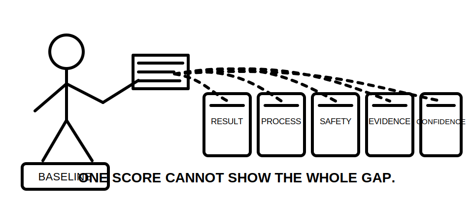
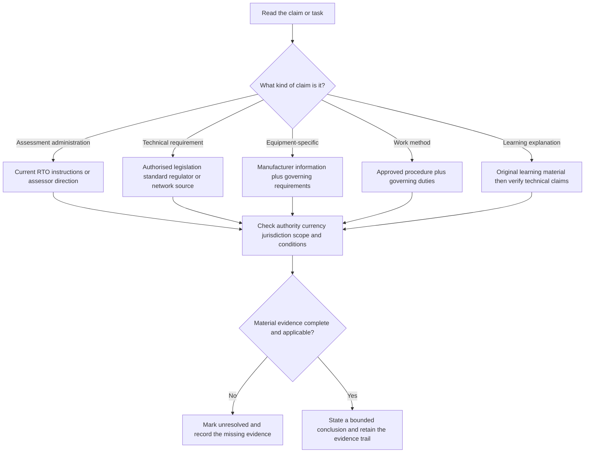
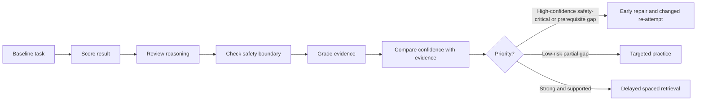

# Day 1 — Program Orientation, Assessment Map and Source Hierarchy

> **Currency notice:** This module teaches planning, diagnostic and source-selection methods. It does not state a universal Capstone format, pass mark, permitted-resource rule, technical limit or clause location. Confirm current arrangements with the learner's RTO and verify technical conclusions using authorised current legislation, standards, regulator guidance, network requirements, manufacturer information and approved workplace procedures as applicable.

## 1. Outcome and entry check

### Learning objectives

By the end of this block, the learner should be able to:

1. divide Capstone preparation into observable capability domains;
2. separate assessment-administration evidence from technical-authority evidence;
3. complete a closed-note baseline diagnostic and classify each response by result, reasoning, safety, evidence and confidence;
4. identify high-confidence errors, safety-critical gaps and missing prerequisites as priority repairs;
5. choose the source family most likely to control a claim and state why it applies;
6. record edition, jurisdiction, scope and scenario conditions before relying on a source;
7. build a six-week study map with retrieval, application, verification and re-attempt actions;
8. leave unresolved questions unresolved rather than filling gaps from memory.

### Entry check

Without opening a reference, answer and rate confidence as **guessing**, **unsure**, **reasonably confident** or **certain**:

1. Which source controls permitted resources in a specific assessment?
2. Which source controls a technical installation requirement?
3. Why can a technically authoritative source still be inapplicable to a particular scenario?
4. What is more urgent: a low-confidence mistake or a high-confidence safety-critical mistake?
5. What evidence demonstrates application rather than recognition?
6. When must a study conclusion remain unresolved?

Do not turn this entry check into a pass mark. It reveals assumptions before the baseline diagnostic.

## 2. Why it matters

A six-week program creates enough time to repair weak reasoning only when the learner identifies the actual weakness. Labels such as “bad at testing” hide whether the problem is terminology, source navigation, calculation setup, sequence control, interpretation, safety judgment or confidence calibration.

Day 1 produces three working artefacts:

- an **assessment map** of observable capabilities;
- a **source map** linking each claim type to likely controlling evidence;
- a **baseline evidence register** that determines what to repair, practise, retrieve or verify.

These prevent equal-time study, authority-by-memory and false confidence from familiarity.



## 3. Core concepts and terminology

### Capability domain

A **capability domain** is a group of related observable actions. Planning domains may include source navigation, safety reasoning, protection, earthing and MEN, circuit design, switching and switchboards, wiring systems, inspection, verification, fault finding, evidence recording and explanation. These are planning categories, not official RTO assessment sections.

### Baseline diagnostic

A **baseline diagnostic** is a first-attempt sample used to locate strengths and weaknesses before teaching. It must include varied task forms rather than one undifferentiated score.

### Retrieval, recognition and application

- **Retrieval:** producing an answer, sequence or explanation before checking a source.
- **Recognition:** noticing that information looks familiar while rereading.
- **Application:** using a concept in a changed scenario, calculation, diagram, inspection or decision.

Recognition is useful but is weaker evidence than retrieval and application.

### High-confidence error

A **high-confidence error** occurs when the learner is wrong while believing the answer is reliable. It receives priority because the learner is less likely to self-correct.

### Source family

A **source family** is a category of material likely to control a claim:

- current RTO instructions and assessor direction;
- legislation and regulation;
- authorised standards;
- regulator and network requirements;
- manufacturer documentation;
- approved workplace procedures and safe-work systems;
- original learning notes and practice material.

### Authority and applicability

**Authority** concerns whether a source can control a type of claim. **Applicability** concerns whether that source, edition and requirement fit the actual jurisdiction, equipment, task and conditions. Authority without applicability is insufficient.

### Evidence and claim status

Use these evidence statuses:

- **Observed:** directly shown in the supplied task or document.
- **Documented:** stated in a current authorised record.
- **Verified applicable:** authority, currency, scope and conditions have been checked.
- **Assumed:** plausible but not evidenced.
- **Missing:** required but unavailable.

Use these claim statuses:

- **Described:** reports what the task shows.
- **Supported:** combines applicable evidence into a bounded conclusion.
- **Verified:** requires the complete authorised evidence and review appropriate to the claim.
- **Unresolved:** material evidence is missing or applicability is uncertain.

## 4. Rule-finding workflow

Use **M-A-P-S** before relying on any study answer.

1. **M — Map the claim:** assessment administration, technical requirement, equipment information, work method or learning strategy.
2. **A — Assign the source family:** select the category most likely to control that claim.
3. **P — Prove currency and applicability:** check edition, amendments, jurisdiction, scope, equipment and scenario conditions.
4. **S — State the conclusion and status:** explain it in original words and mark unresolved checks.



### Source-applicability test

Before citing a source, answer:

1. What exact claim is being supported?
2. Does this source family control that claim?
3. Is the edition or version current for the task?
4. Does the jurisdiction match?
5. Do the equipment, installation and operating conditions match?
6. Is another source also required?
7. What remains unresolved?

## 5. Visual model or worked example

### Worked baseline classification

A learner identifies the broad protection concept in a fictional scenario, omits a material condition, names no source and reports being certain.

| Dimension | Observation | Classification | Study response |
|---|---|---|---|
| Result | Broad concept is correct | Partly correct | Retain concept; vary the scenario |
| Process | Material condition omitted | Incomplete | Practise a condition checklist |
| Safety | No practical action proposed | Boundary maintained | Keep stop statement explicit |
| Evidence | No controlling source identified | Missing | Repeat M-A-P-S |
| Confidence | Certain despite missing evidence | High-confidence weakness | Prioritise early repair |



The output is a remediation decision, not a percentage.

## 6. Practical application

### Build the six-week baseline map

Attempt one task in each format:

1. source navigation;
2. plain-language safety explanation;
3. protection or fault-path diagram interpretation;
4. calculation setup without remembered final values;
5. inspection observation and evidence statement;
6. sequence ordering;
7. fault-finding hypothesis;
8. two-minute explanation in the learner's own words.

For each task record:

```text
Capability domain:
Task attempted:
Result: correct / partly / incorrect
Reasoning: sound / incomplete / incorrect
Safety boundary: maintained / unclear / breached in reasoning
Evidence status:
Claim status:
Confidence before checking:
Source family and applicability checks:
Error type:
Next action:
Changed re-attempt:
Re-attempt date:
```

Assign one action: **priority repair**, **targeted practice**, **spaced retrieval** or **reference check**. Limit initial priority repairs to three and preserve capacity for later discoveries.

### Assessment rubric

Score each category from **0 to 2**.

| Category | 0 | 1 | 2 |
|---|---|---|---|
| Capability map | Vague topics only | Some observable actions | Domains expressed as assessable actions |
| Source selection | Notes treated as authority | Likely family named | Family and reason correctly matched to claim |
| Applicability | Not checked | Some conditions checked | Currency, jurisdiction, scope and conditions recorded |
| Diagnostic quality | One score only | Several dimensions used | Result, process, safety, evidence and confidence separated |
| Remediation | Rereading or equal-time plan | Some targeted action | Risk- and prerequisite-based action with changed re-attempt |
| Boundary control | Unsupported answer asserted | General caveat | Claim graded and material gaps left unresolved |

A score of **10/12 or higher** with no critical error indicates readiness for Day 2. This is an educational threshold, not an official assessment rule.

## 7. Common errors and safety checkpoint

### Common errors

- treating one percentage as the diagnosis;
- treating a source hierarchy as a universal ranking;
- checking authority but not applicability;
- planning from topic preference rather than evidence and risk;
- rereading immediately instead of classifying the error;
- counting copied steps as application;
- using learning notes as technical authority;
- assuming another provider's assessment rules apply;
- filling unresolved gaps from memory.

### Critical errors

- presenting an assumed assessment rule as current RTO fact;
- presenting an unverified technical claim as authoritative;
- omitting a safety-critical or prerequisite gap from the repair plan;
- proposing practical work merely to confirm a study answer.

### Safety checkpoint

This module authorises no electrical work, access, isolation, testing, energisation, reset, repair or alteration. Baseline tasks remain paper-based, simulated or conducted under authorised RTO and workplace arrangements.

Stop and escalate when the task exceeds authority, the equipment or supply state is unknown, an authorised source is unavailable, applicability is uncertain or assessment instructions conflict with remembered practice.

## 8. Retrieval and next links

### Closed-note retrieval

1. Expand **M-A-P-S**.
2. Distinguish authority from applicability.
3. Distinguish retrieval, recognition and application.
4. Name the five diagnostic dimensions.
5. Name the evidence and claim statuses.
6. Why are high-confidence errors prioritised?
7. Why must the study plan retain unused capacity?
8. When must a conclusion remain unresolved?

### Changed-scenario transfer

Take one baseline task and change its jurisdiction, equipment model, assessment provider or installation condition. Re-run M-A-P-S and explain which earlier source or conclusion no longer applies.

### Delayed retrieval

Schedule a closed-note re-attempt 48–72 hours later using a different claim type. A correct repeated example is not sufficient evidence of transfer.

### Navigation

- **Program:** [Six-Week Capstone Learning Plan](../MASTER_PLAN.md)
- **Previous:** [Six-Week Capstone Learning Plan](../MASTER_PLAN.md)
- **Knowledge note:** [[Six-Week Day 01 - Program Orientation Assessment Map and Source Hierarchy]]
- **Next:** [Day 2 — Hazard, Risk, Exposure and Critical Controls](day-02-hazard-risk-exposure-and-critical-controls.md)

### References and review boundary

- Confirm assessment structure, permitted resources, timing and evidence rules with the learner's current RTO.
- Use authorised current sources for all technical conclusions.
- This original module remains `review-required` and `reference_check_required`.
- It is not `technically-reviewed`.
