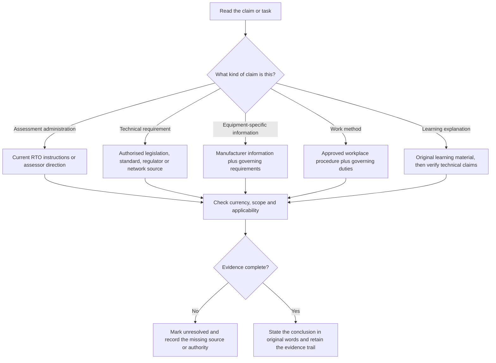
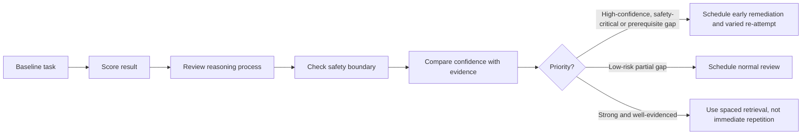

# Day 1 — Program Orientation, Assessment Map and Source Hierarchy

> **Currency notice:** This module teaches planning, diagnostic and source-selection methods. It does not state a universal Capstone format, pass mark, permitted-resource rule, technical limit or clause location. Confirm current arrangements with the learner's RTO and verify technical conclusions using authorised current legislation, standards, regulator guidance, network requirements, manufacturer information and approved workplace procedures as applicable.

## 1. Outcome and entry check

### Learning objectives

By the end of this block, the learner should be able to:

1. divide Capstone preparation into observable capability domains rather than treating it as one undifferentiated exam;
2. separate assessment-administration evidence from technical-authority evidence;
3. complete a baseline diagnostic without using notes and classify each response by correctness, process, safety and confidence;
4. identify high-confidence errors and safety-critical gaps as priority remediation items;
5. build a six-week study map that assigns retrieval, application and review actions to specific weak capabilities;
6. choose the most appropriate source family for an assessment, design, installation, verification or equipment question;
7. record unresolved source, jurisdiction and supervision questions rather than filling gaps from memory.

### Entry check

Without opening a reference, answer and rate confidence as **guessing**, **unsure**, **reasonably confident** or **certain**:

1. Which source controls what resources are permitted in a specific assessment?
2. Which source controls a technical installation requirement?
3. What is more urgent: a low-confidence mistake or a high-confidence safety-critical mistake? Why?
4. What evidence would show that you can apply a concept rather than merely recognise it?
5. When should a study question be marked unresolved instead of answered from memory?

Do not convert this entry check into a pass mark. Its purpose is to reveal planning assumptions before the baseline diagnostic.

## 2. Why it matters

A six-week program creates enough time to improve weak reasoning, but only if the learner knows what is weak. Broad labels such as “bad at testing” or “need more wiring rules” are not actionable. They hide whether the actual problem is terminology, source navigation, calculation setup, sequence control, interpretation, safety judgment or confidence calibration.

The first block therefore produces two working artefacts:

- an **assessment map** showing the capabilities likely to be demonstrated;
- a **source hierarchy** showing where different kinds of claims must be verified.

These artefacts prevent three common failures:

- spending equal time on strong and weak topics;
- treating remembered notes as technical authority;
- mistaking familiarity with a page for the ability to solve a fresh problem.


## 3. Core concepts and terminology

### Capability domain

A **capability domain** is a group of related actions that can be observed and assessed. Useful planning domains include:

- source navigation and rule finding;
- safety reasoning and work boundaries;
- protection and fault-current reasoning;
- earthing and MEN concepts;
- demand, conductor selection and voltage drop;
- switching, isolation and switchboards;
- wiring systems and special locations;
- inspection, verification and test interpretation;
- systematic fault finding;
- explanation, evidence recording and confidence calibration.

These are planning categories, not official RTO assessment sections. The actual assessment map must be checked against current RTO information.

### Baseline diagnostic

A **baseline diagnostic** is a short first-attempt sample used to locate strengths and weaknesses before teaching begins. It should include varied task types rather than a single quiz score.

### Retrieval

**Retrieval** means producing an answer, sequence, explanation or decision from memory before checking a source. Recognition while rereading is weaker evidence of learning.

### Application

**Application** means using a concept in a new scenario, calculation, diagram, inspection or decision. Correctly repeating an example does not by itself demonstrate application.

### High-confidence error

A **high-confidence error** occurs when the learner is wrong while believing the answer is reliable. These errors deserve priority because they may survive into practical decisions or assessment responses without triggering self-checking.

### Source family

A **source family** is the category of material likely to control a claim. Typical families are:

- RTO instructions and assessor direction;
- legislation and regulation;
- authorised installation or verification standards;
- regulator and network requirements;
- manufacturer documentation;
- approved workplace procedures and safe-work systems;
- original learning notes and practice material.

Learning notes support understanding but do not automatically control technical or legal decisions.

### Evidence record

Use this compact format:

```text
Capability domain:
Task attempted:
Correct result? yes / partly / no
Reasoning process: sound / incomplete / incorrect
Safety boundary: maintained / unclear / breached in reasoning
Confidence before checking:
Controlling source family:
Verification completed:
Error type:
Next remediation action:
Re-attempt date:
```

## 4. Rule-finding workflow

Use **M-A-P-S** before relying on any study answer.

1. **M — Map the claim.** Decide whether the claim concerns assessment administration, technical requirements, equipment information, work method or learning strategy.
2. **A — Assign the source family.** Choose the source category most likely to control that claim.
3. **P — Prove currency and applicability.** Check edition, amendments, jurisdiction, scope, equipment and scenario conditions.
4. **S — State the conclusion and status.** Explain the result in original words and mark unresolved checks explicitly.



### Source hierarchy is not a simple universal ranking

A source is authoritative only for the question it controls. RTO instructions can control assessment conditions but do not replace technical requirements. Manufacturer information can control equipment-specific conditions but does not displace legislation or applicable installation requirements. Workplace procedures can impose approved work methods but must remain consistent with governing duties.

## 5. Visual model or worked example

### Worked baseline classification

**Prompt:** A learner is shown a small installation scenario and asked to identify the applicable protection concept, explain the reasoning, nominate the source family and state what must be verified before acting.

The learner selects the right concept but gives no source, omits a material condition and reports being certain.

| Dimension | Observation | Classification | Study response |
|---|---|---|---|
| Result | Broad concept is correct | Partly correct | Retain the concept but test it in a varied scenario |
| Process | Material condition omitted | Incomplete reasoning | Practise a condition checklist |
| Evidence | No controlling source identified | Evidence gap | Repeat using M-A-P-S |
| Safety | No practical action proposed | Boundary maintained | Keep the stop condition explicit |
| Confidence | Certain despite missing evidence | High-confidence weakness | Prioritise early remediation |

The important outcome is not a percentage. It is the decision that this item needs an early varied re-attempt because confidence exceeded evidence quality.



## 6. Practical application

### Build the six-week baseline map

Complete one short task in each of these formats:

1. source-navigation task;
2. plain-language safety explanation;
3. protection or fault-path diagram interpretation;
4. calculation setup without relying on remembered final values;
5. inspection observation and evidence statement;
6. sequence-ordering task;
7. fault-finding hypothesis task;
8. two-minute explanation in your own words.

For every task, complete the evidence record. Then assign one of four actions:

- **Priority repair:** high-confidence error, safety-critical gap or missing prerequisite;
- **Targeted practice:** partial process or application weakness;
- **Spaced retrieval:** correct, justified and safely bounded response;
- **Reference check:** conclusion cannot be completed without authorised current material.

### Six-week study allocation

Create a table with these columns:

| Capability | Baseline evidence | Main error type | Planned block | Re-attempt form | Verification needed |
|---|---|---|---|---|---|

Do not fill every available study block. Reserve space for errors discovered later. A rigid plan made before learning begins is less useful than a controlled plan that can respond to evidence.

### Completion criteria

This block is complete when the learner has:

- attempted all eight baseline formats;
- recorded confidence before checking;
- identified no more than three priority repairs;
- assigned each priority repair to a later block or retrieval session;
- listed all unresolved RTO, jurisdiction and source-access questions;
- confirmed the exact next block rather than beginning several topics at once.

## 7. Common errors and safety checkpoint

### Common errors

- **Treating one score as the diagnosis:** classify result, reasoning, safety, evidence and confidence separately.
- **Planning from topic preference:** allocate effort according to evidence, prerequisites and risk.
- **Rereading immediately after failure:** first state the error type, then use a smaller explanation and a fresh re-attempt.
- **Counting copied steps as application:** vary the scenario, diagram, values or required explanation.
- **Using notes as authority:** use them to organise learning, then verify technical claims in the controlling source.
- **Assuming the assessment format:** confirm current RTO instructions rather than importing another provider's rules.
- **Overloading Week 1:** limit priority repairs to the most consequential gaps and preserve later review capacity.
- **Ignoring confidence:** a certain wrong answer usually deserves earlier review than an unsure wrong answer of equal consequence.

### Safety checkpoint

This module does not authorise electrical work, isolation, access, testing, energisation, reset, repair or alteration. Baseline tasks should remain paper-based, simulated or conducted under the learner's authorised RTO and workplace arrangements.

Stop and escalate when:

- the task requires practical access beyond the learner's training, licence or supervision boundary;
- the equipment state or supply arrangement is unknown;
- an authorised source is unavailable or its applicability is uncertain;
- the learner is tempted to perform a practical step merely to confirm a study answer;
- an RTO instruction conflicts with a remembered workplace habit.

## 8. Retrieval and next links

### Recall questions

Answer without looking, then check the module.

1. What does each letter in **M-A-P-S** represent?
2. Why is a high-confidence error a priority?
3. What is the difference between retrieval and recognition?
4. Why is a capability map more useful than a broad topic label?
5. Which source family controls assessment conditions?
6. What should happen when evidence is incomplete?
7. What five dimensions are reviewed in the worked baseline classification?
8. Why should the six-week plan retain unused capacity?

### Varied retrieval

Take one original scenario and produce:

- the capability domain being tested;
- the likely controlling source family;
- one material condition that could change the answer;
- the evidence still required;
- a safe stop statement;
- a confidence rating before and after checking.

### Navigation

- **Program:** [Six-Week Capstone Learning Plan](../MASTER_PLAN.md)
- **Previous:** [Six-Week Capstone Learning Plan](../MASTER_PLAN.md)
- **Knowledge note:** [[Six-Week Day 01 - Program Orientation Assessment Map and Source Hierarchy]]
- **Next:** [Day 2 — Hazard, Risk, Exposure and Critical Controls](day-02-hazard-risk-exposure-and-critical-controls.md)

### References and review boundary

- Confirm assessment structure, permitted resources, timing and evidence rules with the learner's current RTO.
- Use authorised current technical sources for all technical conclusions.
- This original learning module remains `review-required` and `reference_check_required`.
- It has not received qualified technical review and must not be labelled `technically-reviewed`.
