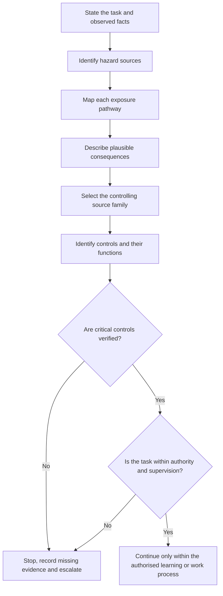
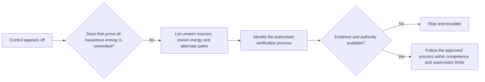

# Day 2 — Hazard, Risk, Exposure and Critical Controls

> **Currency notice:** This module teaches an original reasoning method for paper-based and supervised learning scenarios. It does not replace current legislation, regulator guidance, authorised standards, RTO instructions, workplace risk controls, permits, isolation procedures, manufacturer information or competent supervision. Confirm the controlling requirements for the learner's jurisdiction, workplace and task before practical use.

## 1. Outcome and entry check

### Learning objectives

By the end of this block, the learner should be able to:

1. distinguish a hazard, an exposure pathway, a possible consequence, risk and a control;
2. analyse a scenario without treating the presence of personal protective equipment as proof that the risk is controlled;
3. identify which controls are critical because their failure could permit a severe outcome;
4. separate observed facts from assumptions and unresolved evidence;
5. use the **S-C-O-P-E** workflow to locate the source family governing a safety decision;
6. state a safe stop condition when authority, equipment state, isolation status or control effectiveness is uncertain;
7. produce a concise evidence record showing hazard, exposure, consequence, controls, verification and residual uncertainty.

### Entry check

Answer without references, then rate confidence as **guessing**, **unsure**, **reasonably confident** or **certain**:

1. Is a damaged enclosure a hazard, a risk or a consequence?
2. Can a hazard exist when nobody is currently exposed?
3. What makes a control “critical” rather than merely helpful?
4. Why is “the switch is off” incomplete evidence of a safe state?
5. What should happen when the learner cannot verify a control?

Do not turn this diagnostic into a pass mark. Record any high-confidence error for later retrieval.

## 2. Why it matters

Safety questions are often answered poorly because the learner jumps directly from a visible problem to a familiar control. That shortcut can hide the actual exposure pathway, omit a second source of energy, or assume that a control is effective without evidence.

A defensible explanation shows a chain:

**hazard → exposure pathway → consequence → controls → verification → remaining uncertainty**

This matters in assessment because a technically familiar answer may still be unsafe if it:

- confuses the hazardous source with the likelihood of harm;
- names a control without explaining how it interrupts exposure;
- assumes equipment is de-energised from an indicator, label or control position alone;
- ignores competence, permission, supervision or task boundaries;
- continues despite missing evidence.


## 3. Core concepts and terminology

### Hazard

A **hazard** is a source or situation with the potential to cause harm. In electrical contexts this may include electrical energy, heat, arc effects, unexpected movement, stored energy, damaged insulation, conductive surroundings or an unsuitable work environment.

### Exposure pathway

An **exposure pathway** is the route or set of conditions by which the hazard could reach a person, equipment or property. Examples include contact with an energised conductive part, bridging two different potentials, conductive contamination, loss of an enclosure barrier or unexpected energisation.

### Consequence

A **consequence** is the harm or loss that could result if exposure occurs. Consequences can affect people, equipment, property, continuity of supply and others who are not performing the task.

### Risk

**Risk** is the combination of the possibility of the event and the severity of its consequences, considered in the actual context. Risk is not a synonym for hazard. The same hazard can present different risk depending on access, environment, task, controls and uncertainty.

### Control

A **control** is a measure intended to eliminate the hazard or interrupt the pathway to harm. Controls should be described by function, not only by name. For example, a barrier controls access only while it is suitable, intact, correctly placed and maintained.

### Critical control

A **critical control** is a control whose absence or failure could materially permit a severe outcome. Because the consequence of failure is high, its presence and effectiveness require explicit verification rather than assumption.

### Control verification

**Control verification** means obtaining evidence that the control exists, applies to the scenario and is effective at the required time. A checklist tick without supporting evidence is not verification.

### Residual uncertainty

**Residual uncertainty** is what remains unresolved after the available evidence has been reviewed. It must be stated where it could change the decision. Safety-critical uncertainty is a reason to stop and escalate, not a gap to fill from memory.

### Evidence record

Use this original compact format:

```text
Observed facts:
Hazard source:
Exposure pathway:
Plausible consequence:
Existing controls and intended function:
Critical controls:
Evidence of control effectiveness:
Authority / supervision boundary:
Unresolved assumptions:
Decision: proceed in simulation / obtain evidence / stop and escalate
```

## 4. Rule-finding workflow

Use **S-C-O-P-E** before accepting a safety conclusion.

1. **S — State the scenario.** Identify the task, people, equipment, environment, energy sources and what is actually observed.
2. **C — Choose the controlling source family.** Determine whether the issue is governed by legislation, regulator guidance, an authorised standard, network rules, manufacturer information, RTO direction or an approved workplace procedure.
3. **O — Outline the exposure chain.** Connect the hazard to the exposure pathway and plausible consequence without skipping assumptions.
4. **P — Prove the controls.** Identify critical controls and the evidence required to show they are present, applicable and effective.
5. **E — Escalate uncertainty.** Stop when authority, isolation, equipment state, control integrity or source applicability cannot be confirmed.



The diagram is a reasoning sequence, not a practical isolation procedure. It deliberately places evidence and authority gates before any continuation decision.

## 5. Visual model or worked example

### Paper-based scenario

A learner is shown a photograph of a closed item of electrical equipment. The external control is in an off position, a warning label is partly damaged and the supply arrangement is not visible. The question asks whether the equipment can be treated as safe to access.

A weak response says: “It is off, so it is safe.”

A stronger analysis is:

| Element | Evidence-based analysis |
|---|---|
| Observed fact | The external control appears to be in an off position |
| Hazard | Electrical or stored energy may still be present |
| Exposure pathway | Access could defeat an enclosure barrier and permit contact or another harmful event |
| Consequence | Serious injury, equipment damage or harm to another person is plausible |
| Missing evidence | Supply sources, isolation status, stored energy, control function, authority and approved procedure are unknown |
| Critical controls | Task-specific isolation and verification controls determined by authorised current requirements and approved procedures |
| Decision | Do not infer a safe state; stop at the paper-analysis boundary and state the evidence required from an authorised process |



The key lesson is that an indication can be relevant evidence without being sufficient evidence.

## 6. Practical application

### Scenario analysis set

Complete three paper-based scenarios supplied by the trainer or created from fictional equipment arrangements. Use varied contexts such as:

1. damaged enclosure near a conductive or wet environment;
2. equipment with an unexpected or alternate supply possibility;
3. a reported fault where another person proposes repeated resetting or immediate access.

For each scenario:

1. list only observed facts;
2. identify at least one hazard and one exposure pathway;
3. state one plausible consequence without exaggeration;
4. identify existing controls and explain their intended function;
5. nominate the critical control or controls;
6. state what evidence would verify those controls;
7. identify the controlling source family using S-C-O-P-E;
8. state the authority or supervision boundary;
9. make one of three decisions: continue in simulation, obtain missing evidence, or stop and escalate.

### Assessment-focused completion criteria

The activity is complete when the learner can produce three records that:

- distinguish hazards from risk and consequences;
- contain no invented observations;
- explain how each named control interrupts the exposure chain;
- mark critical controls explicitly;
- identify missing evidence and source checks;
- contain an unambiguous stop decision where required;
- use original wording rather than reconstructed standards text.

### Varied re-attempt

After feedback, repeat one scenario with a changed environment, a different person exposed, or an added alternate energy source. Do not simply correct the original wording. Show how the changed condition alters the pathway, control verification or decision.

## 7. Common errors and safety checkpoint

### Common errors

- **Calling the hazard “the risk”:** state the hazardous source first, then analyse exposure and consequence in context.
- **Jumping straight to PPE:** first consider whether the hazard can be removed or the pathway prevented by higher-order controls required by the authorised process.
- **Listing controls without functions:** explain what pathway each control interrupts.
- **Treating presence as effectiveness:** a control may be present but unsuitable, damaged, bypassed, incorrectly applied or unverified.
- **Inventing certainty from appearance:** labels, switch positions, indicators and historical information may be incomplete.
- **Ignoring others:** consider coworkers, occupants, the public and people affected by restoration or unexpected operation.
- **Using a generic checklist as authority:** identify the current source family and approved task-specific process.
- **Proceeding because the likely answer is obvious:** safety-critical missing evidence remains a stop condition.

### Safety checkpoint

This module authorises no electrical access, isolation, proving, testing, reset, disconnection, repair, alteration or energisation. Activities must remain paper-based, simulated, or conducted within current RTO and workplace authorisation under competent supervision.

Stop and escalate when:

- the equipment state or all possible energy sources are not established;
- a critical control cannot be verified;
- the task exceeds the learner's competence, permission, licence or supervision;
- environmental conditions differ from the approved plan;
- another person's action could defeat the control;
- the controlling requirement or approved procedure is unavailable or appears inconsistent;
- practical action is being proposed merely to answer a study question.

## 8. Retrieval and next links

### Recall questions

Answer without looking, then verify against the module.

1. What is the difference between a hazard and risk?
2. What is an exposure pathway?
3. What makes a control critical?
4. What does each letter in S-C-O-P-E represent?
5. Why is a switch position insufficient by itself?
6. What is residual uncertainty?
7. What evidence is needed before relying on a critical control?
8. When must the learner stop and escalate?

### Fresh application

For a fictional scenario involving a damaged barrier and an unknown supply arrangement, write six sentences covering:

1. observed fact;
2. hazard;
3. exposure pathway;
4. consequence;
5. missing critical-control evidence;
6. stop and escalation statement.

Rate confidence before checking. A high-confidence response that invents facts must be entered into the error log.

### Navigation

- **Program:** [Six-Week Capstone Learning Plan](../MASTER_PLAN.md)
- **Previous:** [Day 1 — Program Orientation, Assessment Map and Source Hierarchy](day-01-program-orientation-assessment-map-and-source-hierarchy.md)
- **Knowledge note:** [[Six-Week Day 02 - Hazard Risk Exposure and Critical Controls]]
- **Next:** [Day 3 — Fundamental Protection Concepts and Fault Types](day-03-fundamental-protection-concepts-and-fault-types.md)

### References and review boundary

- Verify task-specific safety duties and controls using current legislation, regulator guidance, authorised standards, approved workplace procedures, manufacturer information and RTO direction as applicable.
- Exact procedural requirements, limits and jurisdiction-specific claims remain `reference_check_required`.
- This original module is organised around learner decisions rather than a standards clause sequence and reproduces no standards table, figure or systematic clause wording.
- It remains `review-required`, has not received qualified technical review and must not be labelled `technically-reviewed`.
