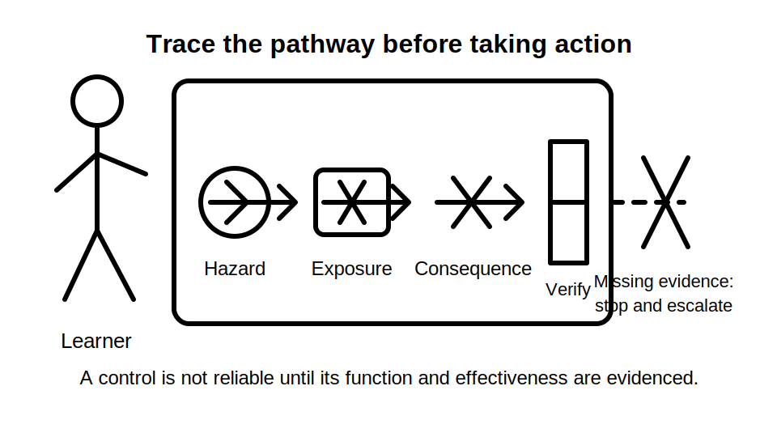
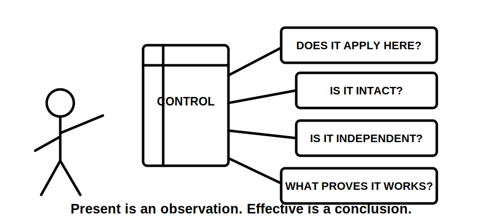
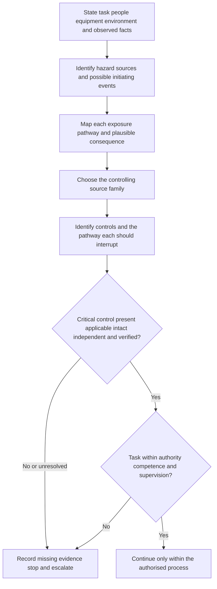
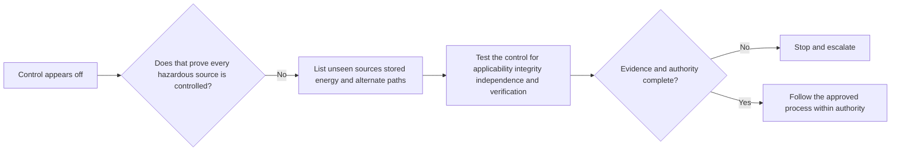

# Day 2 — Hazard, Risk, Exposure and Critical Controls

> **Currency and authority notice:** This original module supports paper-based and supervised learning scenarios. It does not replace current legislation, regulator guidance, authorised standards, RTO instructions, workplace risk controls, permits, isolation procedures, manufacturer information or competent supervision. Exact duties, control requirements and practical procedures must be verified from current authorised sources. This module is not `technically-reviewed`.

## 1. Outcome and entry check

### Learning objectives

By the end of this block, the learner should be able to:

1. distinguish a hazard, exposure pathway, initiating event, consequence, risk and control;
2. map at least one complete exposure chain from observed fact to plausible consequence without inventing evidence;
3. classify a control as present, applicable, intact, independent, verified or unresolved;
4. identify which controls are critical because their failure could permit a severe outcome;
5. explain why personal protective equipment or a visible switch position does not, by itself, prove adequate control;
6. use the **S-C-O-P-E** workflow to locate the governing source family and test a safety conclusion;
7. grade evidence as observed, documented, verified, assumed or missing;
8. write a bounded decision to continue in simulation, obtain evidence, or stop and escalate.

### Entry check

Answer without references, then rate confidence as **guessing**, **unsure**, **reasonably confident** or **certain**:

1. Is a damaged enclosure a hazard, a risk or evidence of a failed control?
2. Can a hazard exist when nobody is currently exposed?
3. What is the difference between a control being present and being effective?
4. What makes a control critical rather than merely useful?
5. Why is “the switch is off” incomplete evidence of a safe state?
6. What should happen when the learner cannot verify a critical control?

Record every high-confidence error in the error log. The diagnostic is not a pass mark.

## 2. Why it matters

Safety reasoning fails when the learner jumps from a visible condition directly to a familiar control. That shortcut can hide the actual exposure pathway, omit an alternate or stored energy source, or treat the presence of a control as proof of effectiveness.

A defensible explanation shows this chain:

**hazard → initiating event or condition → exposure pathway → consequence → controls → verification → residual uncertainty**

This matters in assessment because a technically familiar answer may still be unsafe if it:

- confuses the hazardous source with the likelihood of harm;
- names a control without explaining which pathway it interrupts;
- assumes equipment is de-energised from an indicator, label or control position alone;
- treats one control as independent when it relies on another unverified condition;
- ignores competence, permission, supervision or task boundaries;
- continues despite safety-critical missing evidence.





## 3. Core concepts and terminology

### Hazard

A **hazard** is a source or situation with the potential to cause harm. Electrical examples may include electrical energy, heat, arc effects, unexpected movement, stored energy, damaged insulation, conductive surroundings or an unsuitable work environment.

### Initiating event or condition

An **initiating event or condition** is what allows the hazard to begin affecting the exposure pathway. It may be a failure, action, environmental change, loss of separation, unexpected energisation or restoration of supply.

### Exposure pathway

An **exposure pathway** is the route or set of conditions by which the hazard could reach a person, equipment or property. Examples include contact with an energised conductive part, bridging different potentials, conductive contamination, loss of an enclosure barrier or unexpected operation.

### Consequence

A **consequence** is the harm or loss that could result if exposure occurs. Consequences can affect people, equipment, property, continuity of supply and people who are not performing the task.

### Risk

**Risk** combines the possibility of an event with the severity of its consequences in the actual context. Risk is not a synonym for hazard. The same hazard can present different risk depending on access, environment, task, controls and uncertainty.

### Control

A **control** is a measure intended to eliminate the hazard or interrupt the pathway to harm. Describe a control by function, not only by name. A barrier, for example, controls access only while it is suitable, intact, correctly placed and maintained.

### Critical control

A **critical control** is a control whose absence or failure could materially permit a severe outcome. Its presence and effectiveness require explicit evidence rather than assumption.

### Control state

Use six control-state questions:

1. **Present:** can the control be directly observed or documented?
2. **Applicable:** does it address the actual hazard and pathway in this scenario?
3. **Intact:** is there evidence it has not been damaged, bypassed or degraded?
4. **Independent:** does it still function if another control or assumption fails?
5. **Verified:** is there authorised evidence that it is effective at the required time?
6. **Unresolved:** is any material question unanswered?

A control can be present but inapplicable, damaged, dependent or unverified.

### Residual uncertainty

**Residual uncertainty** is what remains unresolved after the available evidence has been reviewed. State it whenever it could change the decision. Safety-critical uncertainty is a reason to stop and escalate, not a gap to fill from memory.

### Evidence grades

- **Observed:** directly visible in the supplied scenario, image or record.
- **Documented:** stated in a current authorised record, procedure, label or drawing.
- **Verified:** supported by the authorised process appropriate to the claim.
- **Assumed:** plausible but not evidenced.
- **Missing:** required for the decision but unavailable.

### Evidence record

```text
Observed facts:
Hazard source:
Initiating event or condition:
Exposure pathway:
Plausible consequence:
Existing controls and intended function:
Critical controls:
Control state: present / applicable / intact / independent / verified / unresolved
Authority / supervision boundary:
Residual uncertainty:
Decision: continue in simulation / obtain evidence / stop and escalate
```

## 4. Rule-finding workflow

Use **S-C-O-P-E** before accepting a safety conclusion.

1. **S — State the scenario.** Identify the task, people, equipment, environment, energy sources and what is actually observed.
2. **C — Choose the controlling source family.** Determine whether the issue is governed by legislation, regulator guidance, an authorised standard, network rules, manufacturer information, RTO direction or an approved workplace procedure.
3. **O — Outline the exposure chain.** Connect hazard, initiating event, exposure pathway and plausible consequence without skipping assumptions.
4. **P — Prove the controls.** Test each critical control for presence, applicability, integrity, independence and authorised verification.
5. **E — Escalate uncertainty.** Stop when authority, isolation, equipment state, control integrity or source applicability cannot be confirmed.



The diagram is a reasoning sequence, not a practical isolation procedure. It places evidence and authority gates before continuation.

## 5. Visual model or worked example

### Complete worked example

A learner is shown a photograph of closed electrical equipment. An external control is in an off position, a warning label is partly damaged, and the supply arrangement is not visible. The question asks whether the equipment can be treated as safe to access.

A weak response says: “It is off, so it is safe.”

| Element | Evidence-based analysis |
|---|---|
| Observed fact | The external control appears to be in an off position. |
| Hazard | Electrical or stored energy may remain present. |
| Initiating condition | Access, restoration, alternate supply or stored-energy release could create exposure. |
| Exposure pathway | Defeating the enclosure boundary could permit contact or another harmful event. |
| Consequence | Serious injury, equipment damage or harm to another person is plausible. |
| Control state | The control position is observed, but applicability, independence and effectiveness are not verified. |
| Missing evidence | Sources, isolation status, stored energy, control function, authority and approved procedure are unknown. |
| Decision | Do not infer a safe state; stop at the paper-analysis boundary and request authorised evidence. |



The key lesson is that an indication can be relevant evidence without being sufficient evidence.

### Worked-example fading

A second fictional scenario shows a damaged enclosure near a damp surface. A warning sign is present and the area is normally restricted.

Complete only the following:

1. identify the hazard and initiating condition;
2. map one exposure pathway;
3. test the warning sign and restricted area against the six control-state questions;
4. identify missing evidence;
5. write one bounded stop or escalation decision.

## 6. Practical application

### Scenario analysis set

Complete three paper-based scenarios using varied contexts:

1. damaged enclosure near a conductive or wet environment;
2. equipment with an unexpected, stored or alternate supply possibility;
3. a reported fault where another person proposes repeated resetting or immediate access.

For each scenario:

1. list only observed facts;
2. identify at least one hazard and initiating event or condition;
3. map at least one exposure pathway;
4. state one plausible consequence without exaggeration;
5. identify existing controls and explain their intended function;
6. nominate the critical controls;
7. test every critical control for presence, applicability, integrity, independence and verification;
8. identify the controlling source family using S-C-O-P-E;
9. state the authority or supervision boundary;
10. decide to continue in simulation, obtain evidence, or stop and escalate.

### Assessment rubric

Score each category from **0 to 2**.

| Category | 0 | 1 | 2 |
|---|---|---|---|
| Evidence discipline | Invents facts | Some assumptions labelled | Observed, documented, verified, assumed and missing evidence separated consistently |
| Exposure-chain reasoning | Names hazard only | Partial chain | Hazard, initiating event, pathway and consequence connected clearly |
| Control analysis | Lists controls | Functions partly explained | Critical controls tested across all control-state questions |
| Source and authority | No source or boundary | General source named | Applicable source family and authority boundary stated |
| Decision quality | Unsafe or vague conclusion | Cautious but incomplete | Bounded decision follows directly from evidence and uncertainty |
| Transfer | Repeats memorised wording | Adapts some elements | Rebuilds the analysis when a condition changes |

A score of **10/12 or higher** with no critical error indicates readiness for Day 3. This is an educational threshold, not an official assessment rule.

### Varied re-attempt

Repeat one scenario after changing the environment, exposed person, supply arrangement or control condition. Rebuild the exposure chain and control-state analysis rather than editing the previous answer.

## 7. Common errors and safety checkpoint

### Common errors

- **Calling the hazard “the risk”:** state the hazardous source first, then analyse exposure and consequence.
- **Jumping straight to PPE:** first identify whether the hazard or pathway can be addressed by controls required by the authorised process.
- **Listing controls without functions:** explain which pathway each control interrupts.
- **Treating presence as effectiveness:** a control may be present but unsuitable, damaged, dependent, bypassed or unverified.
- **Assuming independence:** two controls may rely on the same source, person, component or assumption.
- **Inventing certainty from appearance:** labels, switch positions, indicators and historical information may be incomplete.
- **Ignoring others:** consider coworkers, occupants, the public and people affected by restoration or unexpected operation.
- **Using a generic checklist as authority:** locate the current task-specific source and approved process.

### Critical errors

Any of the following requires remediation regardless of score:

- claiming a safe state from appearance alone;
- omitting a plausible alternate or stored energy source supplied by the scenario;
- treating a visible control as verified effectiveness;
- inventing an observation or verification result;
- proposing practical access, isolation, testing, resetting or energisation outside authority;
- continuing despite an unresolved critical control.

### Safety checkpoint

This module authorises no electrical access, isolation, proving, testing, reset, disconnection, repair, alteration or energisation. Activities must remain paper-based, simulated, or conducted within current RTO and workplace authorisation under competent supervision.

Stop and escalate when:

- equipment state or all possible energy sources are not established;
- a critical control cannot be verified;
- the task exceeds competence, permission, licence or supervision;
- environmental conditions differ from the approved plan;
- another person's action could defeat the control;
- the controlling requirement or approved procedure is unavailable or inconsistent;
- practical action is proposed merely to answer a study question.

## 8. Retrieval and next links

### Closed-note retrieval

1. Distinguish hazard, initiating event, exposure pathway, consequence and risk.
2. What makes a control critical?
3. Name the six control-state questions.
4. Expand S-C-O-P-E.
5. Why can two controls fail to be independent?
6. Name the five evidence grades.
7. Why is a switch position insufficient by itself?
8. State three stop conditions.

### Delayed retrieval

At the start of Day 3, reconstruct the exposure-chain model and six control-state questions from memory before opening either module.

### Changed-scenario transfer

For a fictional damaged barrier, change one condition: add an alternate source, remove the access restriction, or introduce a person unfamiliar with the equipment. Rebuild the analysis and explain exactly which conclusion changes.

### Navigation

- **Program:** [Six-Week Capstone Learning Plan](../MASTER_PLAN.md)
- **Previous:** [Day 1 — Program Orientation, Assessment Map and Source Hierarchy](day-01-program-orientation-assessment-map-and-source-hierarchy.md)
- **Knowledge note:** [[Six-Week Day 02 - Hazard Risk Exposure and Critical Controls]]
- **Next:** [Day 3 — Fundamental Protection Concepts and Fault Types](day-03-fundamental-protection-concepts-and-fault-types.md)

### References and review boundary

- Verify task-specific duties and controls using current legislation, regulator guidance, authorised standards, approved workplace procedures, manufacturer information and RTO direction.
- Exact procedural requirements, limits and jurisdiction-specific claims remain `reference_check_required`.
- This original module is organised around learner decisions rather than a standards clause sequence and reproduces no standards table, figure or systematic clause wording.
- It remains `review-required`, has not received qualified technical review and must not be labelled `technically-reviewed`.
