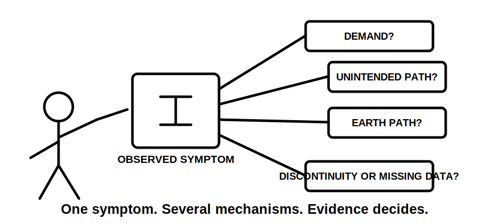
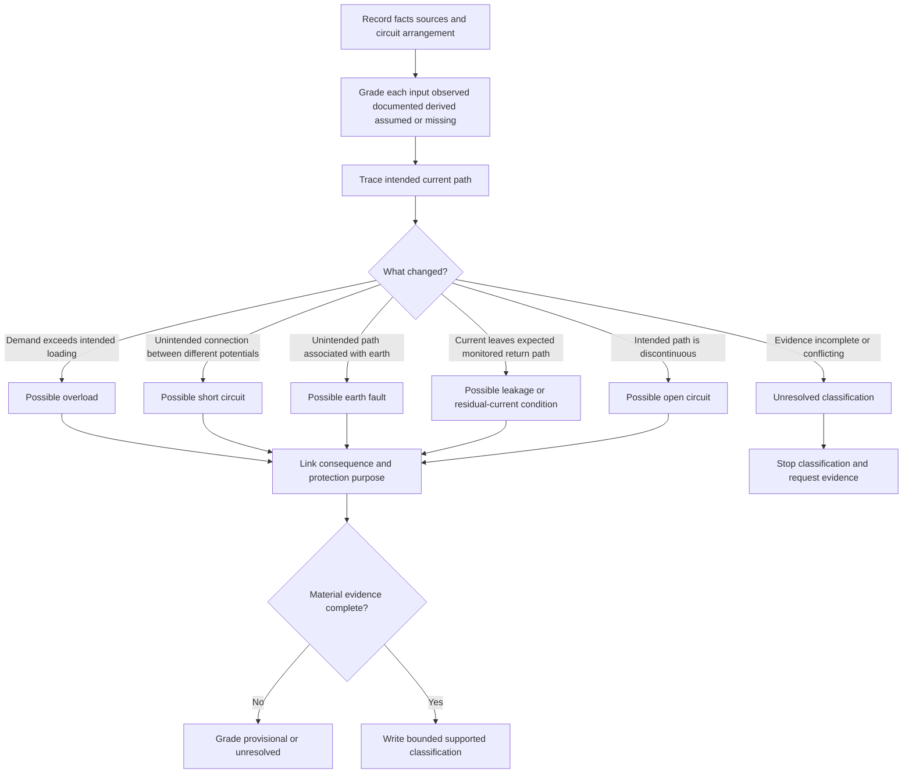
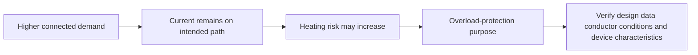

# Day 3 — Fundamental Protection Concepts and Fault Types

> **Currency notice:** This module provides an original conceptual framework for classifying abnormal electrical conditions and explaining the purpose of protective measures. It does not specify device ratings, disconnection times, test limits, installation procedures or authorised work methods. Verify all technical decisions against current authorised standards, legislation, regulator guidance, manufacturer information, network requirements, workplace procedures and RTO instructions. It is not `technically-reviewed`.

## 1. Outcome and entry check

### Learning objectives

By the end of this block, the learner should be able to:

1. distinguish normal operation, overload, short circuit, earth fault, leakage current, residual current and open-circuit conditions from a written scenario;
2. separate an observed symptom from an initiating condition, current path, mechanism, consequence and protection purpose;
3. grade supplied information as **observed**, **documented**, **derived**, **assumed** or **missing**;
4. grade a conclusion as **described**, **supported**, **provisional** or **unresolved**;
5. explain the difference between protection of people, conductors, equipment and continuity of supply;
6. use the **F-A-U-L-T** workflow without treating one protective measure as a universal response;
7. identify the authorised source family and technical evidence required before device selection, calculation, testing or practical action;
8. reopen a classification when the current path, source, circuit arrangement or supplied evidence changes.

### Entry check

Answer without references, then rate confidence as **guessing**, **unsure**, **reasonably confident** or **certain**:

1. Is every current above normal load current a short circuit?
2. Can an earth fault exist without a person receiving an electric shock?
3. Does an RCD provide all required protection against overload?
4. What is the difference between a symptom, a fault mechanism and a consequence?
5. Why must the current path be identified before selecting the relevant protection concept?
6. Which missing fact would make a classification provisional rather than supported?

Record high-confidence errors. Do not convert this entry check into an unofficial pass mark.

## 2. Why it matters

Protection reasoning becomes unreliable when the learner begins with a device name or visible symptom. A familiar device may be relevant, but the reasoning must begin with what changed, where current can flow, what is exposed to harm and which protection purpose applies.

The same symptom can result from different mechanisms. Loss of operation may follow an open circuit, protective-device operation, a control condition or a supply issue. Protective-device operation is an observation; it does not by itself prove the fault type, location or cause.

A defensible answer separates:

**symptom → initiating condition → current path → mechanism → consequence → protection purpose → evidence required**

This supports later work on overcurrent protection, RCDs, earthing, conductor selection, verification and fault finding.




## 3. Core concepts and terminology

### Normal operation

**Normal operation** is the intended state of a circuit or item of equipment within its designed and authorised operating conditions. Current follows the intended conductive path and remains within the conditions used for design and protection decisions.

### Abnormal condition

An **abnormal condition** is a departure from intended operation. It may be caused by excessive load, unintended connection, insulation failure, conductor discontinuity, equipment failure, environmental influence or another verified mechanism.

### Symptom

A **symptom** is an observed effect, such as loss of operation, heating, noise, protective-device operation or intermittent performance. A symptom is evidence to classify; it is not a complete diagnosis.

### Fault

A **fault** is an abnormal condition caused by failure, damage, incorrect connection or another defect that changes intended electrical behaviour. The word does not identify the path, magnitude or consequence by itself.

### Overcurrent

**Overcurrent** is current exceeding the applicable rated or design value. It is a broad category that can include overload current and fault current. The cause must be classified before applying a protection conclusion.

### Overload

An **overload** is an overcurrent occurring in an electrically sound circuit because connected demand or an operating condition exceeds what the circuit is intended to carry. It is conceptually different from excessive current caused by an unintended conductive connection.

### Short circuit

A **short circuit** is an unintended conductive connection between points that should be at different potentials. Current magnitude depends on the source and total path impedance. Exact prospective current and protective response require authorised data and calculation.

### Earth fault

An **earth fault** is an unintended conductive connection between a live part and earth, an exposed conductive part, a protective conductor or another conductive path associated with earth. Consequences depend on the complete path, earthing arrangement and operation of protective measures.

### Leakage current

**Leakage current** is current flowing by a path other than the intended load-current path, including through insulation, filtering components or capacitance. Some leakage may exist during normal operation. Whether it is acceptable, cumulative or fault-related requires current authorised requirements and equipment information.

### Residual current

**Residual current** is the imbalance obtained when currents in the relevant live conductors do not sum as expected. It indicates that current is not returning through the expected monitored path, but it does not identify the exact location or cause.

### Open circuit

An **open circuit** is a discontinuity that prevents or restricts intended current flow. It may stop operation, cause intermittent performance or remove a required protective or control path. Absence of load current does not prove absence of hazardous voltage.

### Protection purpose

A **protection purpose** states what harm a measure is intended to prevent or limit. Purposes may include:

- limiting conductor or equipment heating;
- reducing the duration of a hazardous fault condition;
- providing additional protection for people in specified circumstances;
- containing or interrupting fault energy;
- preserving coordination or continuity where required.

No single measure should be assumed to satisfy every purpose.

### Evidence grades

Use five evidence grades:

1. **Observed** — directly stated or visible in the supplied scenario.
2. **Documented** — supported by a current drawing, schedule, label, record or authorised document.
3. **Derived** — calculated or logically inferred from verified inputs using an applicable method.
4. **Assumed** — plausible but not evidenced.
5. **Missing** — required for the conclusion but unavailable.

### Claim grades

- **Described:** states only what the supplied evidence shows.
- **Supported:** links applicable evidence to a bounded classification.
- **Provisional:** a classification is plausible, but one or more material facts remain unverified.
- **Unresolved:** available evidence does not distinguish safely between credible mechanisms.

### Fault-classification record

Use this original record:

```text
Observed symptom or stated condition:
Known circuit arrangement and sources:
Initiating condition:
Intended current path:
Abnormal current path or discontinuity:
Fault category:
Possible consequences:
Relevant protection purpose:
Evidence grade for each input:
Claim grade:
Evidence still required:
Authorised source family:
Reopening trigger:
Decision: describe / support / classify provisionally / stop unresolved
```

## 4. Rule-finding workflow

Use **F-A-U-L-T** before naming a protection response.

1. **F — Fix the facts.** Record the circuit arrangement, sources, symptoms and conditions actually provided. Grade each item of evidence.
2. **A — Analyse the path.** Trace the intended current path and any stated abnormal path or discontinuity.
3. **U — Understand the mechanism.** Decide whether the evidence points to overload, short circuit, earth fault, leakage, residual imbalance, open circuit or an unresolved condition.
4. **L — Link the protection purpose.** State whether the immediate concern is heating, shock exposure, fault energy, equipment damage, continuity or another defined consequence.
5. **T — Test the evidence boundary.** Grade the claim, identify missing evidence and name the authorised source, device data, circuit information or supervision required before the next decision.



The diagram is a classification aid. It does not establish device suitability, ratings, operating times or permission to inspect or test equipment.

## 5. Visual model or worked example

### Worked paper scenario

A fictional final subcircuit supplies several loads. The scenario states that conductors and connections are intact, connected demand has increased beyond the design assumption, and no unintended conductive connection is reported.

A weak response says: “It is a short circuit because the current is too high.”

A stronger response is:

| Reasoning element | Analysis |
|---|---|
| Observed facts | Demand has increased; the scenario states that conductors and connections remain intact |
| Intended path | Current continues through the intended active and return path |
| Initiating condition | Connected demand exceeds the stated design assumption |
| Mechanism | Excessive current on the intended path |
| Classification | Overload is supported within the fictional scenario |
| Possible consequence | Excess heating may damage conductors, connections or equipment if the condition persists |
| Protection purpose | Limit damaging overcurrent and coordinate protection with the circuit design |
| Missing evidence | Actual design current, device characteristics, conductor capacity, installation conditions and authorised source requirements |
| Claim grade | Classification supported; device suitability unresolved |
| Boundary | Do not select, reset or alter a device from this conceptual scenario |



The critical distinction is not merely “high current.” It is whether excessive current follows the intended path because of demand or follows an unintended path because of a fault.

### Contrast and reopening case

Change one fact: an unintended conductive connection is now documented between points at different potentials. The earlier overload classification must be reopened. The mechanism and path now support short-circuit reasoning even though the visible symptom remains “high current.”

### Worked-example fading

A second fictional scenario states only that a protective device operated and a load stopped. Complete these fields without inventing test results:

1. observed symptom;
2. at least four credible mechanisms;
3. evidence grade for each supplied fact;
4. claim grade;
5. missing evidence;
6. practical stop boundary;
7. one change that would reopen any provisional conclusion.

## 6. Practical application

### Fault-card sorting task

Complete six fictional paper-based fault cards. Include at least one of each:

1. increased connected demand with an otherwise intact circuit;
2. unintended connection between conductors at different potentials;
3. unintended connection from a live part to an earth-associated path;
4. current imbalance with the exact leakage path unknown;
5. discontinuity in an intended current path;
6. ambiguous symptoms with insufficient evidence for classification.

For each card:

1. list facts and mark assumptions;
2. grade every item of evidence;
3. sketch the intended path using functional labels rather than conductor colours alone;
4. sketch or describe the abnormal path or discontinuity;
5. classify the condition and grade the claim;
6. identify at least one plausible consequence;
7. state the relevant protection purpose without naming a universal device;
8. identify the source family and data needed for the next decision;
9. state the stop condition and reopening trigger.

### Assessment rubric

Score each category from **0 to 2**.

| Category | 0 | 1 | 2 |
|---|---|---|---|
| Facts and sources | Invents or omits material facts | Partial source inventory | Complete bounded facts and source inventory |
| Path reasoning | No intended or abnormal path | One path partly described | Intended path and abnormal path or discontinuity clearly distinguished |
| Classification | Symptom treated as diagnosis | Plausible category with weak mechanism | Category linked correctly to mechanism and path |
| Evidence discipline | Assumptions presented as facts | Grades used inconsistently | Evidence and claim grades applied consistently |
| Protection purpose | Universal device answer | General consequence named | Consequence and protection purpose linked without overclaiming |
| Safety boundary | Practical action implied | General caution only | Clear stop conditions, missing evidence and authorised next source |

A score of **10/12 or higher** with no critical error indicates readiness for Day 4. This is an educational threshold, not an official assessment rule.

### Critical errors

Any of the following requires remediation regardless of score:

- treating protective-device operation as proof of fault type or location;
- calling every overcurrent a short circuit;
- claiming an earth fault proves that a person received a shock;
- treating an RCD as universal overload or short-circuit protection;
- treating an open circuit as proof of absence of hazardous voltage;
- inventing measurements, source conditions, conductor paths or device data;
- proposing resetting, opening, testing, bridging, alteration or energisation outside authority.

## 7. Common errors and safety checkpoint

### Common errors

- **Starting with the device:** classify the abnormal condition and protection purpose before considering a device.
- **Calling every high-current event a short circuit:** determine whether current follows the intended path or an unintended connection.
- **Assuming an earth fault means a person has been shocked:** separate the fault path from the possible human exposure pathway.
- **Assuming no current means no danger:** an open circuit can coexist with hazardous voltage or a broken protective path.
- **Treating residual current as a complete diagnosis:** imbalance indicates current is not returning as expected; further evidence is required.
- **Using conductor colour as the only identifier:** diagrams and records must use functional labels because colours can be misapplied, altered or inaccessible.
- **Inferring device operation proves fault location:** operation is evidence to investigate, not proof of the initiating defect.
- **Replacing missing data with remembered limits:** mark `reference_check_required` and obtain current authorised information.

### Safety checkpoint

This module authorises no opening of equipment, removal of covers, resetting, isolation, proving, testing, fault creation, bridging, disconnection, repair, device replacement, alteration or energisation.

Stop and escalate when:

- the circuit arrangement or possible sources cannot be established;
- classification depends on inspection or testing outside current authority;
- protective-conductor, neutral or alternate-supply conditions are uncertain;
- device markings, manufacturer data or authorised requirements are unavailable;
- a learner is asked to create or simulate a real electrical fault;
- any proposed action could expose a person to live parts, stored energy, arc effects, unexpected movement or re-energisation;
- the scenario moves beyond paper analysis or an approved supervised training environment.

## 8. Retrieval and next links

### Closed-note retrieval

1. Distinguish symptom, initiating condition, mechanism and consequence.
2. What is the difference between overcurrent and overload?
3. What feature distinguishes the conceptual path of a short circuit from an overload?
4. Why does residual current not identify the exact defect?
5. Why can an open circuit remain hazardous?
6. Expand **F-A-U-L-T**.
7. Name the five evidence grades and four claim grades.
8. Which missing facts should force provisional classification or escalation?

### Changed-scenario transfer

Re-attempt one fault card after changing exactly one material condition: add an alternate source, change the documented current path, reveal a broken protective conductor, or replace an assumed connection with a verified drawing. Rebuild the classification rather than editing only the final label.

### Delayed retrieval

On the next study day, complete one new card without reopening this module. Compare confidence with evidence quality. A high-confidence unsupported diagnosis goes into the error log and must be corrected using a varied scenario.

### Navigation

- **Program:** [Six-Week Capstone Learning Plan](../MASTER_PLAN.md)
- **Previous:** [Day 2 — Hazard, Risk, Exposure and Critical Controls](day-02-hazard-risk-exposure-and-critical-controls.md)
- **Knowledge note:** [[Six-Week Day 03 - Fundamental Protection Concepts and Fault Types]]
- **Next:** [Day 4 — Overload and Short-Circuit Protection Reasoning](day-04-overload-and-short-circuit-protection-reasoning.md)

### References and review boundary

- Use current authorised standards and applicable legislation, regulator guidance, network requirements, manufacturer information, workplace procedures and RTO direction for technical decisions.
- Exact current thresholds, protective-device characteristics, disconnection requirements, fault-current calculations and verification procedures remain `reference_check_required`.
- This module is organised around fault classification and protection purpose rather than a standards clause sequence. It reproduces no standards table, figure or systematic clause wording.
- It remains `review-required`, has not received qualified technical review and must not be labelled `technically-reviewed`.
