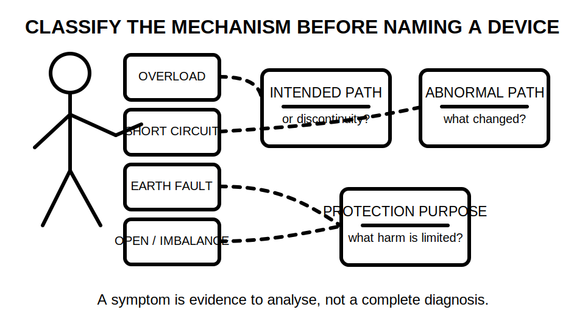
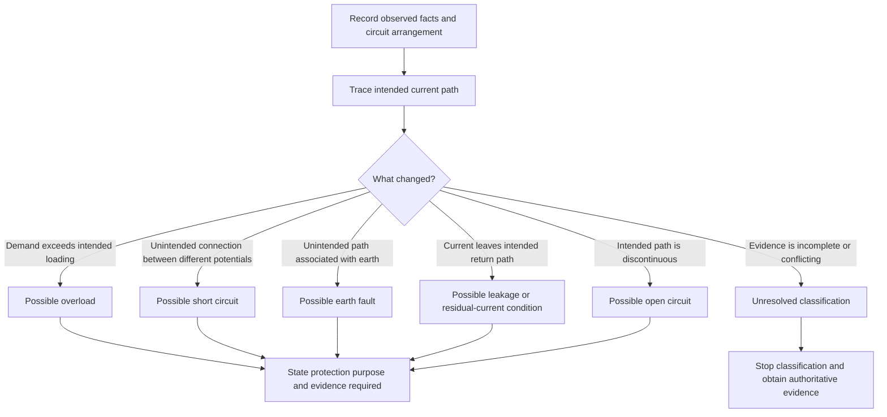
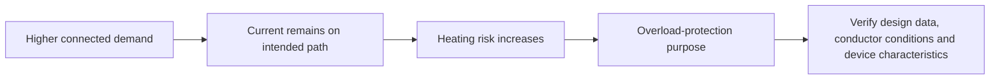

# Day 3 — Fundamental Protection Concepts and Fault Types

> **Currency notice:** This module provides an original conceptual framework for classifying abnormal electrical conditions and explaining the purpose of protective measures. It does not specify device ratings, disconnection times, test limits, installation procedures or authorised work methods. Verify all technical decisions against current authorised standards, legislation, regulator guidance, manufacturer information, network requirements, workplace procedures and RTO instructions.

## 1. Outcome and entry check

### Learning objectives

By the end of this block, the learner should be able to:

1. distinguish normal operation, overload, short circuit, earth fault, leakage current and open-circuit conditions from a written scenario;
2. identify the initiating condition, current path, likely consequence and intended protection purpose without guessing missing facts;
3. explain the difference between protection of people, conductors, equipment and continuity of supply;
4. avoid treating one protective measure as a universal response to every fault type;
5. use the **F-A-U-L-T** workflow to classify a paper-based scenario and identify the authoritative source family required for the next decision;
6. state when a scenario cannot be classified confidently because circuit arrangement, protective device data or fault-path evidence is missing;
7. produce a concise fault-classification record suitable for later device-coordination and verification work.

### Entry check

Answer without references, then rate confidence as **guessing**, **unsure**, **reasonably confident** or **certain**:

1. Is every current above normal load current a short circuit?
2. Can an earth fault exist without a person receiving an electric shock?
3. Does an RCD provide all required protection against overload?
4. What is the difference between a fault condition and its consequence?
5. Why must the current path be identified before selecting the relevant protection concept?

Record high-confidence errors. Do not convert this entry check into an unofficial pass mark.

## 2. Why it matters

Protection questions become unreliable when the learner begins with a device name instead of the abnormal condition. A familiar device may be relevant, but the reasoning must begin with what changed, where current can flow, what is exposed to harm and which protective purpose applies.

The same visible symptom can arise from different mechanisms. For example, loss of operation may result from an open circuit, a protective device operating, a control condition or a supply issue. Likewise, a protective device operating does not by itself prove the location or type of fault.

A defensible answer separates:

**initiating condition → current path → exposure or heating mechanism → consequence → protection purpose → evidence required**

This supports later work on overcurrent protection, RCDs, earthing, conductor selection, verification and fault finding.



## 3. Core concepts and terminology

### Normal operation

**Normal operation** is the intended state of a circuit or item of equipment within its designed and authorised operating conditions. Current follows the intended conductive path and remains within the conditions used for design and protection decisions.

### Abnormal condition

An **abnormal condition** is a departure from intended operation. It may be caused by excessive load, unintended connection, insulation failure, conductor discontinuity, equipment failure, environmental influence or another verified mechanism.

### Fault

A **fault** is an abnormal condition caused by failure, damage, incorrect connection or another defect that changes the intended electrical behaviour. The word does not identify the path or severity by itself.

### Overload

An **overload** is an overcurrent occurring in an electrically sound circuit because the connected demand or operating condition exceeds what the circuit is intended to carry. It is conceptually different from current caused by an unintended low-impedance connection.

### Short circuit

A **short circuit** is an unintended conductive connection between points that should be at different potentials, producing a current path whose magnitude is governed by the source and total path impedance. Exact prospective current and protective response require authorised data and calculation.

### Earth fault

An **earth fault** is an unintended conductive connection between a live part and earth, an exposed conductive part, a protective conductor or another conductive path associated with earth. The consequence depends on the complete fault path, earthing arrangement and operation of protective measures.

### Leakage current

**Leakage current** is current that flows by a path other than the intended load-current path, including through insulation, filtering components or capacitance. Some leakage may exist in normal operation. Whether it is acceptable, cumulative or indicative of a fault requires current authorised requirements and equipment information.

### Residual current

**Residual current** is the imbalance obtained when the currents in the relevant live conductors do not sum as expected. It can indicate current leaving the intended return path, but it does not by itself identify the exact location or cause.

### Open circuit

An **open circuit** is a discontinuity that prevents or restricts intended current flow. It may stop equipment operating, create intermittent operation or remove a required protective or control path. Absence of load current does not prove absence of hazardous voltage.

### Overcurrent

**Overcurrent** is current exceeding the applicable rated or design value. It is a broad category that can include overload current and fault current. The cause must be classified before applying a protection conclusion.

### Protection purpose

A **protection purpose** states what harm the measure is intended to prevent or limit. Common purposes include:

- limiting conductor or equipment heating;
- reducing the duration of a hazardous fault condition;
- providing additional protection for people in specified circumstances;
- containing or interrupting fault energy;
- preserving coordination or continuity where required.

No single measure should be assumed to satisfy every purpose.

### Fault-classification record

Use this original record:

```text
Observed symptom or stated condition:
Known circuit arrangement:
Initiating condition:
Intended current path:
Abnormal current path or discontinuity:
Fault category:
Possible consequences:
Relevant protection purpose:
Evidence still required:
Authorised source family:
Decision: classify / classify provisionally / stop and obtain evidence
```

## 4. Rule-finding workflow

Use **F-A-U-L-T** before naming a protection response.

1. **F — Fix the facts.** Record only the circuit arrangement, symptoms and conditions actually provided.
2. **A — Analyse the path.** Trace the intended current path and any stated abnormal path or discontinuity.
3. **U — Understand the mechanism.** Decide whether the evidence points to overload, short circuit, earth fault, leakage, residual imbalance, open circuit or an unresolved condition.
4. **L — Link the protection purpose.** State whether the immediate concern is heating, shock exposure, fault energy, equipment damage or another defined consequence.
5. **T — Test the evidence boundary.** Identify the authorised source, device data, circuit information or supervision needed before making a technical selection or practical decision.



The diagram is a classification aid. It does not establish device suitability, ratings, operating times or permission to inspect or test equipment.

## 5. Visual model or worked example

### Worked paper scenario

A fictional final subcircuit supplies several loads. The scenario states that the conductors and connections are intact, the connected demand has increased beyond the design assumption, and no unintended conductive connection is reported.

A weak response says: “It is a short circuit because the current is too high.”

A stronger response is:

| Reasoning element | Analysis |
|---|---|
| Known facts | The circuit is stated to be electrically intact and connected demand has increased |
| Intended path | Current still follows the intended active and return path |
| Initiating condition | Demand exceeds the condition used for design |
| Classification | The evidence points to overload rather than short circuit |
| Possible consequence | Excess heating may damage conductors, connections or equipment if the condition persists |
| Protection purpose | Limit damaging overcurrent and coordinate protection with the circuit design |
| Missing evidence | Actual design current, device characteristics, conductor capacity, installation conditions and authorised source requirements |
| Boundary | Do not select or alter a device from this conceptual scenario |



The critical distinction is not merely “high current.” It is whether the excessive current follows the intended path because of demand or follows an unintended path because of a fault.

### Contrast case

Change one fact: an unintended conductive connection is now stated between points at different potentials. The classification changes toward short circuit because the mechanism and path changed. The learner must not preserve the original answer simply because the symptom “high current” remains.

## 6. Practical application

### Fault-card sorting task

Complete six fictional paper-based fault cards. Include at least one of each:

1. increased connected demand with an otherwise intact circuit;
2. unintended connection between conductors at different potentials;
3. unintended connection from a live part to an earth-associated conductive path;
4. current imbalance with the exact leakage path unknown;
5. discontinuity in an intended current path;
6. ambiguous symptoms with insufficient evidence for classification.

For each card:

1. list the facts and explicitly mark assumptions;
2. sketch the intended current path using labels rather than conductor colours alone;
3. sketch or describe the abnormal path or discontinuity;
4. classify the condition, or state that classification is provisional;
5. identify at least one plausible consequence;
6. state the relevant protection purpose without naming a universal device;
7. identify the source family and technical data needed for the next decision;
8. state the practical boundary and stop condition.

### Assessment-focused completion criteria

The task is complete when the learner can:

- classify at least five cards without confusing symptom, mechanism and consequence;
- explain why overload and short circuit are both overcurrent conditions but arise from different mechanisms;
- distinguish earth-fault reasoning from a claim that shock has necessarily occurred;
- explain why residual current is evidence of imbalance rather than proof of a particular defect;
- refuse to force a classification when material facts are absent;
- use original language rather than reconstructing standards wording;
- identify which conclusions require authorised values or procedures.

### Worked-example fading

Use three stages:

1. first card: complete model with all reasoning fields shown;
2. second and third cards: headings provided, analysis completed by the learner;
3. remaining cards: learner creates the record independently.

After feedback, replace one card with a varied scenario that preserves the symptom but changes the current path. This tests transfer rather than memory of the answer.

## 7. Common errors and safety checkpoint

### Common errors

- **Starting with the device:** classify the abnormal condition and protection purpose before considering a device.
- **Calling every high-current event a short circuit:** determine whether current follows the intended path or an unintended connection.
- **Assuming an earth fault means a person has been shocked:** separate the fault path from the possible human exposure pathway.
- **Assuming no current means no danger:** an open circuit can coexist with hazardous voltage or a broken protective path.
- **Treating residual current as a complete diagnosis:** imbalance indicates current is not returning as expected; further evidence is required.
- **Using conductor colour as the only identifier:** diagrams and records must use functional labels because colours can be misapplied, altered or inaccessible.
- **Inferring device operation proves fault location:** operation is evidence to investigate, not proof of the initiating defect.
- **Replacing missing data with remembered limits:** mark `reference_check_required` and obtain current authorised information.

### Safety checkpoint

This module authorises no opening of equipment, removal of covers, resetting, isolation, proving, testing, fault creation, bridging, disconnection, repair, device replacement, alteration or energisation.

Stop and escalate when:

- the circuit arrangement or possible sources cannot be established;
- the proposed classification depends on inspection or testing outside current authority;
- protective-conductor, neutral or alternate-supply conditions are uncertain;
- device markings, manufacturer data or authorised requirements are unavailable;
- a learner is asked to create or simulate a real electrical fault;
- any proposed action could expose a person to live parts, stored energy, arc effects, unexpected movement or re-energisation;
- the scenario moves beyond paper-based analysis or an approved supervised training environment.

## 8. Retrieval and next links

### Recall questions

Answer without looking, then verify.

1. What is the difference between overcurrent and overload?
2. What feature distinguishes the conceptual path of a short circuit from an overload?
3. What is an earth fault?
4. Why does residual current not identify the exact defect?
5. What is an open circuit, and why can it still be hazardous?
6. What does each letter in F-A-U-L-T represent?
7. Why must protection purpose be stated before device selection?
8. Which missing facts should force provisional classification or escalation?

### Fresh application

A fictional circuit stops operating after a protective device operates. No information is provided about connected demand, insulation condition, conductor continuity, fault path, device characteristics or alternate supplies.

Write a response that:

1. states what is known;
2. lists at least four plausible but unproven mechanisms;
3. explains why device operation alone does not identify the fault;
4. identifies the authorised evidence needed next;
5. states a clear stop boundary.

Rate confidence before checking. Enter any high-confidence unsupported diagnosis into the error log.

### Navigation

- **Program:** [Six-Week Capstone Learning Plan](../MASTER_PLAN.md)
- **Previous:** [Day 2 — Hazard, Risk, Exposure and Critical Controls](day-02-hazard-risk-exposure-and-critical-controls.md)
- **Knowledge note:** [[Six-Week Day 03 - Fundamental Protection Concepts and Fault Types]]
- **Next:** [Day 4 — Overload and Short-Circuit Protection Reasoning](day-04-overload-and-short-circuit-protection-reasoning.md)

### References and review boundary

- Use current authorised standards and applicable legislation, regulator guidance, network requirements, manufacturer information, workplace procedures and RTO direction for technical decisions.
- Exact current thresholds, protective-device characteristics, disconnection requirements, fault-current calculations and verification procedures remain `reference_check_required`.
- This module is organised around fault classification and protection purpose rather than a standards clause sequence. It reproduces no standards table, figure or systematic clause wording.
- It remains `review-required`, has not received qualified technical review and must not be labelled `technically-reviewed`.
