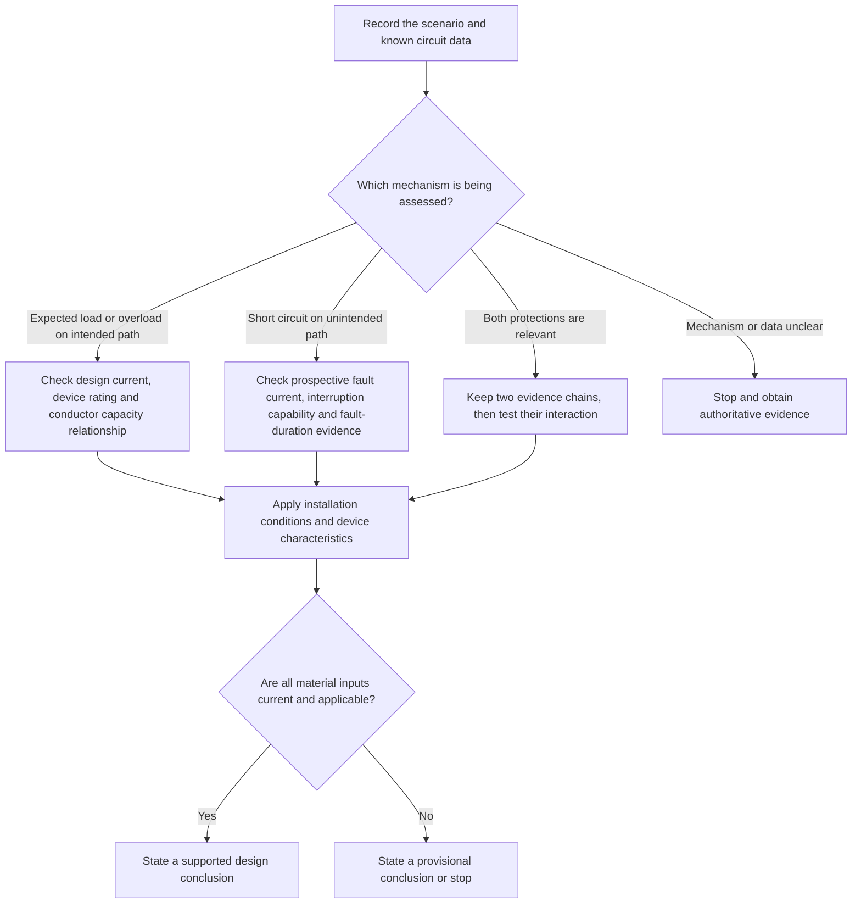
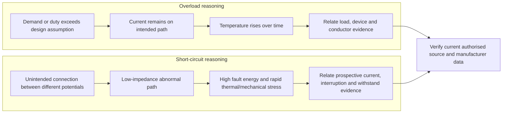

# Day 4 — Overload and Short-Circuit Protection Reasoning

> **Currency notice:** This module teaches an original reasoning process for separating overload protection from short-circuit protection and for identifying the evidence needed before a design conclusion. It does not provide device ratings, conductor capacities, fault-current values, breaking capacities, operating times, coordination limits or installation procedures. Verify every technical decision against current authorised standards, legislation, regulator guidance, network requirements, manufacturer data, workplace procedures and RTO instructions.

## 1. Outcome and entry check

### Learning objectives

By the end of this block, the learner should be able to:

1. distinguish overload current from short-circuit current using the initiating condition and current path rather than the symptom “high current”;
2. explain the different protection purposes associated with prolonged thermal stress and high-energy fault interruption;
3. identify the roles of design current, protective-device rating, conductor current-carrying capacity, prospective short-circuit current and device breaking capacity without substituting remembered values;
4. build an evidence chain showing which relationships must be checked for overload protection and which additional checks apply to short-circuit protection;
5. use the **C-L-E-A-R** workflow to analyse a fictional circuit-design scenario;
6. recognise when installation conditions, device data, conductor data, source impedance or fault-location information are missing;
7. state a safe stop boundary and mark unverified numerical or procedural claims `reference_check_required`;
8. produce a concise protection-reasoning record suitable for later cable-selection and verification modules.

### Entry check

Answer without references, then rate confidence as **guessing**, **unsure**, **reasonably confident** or **certain**:

1. Why can an overload occur in an electrically sound circuit?
2. Why is a short circuit not defined only by “very high current”?
3. Does a device that protects a conductor against overload automatically have adequate breaking capacity at every possible fault point?
4. What is the difference between a protective-device current rating and its breaking capacity?
5. Which installation conditions can change the conductor information needed for a design decision?
6. What should you do when a question supplies a load current but omits conductor installation conditions or protective-device characteristics?

Record high-confidence errors. Do not create an unofficial pass mark.

## 2. Why it matters

Overload and short-circuit protection are related because both concern overcurrent, but they are not interchangeable design checks.

An overload generally develops while current remains on the intended circuit path. The central concern is whether sustained current produces damaging temperature rise in conductors, connections or equipment. A short circuit creates an unintended conductive path between points at different potentials. The central concern includes rapid fault-current interruption, thermal and mechanical stress, and whether the protective device can safely interrupt the available fault current.

A weak answer often chooses a familiar device from load current alone. A defensible answer separates:

**operating demand → intended or unintended path → heating or fault-energy mechanism → conductor and device evidence → protection conclusion → unresolved checks**

This distinction supports later work on conductor selection, discrimination, earthing, fault-loop reasoning, verification and fault finding.


*Caption: Treat overload and short circuit as related but separate evidence chains; a current rating alone does not complete both checks.*

## 3. Core concepts and terminology

### Design current

**Design current** is the current expected for the circuit under the design assumptions used for load and duty. It is not automatically the measured current at every moment, and it does not by itself determine conductor or device suitability.

### Protective-device rated current

The **protective-device rated current** is the current value assigned to the device for its intended operating conditions. Its relationship to design current and conductor capacity must be checked using current authorised requirements and device information.

### Conductor current-carrying capacity

**Conductor current-carrying capacity** is the current a conductor can carry continuously under stated installation conditions without exceeding the applicable temperature limit. It depends on more than conductor cross-sectional area. Relevant conditions can include wiring method, ambient temperature, grouping, insulation, enclosure, thermal surroundings and other verified factors.

### Overload current

**Overload current** is overcurrent in an electrically sound circuit caused by connected demand or operating conditions exceeding the intended design condition. It normally follows the intended current path.

### Short-circuit current

**Short-circuit current** is fault current produced by an unintended conductive connection between points at different potentials. Its magnitude depends on the source and the total impedance of the fault path.

### Prospective short-circuit current

**Prospective short-circuit current** is the current expected to flow at a point if a short circuit of the relevant type occurs there, before considering the limiting effect of the protective device. The value is location- and system-dependent and requires authorised calculation or measurement methods.

### Breaking capacity

**Breaking capacity** is the maximum prospective fault current a protective device is designed to interrupt safely under stated conditions. It is not the same as the device’s normal current rating.

### Operating characteristic

A protective device’s **operating characteristic** describes how its response changes with current and time under specified conditions. Exact curves, tolerances and application rules require current manufacturer data and authorised requirements.

### Thermal stress

**Thermal stress** is heating produced by current over time. For overload reasoning, the concern is sustained temperature rise. For short-circuit reasoning, a large current may produce intense heating over a much shorter duration.

### Coordination

**Coordination** is the planned relationship among the load, conductors and protective devices so that the installation performs its intended protective functions without creating an unverified weak point. Coordination can include overload protection, short-circuit protection, breaking capacity and interaction with upstream or downstream devices. Exact coordination claims require authorised data.

### Protection-reasoning record

Use this original record:

```text
Scenario and circuit purpose:
Observed or stated load condition:
Intended current path:
Possible abnormal path:
Design current evidence:
Protective-device data available:
Conductor data and installation conditions available:
Overload-protection relationship to verify:
Prospective short-circuit evidence:
Breaking-capacity evidence:
Operating-characteristic or coordination evidence:
Missing facts and assumptions:
Authorised source family:
Decision: supported / provisional / stop and obtain evidence
Safety and authority boundary:
```

## 4. Rule-finding workflow

Use **C-L-E-A-R** before accepting a protection choice.

1. **C — Classify the current mechanism.** Decide whether the scenario concerns expected load, overload on the intended path, short circuit on an unintended path, or incomplete evidence.
2. **L — Link load, device and conductor.** Identify the design current, protective-device rating and conductor capacity evidence that must be related for overload reasoning.
3. **E — Establish fault evidence.** Identify prospective short-circuit current at the relevant point, device breaking capacity and any conductor fault-withstand or operating-characteristic evidence required.
4. **A — Apply conditions and dependencies.** Check installation conditions, device type, location, upstream/downstream relationships, manufacturer limits and source applicability.
5. **R — Record the boundary.** State the supported conclusion, missing evidence, authorised source to consult and the point at which design or practical action must stop.



The diagram prevents a common shortcut: using one current value as though it proves load suitability, conductor protection and fault interruption simultaneously.

## 5. Visual model or worked example

### Two-path visual model



The two paths meet at verification, not at assumption. Both require current, applicable data, but the inputs and protection purposes differ.

### Worked fictional scenario

A paper scenario describes a final subcircuit with a stated design current. It also supplies a proposed protective-device current rating, but omits conductor installation method, grouping, ambient conditions, device operating characteristic, prospective short-circuit current and breaking capacity.

A weak response says: “The device rating is above the load, so the circuit is protected.”

A stronger analysis is:

| Reasoning element | Analysis |
|---|---|
| Current mechanism | Normal-load and possible overload coordination can be considered; short-circuit adequacy cannot yet be concluded |
| Available evidence | Stated design current and proposed device current rating |
| Missing overload evidence | Conductor capacity under the actual installation conditions and applicable coordination requirements |
| Missing short-circuit evidence | Prospective short-circuit current, device breaking capacity, relevant operating characteristic and any required conductor fault-withstand evidence |
| Supported conclusion | The supplied information is insufficient for a complete protection decision |
| Next source step | Obtain current authorised requirements, conductor data for the installation conditions and manufacturer device data |
| Boundary | Do not select, replace or alter a device from the incomplete paper scenario |

### Changed-condition contrast

Now change one fact: the conductor is installed in a different thermal environment from the original assumption. Even though the design current and device label remain unchanged, the conductor-capacity evidence must be re-established. This tests whether the learner understands dependencies rather than memorising a numeric pattern.

## 6. Practical application

### Protection evidence-board task

Complete four fictional, de-energised paper scenarios:

1. **Load growth:** connected demand increases while the circuit remains electrically sound.
2. **Fault at the load end:** an unintended connection is stated at the remote end of a circuit.
3. **Fault near the source:** the same type of fault is moved to a point with different available fault-current conditions.
4. **Incomplete design card:** load current and device rating are supplied, but installation and fault data are missing.

For each scenario:

1. classify the current mechanism;
2. draw the intended path and any stated abnormal path;
3. state the overload-protection purpose;
4. state the short-circuit-protection purpose;
5. list the load, device and conductor evidence required;
6. list the prospective-current, interruption and operating-characteristic evidence required;
7. identify installation or location dependencies;
8. separate facts, assumptions and unresolved checks;
9. name the authorised source families needed;
10. state whether the conclusion is supported, provisional or stopped.

### Assessment-focused completion criteria

The task is complete when the learner can:

- classify all four scenarios without using “high current” as a complete diagnosis;
- explain why current rating and breaking capacity answer different questions;
- identify at least three installation conditions that can affect conductor data;
- explain why prospective short-circuit current varies by system and location;
- keep overload and short-circuit evidence chains separate until coordination is checked;
- reject at least one apparently plausible but unsupported design conclusion;
- use original language rather than reconstructing standards wording;
- mark all exact values and procedures requiring authorised verification.

### Worked-example fading

Use three levels:

1. scenario 1 includes a completed protection-reasoning record;
2. scenarios 2 and 3 provide headings but require the learner’s analysis;
3. scenario 4 provides only the raw facts and requires an independent record.

After feedback, repeat one scenario with a changed installation condition or fault location. Do not merely change numbers; change the dependency that controls the reasoning.

## 7. Common errors and safety checkpoint

### Common errors

- **Treating overload and short circuit as synonyms:** both are overcurrent conditions, but their initiating mechanisms and evidence requirements differ.
- **Selecting from design current alone:** conductor conditions and device characteristics remain material.
- **Confusing rated current with breaking capacity:** one relates to normal/current-carrying application; the other concerns safe interruption of prospective fault current.
- **Assuming a device label proves coordination:** complete manufacturer data and authorised application requirements are needed.
- **Ignoring fault location:** available fault current and path conditions can vary across the installation.
- **Assuming a larger device is safer:** increasing a rating can remove intended conductor protection or create another coordination problem.
- **Using an RCD as a substitute for all overcurrent checks:** additional protection and overcurrent protection have different purposes.
- **Reading one table in isolation:** applicability notes, installation conditions, dependencies and related requirements must be checked.
- **Inventing missing values:** mark `reference_check_required` and obtain current authorised evidence.

### Safety checkpoint

This module authorises no opening of equipment, removal of covers, isolation, proving, testing, fault creation, bridging, shorting, resetting, disconnection, device replacement, conductor alteration, energisation or measurement of prospective fault current.

Stop and escalate when:

- any proposed conclusion depends on live testing or practical work outside current authority;
- the circuit arrangement, supply sources or fault path are uncertain;
- device markings are incomplete or manufacturer data cannot be verified;
- conductor size, material, insulation, installation method, grouping or thermal environment are unknown;
- prospective short-circuit current or interruption capability is unverified;
- a proposed rating change is suggested without a complete design check;
- the learner is asked to create a fault or defeat a protective device;
- the task moves beyond paper-based analysis or an approved supervised training environment.

## 8. Retrieval and next links

### Recall questions

Answer without looking, then verify:

1. What distinguishes overload current from short-circuit current?
2. What does design current describe?
3. Why can conductor current-carrying capacity not be inferred from size alone?
4. What is prospective short-circuit current?
5. How does breaking capacity differ from rated current?
6. What does each letter in C-L-E-A-R represent?
7. Which evidence belongs primarily to overload reasoning?
8. Which additional evidence is needed for short-circuit reasoning?
9. Why can changing fault location change the design check?
10. Which missing facts require a provisional conclusion or stop decision?

### Fresh application

A fictional circuit card supplies a design current, a proposed device current rating and a conductor cross-sectional area. It omits installation method, ambient conditions, grouping, device characteristic, prospective short-circuit current and breaking capacity.

Write a response that:

1. identifies what can and cannot be concluded;
2. separates overload and short-circuit evidence chains;
3. lists the missing data in priority order;
4. identifies the authorised source families required;
5. states why choosing a device from the three supplied values would be unsafe reasoning;
6. records the practical stop boundary.

Rate confidence before checking. Add any high-confidence unsupported relationship to the error log for Day 5 correction.

### Navigation

- **Program:** [Six-Week Capstone Learning Plan](../MASTER_PLAN.md)
- **Previous:** [Day 3 — Fundamental Protection Concepts and Fault Types](day-03-fundamental-protection-concepts-and-fault-types.md)
- **Knowledge note:** [[Six-Week Day 04 - Overload and Short-Circuit Protection Reasoning]]
- **Next:** [Day 5 — Rest, Retrieval and Source-Navigation Correction](day-05-rest-retrieval-and-source-navigation-correction.md)

### References and review boundary

- Use current authorised standards, legislation, regulator guidance, network requirements, manufacturer information, approved workplace procedures and RTO direction for technical decisions.
- Exact current relationships, conductor capacities, correction factors, prospective fault-current methods, breaking capacities, operating characteristics, fault-duration limits, coordination requirements and test procedures remain `reference_check_required`.
- This module is organised around two learner evidence chains rather than a standards clause sequence. It reproduces no standards table, figure, device curve or systematic clause wording.
- It remains `review-required`, has not received qualified technical review and must not be labelled `technically-reviewed`.
