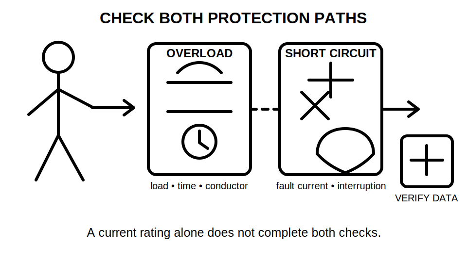
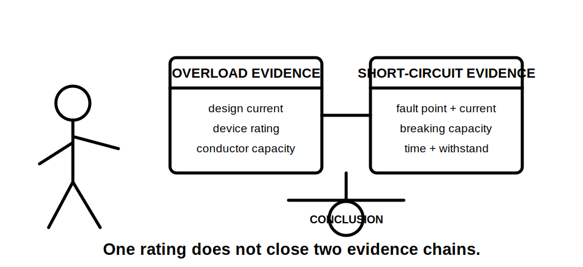
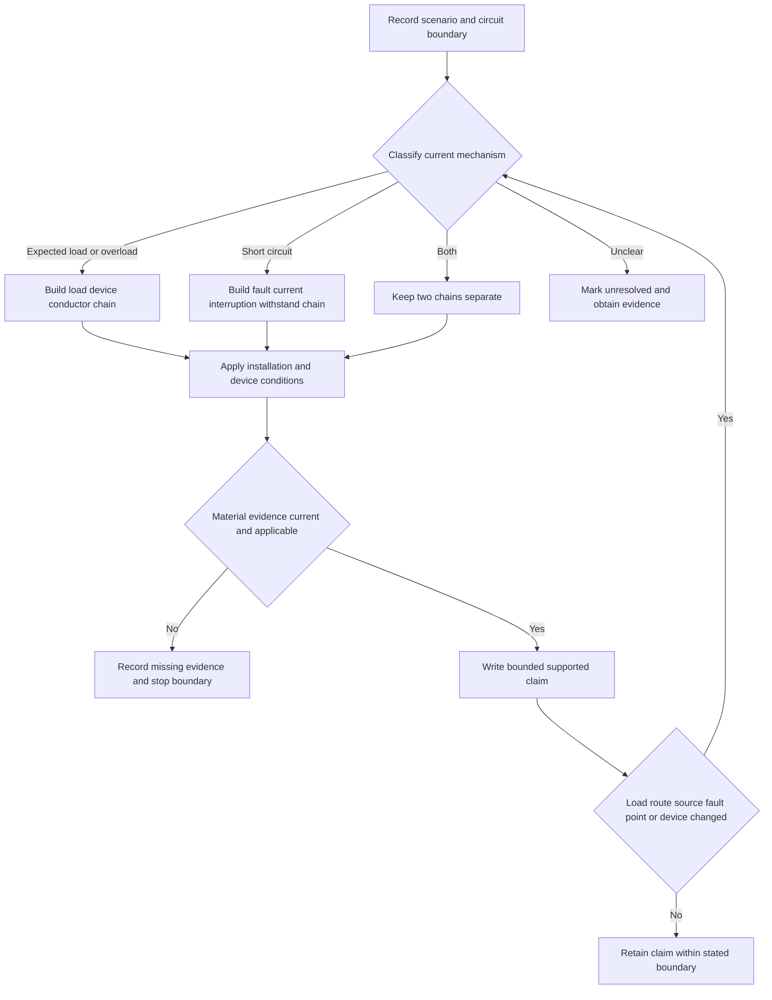
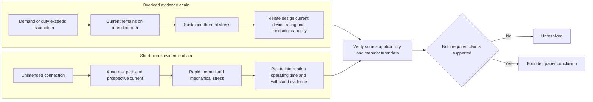

# Day 4 — Overload and Short-Circuit Protection Reasoning

> **Currency and safety notice:** This original module supports paper-based reasoning only. It does not provide device ratings, conductor capacities, correction factors, fault-current values, breaking capacities, operating times, coordination limits or practical procedures. Verify every technical decision against current authorised standards, legislation, regulator guidance, network requirements, manufacturer information, workplace procedures and RTO instructions. It is `review-required`, `reference_check_required` and not `technically-reviewed`.

## 1. Outcome and entry check

### Learning objectives

By the end of this block, the learner should be able to:

1. classify a stated overcurrent as expected load, overload, short circuit or unresolved by using the initiating condition and current path;
2. distinguish sustained thermal-stress reasoning from rapid fault-energy and interruption reasoning;
3. explain the roles of design current, protective-device rated current, conductor current-carrying capacity, prospective short-circuit current, breaking capacity and operating characteristic;
4. build separate overload and short-circuit evidence chains before testing their interaction;
5. apply the **C-L-E-A-R** workflow to a fictional design scenario without inventing missing values;
6. grade evidence as **stated**, **derived**, **manufacturer-verified**, **assumed** or **missing**;
7. grade a conclusion as **described**, **supported**, **verified** or **unresolved**;
8. reopen dependent conclusions when the load, conductor route, installation condition, fault location, source or protective device changes.

### Entry check

Answer without references, then rate confidence as **guessing**, **unsure**, **reasonably confident** or **certain**:

1. Why can an overload occur in an electrically sound circuit?
2. Why is a short circuit not defined only by “very high current”?
3. Does a device that protects a conductor against overload automatically have adequate breaking capacity at every possible fault point?
4. What is the difference between protective-device rated current and breaking capacity?
5. Which installation conditions can change conductor-capacity evidence?
6. Which conclusions must be reopened if the fault location moves closer to the source?

Record high-confidence unsupported answers in the error log. Do not create an unofficial pass mark.

## 2. Why it matters

Overload and short-circuit protection both concern overcurrent, but they answer different questions.

An overload generally develops while current remains on the intended circuit path. The concern is whether sustained current produces damaging temperature rise in conductors, connections or equipment. A short circuit creates an unintended conductive path between points at different potentials. The concern includes available fault current, rapid thermal and mechanical stress, interruption capability and the time for which stress persists.

The governing mental model is:

**initiating condition → intended or unintended path → current magnitude and duration → stress mechanism → applicable evidence → bounded conclusion**

A familiar device rating is not a complete protection argument. It does not by itself demonstrate conductor coordination, fault interruption, fault withstand or suitability under the actual installation conditions.

*Caption: Keep the overload and short-circuit evidence chains separate until their interaction is checked.*

*Caption: One label can answer one question while leaving the other unresolved.*

## 3. Core concepts and terminology

### Design current

**Design current** is the current expected for the circuit under the stated load and duty assumptions. It is an input to the design process, not proof of conductor or device suitability.

### Protective-device rated current

**Protective-device rated current** is the current value assigned to the device for stated operating conditions. Its relationship to design current and conductor capacity requires current authorised rules and applicable device data.

### Conductor current-carrying capacity

**Conductor current-carrying capacity** is the continuous current a conductor can carry under stated installation conditions without exceeding the applicable temperature limit. It depends on the complete installation context, not cross-sectional area alone.

### Overload current

**Overload current** is overcurrent in an electrically sound circuit caused by demand or operating conditions exceeding the design condition. It normally follows the intended current path.

### Short-circuit current

**Short-circuit current** is fault current produced by an unintended conductive connection between points at different potentials. Its magnitude depends on the source and total impedance of the fault path.

### Prospective short-circuit current

**Prospective short-circuit current** is the current expected at a stated point if a relevant short circuit occurs there, before considering the limiting action of the protective device. It is system- and location-dependent.

### Breaking capacity

**Breaking capacity** is the maximum prospective fault current a protective device is designed to interrupt safely under stated conditions. It is not the device’s normal current rating.

### Operating characteristic

An **operating characteristic** describes how a protective device responds to current over time under specified conditions. Exact curves, tolerances and application rules require authorised manufacturer data.

### Thermal and mechanical stress

**Thermal stress** is heating caused by current over time. **Mechanical stress** is physical force produced during a fault event. Both depend on the current path, magnitude, duration and assembly conditions.

### Coordination

**Coordination** is the planned relationship among load, conductors and protective devices so the required protective functions are achieved without an unverified weak point. Exact coordination claims require current authorised evidence.

### Evidence grades

Use five evidence grades:

1. **Stated** — supplied directly in the fictional scenario, drawing or schedule.
2. **Derived** — calculated from stated inputs using an authorised method that has been identified.
3. **Manufacturer-verified** — supported by applicable current device or assembly information.
4. **Assumed** — plausible but not evidenced.
5. **Missing** — required for the conclusion but unavailable.

### Claim grades

- **Described:** reports what the supplied material states.
- **Supported:** combines applicable evidence into a bounded paper conclusion.
- **Verified:** requires complete authorised evidence and qualified confirmation appropriate to the claim.
- **Unresolved:** a material evidence gap prevents the conclusion.

## 4. Rule-finding workflow

Use **C-L-E-A-R**:

1. **C — Classify the mechanism:** identify expected load, overload on the intended path, short circuit on an unintended path, both, or unresolved.
2. **L — Link load, device and conductor:** identify design-current, device-rating and conductor-capacity evidence required for overload reasoning.
3. **E — Establish fault evidence:** identify the relevant fault point, prospective current, interruption capability, operating characteristic and any required withstand evidence.
4. **A — Apply conditions and dependencies:** check installation method, thermal conditions, device type, location, source, upstream/downstream relationships and manufacturer limits.
5. **R — Record and reopen:** assign evidence and claim grades, state missing evidence and stop conditions, and reopen every dependent conclusion after a material change.

The workflow prevents one current value or device label from being used as proof for several different protection functions.

### Protection-reasoning record

For each conclusion, record:

- circuit and operating boundary;
- initiating condition and current path;
- fault point where relevant;
- design-current evidence;
- device-rating evidence;
- conductor and installation-condition evidence;
- prospective-current evidence;
- interruption and operating-characteristic evidence;
- evidence grade for each input;
- claim grade;
- missing evidence and authorised source family;
- reopening trigger;
- safety and authority boundary.

## 5. Visual model or worked example

The chains meet at verification, not at assumption. The inputs and protection purposes remain distinct even when one device contributes to both functions.

### Complete worked example

A fictional final subcircuit supplies a stated design current and proposed protective-device rated current. It omits conductor installation method, grouping, ambient conditions, device operating characteristic, prospective short-circuit current and breaking capacity.

| C-L-E-A-R step | Evidence-led response |
|---|---|
| Classify | Normal-load and overload coordination can be discussed; complete short-circuit adequacy cannot be concluded. |
| Link | Design current and proposed device rating are stated. Conductor capacity under actual conditions is missing. |
| Establish | Fault point, prospective current, breaking capacity and operating-characteristic evidence are missing. |
| Apply | Installation conditions, manufacturer applicability and upstream relationships remain unresolved. |
| Record and reopen | **Some inputs described; overload and short-circuit suitability unresolved.** A route, source, fault-point or device change reopens the relevant chain. |

### Worked-example fading

A second fictional circuit supplies conductor material, cross-sectional area, installation method and a device data sheet, but omits grouping, ambient conditions and the prospective current at the proposed device location.

Complete only these steps:

1. grade every supplied item;
2. classify which protection chain each item supports;
3. identify the missing evidence in priority order;
4. write one described claim and one unresolved claim;
5. state two changes that would reopen the analysis.

## 6. Practical application

### Protection evidence-board task

Complete four fictional paper scenarios:

1. connected demand increases while the circuit remains electrically sound;
2. an unintended connection is stated at the remote end of a circuit;
3. the same fault type is moved nearer the source;
4. load current and device rating are supplied, but installation and fault data are missing.

For each scenario:

1. classify the mechanism and draw the stated path;
2. build separate overload and short-circuit evidence chains;
3. grade each input;
4. identify installation, source and location dependencies;
5. name the authorised source families required;
6. write described, supported or unresolved claims;
7. record the reopening triggers and practical stop boundary.

### Assessment rubric

Score each category from **0 to 2**.

| Category | 0 | 1 | 2 |
|---|---|---|---|
| Mechanism and path | Mechanism guessed or paths confused | Mechanism partly classified | Initiating condition and intended/abnormal paths classified correctly |
| Overload chain | Device selected from one value | Some relationships identified | Load, device, conductor and installation evidence connected |
| Short-circuit chain | Rated current treated as interruption proof | Some fault evidence identified | Fault point, prospective current, interruption and withstand evidence connected |
| Evidence discipline | Assumptions presented as facts | Grades used inconsistently | Evidence and claim grades applied consistently |
| Change propagation | Material change ignored | Some conclusions reopened | Every dependent conclusion reopened and explained |
| Safety communication | Practical authority implied | General caution only | Clear stop conditions and bounded paper conclusion |

A score of **10/12 or higher** with no critical error indicates readiness for Day 5 retrieval work. This is an educational threshold, not an official assessment rule.

### Critical errors

Any of the following requires remediation regardless of score:

- treating overload and short circuit as interchangeable;
- treating rated current as breaking-capacity evidence;
- selecting a device from design current alone;
- inventing installation conditions or fault-current values;
- ignoring a changed source, route, fault point or protective device;
- claiming compliance, safe interruption or practical authority without authorised evidence.

## 7. Common errors and safety checkpoint

### Common errors

- treating every high-current symptom as the same mechanism;
- selecting from design current alone;
- confusing rated current with breaking capacity;
- treating a device label as complete coordination evidence;
- ignoring fault location and source changes;
- assuming a larger rating is automatically safer;
- using an RCD as a substitute for all overcurrent checks;
- reading one authorised table or data sheet without applicability conditions;
- retaining an earlier conclusion after a material dependency changes.

### Safety checkpoint

This module authorises no opening, cover removal, isolation, proving, testing, fault creation, bridging, shorting, resetting, disconnection, device replacement, conductor alteration, energisation or prospective-fault-current measurement.

Stop and escalate when:

- any conclusion depends on practical work outside current authority;
- the circuit boundary, source or fault path is uncertain;
- device markings or applicable manufacturer data cannot be verified;
- conductor material, insulation, route, grouping or thermal environment is unknown;
- prospective current or interruption capability is unverified;
- a rating change is proposed without reopening the complete design check;
- the task moves beyond paper analysis or an approved supervised training environment.

## 8. Retrieval and next links

### Closed-note retrieval

1. Distinguish overload current from short-circuit current by mechanism and path.
2. Define design current, conductor current-carrying capacity and prospective short-circuit current.
3. Distinguish rated current from breaking capacity.
4. Expand **C-L-E-A-R**.
5. Name the five evidence grades and four claim grades.
6. Which evidence belongs to the overload chain?
7. Which additional evidence belongs to the short-circuit chain?
8. Why can a changed fault location reopen the analysis?
9. State three stop conditions.

### Changed-scenario transfer

Re-attempt the practical task after changing one material condition: move the fault point, alter the conductor route, disclose an upstream device, or add another source. Do not reuse the earlier conclusion. Rebuild the affected evidence chain and state why each dependent claim reopens.

### Delayed retrieval

On Day 5, retrieve the two evidence chains and one high-confidence Day 4 error before opening this module. Correct only the failed dependency, then attempt a fresh scenario.

### Exit check

The learner is ready to continue when they can:

- apply **C-L-E-A-R** without inventing values;
- keep overload and short-circuit evidence chains distinct;
- distinguish evidence and claim grades;
- reopen affected conclusions after a material change;
- stop before unsupported design, compliance or safety claims.

### Navigation

- **Program:** [Six-Week Capstone Learning Plan](../MASTER_PLAN.md)
- **Previous:** [Day 3 — Fundamental Protection Concepts and Fault Types](day-03-fundamental-protection-concepts-and-fault-types.md)
- **Knowledge note:** [[Six-Week Day 04 - Overload and Short-Circuit Protection Reasoning]]
- **Next:** [Day 5 — Rest, Retrieval and Source-Navigation Correction](day-05-rest-retrieval-and-source-navigation-correction.md)

### References and review boundary

- Use current authorised standards, legislation, regulator guidance, network requirements, manufacturer information, approved workplace procedures and RTO direction for technical decisions.
- Exact relationships, conductor capacities, correction factors, prospective-current methods, breaking capacities, operating characteristics, fault-duration limits, coordination requirements and procedures remain `reference_check_required`.
- This module is organised around learner evidence chains rather than a standards clause sequence. It reproduces no standards table, figure, device curve or systematic clause wording.
- It remains `review-required`, safety-critical and not `technically-reviewed`.