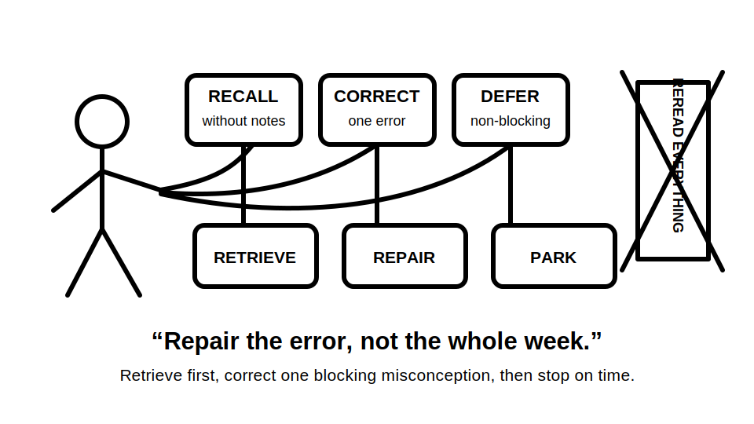
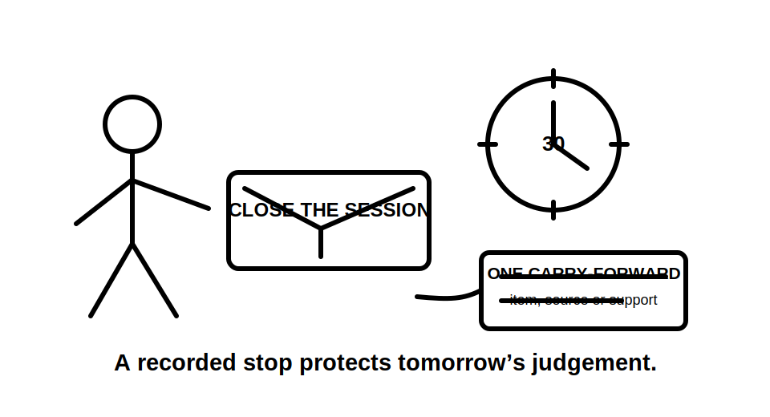
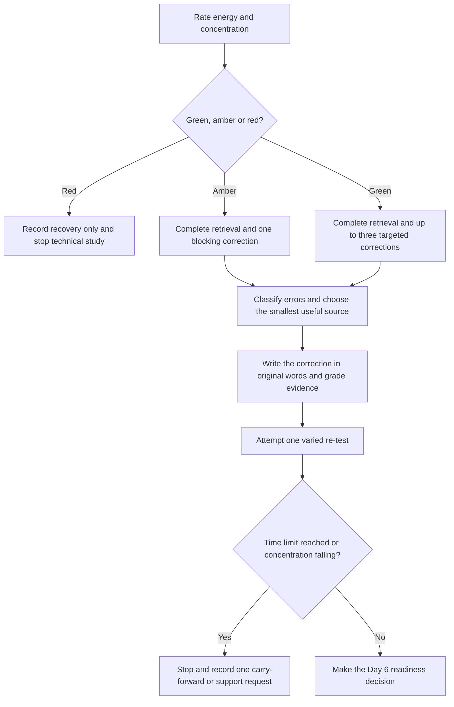
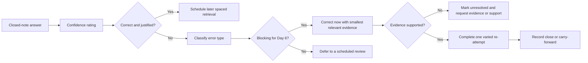

# Day 5 — Rest, Retrieval and Source-Navigation Correction

> **Purpose and safety notice:** This is a deliberate recovery and correction block. It introduces no new electrical procedure and authorises no electrical work, testing or equipment interaction. Its purpose is to retrieve Week 1 reasoning, repair selected misconceptions and improve source navigation while the material is still recent. Exact technical requirements remain `reference_check_required` and must be checked against current authorised sources. This module is not `technically-reviewed`.

## 1. Outcome and entry check

### Learning objectives

By the end of this block, the learner should be able to:

1. complete a closed-note retrieval set covering Days 1–4 in no more than 15 minutes;
2. classify each error as **memory lapse**, **concept confusion**, **source-navigation failure**, **unsupported assumption** or **unsafe action tendency**;
3. grade each correction record as **recalled**, **located**, **supported** or **unresolved**;
4. prioritise one blocking misconception and no more than two secondary corrections;
5. locate the appropriate authorised source family for at least four fictional questions without reconstructing standards wording;
6. correct one high-confidence error using a short explanation and a varied re-attempt;
7. stop catch-up at the stated time or fatigue boundary;
8. record a readiness decision for Day 6 as **ready**, **ready with one carry-forward item** or **not ready—recover and seek support**.

### Entry check

Before opening notes, rate current energy and concentration:

| Rating | Description | Action |
|---|---|---|
| **Green** | Alert, calm and able to explain ideas | Complete retrieval and up to three targeted corrections |
| **Amber** | Tired or distracted but still able to reason safely | Complete retrieval and one blocking correction only |
| **Red** | Repeated rereading, agitation, headache or inability to explain simple ideas | Record recovery only; stop technical study |

Then answer without notes:

1. Can you distinguish hazard, exposure pathway, consequence and risk?
2. Can you classify overload and short circuit by initiating condition and current path?
3. Can you distinguish device rated current from breaking capacity?
4. Can you identify when a source is current, applicable and authorised?
5. Which Week 1 answer are you least confident about?

Do not convert the energy rating into a moral judgement. Fatigue is a condition to manage, not evidence of poor commitment.

## 2. Why it matters

The first four days establish source, safety and protection distinctions that later modules depend on. Continuing while those distinctions remain blurred creates compounding errors. Typical examples include:

- remembering a device name but not the protection purpose;
- treating a search result or old note as authoritative;
- confusing “high current” with a complete fault classification;
- assuming a current rating proves breaking capacity;
- believing more study time automatically produces better recall;
- rereading whole modules instead of correcting the smallest failed distinction.

A recovery block protects learning quality in two ways. Spacing forces retrieval rather than recognition. A hard time boundary preserves the recovery needed for the next technical block.



*Caption: Repair the error, not the whole week. Retrieve first, correct one blocking misconception, then stop on time.*



*Caption: A recorded stop protects tomorrow’s judgement better than an exhausted extra hour.*

## 3. Core concepts and terminology

### Deliberate rest

**Deliberate rest** is a planned reduction in cognitive workload so attention, recall and judgement can recover. It is part of the learning design, not an empty day.

### Retrieval practice

**Retrieval practice** means producing an answer from memory before checking notes. Recognition while rereading is easier than recall and can create false confidence.

### Spaced retrieval

**Spaced retrieval** repeats important ideas after a delay. The delay makes recall harder but more informative because difficulty reveals what is not stable.

### Error log

An **error log** records the failed distinction, confidence level, correction evidence and varied re-attempt. It is not a list of topics to reread.

Use this entry format:

```text
Question or scenario:
My original answer:
Confidence before checking:
Error type:
Failed distinction:
Source family and location:
Evidence status:
Corrected explanation in my own words:
Varied re-attempt:
Result:
Carry forward, seek support or close:
```

### Blocking misconception

A **blocking misconception** is an error that will distort the next learning block or create unsafe reasoning. Examples include confusing protective purposes, treating assumptions as evidence or selecting practical action without authority.

### Secondary correction

A **secondary correction** is useful but not essential for beginning the next block. It may be parked for a later scheduled review if time or attention is limited.

### Source-navigation failure

A **source-navigation failure** occurs when the learner chooses the wrong source family, fails to check currency or applicability, or cannot explain why a source supports the claim.

### Unsupported assumption

An **unsupported assumption** is a claim presented as fact without sufficient scenario information or authorised evidence.

### Evidence statuses

Use four evidence statuses for each correction:

1. **Recalled** — produced from memory but not yet checked.
2. **Located** — the relevant source family and location have been found.
3. **Supported** — applicable evidence supports the corrected explanation within its stated boundary.
4. **Unresolved** — material information, applicability or qualified confirmation is missing.

A recalled answer is not automatically supported. An unresolved item is not a failure if the evidence gap is identified accurately.

### Readiness decision

A **readiness decision** is a bounded judgement about whether the learner can safely and productively start the next block. It is not an official assessment result.

## 4. Rule-finding workflow

Use **R-E-S-E-T**:

1. **R — Rate readiness.** Check energy, concentration and emotional load before technical retrieval.
2. **E — Extract from memory.** Complete the closed-note questions before opening references.
3. **S — Sort errors.** Classify each error and identify the single blocking misconception.
4. **E — Evidence-correct.** Use the smallest relevant module section and appropriate authorised source family; grade the result recalled, located, supported or unresolved.
5. **T — Test and terminate.** Attempt one varied question, record the result and stop at the time or fatigue boundary.



The workflow treats stopping as a valid learning decision. Extending a low-quality session is not automatically productive.

### Source-navigation correction sequence

For each question requiring an exact rule, procedure or value:

1. identify the claim being checked;
2. select the source family: authorised standard, legislation, regulator guidance, network requirement, manufacturer information, approved workplace procedure or RTO instruction;
3. confirm edition, date, jurisdiction, equipment and scenario applicability;
4. read surrounding scope, definitions, notes and cross-references;
5. record the source location without copying substantial wording;
6. explain the result in original language;
7. grade the evidence as located, supported or unresolved;
8. mark unresolved exact detail `reference_check_required`.

## 5. Visual model or worked example

### Error-to-correction model



The important distinction is between a wrong answer and the reason it was wrong. Correcting the answer alone may leave the misconception intact.

### Complete worked correction

A learner answers with high confidence:

> “A circuit-breaker current rating shows the maximum short-circuit current it can interrupt.”

A useful correction record is:

| Field | Entry |
|---|---|
| Error type | Concept confusion and unsupported assumption |
| Failed distinction | Rated current and breaking capacity answer different questions |
| Immediate source | Day 4 module for conceptual correction; current manufacturer data and authorised requirements for exact application |
| Evidence status | Supported for the conceptual distinction; unresolved for any particular installation |
| Corrected explanation | Rated current relates to stated normal-current application, while breaking capacity concerns safe interruption of prospective fault current under stated conditions |
| Varied re-attempt | A device label shows rated current but the scenario omits prospective fault current and breaking capacity; decide what can be concluded |
| Result | No complete short-circuit adequacy conclusion is supported |
| Carry forward | Revisit during the Day 7 checkpoint |

This example repairs the distinction without supplying an unverified rating, curve or value.

### Worked-example fading

A second learner says, “The old course note quotes a clause, so it is enough for today’s answer.” Complete only these fields:

1. error type;
2. failed distinction;
3. smallest immediate source;
4. authorised source family for exact confirmation;
5. evidence status;
6. one varied re-attempt;
7. close, carry forward or seek support.

## 6. Practical application

### Time-boxed recovery session

Maximum duration: **30 minutes**. Stop earlier for a red readiness rating or declining concentration.

#### Part A — closed-note retrieval, 12–15 minutes

Answer in short form:

1. Name three checks that make a source usable for a technical claim.
2. Distinguish hazard from exposure pathway.
3. Explain why a critical control requires verification.
4. Classify overload, short circuit, earth fault and leakage by path or mechanism.
5. State why “high current” is not a complete diagnosis.
6. Distinguish design current, protective-device rated current and conductor current-carrying capacity.
7. Distinguish rated current from breaking capacity.
8. State one situation where the correct conclusion is to stop and obtain evidence.
9. Name one high-confidence error from Days 1–4.
10. Identify the source family for a fictional manufacturer-specific device characteristic.

#### Part B — triage, 3–5 minutes

Mark each response:

- **secure** — correct, explained and supported;
- **fragile** — correct but uncertain or poorly explained;
- **incorrect** — wrong distinction or missing evidence;
- **unsafe** — suggests unauthorised action, invented values or unsupported certainty.

Choose one blocking item to correct now, up to two secondary items if green, and defer all remaining items.

#### Part C — targeted correction, 8–10 minutes

For each selected item:

1. name the failed distinction;
2. consult only the smallest relevant module section first;
3. identify the authorised source family for exact confirmation;
4. write a two-sentence correction in original language;
5. grade the evidence;
6. answer one varied question without notes;
7. record whether the item is closed, carried forward or requires support.

#### Part D — readiness decision, 2 minutes

Choose one:

- **Ready:** no blocking misconception remains and concentration is adequate.
- **Ready with one carry-forward item:** the remaining issue is recorded and does not prevent safe conceptual work on RCD purpose and limits.
- **Not ready—recover and seek support:** a critical safety or protection distinction remains confused, evidence is materially unresolved, or fatigue prevents reliable reasoning.

### Catch-up triage

Prioritise missed work as:

1. safety-critical misconception;
2. prerequisite required for Day 6;
3. high-confidence error;
4. incomplete retrieval task;
5. optional extension or formatting work.

Do not attempt to complete every missed page. The maximum catch-up period remains 30 minutes.

### Assessment rubric

Score each category from **0 to 2**.

| Category | 0 | 1 | 2 |
|---|---|---|---|
| Retrieval discipline | Opens notes before attempting recall | Mixed closed-note and open-note work | Completes bounded closed-note retrieval first |
| Error diagnosis | Records only right or wrong | Names a broad error type | Identifies the failed distinction and error mechanism |
| Source navigation | Uses an unverified or irrelevant source | Finds a plausible source family | Checks authority, currency, jurisdiction and applicability |
| Correction quality | Copies wording or changes the answer only | Gives a partial explanation | Explains in original words and grades evidence accurately |
| Transfer and confidence | Skips re-attempt or confidence check | Completes one incompletely | Completes a varied re-attempt and calibrates confidence |
| Recovery boundary | Continues through fatigue or exceeds the limit | Stops late or leaves no record | Stops on time and records close, carry-forward or support |

A score of **10/12 or higher** with no critical error indicates readiness to proceed to Day 6. This is an educational threshold, not an official assessment rule.

### Critical errors

Any of the following requires remediation regardless of score:

- treating a recalled answer as verified evidence;
- copying standards wording as the correction;
- inventing an exact rule, value or device characteristic;
- proposing practical action outside authority;
- ignoring a red readiness rating or the 30-minute maximum;
- concealing an unresolved safety-critical misconception;
- claiming an official pass or competency result.

## 7. Common errors and safety checkpoint

### Common errors

- **Rereading before retrieval:** this measures recognition more than recall.
- **Correcting too many items:** spreading attention across the whole week prevents deep repair of the blocking misconception.
- **Treating confidence as correctness:** high confidence increases the priority of a wrong answer.
- **Using the first search result:** authority, currency and applicability still require checking.
- **Copying source wording:** a useful correction explains the distinction in original language and records the authorised reference location.
- **Turning rest into a long catch-up session:** this removes the recovery the block is designed to provide.
- **Changing answers without recording why:** the same misconception can return in a different scenario.
- **Continuing through fatigue:** repeated rereading, irritability and loss of explanation quality are stop signals.
- **Using practical activity to prove a concept:** this block is paper-based and authorises no field action.

### Safety checkpoint

This block authorises no opening of equipment, isolation, proving, testing, fault creation, bridging, resetting, disconnection, replacement, alteration, energisation or measurement.

Stop technical study when:

- the readiness rating is red;
- attention is falling and the same sentence is being reread repeatedly;
- a correction depends on an unverified exact value, clause, procedure or device characteristic;
- the learner proposes practical action outside current authority;
- a safety-critical distinction remains confused after one targeted correction;
- anxiety, frustration or fatigue is affecting judgement;
- the 30-minute maximum has been reached.

A stopped session should record the unresolved item and the qualified person, authorised source or later module needed. It should not be hidden as incomplete work.

## 8. Retrieval and next links

### End-of-block recall

Without notes, answer:

1. What does each letter in R-E-S-E-T represent?
2. Why is retrieval completed before rereading?
3. What makes a misconception blocking?
4. Which five error types are used in this module?
5. What are the four evidence statuses?
6. What is the maximum catch-up duration?
7. Which signs require technical study to stop?
8. What must an error-log entry include?
9. Which readiness outcomes permit Day 6 to begin?
10. Why is “not ready” sometimes the competent conclusion?

### Changed-scenario transfer

A fictional learner remembers that an RCD responds to residual current but cannot explain what protection it does not replace. They are amber for concentration and have two unrelated formatting tasks outstanding.

Write the Day 5 decision:

1. classify the RCD gap as blocking or secondary for Day 6;
2. choose the smallest correction source;
3. identify the authorised source family for exact confirmation;
4. grade the evidence;
5. state what work is deferred;
6. set the maximum study duration and stop condition;
7. record the readiness outcome.

### Delayed retrieval

At the start of Day 7, repeat three Day 5 questions without notes: one source-applicability question, one protection-purpose distinction and one stop-decision scenario. Reopen the error log if confidence exceeds evidence quality.

### Navigation

- **Program:** [Six-Week Capstone Learning Plan](../MASTER_PLAN.md)
- **Previous:** [Day 4 — Overload and Short-Circuit Protection Reasoning](day-04-overload-and-short-circuit-protection-reasoning.md)
- **Knowledge note:** [[Six-Week Day 05 - Rest Retrieval and Source-Navigation Correction]]
- **Next:** [Day 6 — RCD Purpose, Limits and Coordination with Other Protection](day-06-rcd-purpose-limits-and-coordination-with-other-protection.md)

### References and review boundary

- Use current authorised standards, legislation, regulator guidance, network requirements, manufacturer information, approved workplace procedures and RTO instructions for exact technical claims.
- This module relies on original retrieval, triage and remediation activities. It reproduces no standards table, figure, systematic clause wording or source PDF content.
- Exact technical requirements encountered during correction remain `reference_check_required`.
- This module remains `review-required`, has not received qualified technical review and must not be labelled `technically-reviewed`.
