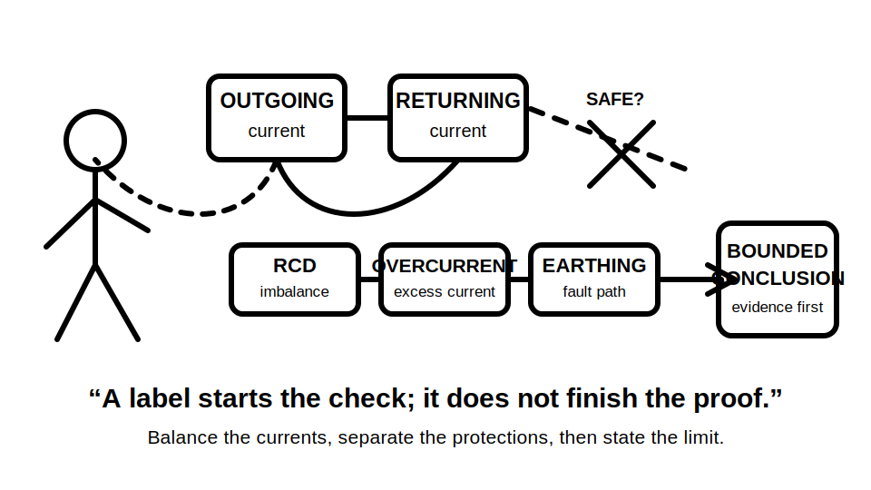
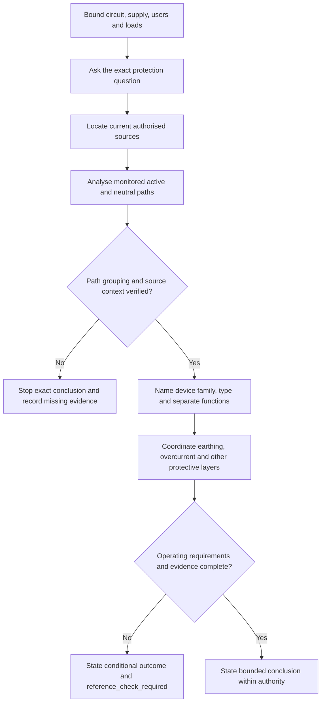
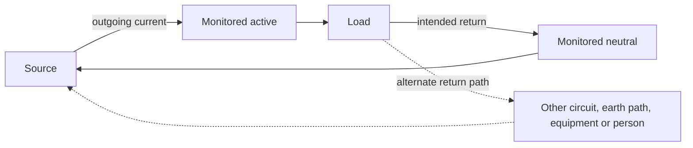
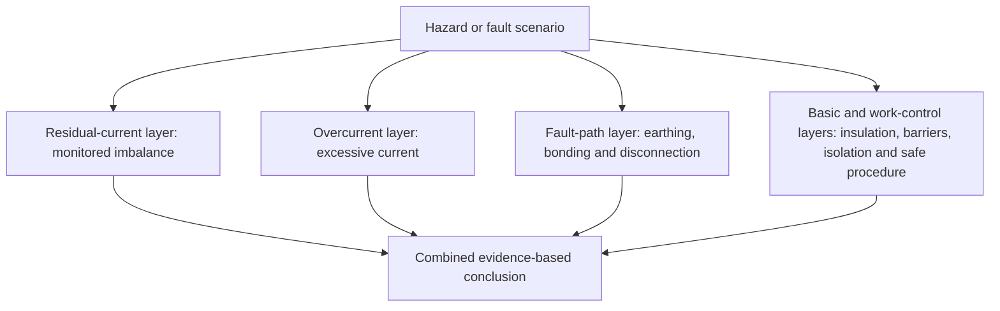

# Day 6 — RCD Purpose, Limits and Coordination with Other Protection

> **Currency and safety notice:** This module teaches an original paper-based model for residual-current protection. It does not state a universal circuit list, device type, residual-current setting, operating time, test sequence, exception, installation method or official assessment answer. Exact requirements must be checked against current authorised standards, legislation, regulator guidance, manufacturer information, approved workplace procedures and RTO instructions. This module is `review-required`, not `technically-reviewed`, and authorises no electrical work or testing.

## 1. Outcome and entry check

### Learning objectives

By the end of this block, the learner should be able to:

1. define **residual current**, **current balance**, **RCD**, **additional protection**, **protective earthing**, **overcurrent protection**, **combined protective device**, **RCD type**, **unwanted operation** and **selectivity** in original words;
2. draw a simple monitored-conductor model showing outgoing and returning current and one alternate return path;
3. explain why an RCD responds to monitored-current imbalance rather than identifying “earth” as a destination;
4. distinguish the residual-current, overcurrent and fault-path questions in at least three fictional scenarios;
5. apply the **B-A-L-A-N-C-E** workflow to identify the protection objective, conductor-path evidence, device evidence and unresolved assumptions;
6. identify at least six limits of the claim “the circuit has an RCD, therefore it is safe”;
7. explain why a combined device still requires separate reasoning about residual-current and overcurrent functions;
8. produce a bounded conclusion that marks exact unverified requirements `reference_check_required`;
9. score at least 10 out of 12 on the module rubric with no zero in current-balance reasoning, protection boundaries or safety and uncertainty.

### Entry check

Answer without notes and rate confidence as **guessing**, **unsure**, **reasonably confident** or **certain**:

1. Which currents does an RCD compare in a simple single-phase conceptual model?
2. Does every current through a person necessarily create an imbalance visible to an RCD?
3. Does a standard RCD function by itself establish overload protection?
4. Why can a neutral connected to the wrong protected group cause operation or misleading behaviour?
5. What does protective earthing contribute that residual-current protection does not prove?
6. Why might connected electronic equipment affect device selection or unwanted operation?
7. What evidence would be needed before calling an RCD operation a device fault?

Record any high-confidence claim that an RCD prevents all electric shock, replaces earthing, or replaces overcurrent protection as a blocking misconception.

## 2. Why it matters

An RCD can reduce risk by disconnecting when current does not return through the expected monitored live-conductor path. That is a specific protective function, not a complete declaration that an installation, circuit or work activity is safe.

Weak reasoning often begins with a label:

- “RCD protected”;
- “safety switch fitted”;
- “RCBO installed”;
- “test button works.”

A defensible answer begins with the protection question and the evidence chain:

1. What hazard or failure mode is being considered?
2. What currents are monitored?
3. What alternate path could create residual current?
4. Which protective function is expected from the device?
5. Which functions remain dependent on earthing, bonding, insulation, enclosures, overcurrent protection, isolation or safe work controls?
6. Are the device type, conductor arrangement, connected loads, coordination and verification evidence known?

*Caption: A device label starts the investigation; it does not finish the proof.*

## 3. Core concepts and terminology

### Current balance

**Current balance** is the condition in which the vector sum of currents passing through the device's monitored live conductors is approximately zero under normal operation. In a simple conceptual single-phase circuit, current leaving on active returns on neutral.

### Residual current

**Residual current** is the difference between the currents passing through the monitored live conductors. It appears when some current returns by a path outside that monitored group.

The alternate path might involve exposed conductive parts, protective earthing, another circuit, filters, capacitance, moisture, damaged insulation or a person. The RCD detects the imbalance; it does not identify the physical route or cause.

### Residual current device

A **residual current device (RCD)** is a switching device designed to open a circuit when residual-current operating conditions are reached. Exact device requirements, characteristics and applications remain `reference_check_required`.

### Additional protection

**Additional protection** is supplementary protection used in addition to basic protection and fault protection. It does not authorise omission of insulation, barriers, enclosures, protective earthing, bonding, automatic disconnection, isolation or safe work practices.

### Protective earthing

**Protective earthing** connects relevant conductive parts to the earthing system so a fault-current path can support the intended protective response under the applicable conditions. An RCD can complement this system but does not prove continuity, connection quality or compliance.

### Overcurrent protection

**Overcurrent protection** addresses excessive current conditions such as overload and short circuit. Residual-current and overcurrent functions answer different questions. A device containing both functions still requires each function to be assessed against its own evidence.

### Combined protective device

A **combined protective device**, commonly described as an RCBO, contains residual-current and overcurrent functions in one unit. The shared enclosure does not merge the technical questions. Rated current, breaking capacity, time-current behaviour, residual-current characteristics, load compatibility and coordination remain separate evidence needs.

### RCD type

An **RCD type** identifies the residual-current waveform conditions the device is designed to detect. Loads containing rectifiers, electronic power conversion, drives, inverters, chargers or filters may influence waveform and leakage behaviour. Exact selection must be supported by current authorised requirements and manufacturer information.

### Unwanted operation

**Unwanted operation** describes disconnection where investigation does not confirm a hazardous fault requiring that response. This is not a diagnosis. Possible contributors include accumulated leakage, incorrect neutral grouping, switching effects, moisture, damaged equipment, unsuitable device selection or an actual fault not yet located.

### Selectivity

**Selectivity** is coordination intended to limit disconnection to the protective device closest to the relevant fault while preserving appropriate continuity elsewhere. It depends on the complete arrangement and verified characteristics, not labels alone.

### Three protection questions

Keep these questions separate:

1. **Residual-current question:** Is current leaving the monitored live-conductor group by another path?
2. **Overcurrent question:** Are conductors and equipment protected against excessive current under the relevant conditions?
3. **Fault-path question:** Are earthing, bonding and automatic disconnection arrangements present and effective as required?

A strong answer may discuss all three, but it never substitutes one for another.

## 4. Rule-finding workflow

Use **B-A-L-A-N-C-E**.

1. **B — Bound the scenario.** Record circuit purpose, location, users, supply arrangement, connected equipment, environmental conditions and any alternate supply.
2. **A — Ask the protection question.** State whether the issue concerns residual current, overload, short circuit, fault-current return, additional protection, continuity of supply or several separate questions.
3. **L — Locate current authorised sources.** Use the applicable standard, legislation, regulator guidance, manufacturer information, approved design, workplace procedure and RTO instruction.
4. **A — Analyse all monitored paths.** Identify which live conductors pass through the device, how current should return and whether neutrals or sources could bypass or cross the monitored group.
5. **N — Name the device evidence.** Record device family, markings, manufacturer data, RCD type, separate overcurrent characteristics and stated installation context without inferring missing facts.
6. **C — Coordinate the protective layers.** Check what remains dependent on earthing, bonding, insulation, enclosures, isolation, upstream or downstream devices and load behaviour.
7. **E — Evidence the conclusion.** Separate observed facts, authorised technical evidence and assumptions; state stop conditions and mark exact unresolved details `reference_check_required`.

The two stop branches are valid outcomes. They prevent a familiar device label from becoming unsupported certainty.

### Evidence grades

Use three grades:

- **Grade A — scenario fact or observation:** stated circuit purpose, visible marking, authorised drawing detail or recorded result supplied by the scenario.
- **Grade B — authorised technical evidence:** current requirement, manufacturer instruction, approved design or competent reviewer direction that applies to the scenario.
- **Grade C — assumption:** guessed circuit identity, presumed device type, inferred neutral grouping, unverified exception or unsupported cause of operation.

Grade C evidence may generate a question or hypothesis. It must not support an exact safety-critical conclusion.

## 5. Visual model or worked example

### Balanced and alternate return paths

The solid loop represents current leaving and returning through the monitored group. The dashed route represents current returning outside that group. The model explains imbalance only; it is not a wiring diagram, test instruction or claim about a particular device's operating point.

### Protection-layer comparison

The diagram shows coordination without implying that every layer uses the same device or evidence. A conclusion is only as strong as the weakest relevant unverified layer.

### Worked reasoning example

**Scenario:** A fictional switchboard schedule states that two final subcircuits are supplied through a combined protective device. After a new electronic appliance is connected, the device operates intermittently. The scenario includes the device label and circuit names but no conductor-routing evidence, manufacturer application data or authorised test results.

Apply B-A-L-A-N-C-E:

1. **Bound:** identify both circuits, the new appliance, timing of operation, supply arrangement and any alternate sources. Do not assume the schedule proves physical conductor routing.
2. **Ask:** separate possible residual-current operation from overcurrent operation and from a fault-path concern.
3. **Locate:** identify current requirements and manufacturer information needed for the device and appliance.
4. **Analyse:** seek evidence that all required live conductors pass through the correct device and neutrals are not shared or crossed.
5. **Name:** record the combined device's stated functions, but do not infer type suitability or cause from its front label alone.
6. **Coordinate:** consider accumulated leakage, load behaviour, overcurrent conditions, earthing and continuity consequences as separate hypotheses.
7. **Evidence:** conclude only that several causes remain possible and authorised investigation is required.

A bounded conclusion is:

> The supplied facts show operation of a combined protective device after a load change, but they do not establish which protective function operated or why. Conductor grouping, device and load compatibility, residual-current conditions, overcurrent conditions, earthing evidence and authorised test results remain incomplete. No replacement, reset or compliance conclusion is justified from the stated evidence.

## 6. Practical application

### Round 1 — supported classification

Use a trainer-supplied fictional paper scenario containing:

- one source;
- one protected final subcircuit;
- a simple active and neutral path;
- a stated protective-earthing connection;
- an RCD or combined protective device;
- one load with basic manufacturer information;
- three supplied facts and three deliberate information gaps.

Produce:

1. a current-balance sketch;
2. a list of residual-current, overcurrent and fault-path questions;
3. a B-A-L-A-N-C-E evidence table;
4. Grade A, B or C beside every material claim;
5. at least four limits of the installed-device conclusion;
6. a bounded outcome and stop condition.

### Round 2 — worked-example fading

Repeat with the following prompts removed:

- which conductors are monitored;
- which protective function may have operated;
- which source family confirms device compatibility;
- which facts are assumptions.

The learner must reconstruct these questions independently.

### Round 3 — changed-context transfer

Change the scenario by adding two of the following:

- another protected group with an uncertain neutral arrangement;
- an inverter or alternate source;
- several electronic loads with possible accumulated leakage;
- incomplete device markings;
- moisture reported near connected equipment;
- an upstream and downstream RCD arrangement;
- a person proposing repeated resets without investigation.

Explain:

1. which new hypotheses appear;
2. which earlier assumptions are no longer safe;
3. which evidence priority changes first;
4. which protection layers must remain separate;
5. why the learner must stop rather than test or alter the installation.

### Performance rubric

Score each category **0–2**.

| Category | 0 | 1 | 2 |
|---|---|---|---|
| Current-balance reasoning | Says “detects earth” only or draws an incorrect path | Recognises imbalance but omits monitored-path detail | Clearly explains outgoing, returning and alternate paths |
| Protection boundaries | Treats RCD as universal protection | Names another layer without clear distinction | Separates residual-current, overcurrent, fault-path and work-control layers |
| Scenario and source control | Uses generic assumptions | Records some context or sources | Bounds supply, loads, users and applicable authorised sources |
| Conductor and device evidence | Assumes grouping or suitability from labels | Identifies one missing check | Analyses monitored conductors, neutral grouping, device family, type and separate functions |
| Coordination and transfer | Gives one-device answer | Mentions another protective measure | Explains interaction and adapts priorities when the scenario changes |
| Safety and uncertainty | Proposes unauthorised action or false certainty | Includes general caution | States authority boundary, stop conditions, assumptions and exact reference checks |

A score below **10/12**, or any zero in **current-balance reasoning**, **protection boundaries** or **safety and uncertainty**, requires targeted correction and a varied re-attempt. This is an educational rubric, not an official RTO pass mark.

## 7. Common errors and safety checkpoint

### Common errors

- **“The RCD detects electricity going to earth.”** The device detects imbalance in monitored live conductors; the alternate path must be investigated separately.
- **“An RCD stops every electric shock.”** Some current paths may not create the expected monitored imbalance, and no protective device removes the need for other protections and safe work controls.
- **“An RCD replaces protective earthing.”** Residual-current protection does not prove the protective-earthing path or its effectiveness.
- **“An RCD provides overload and short-circuit protection.”** Only a device with the relevant separate functions can address those conditions, and each function requires evidence.
- **“An RCBO label proves the whole circuit is correctly protected.”** A combined enclosure does not prove ratings, breaking capacity, residual-current type, conductor arrangement, coordination or installation compliance.
- **“The test button proves the installation is safe.”** A built-in functional check does not prove all conductors, earthing, load compatibility or the whole installation.
- **“Operation means the RCD is faulty.”** Device operation is an observation, not a cause diagnosis.
- **“Repeated resetting is a reasonable diagnostic.”** Repeated operation without evidence may indicate a fault or unsuitable condition and requires authorised investigation.
- **“Neutral is harmless because it is near earth potential.”** Neutral is a live conductor in the electrical sense relevant to circuit arrangement and must not be treated as protective earth.
- **“A typical household diagram applies to every supply.”** Alternate sources and different supply arrangements can change the analysis.

### Safety checkpoint

This module authorises no opening, isolation, proving, testing, fault creation, bridging, resetting, disconnection, replacement, alteration, energisation, measurement or commissioning.

Stop and seek qualified guidance when:

- conductor routing or neutral grouping is uncertain;
- an alternate or multiple supply may be present;
- exposed live parts, damage, moisture, burning, overheating or repeated operation are reported;
- device markings or manufacturer information are incomplete;
- exact operating requirements, test methods or exceptions are needed;
- the proposed conclusion depends on an assumed current path;
- a person proposes bypassing, repeated resetting or device replacement without an authorised investigation;
- the learner cannot keep residual-current, overcurrent and fault-path functions separate.

The safe educational action is to record the evidence gap and escalation need, not to create a practical test.

## 8. Retrieval and next links

### End-of-block recall

Answer without notes:

1. Define residual current without using the phrase “current to earth.”
2. What does an RCD compare?
3. Why is the alternate path not identified by the device alone?
4. What are the three protection questions?
5. What does each letter in B-A-L-A-N-C-E represent?
6. Why does a combined device still require separate function checks?
7. Name four possible contributors to unwanted operation.
8. Why can incorrect neutral grouping affect operation?
9. What does a test button not prove?
10. Which exact details remain `reference_check_required`?
11. State three stop conditions.
12. Give a bounded response to “the circuit has an RCD, so it is safe.”

### Fresh transfer

A fictional circuit has a visible combined device, an electronic load and a schedule stating “RCD protected.” The neutral path is not shown, the supply arrangement is incomplete, and no manufacturer or test evidence is supplied.

Write a six-sentence response that:

1. identifies the residual-current question;
2. states a separate overcurrent question;
3. states a separate fault-path question;
4. names the missing conductor and source evidence;
5. refuses an exact compliance or operating conclusion;
6. records the safe stop and escalation boundary.

### Navigation

- **Program:** [Six-Week Capstone Learning Plan](../MASTER_PLAN.md)
- **Previous:** [Day 5 — Rest, Retrieval and Source-Navigation Correction](day-05-rest-retrieval-and-source-navigation-correction.md)
- **Knowledge note:** [[Six-Week Day 06 - RCD Purpose Limits and Coordination with Other Protection]]
- **Next:** [Day 7 — Week 1 Protection Decision Checkpoint](day-07-week-1-protection-decision-checkpoint.md)

### References and review boundary

- AS/NZS 3000: use a current authorised copy and applicable amendments for exact requirements.
- Use current legislation, regulator guidance, manufacturer information, approved workplace procedures and RTO instructions as applicable.
- This module uses original explanations, scenarios, workflows, diagrams and assessment activities. It reproduces no standards table, figure, systematic clause wording, device curve or source PDF content.
- Exact circuit coverage, device types, residual-current values, operating times, test sequences, permitted arrangements, exceptions and jurisdiction-specific requirements remain `reference_check_required`.
- This module remains `review-required`, has not received qualified technical review and must not be labelled `technically-reviewed`.
