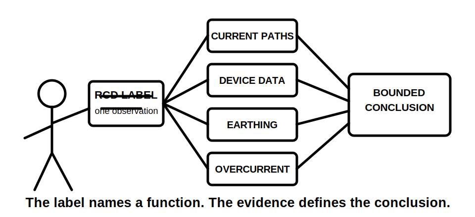
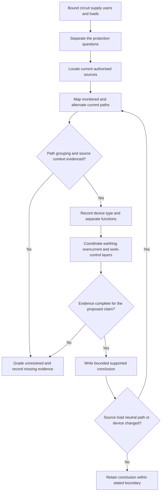
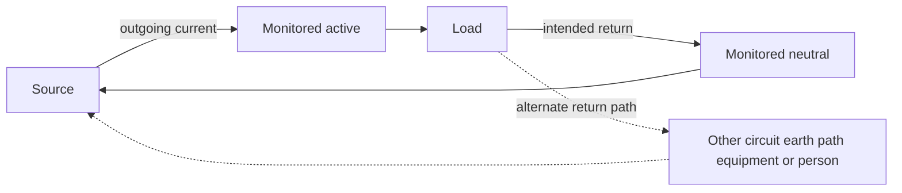

# Day 6 — RCD Purpose, Limits and Coordination with Other Protection

> **Currency and safety notice:** This original module supports paper-based reasoning only. It does not provide a universal circuit list, device type, residual-current setting, operating time, test sequence, exception, installation method or official assessment answer. Exact requirements must be checked against current authorised standards, legislation, regulator guidance, manufacturer information, approved workplace procedures and RTO instructions. It is `review-required`, not `technically-reviewed`, and authorises no electrical work or testing.

## 1. Outcome and entry check

### Learning objectives

By the end of this block, the learner should be able to:

1. define **current balance**, **residual current**, **RCD**, **additional protection**, **protective earthing**, **overcurrent protection**, **combined protective device**, **RCD type**, **unwanted operation** and **selectivity**;
2. draw a monitored-conductor model showing intended and alternate return paths;
3. explain why an RCD detects monitored-current imbalance rather than identifying the alternate path;
4. separate residual-current, overcurrent, fault-path and work-control questions in three fictional scenarios;
5. apply **B-A-L-A-N-C-E** without inventing conductor routing, device suitability or cause of operation;
6. grade evidence as **observed**, **documented**, **manufacturer-verified**, **assumed** or **missing**;
7. grade conclusions as **described**, **supported**, **verified** or **unresolved**;
8. identify when changed loads, neutral grouping, supply arrangements or device information reopen an earlier conclusion;
9. score at least 10/12 on the educational rubric with no critical error.

### Entry check

Answer without notes and rate confidence as **guessing**, **unsure**, **reasonably confident** or **certain**:

1. Which conductors does an RCD compare in a simple conceptual single-phase model?
2. Does every current path through a person necessarily create a detectable imbalance?
3. Does an RCD function by itself prove overload or short-circuit protection?
4. Why can a neutral connected to the wrong protected group affect operation?
5. What does protective earthing contribute that RCD presence does not prove?
6. Why can electronic loads affect selection or unwanted operation?
7. What evidence is needed before calling an operation a device fault?

Treat any high-confidence claim that an RCD prevents every shock, replaces earthing or replaces overcurrent protection as a blocking misconception.

## 2. Why it matters

An RCD can reduce risk by disconnecting when current does not return through the expected monitored live-conductor group. That is one protective function, not a complete declaration that a circuit, installation or work activity is safe.

A label such as “RCD protected”, “safety switch”, “RCBO” or “test button works” is evidence about a device or observation. It does not prove:

- the monitored conductors are grouped correctly;
- the device type suits the connected loads;
- overload and short-circuit requirements are satisfied;
- earthing and bonding are effective;
- upstream and downstream devices coordinate;
- an operation's cause is known;
- an installation is safe to access, reset or alter.

*Caption: A device label starts the investigation; it does not finish the proof.*

*Caption: The label names a function. The evidence defines the conclusion.*

## 3. Core concepts and terminology

### Current balance

**Current balance** means the vector sum of currents through the monitored live conductors is approximately zero under normal operation. In a simple conceptual single-phase circuit, current leaving on active returns on neutral.

### Residual current

**Residual current** is the difference between currents passing through the monitored live conductors. It appears when some current returns outside that monitored group. The device detects imbalance; it does not identify the physical route or cause.

### Residual current device

A **residual current device (RCD)** is a switching device intended to open a circuit when its residual-current operating conditions are met. Exact characteristics and applications remain `reference_check_required`.

### Additional protection

**Additional protection** supplements basic protection and fault protection. It does not replace insulation, barriers, enclosures, protective earthing, bonding, automatic disconnection, isolation or safe work controls.

### Protective earthing

**Protective earthing** connects relevant conductive parts to an earthing system so the intended protective response can occur under applicable fault conditions. RCD presence does not prove continuity, connection quality or compliance.

### Overcurrent protection

**Overcurrent protection** addresses excessive current, including overload and short circuit. Residual-current and overcurrent functions answer different questions.

### Combined protective device

A **combined protective device**, commonly called an RCBO, contains residual-current and overcurrent functions in one unit. A shared enclosure does not merge the evidence needed for each function.

### RCD type

An **RCD type** identifies residual-current waveform conditions the device is designed to detect. Electronic conversion equipment, drives, inverters, chargers and filters can affect waveform and leakage behaviour. Exact selection requires current authorised and manufacturer evidence.

### Unwanted operation

**Unwanted operation** is disconnection where investigation has not confirmed a hazardous fault requiring that response. It is an observation category, not a diagnosis.

### Selectivity

**Selectivity** is coordination intended to limit disconnection to the appropriate protective device while preserving continuity elsewhere. It depends on the complete arrangement and verified characteristics.

### Four protection questions

Keep these questions separate:

1. **Residual-current:** Is current leaving the monitored live-conductor group by another path?
2. **Overcurrent:** Are conductors and equipment protected against excessive current?
3. **Fault-path:** Are earthing, bonding and automatic-disconnection arrangements effective as required?
4. **Work-control:** Are isolation, access controls, authority and safe procedures adequate for the task?

### Evidence grades

1. **Observed** — directly visible or stated in the supplied scenario.
2. **Documented** — supported by a current schedule, drawing, label or authorised record.
3. **Manufacturer-verified** — supported by applicable device or load information.
4. **Assumed** — plausible but not evidenced.
5. **Missing** — required for the conclusion but unavailable.

### Claim grades

- **Described:** states what the supplied evidence shows.
- **Supported:** combines applicable evidence into a bounded conclusion.
- **Verified:** requires complete authorised evidence and qualified confirmation appropriate to the claim.
- **Unresolved:** a material evidence gap prevents the conclusion.

## 4. Rule-finding workflow

Use **B-A-L-A-N-C-E**:

1. **B — Bound the scenario:** identify circuit purpose, location, users, supply arrangement, loads, environmental conditions and alternate supplies.
2. **A — Ask the protection question:** separate residual-current, overcurrent, fault-path, continuity and work-control questions.
3. **L — Locate authorised sources:** find applicable standards, legislation, regulator guidance, manufacturer information, approved design, workplace procedure and RTO instruction.
4. **A — Analyse monitored paths:** identify which live conductors pass through the device, intended return paths and possible bypass or crossed-neutral paths.
5. **N — Name device evidence:** record device family, markings, type, manufacturer data and separate functions without inferring missing facts.
6. **C — Coordinate protective layers:** retain earthing, bonding, insulation, enclosures, isolation, upstream/downstream devices and load behaviour as separate checks.
7. **E — Evidence and stress-test the conclusion:** grade evidence and claims, record stop conditions, then reopen the analysis when a source, load, neutral path, device or operating state changes.

The reopening loop matters because a conclusion based on one load, source or neutral arrangement may become invalid when that condition changes.

## 5. Visual model or worked example

### Balanced and alternate return paths

The solid loop represents current leaving and returning through the monitored group. The dashed route represents current returning outside it. This is a reasoning model, not a wiring diagram or test instruction.

### Complete worked example

A fictional schedule states that two circuits are supplied through a combined protective device. After a new electronic appliance is connected, the device operates intermittently. The dossier contains a front label and circuit names but no conductor-routing evidence, manufacturer compatibility information or authorised test results.

Apply **B-A-L-A-N-C-E**:

| Step | Evidence-led response |
|---|---|
| Bound | Two named circuits and one new load are described; supply and alternate-source details are incomplete. |
| Ask | Residual-current operation, overcurrent operation and fault-path concerns remain separate hypotheses. |
| Locate | Current requirements, device data, load data, drawings and authorised investigation records are needed. |
| Analyse | Neutral grouping and monitored-conductor routing are missing. |
| Name | A combined-device label is observed; suitability and the function that operated are not established. |
| Coordinate | Accumulated leakage, load behaviour, overcurrent, earthing and continuity consequences remain separate. |
| Evidence | Operation after a load change is described; cause, compliance and replacement decisions are unresolved. |

A bounded conclusion is:

> The supplied evidence describes operation of a combined protective device after a load change. It does not establish which function operated or why. Conductor grouping, device/load compatibility, supply context, earthing evidence and authorised results are missing, so resetting, replacement and compliance conclusions remain unresolved.

### Worked-example fading

A second fictional scenario supplies a current schedule and device data but omits the neutral route, alternate-source status and load leakage information. Complete only:

1. the four protection questions;
2. the evidence grades for each supplied item;
3. one described claim and one unresolved claim;
4. the first evidence request;
5. one change that would reopen the analysis.

## 6. Practical application

A trainer-supplied fictional dossier contains one protected circuit, a simple load description, a device label, a partial drawing, four facts and four evidence gaps.

Produce:

1. a current-balance sketch;
2. the four separate protection questions;
3. a completed B-A-L-A-N-C-E record;
4. evidence grades for every material statement;
5. claim grades for the final conclusions;
6. at least six limits of “an RCD is installed, therefore the circuit is safe”;
7. a bounded conclusion and stop condition;
8. a reopening note for a changed neutral path, new electronic load or alternate supply.

### Assessment rubric

Score each category **0–2**.

| Category | 0 | 1 | 2 |
|---|---|---|---|
| Current-balance reasoning | Says only “detects earth” or draws an incorrect path | Recognises imbalance but omits monitored-path detail | Explains outgoing, returning and alternate paths accurately |
| Protection boundaries | Treats RCD as universal protection | Names another layer without distinction | Separates residual-current, overcurrent, fault-path and work-control questions |
| Scenario and source control | Uses generic assumptions | Records partial context | Bounds supply, loads, users and applicable authorised sources |
| Evidence and claims | Presents assumptions as facts | Uses grades inconsistently | Applies all evidence and claim grades consistently |
| Coordination and change | Gives a one-device answer | Mentions another layer or change | Connects layers and reopens every dependent conclusion after change |
| Safety communication | Proposes unauthorised action or false certainty | Includes general caution | States authority boundary, stop conditions and exact evidence gaps |

A score below **10/12**, or any critical error, requires targeted correction and a varied re-attempt. This is not an official RTO pass mark.

### Critical errors

- claiming that an RCD prevents every electric shock;
- treating RCD presence as proof of earthing or overcurrent protection;
- inferring conductor grouping or device suitability from labels alone;
- diagnosing a device fault from operation alone;
- ignoring an alternate supply or changed neutral path;
- proposing repeated resetting, testing or alteration outside authority.

## 7. Common errors and safety checkpoint

### Common errors

- saying the device identifies “current to earth” rather than monitored imbalance;
- treating additional protection as a substitute for basic or fault protection;
- treating a combined device as one undivided protection question;
- treating a test button as proof of the complete installation;
- calling operation a device defect without evidence;
- overlooking crossed neutrals, accumulated leakage or alternate sources;
- failing to reopen conclusions after a load, source or path changes.

### Safety checkpoint

This module authorises no opening, isolation, proving, testing, fault creation, bridging, resetting, disconnection, replacement, alteration, energisation, measurement or commissioning.

Stop and seek qualified guidance when:

- conductor routing or neutral grouping is uncertain;
- an alternate or multiple supply may be present;
- exposed live parts, damage, moisture, burning, overheating or repeated operation are reported;
- device markings or manufacturer information are incomplete;
- exact operating requirements, test methods or exceptions are needed;
- a conclusion depends on an assumed current path;
- bypassing, repeated resetting or replacement is proposed without authorised investigation.

## 8. Retrieval and next links

### Closed-note retrieval

1. Define residual current without saying “current to earth”.
2. What does an RCD compare?
3. Name the four protection questions.
4. Expand B-A-L-A-N-C-E.
5. Name the five evidence grades and four claim grades.
6. Why does an RCBO require separate function checks?
7. Name four possible contributors to unwanted operation.
8. What does a test button not prove?
9. What changes require the analysis to reopen?
10. State three stop conditions.

### Changed-scenario transfer

Repeat the practical scenario after adding an inverter supply or moving one neutral to another protected group. Do not reuse the earlier conclusion. Rebuild the boundary, current-path map, evidence grades, claim grades and evidence requests.

### Navigation

- **Program:** [Six-Week Capstone Learning Plan](../MASTER_PLAN.md)
- **Previous:** [Day 5 — Rest, Retrieval and Source-Navigation Correction](day-05-rest-retrieval-and-source-navigation-correction.md)
- **Knowledge note:** [[Six-Week Day 06 - RCD Purpose Limits and Coordination with Other Protection]]
- **Next:** [Day 7 — Week 1 Protection Decision Checkpoint](day-07-week-1-protection-decision-checkpoint.md)

### References and review boundary

- Use a current authorised copy of AS/NZS 3000 and applicable amendments for exact requirements.
- Use current legislation, regulator guidance, manufacturer information, approved workplace procedures and RTO instructions as applicable.
- This module uses original explanations, scenarios, workflows, diagrams and assessment activities. It reproduces no standards table, figure, device curve, systematic clause wording or source PDF content.
- Exact circuit coverage, device types, residual-current values, operating times, test sequences, permitted arrangements, exceptions and jurisdiction-specific requirements remain `reference_check_required`.
- This module remains `review-required`, is not `technically-reviewed` and grants no practical authority.
