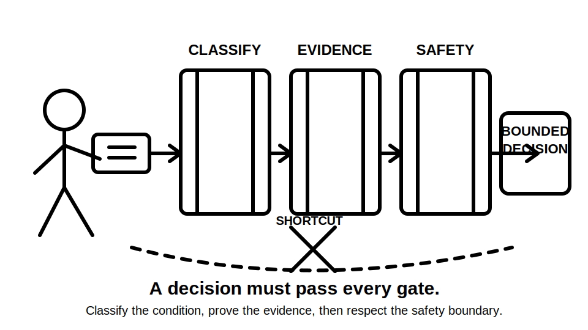
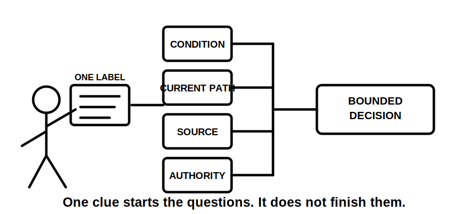
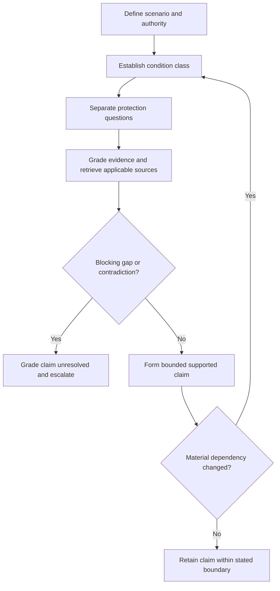
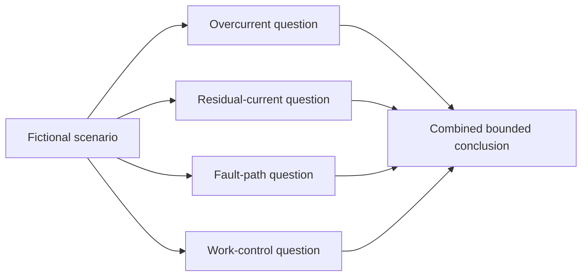

# Day 7 — Week 1 Protection Decision Checkpoint

> **Currency and safety notice:** This is an original paper-based cumulative checkpoint. It assesses reasoning, source control and uncertainty management; it is not an official RTO assessment and authorises no electrical work, testing, resetting, isolation or alteration. Exact clauses, values, device requirements, procedures and jurisdiction-specific claims remain `reference_check_required`. This module is `review-required`, not `technically-reviewed`.

## 1. Outcome and entry check

### Learning objectives

By the end of this block, the learner should be able to:

1. classify a fictional condition as normal operation, overload, short circuit, earth fault, leakage, residual-current imbalance, open circuit or unresolved;
2. distinguish hazard, initiating event, exposure pathway, consequence and critical control in a supplied scenario;
3. state separate residual-current, overcurrent, fault-path and work-control questions without substituting one for another;
4. select appropriate source families and explain their applicability and limits;
5. grade every material item as observed, documented, authorised, assumed or missing;
6. grade each conclusion as described, supported, verified or unresolved;
7. identify missing evidence that blocks an exact conclusion;
8. produce a bounded recommendation within learner authority;
9. reopen every dependent conclusion when one material scenario condition changes;
10. score at least 10 out of 12 on the checkpoint rubric with no critical error.

### Entry check

Without notes, answer and rate confidence as **guessing**, **unsure**, **reasonably confident** or **certain**:

1. What is the difference between a hazard and an exposure pathway?
2. How does an overload differ from a short circuit?
3. What evidence is needed before claiming a protective device is suitable?
4. What does an RCD detect in a simple conceptual model?
5. Why does RCD presence not prove protective-earthing effectiveness?
6. Which source types can establish requirements, product limitations and local authority?
7. What is the correct response when a conclusion depends on an assumed current path?

Record high-confidence errors before continuing. They are priority remediation items, not reasons to reread the whole week.

## 2. Why it matters

Capstone questions rarely announce which single concept is being tested. A scenario may combine a reported symptom, incomplete circuit information, a protective-device label, a person proposing an unsafe action and several plausible causes. The assessment skill is to separate these strands before deciding what can be concluded.

A weak response jumps from one visible clue to a familiar answer. A defensible response:

- bounds the scenario;
- classifies the condition by mechanism and path;
- identifies each protection objective;
- checks current-path and device evidence separately;
- selects applicable authorised sources;
- separates observations, documents, authorised evidence, assumptions and missing information;
- grades the conclusion honestly;
- stops where evidence or authority ends.

*Caption: The decision is earned by passing every gate, not by recognising one familiar label.*

*Caption: One clue starts the questions. It does not finish them.*

## 3. Core concepts and terminology

### Integrated protection decision

An **integrated protection decision** combines several distinct questions while keeping their evidence separate. It does not merge overload, short-circuit, residual-current, fault-path and work-control reasoning into one vague idea of “safety.”

### Decision claim

A **decision claim** is a statement the learner intends to rely on, such as “the symptom is consistent with overload” or “the supplied evidence is insufficient to identify the operating function.” Each claim needs evidence proportionate to its consequence.

### Blocking evidence gap

A **blocking evidence gap** is missing information that prevents a reliable conclusion. Examples include unknown supply arrangement, uncertain conductor grouping, incomplete device markings, absent manufacturer data or an unverified source-current assumption.

### Bounded conclusion

A **bounded conclusion** states:

1. what the supplied facts support;
2. what remains possible but unproven;
3. what exact evidence is missing;
4. what action is outside learner authority;
5. where qualified escalation is required.

### Dependency and reopening trigger

A **dependency** is an earlier fact, assumption or evidence item on which a conclusion relies. A **reopening trigger** is a change that invalidates or weakens that dependency, such as a newly disclosed alternate source, changed load, different conductor route, revised device information or conflicting record. A changed condition requires the learner to revisit every dependent classification and claim, not merely edit the final sentence.

### Evidence grades

Use five evidence grades:

1. **Observed** — directly supplied or visible in the fictional scenario.
2. **Documented** — stated in a current drawing, schedule, label, record or scenario document.
3. **Authorised** — supported by an applicable current requirement, manufacturer instruction, approved design, workplace procedure or competent direction.
4. **Assumed** — plausible but not evidenced.
5. **Missing** — required for the conclusion but unavailable.

Observed or documented information does not become proof of hidden condition, suitability or performance merely because it appears credible.

### Claim grades

Use four claim grades:

- **Described** — states only what supplied material shows or reports.
- **Supported** — combines applicable evidence into a bounded reasoning statement.
- **Verified** — requires all authorised evidence and qualified confirmation appropriate to the claim.
- **Unresolved** — a material evidence gap or contradiction prevents the claim.

The learner may write described, supported and unresolved claims. A safety-critical verified claim must not be made without the required authorised evidence and qualified confirmation.

## 4. Rule-finding workflow

Use **D-E-C-I-D-E**.

1. **D — Define the scenario boundary.** Record supply, circuit, load, users, environment, reported symptom, available documents and learner authority.
2. **E — Establish the condition class.** Separate normal operation, overload, short circuit, earth fault, leakage, residual-current imbalance, open circuit and unresolved conditions.
3. **C — Choose the protection questions.** State separate overcurrent, residual-current, fault-path and work-control questions that actually arise.
4. **I — Identify applicable evidence.** Grade supplied items; select current authorised requirements, manufacturer information, approved drawings, observations and relevant RTO or workplace instructions.
5. **D — Detect gaps, contradictions and dependencies.** Identify missing paths, ratings, source conditions, device characteristics, authority and every assumption on which a conclusion would depend.
6. **E — Express, evaluate and reopen the decision.** Assign a claim grade, state the stop condition and reopen the complete decision chain when a material fact changes.

The change loop is mandatory. A response that cannot adapt may be a memorised script rather than a usable reasoning method.

### Decision ledger

For every material conclusion, record:

- scenario boundary;
- condition class and alternatives;
- protection question;
- evidence item and grade;
- applicable authorised source;
- assumption or missing evidence;
- claim grade;
- practical stop condition;
- reopening trigger.

### Source-selection matrix

| Question | Likely source family | What it can establish | What it does not establish alone |
|---|---|---|---|
| Applicable installation requirement | Current authorised standard, legislation or regulator guidance | Requirement and scope | Actual installation condition |
| Device capability or limitation | Manufacturer information | Product characteristics and application conditions | Correct installation or circuit suitability |
| Installed arrangement | Approved drawing, schedule, inspection record or supplied observation | Documented or observed arrangement | Hidden continuity, condition or performance |
| Learner authority and assessment process | RTO instruction and workplace procedure | Permitted task and evidence format | General technical compliance outside scope |

## 5. Visual model or worked example

### Four-question separation model

The branches may interact, but they do not share identical evidence. A protective-device label cannot answer every branch.

### Complete worked example

**Scenario:** A fictional metal-cased appliance circuit operates a combined protective device after a second portable load is connected. The schedule identifies the circuit, but the scenario gives no conductor-routing evidence, appliance data, device settings, source conditions or authorised test results. A person proposes repeated resetting.

Apply D-E-C-I-D-E:

1. **Define:** record the circuit, two loads, metal enclosure, combined device, reported operation and proposed reset. Supply arrangement and practical authority are incomplete.
2. **Establish:** overload, residual-current operation, equipment fault, neutral-path issue and another unresolved cause remain possible. The operating function is not identified.
3. **Choose:** ask separate overcurrent, residual-current, fault-path and work-control questions.
4. **Identify:** the reported operation is observed; the schedule is documented; exact device capability, appliance behaviour and installation requirements require authorised evidence; several current paths are assumed or missing.
5. **Detect:** conductor grouping, device characteristics, load current, leakage behaviour, earthing effectiveness and cause are blocking gaps and dependencies.
6. **Express:** do not reset or diagnose. Grade the operating event **described**, and the cause and suitability conclusions **unresolved** pending qualified investigation.

A bounded conclusion is:

> The supplied facts establish that a combined protective device operated after a load change, but they do not identify the operating function or cause. Overcurrent, residual-current, equipment, conductor-grouping and fault-path questions require separate authorised evidence. Repeated resetting is not justified. The cause and continued suitability remain unresolved, and exact requirements and investigation procedures remain `reference_check_required`.

### Worked-example fading

A second fictional scenario reports intermittent operation after wet weather and supplies a current schedule plus a partial device label, but no environmental inspection record, current-path evidence or manufacturer information.

Complete only:

1. the boundary and condition alternatives;
2. evidence and claim grades;
3. the first four blocking gaps;
4. one bounded conclusion;
5. one change that would reopen the conclusion.

## 6. Practical application

### Checkpoint scenario pack

Use a trainer-supplied fictional pack containing:

- a one-line circuit description;
- a simple schedule extract written for the exercise;
- two protective-device labels;
- three load descriptions;
- one reported symptom;
- one proposed action;
- five supplied facts;
- five deliberate evidence gaps.

Complete the following independently:

1. write the scenario boundary in no more than six lines;
2. classify the condition and list plausible alternatives;
3. state the four protection or control questions that apply;
4. create a source-selection table;
5. grade every material item using the five evidence grades;
6. identify at least four blocking evidence gaps and dependencies;
7. draw only conceptual current paths supported by the scenario;
8. grade each conclusion and write a bounded escalation statement;
9. change one material fact and reopen every dependent part of the answer.

### Time control

- scenario reading and boundary: 10 minutes;
- classification and questions: 15 minutes;
- source and evidence map: 15 minutes;
- bounded conclusion: 10 minutes;
- changed-condition revision: 10 minutes;
- self-mark and remediation note: 10 minutes.

Stop after 70 minutes. Unfinished work becomes a targeted remediation item; it does not justify unsafe rushing.

### Performance rubric

Score each category **0–2**.

| Category | 0 | 1 | 2 |
|---|---|---|---|
| Protection classification | Selects a label without mechanism | Identifies a likely class but misses alternatives | Classifies by mechanism and records unresolved alternatives |
| Question separation | Treats one device as universal protection | Separates some functions | Clearly separates overcurrent, residual-current, fault-path and work-control questions |
| Source applicability | Uses generic or unsupported sources | Names sources without scope reasoning | Selects source families and explains applicability and limits |
| Evidence and claim control | Presents assumptions as facts | Uses grades inconsistently | Grades all material evidence and claims and identifies blocking gaps |
| Change propagation | Repeats the first answer unchanged | Reopens some dependent reasoning | Re-evaluates classification, evidence priorities and every dependent conclusion |
| Safety and bounded conclusion | Proposes unauthorised action or false certainty | Gives general caution | States supported facts, uncertainty, stop condition, authority boundary and escalation |

A score below **10/12** requires targeted remediation and a varied re-attempt. This is an educational threshold, not an official RTO pass mark.

### Critical errors

Any of the following requires remediation regardless of score:

- treating protective-device operation as proof of cause;
- treating one protective function as proof of another;
- presenting an assumed current path, source condition or device suitability as fact;
- claiming compliance, verified safety or permission to reset without authorised evidence;
- omitting a disclosed source or material condition;
- failing to reopen dependent conclusions after a scenario change;
- proposing opening, testing, resetting, isolation, alteration or energisation outside authority.

## 7. Common errors and safety checkpoint

### Common errors

- **Choosing the device before classifying the condition.** Start with mechanism and path, not hardware familiarity.
- **Treating device operation as a diagnosis.** Operation is evidence of an event, not proof of cause.
- **Using RCD presence to close overcurrent or earthing questions.** These require separate evidence.
- **Assuming a schedule proves physical conductor routing.** Documents and installed condition are different evidence types.
- **Quoting a requirement without checking applicability.** Correct wording applied to the wrong scenario still produces a weak answer.
- **Listing every possible cause without prioritising evidence.** Identify the first blocking checks and explain why.
- **Writing “get an electrician” without a technical boundary.** State what is known, what is missing and why escalation is necessary.
- **Changing only the final sentence after the scenario changes.** Revisit classification, questions, evidence and conclusion.

### Safety checkpoint

This module authorises no opening, isolation, proving, testing, resetting, fault creation, bypassing, bridging, disconnection, replacement, alteration, energisation, measurement or commissioning.

Stop and seek qualified guidance when:

- the supply arrangement or source condition is uncertain;
- conductor routing, neutral grouping or fault-current path is assumed;
- exposed live parts, damage, moisture, burning, overheating or repeated operation are reported;
- device markings, manufacturer information or authorised requirements are incomplete;
- a person proposes repeated resetting, bypassing or alteration;
- the learner cannot distinguish the protective functions;
- the answer requires exact values, clauses, test methods or official assessment criteria not supplied by a current authorised source.

## 8. Retrieval and next links

### Closed-note retrieval

1. What are the six D-E-C-I-D-E steps?
2. Define a blocking evidence gap and a reopening trigger.
3. What are the four separate protection or control questions?
4. Why is device operation not a diagnosis?
5. Name the five evidence grades and four claim grades.
6. What can manufacturer information establish?
7. What can an approved drawing fail to prove?
8. What must a bounded conclusion contain?
9. Why must a changed condition reopen dependent conclusions?
10. State four stop conditions.

### Error-log remediation

Select no more than three errors from this checkpoint. For each:

1. name the failed distinction;
2. write the corrected rule in original words;
3. identify the evidence that would support it;
4. complete one varied re-attempt within 48 hours;
5. record whether confidence became better calibrated.

### Delayed retrieval

Within 72 hours, complete a new five-minute scenario without the D-E-C-I-D-E headings. Record whether you independently separated the four protection questions, used evidence and claim grades, and reopened the answer after a changed fact.

### Navigation

- **Program:** [Six-Week Capstone Learning Plan](../MASTER_PLAN.md)
- **Previous:** [Day 6 — RCD Purpose, Limits and Coordination with Other Protection](day-06-rcd-purpose-limits-and-coordination-with-other-protection.md)
- **Knowledge note:** [[Six-Week Day 07 - Week 1 Protection Decision Checkpoint]]
- **Next:** [Day 8 — Earthing Terminology and Component Identification](day-08-earthing-terminology-and-component-identification.md)

### References and review boundary

- AS/NZS 3000: use a current authorised copy and applicable amendments for exact requirements.
- Use current legislation, regulator guidance, manufacturer information, approved workplace procedures and RTO instructions as applicable.
- This module uses original explanations, scenarios, workflows, diagrams and assessment activities. It reproduces no standards table, figure, systematic clause wording, device curve or source PDF content.
- Exact clauses, limits, device characteristics, test methods, assessment criteria and jurisdiction-specific requirements remain `reference_check_required`.
- This module remains `review-required`, has not received qualified technical review and must not be labelled `technically-reviewed`.
