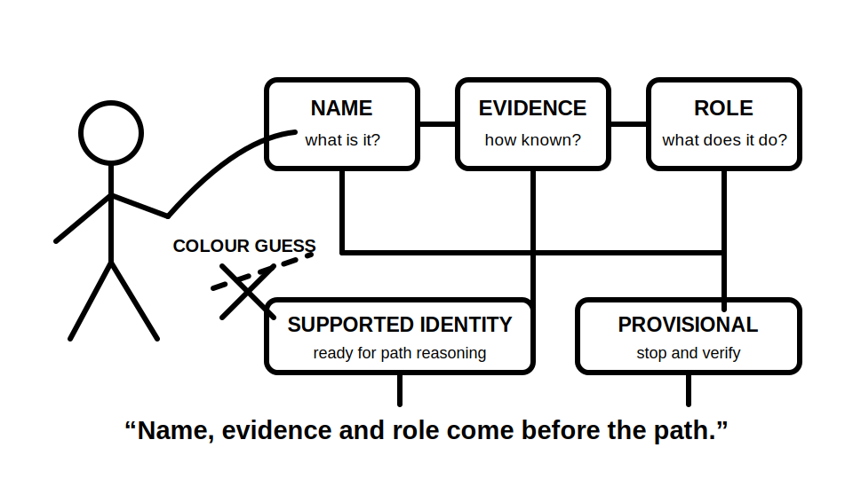
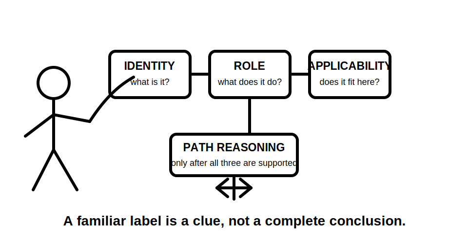
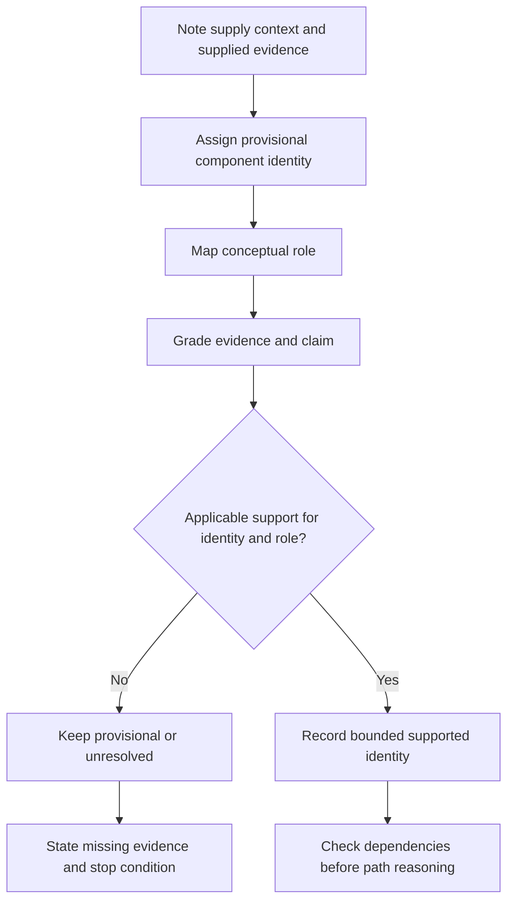
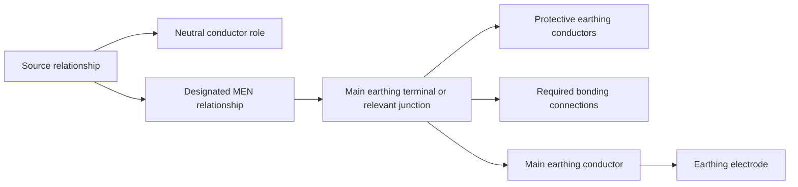

# Day 8 — Earthing Terminology and Component Identification

> **Currency and safety notice:** This is an original identification and reasoning module. It does not authorise opening equipment, tracing conductors, disconnecting conductors, testing continuity or altering an earthing arrangement. Exact definitions, permitted arrangements, connection locations, conductor requirements and jurisdiction-specific duties remain `reference_check_required`. This module is `review-required`, not `technically-reviewed`.

## 1. Outcome and entry check

### Learning objectives

By the end of this block, the learner should be able to:

1. distinguish earthing, protective earthing, bonding and the MEN relationship in plain technical language;
2. identify the conceptual roles of the main earthing terminal, protective earthing conductor, main earthing conductor, earthing electrode, neutral conductor and MEN connection from a supplied learning diagram;
3. separate component identity, role, location, condition and applicability;
4. grade every material identification claim using the five evidence grades;
5. classify conclusions using the four claim grades;
6. avoid identifying conductors solely by colour, position, familiarity or an unverified label;
7. reopen affected conclusions when the source arrangement, drawing status or component evidence changes;
8. produce a bounded component-role ledger with uncertainty and escalation clearly stated;
9. score at least 10 out of 12 on the educational rubric with no critical error.

### Entry check

Without notes, answer and rate confidence as **guessing**, **unsure**, **reasonably confident** or **certain**:

1. What is the difference between a neutral conductor and a protective earthing conductor?
2. What does bonding aim to connect conceptually?
3. Is an earthing electrode normally taught as the sole metallic return path for an installation earth fault?
4. What is the purpose of a main earthing terminal or relevant earthing junction?
5. Why is conductor colour insufficient evidence by itself?
6. What does MEN stand for?
7. Which source types can confirm the applicable arrangement and permitted connection locations?

Record every high-confidence error. Correct it through a varied diagram later rather than rereading the whole module.

## 2. Why it matters

Earthing questions become unreliable when component names, physical locations and electrical roles are blended together. A learner may recognise a green/yellow conductor or an electrode symbol yet still misunderstand what part of the arrangement it represents.

Accurate identification matters because later reasoning depends on it:

- normal current must not be casually assigned to the protective earthing system;
- a protective earthing conductor must not be treated as interchangeable with neutral;
- bonding must not be described as a substitute for earthing or protective-device coordination;
- an electrode must not be imagined as a universal drain that makes fault current disappear into soil;
- a familiar diagram must not be applied outside its stated supply arrangement;
- a label must not be treated as proof of continuity, condition or permitted connection.

*Caption: Name the component, prove the evidence, then state its role; colour and position are clues, not conclusions.*

*Caption: A familiar label is a clue, not a complete conclusion.*

## 3. Core concepts and terminology

### Earthing

**Earthing** is the broader arrangement that connects relevant parts of an electrical installation to an earth reference and supports protective functions under the applicable system design. The exact arrangement and permitted connections depend on current authorised requirements and supply context.

### Protective earthing

**Protective earthing** provides a conductive connection for exposed conductive parts and other required parts so that a fault can be managed by the applicable protective arrangement. It is not intended to carry normal load current in the simplified learning model.

### Exposed conductive part

An **exposed conductive part** is conductive equipment metalwork that can be touched and is not normally live but could become live under a fault. Exact classification remains source-dependent.

### Bonding

**Bonding** is the intentional conductive connection of specified conductive parts to reduce dangerous potential differences under defined conditions. Bonding does not prove that the complete protective path, conductor sizing or protective-device conditions are satisfactory.

### Neutral conductor

The **neutral conductor** is a live conductor associated with the system neutral point and normally participates in the intended current return path for relevant loads. Its role is distinct from protective earthing even where the supply arrangement includes a designated MEN relationship.

### Protective earthing conductor

A **protective earthing conductor** connects required equipment or exposed conductive parts to the installation earthing arrangement. Its exact routing, size, identification and termination require authorised-source verification.

### Main earthing terminal or relevant earthing junction

The **main earthing terminal**, or another relevant earthing junction named by the applicable arrangement, is the principal connection point at which specified protective earthing, bonding and earthing conductors are brought into the installation earthing system.

### Main earthing conductor

The **main earthing conductor** connects the main earthing terminal or relevant junction to the earthing electrode in the simplified installation model. Do not infer its exact physical route or requirements from a conceptual drawing.

### Earthing electrode

An **earthing electrode** is a conductive part in contact with earth and forms part of the earthing arrangement. In the conceptual MEN learning model, it is not presented as the sole metallic return path for an installation earth fault.

### MEN connection

The **MEN connection** is the designated relationship between the installation earthing system and neutral under the applicable multiple earthed neutral arrangement. Exact location, number, permissions and exceptions are safety-critical and remain `reference_check_required`.

### Component-role ledger

A **component-role ledger** keeps six items separate:

1. supplied label or observation;
2. proposed component identity;
3. conceptual role;
4. evidence grade;
5. claim grade;
6. uncertainty, dependency or missing context.

This prevents a visual clue from silently becoming a safety-critical fact.

### Evidence grades

- **E1 — directly supplied:** an explicit label, approved schedule entry, stated scenario fact or authorised recorded observation.
- **E2 — corroborated:** two or more independent applicable sources support the same identification or role.
- **E3 — derived:** the conclusion follows from supported facts and a stated reasoning step, but is not directly observed.
- **E4 — assumed:** the conclusion relies on colour, position, familiarity, presumed continuity or an arrangement copied from another scenario.
- **E5 — missing or conflicting:** the required information is absent, outdated, ambiguous or inconsistent.

E4 may generate a question. E5 requires the conclusion to remain unresolved. Neither grade can establish a safety-critical connection or role.

### Claim grades

- **C1 — described:** reports only what the supplied material shows or states.
- **C2 — provisionally identified:** proposes an identity or role with explicit uncertainty.
- **C3 — supported:** evidence and applicability are sufficient for bounded paper reasoning.
- **C4 — verified:** requires the authorised practical or documentary verification appropriate to the claim.

This module normally stops at C1–C3. It does not authorise practical work needed to reach C4.

## 4. Rule-finding workflow

Use **N-A-M-E-S**.

1. **N — Note the scenario boundary.** Record the stated supply context, installation section, drawing type, labels, accessible observations and learner authority.
2. **A — Assign a provisional identity.** Name the component only as strongly as the supplied evidence permits; use “unidentified conductor” or “proposed earthing junction” when necessary.
3. **M — Map the conceptual role.** State whether the item belongs to the normal-current path, protective path, bonding arrangement, earth-reference arrangement or source relationship.
4. **E — Establish evidence, claim grade and applicability.** Grade the evidence E1–E5, the claim C1–C4, and check that the source applies to this supply arrangement and installation section.
5. **S — State boundaries, dependencies and next question.** Record what is supported, what remains conditional, what must be reopened after a change and which exact source or qualified check is required next.

The workflow deliberately stops before current-path tracing if component identity, role, supply context or applicability is unresolved.

### Reopening rule

Reopen every dependent conclusion when any of these change:

- source or supply arrangement;
- drawing status or revision;
- conductor label or termination information;
- component location or installation boundary;
- evidence grade;
- neutral-to-earthing relationship;
- alternative or multiple supply context.

A changed input invalidates dependent conclusions until they are rebuilt.

## 5. Visual model or worked example

### Conceptual role map

This is a role map, not a wiring instruction. It shows categories of relationship and does not establish exact physical positions, conductor sizes, connection permissions or every supply arrangement.

### Worked identification example

**Scenario:** A fictional learning drawing shows a metal enclosure connected to a junction labelled “installation earthing point.” A second conductor links that point to an electrode symbol. A separate line links the junction to a neutral reference, but the drawing does not state the supply type or whether the line is a permitted MEN connection.

Apply N-A-M-E-S:

1. **Note:** the drawing is conceptual; supply context and approval status are absent.
2. **Assign:** the enclosure conductor is provisionally a protective earthing conductor; the electrode conductor is provisionally a main earthing conductor; the junction is a proposed main earthing terminal or relevant junction.
3. **Map:** enclosure connection belongs to the protective path; electrode connection belongs to the earth-reference arrangement; neutral link could represent a designated MEN relationship but remains unverified.
4. **Establish:** the labels are E1 scenario facts. The proposed identities are C2 derived claims. Exact classifications and permitted connections need applicable authorised support; the neutral relationship is E5 because supply context is missing.
5. **State:** the diagram supports a conceptual earthing arrangement, but exact identity, connection location and supply applicability remain unresolved.

A bounded conclusion is:

> The supplied drawing describes a protective connection, an installation earthing junction and an electrode connection. These identities remain provisional, and the neutral-to-earthing relationship cannot be supported as a permitted MEN connection without the applicable supply context and current authorised evidence. No physical tracing, testing or alteration is authorised.

### Worked-example fading

For a second diagram, provide only the scenario boundary and one completed ledger row. The learner completes the remaining rows, grades each claim and explains why path reasoning must stop for any E4 or E5 item.

## 6. Practical application

### Round 1 — labelled role sort

Use a trainer-created fictional diagram containing:

- source active and neutral references;
- a final-subcircuit active and neutral;
- a metal-cased item of equipment;
- an unidentified protective conductor;
- an installation earthing junction;
- a conductor to an electrode;
- one bonding connection;
- one deliberately misleading colour cue.

For each item, complete a component-role ledger:

| Supplied clue | Provisional identity | Conceptual role | Evidence grade | Claim grade | Dependency or missing context |
|---|---|---|---|---|---|
| Learner completes | Learner completes | Learner completes | E1–E5 | C1–C4 | Learner completes |

Then:

1. circle every component that participates in the normal-current model;
2. box every component that participates in the protective arrangement;
3. mark every identity based only on colour or position as E4;
4. mark absent or conflicting supply information as E5;
5. list the current authorised sources needed to confirm the arrangement;
6. write a bounded two-sentence conclusion.

### Round 2 — worked-example fading

Repeat with labels removed from three components. The learner must choose between:

- supported identification;
- provisional identification;
- unresolved pending evidence.

No unsupported label may be promoted to C3.

### Round 3 — changed-context transfer

Change the scenario from a normal grid-supplied learning model to an unspecified alternative-source context. Reassess every neutral, earthing and MEN claim. Do not carry the first diagram’s assumptions into the changed scenario.

### Delayed retrieval

Within 48 hours, complete a fresh four-component ledger without notes. Include one misleading label and one missing supply fact. Compare confidence with evidence grade and correct any high-confidence E4 claim.

### Performance rubric

Score each category **0–2**.

| Category | 0 | 1 | 2 |
|---|---|---|---|
| Terminology | Uses neutral, earth and bonding interchangeably | Defines terms but blurs one distinction | Defines and consistently separates all key terms |
| Component-role accuracy | Assigns roles by appearance | Identifies most roles with some unsupported inference | Correctly maps normal-current, protective, bonding and earth-reference roles |
| Evidence and claim control | Treats visual clues as facts | Grades some claims inconsistently | Grades every material identity and keeps claims within evidence limits |
| Source applicability | Names generic sources only | Selects sources without context limits | Chooses source families and explains scope and limitations |
| Change propagation | Reuses the first arrangement unchanged | Revises some labels | Reopens every affected identity and role after the context changes |
| Safety and bounded conclusion | Proposes tracing, testing or alteration | Gives general caution | States supported identity, uncertainty, authority boundary and escalation |

A score below **10/12**, or any critical error, requires targeted remediation and a varied re-attempt. This is an educational threshold, not an official RTO pass mark.

### Critical errors

Any of the following requires remediation regardless of score:

- treating neutral and protective earthing conductors as interchangeable;
- treating colour or position as proof of identity;
- describing the electrode as the sole universal fault-current return path;
- claiming an MEN connection without applicable evidence;
- treating a label as proof of continuity, condition or permitted connection;
- carrying a grid-supply conclusion into a changed source arrangement without reopening it;
- proposing opening, tracing, testing, disconnection, alteration or energisation outside authority.

## 7. Common errors and safety checkpoint

### Common errors

- **Calling every green/yellow conductor “the earth.”** Name the specific conductor and role supported by evidence.
- **Treating neutral and protective earth as interchangeable.** Keep normal-current and protective roles separate.
- **Assuming the electrode is the entire fault-current return path.** Treat it as one part of the earthing arrangement, not a universal drain.
- **Calling any metal connection bonding.** Confirm which conductive parts are involved and why the connection exists.
- **Assuming the MEN connection from a familiar diagram.** Verify supply context, permitted location and applicable arrangement.
- **Using a component label to prove continuity or effectiveness.** Identification does not establish condition, impedance or performance.
- **Applying one installation drawing to an alternative supply.** Reassess source and neutral relationships whenever supply context changes.
- **Leaving missing evidence ungraded.** Use E5 so uncertainty remains visible.

### Safety checkpoint

This module authorises no opening, removal of covers, isolation, proving, testing, conductor tracing, continuity testing, disconnection, reconnection, bridging, alteration, energisation or commissioning.

Stop and seek qualified guidance when:

- the supply arrangement or source relationship is uncertain;
- conductor identity depends only on colour, position or memory;
- neutral and protective conductors cannot be distinguished from authorised evidence;
- an MEN connection location or permission is assumed;
- records conflict or applicability is unclear;
- damage, exposed live parts, overheating, moisture or altered conductors are reported;
- the question requires exact clauses, sizes, locations, test methods or jurisdiction-specific requirements not supplied by a current authorised source.

## 8. Retrieval and next links

### Closed-note retrieval

1. Define protective earthing.
2. Distinguish neutral from a protective earthing conductor.
3. Define bonding without claiming it proves the complete protective arrangement.
4. State the conceptual role of the main earthing terminal or relevant junction.
5. State the conceptual role of the main earthing conductor.
6. Why is an electrode not taught as the sole metallic fault-current return path?
7. Expand N-A-M-E-S.
8. State the five evidence grades.
9. State the four claim grades.
10. Name four reopening triggers and four stop conditions.

### Error-log remediation

Select no more than three errors. For each:

1. name the failed distinction;
2. redraw a small original role map;
3. identify the missing evidence or inapplicable source;
4. complete a varied identification card within 48 hours;
5. record confidence before and after correction.

### Navigation

- **Program:** [Six-Week Capstone Learning Plan](../MASTER_PLAN.md)
- **Previous:** [Day 7 — Week 1 Protection Decision Checkpoint](day-07-week-1-protection-decision-checkpoint.md)
- **Knowledge note:** [[Six-Week Day 08 - Earthing Terminology and Component Identification]]
- **Next:** [Day 9 — MEN Arrangement and Normal-Current Paths](day-09-men-arrangement-and-normal-current-paths.md)

### References and review boundary

- AS/NZS 3000: use a current authorised copy and applicable amendments for exact definitions and requirements.
- Use current legislation, regulator guidance, network information, approved drawings, manufacturer information, workplace procedures and RTO instructions as applicable.
- This module uses original explanations, scenarios, workflows, diagrams and assessment activities. It reproduces no standards table, figure, systematic clause wording or source PDF content.
- Exact clauses, definitions, conductor requirements, connection locations, permitted arrangements, exceptions and jurisdiction-specific duties remain `reference_check_required`.
- This module remains `review-required`, has not received qualified technical review and must not be labelled `technically-reviewed`.