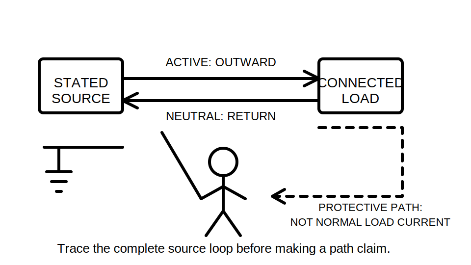
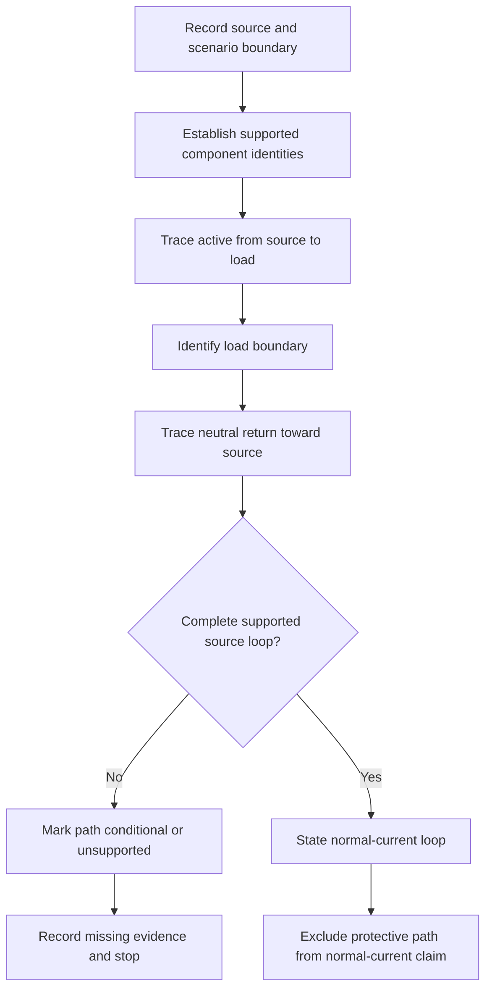
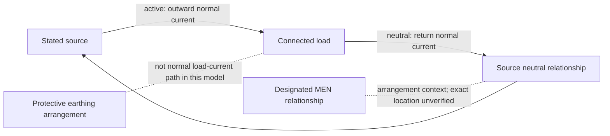

# Day 9 — MEN Arrangement and Normal-Current Paths

> **Currency and safety notice:** This is an original conceptual reasoning module. It does not establish an actual installation arrangement or authorise opening equipment, tracing conductors, testing, disconnection, reconnection or alteration. Exact MEN definitions, permitted connection locations, supply arrangements, exceptions and jurisdiction-specific duties remain `reference_check_required`. This module is `review-required`, not `technically-reviewed`.

## 1. Outcome and entry check

### Learning objectives

By the end of this block, the learner should be able to:

1. explain the purpose of a conceptual MEN arrangement without treating a simplified diagram as an installation instruction;
2. distinguish the normal load-current path from protective earthing and bonding paths;
3. trace a stated single-phase normal-current loop from source through load and back to source using labelled conceptual components;
4. explain why the designated neutral-to-earthing relationship does not make protective earthing a normal load-current conductor;
5. identify which claims depend on supply context, authorised drawings or current requirements;
6. classify path claims as supported, conditional or unsupported;
7. revise the path analysis when a source or neutral relationship changes;
8. score at least 10 out of 12 on the educational rubric with no zero in path accuracy, evidence control or safety boundary.

### Entry check

Without notes, answer and rate confidence as **guessing**, **unsure**, **reasonably confident** or **certain**:

1. Which conductors normally carry current to and from a connected single-phase load in the simplified model?
2. Does a protective earthing conductor normally carry load current in that model?
3. What is the difference between a component role and a verified physical connection?
4. Why must supply context be known before describing an MEN arrangement?
5. What evidence would justify a path claim?
6. What changes when the source or neutral relationship changes?

Record every high-confidence error for a varied re-attempt in Beat 8.

## 2. Why it matters

MEN reasoning is often weakened by one of two shortcuts: memorising a familiar switchboard sketch or assuming that every conductor connected to the earthing system carries the same current for the same purpose. Both shortcuts hide the distinction between normal operation and fault conditions.

A reliable learner must first prove the normal-current path. This creates the baseline required for Day 10, where an earth fault changes the path and protective operation must be reasoned about separately.

*Caption: Trace the stated source-to-load-to-source loop; keep protective conductors outside the normal-current path unless the scenario supplies contrary authorised evidence.*

## 3. Core concepts and terminology

### Multiple earthed neutral arrangement

A **multiple earthed neutral arrangement**, commonly abbreviated **MEN**, is a supply and installation earthing arrangement in which neutral and earth relationships are established at designated points under applicable requirements. This module uses only a simplified conceptual model. Exact connection points, permissions, number of connections and exceptions require current authorised verification.

### Normal load current

**Normal load current** is current associated with intended operation of connected equipment. In the simplified single-phase model, it travels from the source on the active conductor, through the load and returns toward the source on the neutral conductor.

### Active conductor

The **active conductor** is a live conductor that supplies electrical potential to the load in the stated conceptual circuit. Exact identification, switching and installation requirements remain source-dependent.

### Neutral conductor

The **neutral conductor** is a live conductor associated with the system neutral point and normally forms the return path for relevant load current.

### Protective earthing conductor

A **protective earthing conductor** connects required exposed conductive parts to the protective earthing arrangement. In the simplified normal-operation model, it is not assigned normal load current.

### Designated MEN relationship

The **designated MEN relationship** is the authorised neutral-to-earthing relationship that belongs to the applicable arrangement. It must not be inferred merely because two lines meet in a learning diagram.

### Source loop

A **source loop** is the complete conceptual route from a source, through the load and back to the source. Saying “current reaches neutral” is incomplete unless the reasoning returns to the source relationship.

### Supported, conditional and unsupported path claims

- **Supported:** directly established by the supplied scenario and applicable authorised evidence.
- **Conditional:** reasonable only while an explicitly stated condition remains true.
- **Unsupported:** based on colour, position, memory, omitted source context or an unverified physical connection.

## 4. Rule-finding workflow

Use **R-E-T-U-R-N**.

1. **R — Record the source and scenario boundary.** State the source type, phase model, supplied labels, drawing status and learner authority.
2. **E — Establish component identities.** Carry forward only Day 8 identities supported by supplied facts or applicable authorised evidence.
3. **T — Trace the intended outward path.** Follow the stated active path from source to load without adding hidden conductors or devices.
4. **U — Understand the load boundary.** Identify where electrical energy is used and where the return path begins.
5. **R — Return through the stated neutral path.** Trace neutral back toward the source and identify any missing source relationship.
6. **N — Note exclusions, conditions and next question.** State why protective earthing and bonding are excluded from normal current, what remains conditional and what Day 10 must analyse under fault conditions.

The diagram is an evidence-gated reasoning sequence. It does not depict exact physical routing or permitted connection locations.

### Evidence grades

- **Grade A — scenario fact:** labels, source description, approved learning drawing or supplied records.
- **Grade B — applicable authorised evidence:** current requirements, network information, approved design, manufacturer information, workplace procedure or competent direction.
- **Grade C — assumption:** familiar diagram, conductor colour, presumed continuity, guessed source point or an arrangement copied from another installation.

Grade C can create a question. It cannot complete a safety-critical current path.

## 5. Visual model or worked example

### Conceptual normal-current loop

The solid arrows show the intended normal-current loop. The dotted relationships provide conceptual context only. They do not show exact wiring, prove continuity or authorise an installation arrangement.

### Worked example

**Scenario:** A fictional approved learning diagram states that a single-phase load is supplied from a grid-connected source. The active and neutral conductors are labelled. The metal enclosure is connected to a labelled protective earthing conductor. The drawing marks a designated MEN relationship but gives no physical dimensions, connection method or test evidence.

Apply R-E-T-U-R-N:

1. **Record:** grid-connected, single-phase conceptual learning model; approved labels are scenario facts.
2. **Establish:** active, neutral, load and protective earthing roles are supported within the drawing.
3. **Trace outward:** source active to load.
4. **Understand load:** current passes through the intended load function.
5. **Return:** load neutral back toward the stated source neutral relationship.
6. **Note:** the protective earthing conductor is excluded from the normal load-current path. The designated MEN relationship provides arrangement context but its exact physical location and compliance are not established.

A bounded conclusion is:

> The supplied evidence supports a conceptual normal-current loop from the stated source through the active conductor and load, returning through neutral to the source relationship. It does not support normal load current in the protective earthing conductor or prove the physical MEN connection, continuity, impedance or compliance of an actual installation.

## 6. Practical application

### Round 1 — labelled path trace

Use a trainer-created fictional diagram containing:

- one stated source;
- active and neutral conductors;
- one load;
- a metal enclosure;
- a protective earthing conductor;
- an installation earthing junction;
- a designated MEN relationship;
- one irrelevant bonding branch;
- one misleading colour cue.

Complete this record:

| Path segment | Role | Evidence grade | Included in normal-current loop? | Missing evidence or condition |
|---|---|---|---|---|
| Learner completes | Learner completes | A, B or C | Yes, no or conditional | Learner completes |

Then write a three-sentence bounded explanation of the complete source loop.

### Round 2 — worked-example fading

Repeat with the source-neutral relationship partly hidden. The learner must:

1. trace only the supported part of the loop;
2. stop where evidence ends;
3. state the exact missing source information;
4. avoid diverting the return path through protective earth.

### Round 3 — changed-source transfer

Replace the stated grid source with an unspecified alternative source. Reassess every neutral, MEN and return-path claim. The correct response may be “insufficient evidence” until the source arrangement is established.

### Performance rubric

Score each category **0–2**.

| Category | 0 | 1 | 2 |
|---|---|---|---|
| Terminology | Uses neutral, earth and MEN interchangeably | Defines terms but blurs one role | Consistently separates all defined roles |
| Path accuracy | Produces an open or invented path | Traces most segments with one unsupported link | Completes the supported source-to-load-to-source loop |
| Evidence control | Treats visual clues as facts | Marks some assumptions | Grades every material path claim and stops at missing evidence |
| MEN boundary | Treats MEN as a general current shortcut | States a relationship without limits | Explains the designated relationship without assigning protective earth normal load current |
| Transfer | Reuses the original path unchanged | Revises part of the path | Reassesses all source, neutral and MEN claims after context changes |
| Safety and conclusion | Proposes tracing or testing | Gives general caution | States evidence, uncertainty, authority boundary and escalation |

A score below **10/12**, or any zero in **path accuracy**, **evidence control** or **safety and conclusion**, requires targeted remediation and a varied re-attempt. This is an educational threshold, not an official RTO pass mark.

## 7. Common errors and safety checkpoint

### Common errors

- **Stopping the explanation at neutral.** Complete the conceptual loop back to the source relationship.
- **Routing normal current through protective earth.** Keep normal and protective roles separate.
- **Treating MEN as a conductor name.** Describe the designated relationship, not a generic wire.
- **Assuming a diagram proves the real connection location.** Separate conceptual arrangement from verified physical installation.
- **Using colour as path evidence.** Colour is a clue, not proof of identity, continuity or function.
- **Carrying a grid-source model into an alternative-source scenario.** Re-establish the source and neutral relationship.
- **Jumping ahead to disconnection performance.** Day 9 establishes the normal baseline; Day 10 addresses earth-fault current and protective operation.

### Safety checkpoint

This module authorises no opening, cover removal, isolation, proving, testing, conductor tracing, continuity testing, current measurement, disconnection, reconnection, bridging, alteration, energisation or commissioning.

Stop and seek qualified guidance when:

- the source or neutral relationship is uncertain;
- component identity depends only on colour, position or memory;
- a protective conductor appears to carry current in an actual installation;
- a MEN connection location or permission is assumed;
- alternate, standby, inverter or generation supplies are present or suspected;
- damage, exposed live parts, overheating, moisture or altered conductors are reported;
- the question requires exact clauses, connection locations, values, test methods or jurisdiction-specific requirements not supplied by a current authorised source.

## 8. Retrieval and next links

### Closed-note retrieval

1. Define normal load current.
2. State the conceptual single-phase normal-current loop.
3. Why is protective earthing excluded from that loop in the simplified model?
4. What does MEN describe conceptually?
5. What are the six R-E-T-U-R-N steps?
6. Distinguish supported, conditional and unsupported path claims.
7. Why must the explanation return to the source?
8. What changes when the source changes?
9. Name three Grade C assumptions.
10. State four stop conditions.

### Error-log remediation

Select no more than three errors. For each:

1. name the failed distinction;
2. redraw a small original source loop;
3. mark the unsupported segment;
4. identify the evidence needed;
5. complete a varied path trace within 48 hours;
6. record confidence before and after correction.

### Navigation

- **Program:** [Six-Week Capstone Learning Plan](../MASTER_PLAN.md)
- **Previous:** [Day 8 — Earthing Terminology and Component Identification](day-08-earthing-terminology-and-component-identification.md)
- **Knowledge note:** [[Six-Week Day 09 - MEN Arrangement and Normal-Current Paths]]
- **Next:** Day 10 — Earth-Fault Current Path and Disconnection Reasoning

### References and review boundary

- AS/NZS 3000: use a current authorised copy and applicable amendments for exact definitions and requirements.
- Use current legislation, regulator guidance, network information, approved drawings, manufacturer information, workplace procedures and RTO instructions as applicable.
- This module uses original explanations, scenarios, workflows, diagrams and assessment activities. It reproduces no standards table, figure, systematic clause wording or source PDF content.
- Exact MEN definitions, connection locations, supply arrangements, conductor requirements, exceptions, test requirements and jurisdiction-specific duties remain `reference_check_required`.
- This module remains `review-required`, has not received qualified technical review and must not be labelled `technically-reviewed`.
