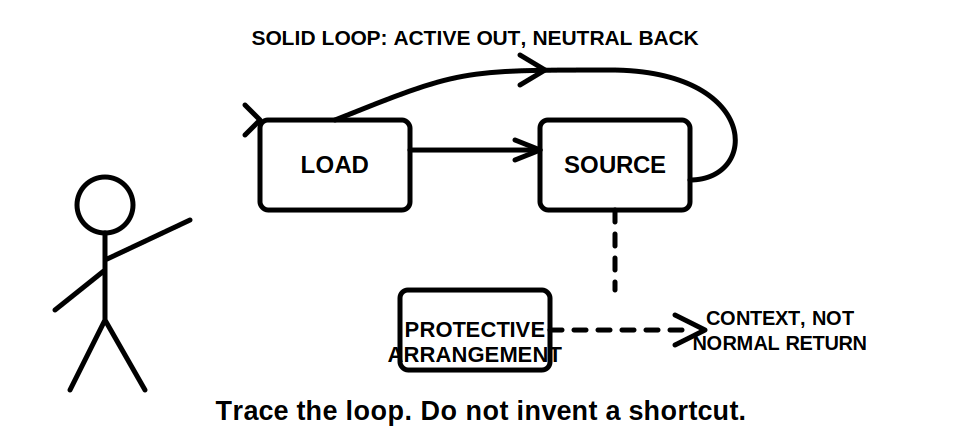
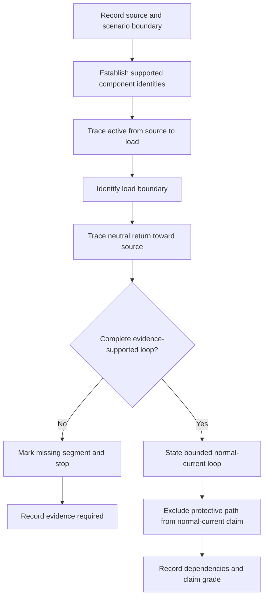
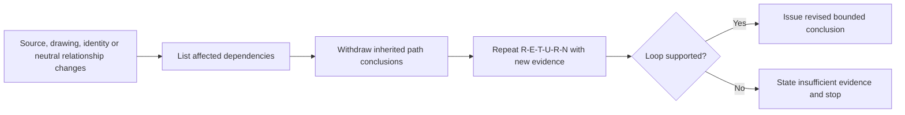
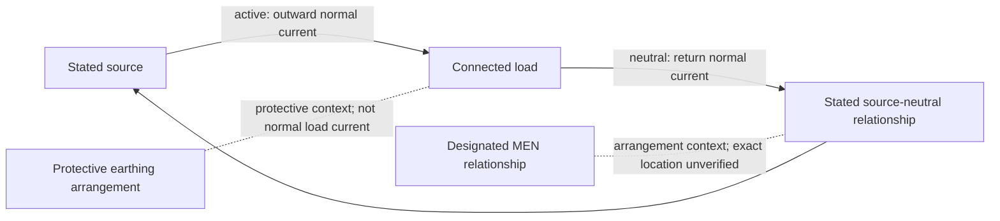

# Day 9 — MEN Arrangement and Normal-Current Paths

> **Currency and safety notice:** This is an original conceptual reasoning module. It does not establish an actual installation arrangement or authorise opening equipment, tracing conductors, testing, disconnection, reconnection or alteration. Exact MEN definitions, permitted connection locations, supply arrangements, exceptions and jurisdiction-specific duties remain `reference_check_required`. This module is `review-required`, not `technically-reviewed`.

## 1. Outcome and entry check

### Learning objectives

By the end of this block, the learner should be able to:

1. explain the purpose of a conceptual MEN arrangement without treating a simplified diagram as an installation instruction;
2. distinguish the normal load-current path from protective earthing and bonding paths;
3. trace a stated single-phase normal-current loop from source through load and back to source;
4. distinguish a component identity, a conceptual relationship and a verified physical connection;
5. assign an evidence grade and claim grade to every material path statement;
6. identify dependencies that must be reopened when the source, neutral relationship, drawing status or component identity changes;
7. stop at missing evidence instead of silently completing a familiar path; and
8. score at least 10 out of 12 on the educational rubric with no critical error.

### Entry check

Without notes, answer and rate confidence as **guessing**, **unsure**, **reasonably confident** or **certain**:

1. Which conductors normally carry current to and from a connected single-phase load in the simplified model?
2. Does a protective earthing conductor normally carry load current in that model?
3. What is the difference between a component role and a verified physical connection?
4. Why must the source and neutral relationship be known before describing the loop?
5. What evidence would justify each segment of a path claim?
6. What must be reconsidered when the source changes?

Record every high-confidence error for a varied re-attempt in Beat 8.

## 2. Why it matters

MEN reasoning is often weakened by two shortcuts: memorising a familiar switchboard sketch and assuming that every conductor associated with earthing carries current for the same purpose. Both shortcuts hide the distinction between normal operation, protective relationships and fault conditions.

A reliable learner must first establish a bounded normal-current baseline. Day 10 can then introduce an earth fault and ask what changes. Without the baseline, the learner may confuse neutral return current, protective earthing, bonding and fault-current paths.

*Caption: Trace the stated source-to-load-to-source loop; keep protective conductors outside the normal-current path unless contrary authorised evidence is supplied.*

*Caption: A designated relationship provides arrangement context; it is not permission to invent a normal-current shortcut.*

## 3. Core concepts and terminology

### Multiple earthed neutral arrangement

A **multiple earthed neutral arrangement**, commonly abbreviated **MEN**, is a supply and installation earthing arrangement in which neutral and earth relationships are established at designated points under applicable requirements. This module uses only a simplified conceptual model. Exact connection points, permissions, number of connections and exceptions require current authorised verification.

### Normal load current

**Normal load current** is current associated with intended operation of connected equipment. In the simplified single-phase model, it travels from the source on the active conductor, through the load and returns toward the source on the neutral conductor.

### Active conductor

The **active conductor** is a live conductor that supplies electrical potential to the load in the stated conceptual circuit. Exact identification, switching and installation requirements remain source-dependent.

### Neutral conductor

The **neutral conductor** is a live conductor associated with the system neutral point and normally forms the return path for relevant load current.

### Protective earthing conductor

A **protective earthing conductor** connects required exposed conductive parts to the protective earthing arrangement. In the simplified normal-operation model, it is not assigned normal load current.

### Bonding conductor

A **bonding conductor** connects conductive parts for a protective purpose defined by the applicable arrangement. Its role must not be inferred from appearance or proximity, and it is not automatically part of the normal load-current loop.

### Designated MEN relationship

The **designated MEN relationship** is the authorised neutral-to-earthing relationship that belongs to the applicable arrangement. It must not be inferred merely because two lines meet in a learning diagram.

### Source loop

A **source loop** is the complete conceptual route from a source, through the load and back to the source. Saying “current reaches neutral” is incomplete unless the reasoning returns to the stated source relationship.

### Dependency

A **dependency** is a fact on which a conclusion relies. Examples include the source type, drawing status, neutral relationship, component identity and scenario boundary. When a dependency changes, every affected conclusion must be reopened.

### Evidence grades

- **Grade 1 — supplied fact:** explicitly stated source, label, approved learning drawing or supplied record.
- **Grade 2 — corroborated fact:** a supplied fact supported by another applicable record or authorised source.
- **Grade 3 — derived conclusion:** a conclusion that follows transparently from Grade 1 or Grade 2 evidence.
- **Grade 4 — assumption:** familiar diagram, conductor colour, presumed continuity, guessed source point or copied arrangement.
- **Grade 5 — missing or conflicting:** evidence is absent, inconsistent, out of date or outside the learner’s authority.

Grades 4 and 5 can create questions. They cannot complete a safety-critical path.

### Claim grades

- **Described:** repeats what the scenario or drawing states.
- **Supported:** connects a conclusion to applicable evidence and states its limits.
- **Conditionally supported:** remains valid only while named dependencies remain true.
- **Verified:** requires authorised practical verification and qualified authority; this module cannot grant that grade.

## 4. Rule-finding workflow

Use **R-E-T-U-R-N**.

1. **R — Record the source and scenario boundary.** State source type, phase model, supplied labels, drawing status and learner authority.
2. **E — Establish component identities.** Carry forward only Day 8 identities supported by supplied facts or applicable authorised evidence.
3. **T — Trace the intended outward path.** Follow the stated active path from source to load without adding hidden conductors or devices.
4. **U — Understand the load boundary.** Identify where intended energy use occurs and where the return path begins.
5. **R — Return through the stated neutral path.** Trace neutral back toward the source and identify any missing source relationship.
6. **N — Note exclusions, dependencies and next question.** Exclude protective earthing and bonding from normal current, grade each claim and state what Day 10 must analyse under fault conditions.

The diagram is an evidence-gated reasoning sequence. It does not depict exact physical routing or permitted connection locations.

### Reopening rule

A changed source does not merely alter one label. It can change the neutral relationship, permitted arrangement, return path and applicability of previous evidence.

## 5. Visual model or worked example

### Conceptual normal-current loop

Solid arrows show the intended normal-current loop. Dotted relationships provide conceptual context only. They do not prove continuity, exact wiring, connection permission or compliance.

### Worked example

**Scenario:** A fictional approved learning diagram states that a single-phase load is supplied from a grid-connected source. Active and neutral are labelled. A metal enclosure is connected to a labelled protective earthing conductor. The drawing marks a designated MEN relationship but gives no physical dimensions, connection method or test evidence.

Apply R-E-T-U-R-N:

1. **Record:** grid-connected, single-phase conceptual learning model; approved labels are supplied facts.
2. **Establish:** active, neutral, load and protective-earthing roles are described by the drawing, not practically verified.
3. **Trace outward:** source active to load.
4. **Understand load:** current passes through the intended load function.
5. **Return:** load neutral back to the stated source-neutral relationship.
6. **Note:** protective earthing is excluded from normal load current; the exact physical MEN connection remains unverified.

A bounded conclusion is:

> The supplied evidence supports a conceptual normal-current loop from the stated source through active and the load, returning through neutral to the stated source relationship. The conclusion is conditionally supported by the drawing’s source and identity assumptions. It does not prove the physical MEN connection, continuity, impedance, compliance or fault performance of an actual installation.

### Faded example

Remove the source-neutral relationship from the drawing. The learner may trace the supported outward path and neutral segment, but must stop before claiming a complete loop. The missing source relationship is the required evidence, not an invitation to reuse the previous diagram from memory.

## 6. Practical application

### Round 1 — labelled path trace

Use a trainer-created fictional diagram containing one stated source, active and neutral conductors, one load, a metal enclosure, a protective earthing conductor, an installation earthing junction, a designated MEN relationship, one irrelevant bonding branch and one misleading colour cue.

Complete this record:

| Path segment or relationship | Stated role | Evidence grade | Claim grade | Normal-current loop? | Dependency or missing evidence |
|---|---|---|---|---|---|
| Learner completes | Learner completes | 1–5 | described, supported or conditional | yes, no or unresolved | Learner completes |

Then write a three-sentence bounded explanation of the complete source loop.

### Round 2 — worked-example fading

Repeat with the source-neutral relationship partly hidden. The learner must trace only supported segments, stop where evidence ends, state the missing source information and avoid diverting the return path through protective earth.

### Round 3 — changed-source transfer

Replace the stated grid source with an unspecified alternative source. Reassess every source, neutral, MEN and return-path claim. The correct conclusion may be “insufficient evidence” until the source arrangement is established.

### Delayed retrieval

Within 48 hours, use a new diagram with reordered components and no conductor colours. Rebuild the path record without the original worked example, then compare confidence with evidence quality.

### Performance rubric

Score each category **0–2**.

| Category | 0 | 1 | 2 |
|---|---|---|---|
| Terminology | Uses neutral, earth, bonding and MEN interchangeably | Defines terms but blurs one role | Separates all defined roles consistently |
| Path accuracy | Produces an open or invented path | Traces most segments with one unsupported link | Completes only the supported source-to-load-to-source loop |
| Evidence control | Treats visual clues as facts | Marks some assumptions | Grades every material claim and stops at missing evidence |
| MEN boundary | Treats MEN as a normal-current shortcut | States a relationship without limits | Explains the relationship without assigning protective earth normal load current |
| Reopening and transfer | Reuses the original path unchanged | Revises part of the path | Reopens every affected conclusion after context changes |
| Safety and conclusion | Proposes tracing or testing | Gives general caution | States evidence, uncertainty, authority boundary and escalation |

A score below **10/12**, or any zero in **path accuracy**, **evidence control** or **safety and conclusion**, requires targeted remediation and a varied re-attempt. This is an educational threshold, not an official RTO pass mark.

## 7. Common errors and safety checkpoint

### Common errors

- **Stopping at neutral.** Complete the conceptual loop back to the stated source relationship.
- **Routing normal current through protective earth.** Keep normal and protective roles separate.
- **Treating MEN as a conductor name.** Describe the designated relationship, not a generic wire.
- **Treating a dotted relationship as a current arrow.** Diagram notation must be explained before it is used as evidence.
- **Assuming a learning diagram proves a real connection location.** Separate conceptual arrangement from verified installation.
- **Using colour as path evidence.** Colour is a clue, not proof of identity, continuity or function.
- **Carrying a grid-source model into an alternative-source scenario.** Re-establish the source and neutral relationship.
- **Jumping ahead to disconnection performance.** Day 9 establishes the normal baseline; Day 10 addresses earth-fault current and protective operation.

### Critical-error gates

A response is not yet competent for this educational task if it:

- assigns normal load current to protective earthing without supplied contrary evidence;
- invents a missing source or neutral segment;
- claims a physical MEN location or compliance from a conceptual diagram;
- labels an automated or paper conclusion as practically verified; or
- recommends unauthorised opening, tracing, testing, alteration or energisation.

### Safety checkpoint

This module authorises no opening, cover removal, isolation, proving, testing, conductor tracing, continuity testing, current measurement, disconnection, reconnection, bridging, alteration, energisation or commissioning.

Stop and seek qualified guidance when the source or neutral relationship is uncertain; component identity depends only on colour, position or memory; a protective conductor appears to carry current in an actual installation; a MEN location or permission is assumed; alternate, standby, inverter or generation supplies are present or suspected; damage or exposed live parts are reported; or exact clauses, values, methods or jurisdiction-specific requirements are required.

## 8. Retrieval and next links

### Closed-note retrieval

1. Define normal load current.
2. State the conceptual single-phase normal-current loop.
3. Why is protective earthing excluded from that loop in the simplified model?
4. What does MEN describe conceptually?
5. State the six R-E-T-U-R-N steps.
6. Distinguish the five evidence grades.
7. Distinguish described, supported, conditionally supported and verified claims.
8. Why must the explanation return to the source?
9. What conclusions reopen when the source changes?
10. State four critical errors or stop conditions.

### Error-log remediation

Select no more than three errors. For each, name the failed distinction, redraw a small original source loop, mark the unsupported segment, identify the evidence needed, complete a varied path trace within 48 hours and record confidence before and after correction.

### Navigation

- **Program:** [Six-Week Capstone Learning Plan](../MASTER_PLAN.md)
- **Previous:** [Day 8 — Earthing Terminology and Component Identification](day-08-earthing-terminology-and-component-identification.md)
- **Knowledge note:** [[Six-Week Day 09 - MEN Arrangement and Normal-Current Paths]]
- **Next:** [Day 10 — Earth-Fault Current Path and Disconnection Reasoning](day-10-earth-fault-current-path-and-disconnection-reasoning.md)

### References and review boundary

- AS/NZS 3000: use a current authorised copy and applicable amendments for exact definitions and requirements.
- Use current legislation, regulator guidance, network information, approved drawings, manufacturer information, workplace procedures and RTO instructions as applicable.
- This module uses original explanations, scenarios, workflows, diagrams and assessment activities. It reproduces no standards table, figure, systematic clause wording or source PDF content.
- Exact MEN definitions, connection locations, supply arrangements, conductor requirements, exceptions, test requirements and jurisdiction-specific duties remain `reference_check_required`.
- This module remains `review-required`, has not received qualified technical review and must not be labelled `technically-reviewed`.
