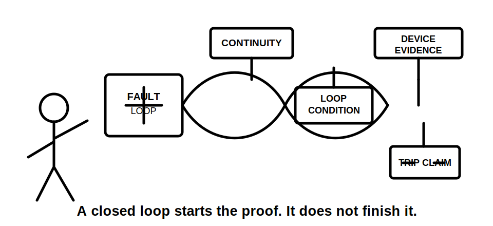
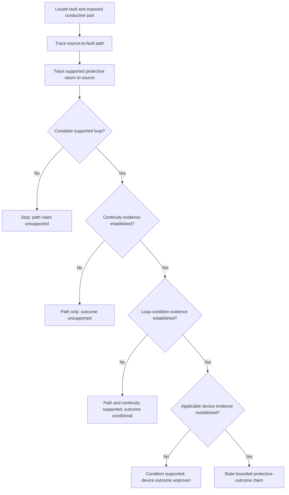
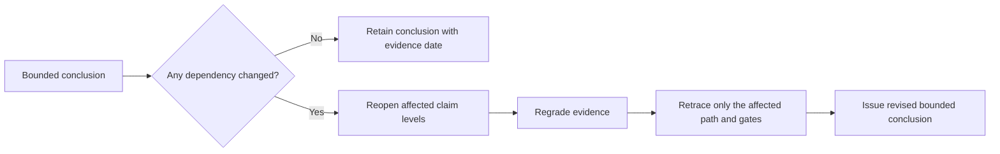

# Day 10 — Earth-Fault Current Path and Disconnection Reasoning

> **Currency and safety notice:** This is an original paper-based reasoning module. It does not prove an installation fault loop, protective-device operation or compliance, and it authorises no electrical work or testing. Exact MEN arrangements, conductor requirements, impedance conditions, device characteristics, operating times, test methods and jurisdiction-specific duties remain `reference_check_required`. This module is `review-required`, not `technically-reviewed`.

## 1. Outcome and entry check

### Learning objectives

By the end of this block, the learner should be able to:

1. distinguish normal load current from earth-fault current;
2. trace a complete conceptual earth-fault loop from source to fault and back to source;
3. identify the protective earthing, MEN and neutral segments that may form part of the stated conceptual loop;
4. explain why a complete path is necessary but not sufficient to prove automatic disconnection;
5. separate path evidence, continuity evidence, loop-condition evidence and protective-device evidence;
6. grade the evidence and classify each claim as descriptive, provisional, supported paper reasoning or authorised verification;
7. reopen the analysis when any source, path, continuity, device or arrangement dependency changes;
8. score at least 10 out of 12 on the educational rubric with no zero in path accuracy, evidence control or safety boundary.

### Entry check

Without notes, answer and rate confidence as **guessing**, **unsure**, **reasonably confident** or **certain**:

1. State the normal-current loop from Day 9.
2. What event changes that loop into an earth-fault loop?
3. Does identifying a protective conductor prove its continuity?
4. Does a complete conceptual loop prove a protective device will operate in the required way?
5. What four evidence categories are needed before making a disconnection claim?
6. Name one changed dependency that would force the conclusion to be reopened.

Record every high-confidence error for Beat 8.

## 2. Why it matters

A learner can draw a plausible fault path and still make an unsafe conclusion. Protective operation depends not only on the route, but also on continuity, the electrical condition of that route, the source arrangement and the applicable protective-device characteristics. Day 10 therefore moves from **where fault current could flow** to **what evidence must exist before a bounded disconnection claim can be made**.

*Caption: A labelled path begins the argument; continuity, loop condition and device evidence must also be established before a disconnection claim.*

*Caption: A closed loop starts the proof. It does not finish it.*

## 3. Core concepts and terminology

### Earth fault

An **earth fault** is an unintended conductive connection between a live part and an exposed conductive part, protective conductor or other relevant conductive path. Exact definitions and classifications require current authorised verification.

### Earth-fault current

**Earth-fault current** is current that flows because of an earth fault. Its conceptual route differs from the normal active-load-neutral loop.

### Fault-current loop

A **fault-current loop** is the complete route from the source, through the fault and protective return path, back to the source relationship. A path that stops at an earthing terminal, electrode, neutral or MEN point is incomplete unless the return to the stated source is also explained.

### Protective earthing continuity

**Protective earthing continuity** means the relevant protective path is electrically continuous. A drawing, conductor colour, label or visual presence does not prove continuity or condition.

### Loop condition

**Loop condition** is the combined electrical condition of the stated path that influences fault-current magnitude and protective response. This module provides no numerical limits or acceptance values.

### Automatic disconnection

**Automatic disconnection** is protective interruption that occurs when the applicable fault, path, source and device conditions are satisfied. A conceptual path alone does not prove those conditions.

### Four evidence questions

A disconnection argument must answer four different questions:

1. **Path:** Is a complete source–fault–source route supported?
2. **Continuity:** Is the required protective path established as electrically continuous?
3. **Loop condition:** Is applicable authorised evidence available for the electrical condition that affects fault-current magnitude?
4. **Device response:** Is the device identity, location and applicable operating evidence established?

Answering one question does not answer the others.

### Evidence grades

- **Grade A — supplied fact:** information explicitly supplied by the fictional scenario, approved learning drawing or stated source record.
- **Grade B — corroborated identity or relationship:** two consistent sources support the component, source or relationship identification, but do not prove electrical condition.
- **Grade C — authorised derived evidence:** a bounded conclusion derived from current authorised requirements, approved design information, verified records, competent test evidence or manufacturer information.
- **Grade D — assumption:** colour, visible presence, familiar arrangement, presumed continuity, guessed impedance or remembered device behaviour.
- **Grade E — missing or conflicting evidence:** the required information is absent, inconsistent, stale or outside the learner's authority to establish.

Grades D and E may identify a question or stop condition. They cannot support a safety-critical protective outcome.

### Claim grades

- **Claim 1 — description:** states only what the scenario shows or says.
- **Claim 2 — provisional identification:** identifies a likely component, relationship or route while recording unresolved dependencies.
- **Claim 3 — supported paper reasoning:** combines applicable evidence into a bounded conceptual conclusion without claiming physical verification.
- **Claim 4 — authorised verification:** relies on competent, authorised verification under current requirements and approved procedures.

This module trains Claims 1–3. It does not authorise Claim 4 activity.

## 4. Rule-finding workflow

Use **L-O-O-P-S**.

1. **L — Locate the fault and exposed conductive part.** State exactly where the unintended connection occurs and what part becomes involved.
2. **O — Outline the outward source path.** Trace from the stated source through active conductors and the fault point without inventing hidden links.
3. **O — Outline the protective return path.** Trace through the stated protective earthing, earthing junction, designated MEN relationship and neutral/source relationship only as supported by the scenario.
4. **P — Prove path, conditions and protection separately.** Grade the evidence for route, continuity, loop condition and device response; do not merge them into one conclusion.
5. **S — State the bounded conclusion and stop point.** Assign a claim grade, list unresolved dependencies and state what change would reopen the analysis.

The diagram shows four separate gates. Passing the route gate does not silently prove continuity, loop condition or device response.

### Dependency ledger

Record these dependencies before finalising the conclusion:

| Dependency | Current evidence | Evidence grade | Claim affected | Reopen when |
|---|---|---|---|---|
| Source arrangement | Learner completes | A–E | Path and outcome | Source type or supply mode changes |
| Fault location | Learner completes | A–E | Path | Fault point or exposed part changes |
| Protective return route | Learner completes | A–E | Path and continuity | Drawing, conductor identity or connection relationship changes |
| Continuity | Learner completes | A–E | Condition and outcome | Evidence is missing, contradicted or superseded |
| Loop condition | Learner completes | A–E | Outcome | Route, conductor, source or authorised evidence changes |
| Protective device | Learner completes | A–E | Outcome | Device identity, location, setting or source evidence changes |

A changed dependency does not always invalidate every statement. It does require the affected path, condition or outcome claim to be reopened rather than copied forward.

## 5. Visual model or worked example

### Conceptual fault loop

The solid arrows show a conceptual closed route. They do not prove conductor continuity, impedance, exact physical routing, permitted connection points or device operation.

### Worked example

**Scenario:** A fictional approved learning diagram shows a stated grid-connected source, an active conductor feeding equipment with a metal enclosure, a labelled protective earthing conductor, an installation earthing junction, a designated MEN relationship and an upstream protective device. A fault symbol connects active to the enclosure. No test results or device characteristic data are supplied.

Apply L-O-O-P-S:

1. **Locate:** active-to-enclosure fault.
2. **Outward path:** source active to equipment and fault point.
3. **Protective return:** enclosure to protective conductor, earthing junction, designated MEN relationship, neutral/source relationship and back to source.
4. **Prove separately:** the drawing provides Grade A path facts and may support a Claim 3 conceptual route. It provides no Grade C continuity, loop-condition or device-response evidence.
5. **State:** the path is conceptually supported, but automatic disconnection remains unsupported until the missing evidence is established through authorised verification. Source arrangement, continuity, loop condition and device identity remain explicit dependencies.

## 6. Practical application

### Round 1 — fault-loop evidence record

Use a trainer-created fictional scenario and complete:

| Segment or claim | Role in reasoning | Evidence source | Evidence grade | Claim grade | Missing evidence or dependency |
|---|---|---|---|---|---|
| Learner completes | Path, continuity, condition or outcome | Learner completes | A–E | 1–4 | Learner completes |

Then write one sentence for each level: path, continuity, loop condition and protective outcome.

### Round 2 — worked-example fading

Repeat with the MEN/source relationship partly hidden. Stop at the unsupported segment, name the missing dependency and avoid completing the loop from memory.

### Round 3 — changed-condition transfer

Provide a second version where one of these changes:

- protective earthing continuity is not established;
- the source changes to an unspecified alternative supply;
- the protective device is identified only by appearance;
- the fault moves to a different exposed conductive part;
- a parallel conductive path is shown without verified status.

Reopen the affected claims, regrade the evidence and issue a revised bounded conclusion. Do not assume the original outcome survives.

### Round 4 — delayed retrieval

After 24–48 hours, use a new diagram with different labels and layout. Without referring to the original example:

1. trace the complete supported loop;
2. mark the four evidence gates;
3. identify two dependencies;
4. state one condition that would reopen the analysis;
5. give the highest defensible claim grade.

### Performance rubric

Score each category **0–2**.

| Category | 0 | 1 | 2 |
|---|---|---|---|
| Terminology | Confuses normal, fault and residual current | Defines terms with one blurred distinction | Uses all defined terms consistently |
| Path accuracy | Produces an open or invented loop | Traces most segments with one unsupported link | Completes only the supported source–fault–source loop |
| Evidence control | Treats labels or visible conductors as proof | Marks some assumptions | Grades every material path, continuity, condition and outcome claim |
| Protection reasoning | Claims operation from path alone | Names missing factors generally | Separates all four evidence questions and bounds the outcome |
| Dependency transfer | Reuses the original conclusion unchanged | Reopens one obvious dependency | Reopens every affected claim and preserves unaffected facts |
| Safety and conclusion | Proposes unauthorised testing or certainty | Gives a general caution | States evidence, uncertainty, authority boundary and escalation |

A score below **10/12**, or any zero in **path accuracy**, **evidence control** or **safety and conclusion**, requires targeted remediation and a varied re-attempt. This is an educational threshold, not an official RTO pass mark.

## 7. Common errors and safety checkpoint

### Common errors

- **Stopping at earth or the MEN point.** Complete the conceptual return to the stated source.
- **Treating an electrode as a universal return explanation.** Use only the route supported by the stated arrangement and authorised evidence.
- **Assuming visible protective earthing proves continuity.** Identity and continuity are separate claims.
- **Claiming a device will operate because a path exists.** Prove continuity, loop condition and applicable device evidence separately.
- **Using an RCD explanation for every earth fault.** Identify the relevant protective function and evidence before making a device claim.
- **Importing the grid model into an alternative-source scenario.** Re-establish source, neutral and protective relationships.
- **Carrying forward a conclusion after a dependency changes.** Reopen the affected claim level and regrade evidence.
- **Quoting remembered values or times.** Use current authorised sources and mark unverified details `reference_check_required`.

### Critical-error gates

The attempt is not acceptable when the learner:

- invents a hidden return path;
- treats conductor colour, presence or a diagram label as continuity proof;
- claims protective operation without applicable loop-condition and device evidence;
- applies a grid-connected MEN explanation unchanged to an unspecified alternative source;
- proposes unauthorised practical access, testing, resetting, alteration or energisation.

### Safety checkpoint

This module authorises no opening, cover removal, isolation, proving, testing, continuity measurement, loop measurement, fault creation, bridging, disconnection, reconnection, resetting, alteration, energisation, commissioning or verification.

Stop and seek qualified guidance when:

- source, neutral, MEN or alternate-supply relationships are uncertain;
- protective conductor identity, continuity or condition is unverified;
- exposed live parts, damage, heat, moisture or altered conductors are reported;
- the proposed conclusion depends on exact values, times, curves, test methods or clauses not verified from current authorised sources;
- the learner lacks practical authority, supervision, equipment or an approved procedure.

## 8. Retrieval and next links

### Closed-note retrieval

1. Define earth fault, earth-fault current and fault-current loop.
2. State the five L-O-O-P-S steps.
3. Why is a complete path necessary but insufficient for a disconnection claim?
4. State the four evidence questions.
5. Distinguish the five evidence grades and four claim grades.
6. Why does visible protective earthing not prove continuity?
7. Name three dependencies that can reopen the analysis.
8. State four stop conditions.

### Error-log remediation

Select no more than three errors. For each, redraw a small original loop, mark the unsupported gate, identify the required evidence, state the affected dependency and complete a varied re-attempt within 48 hours.

### Navigation

- **Program:** [Six-Week Capstone Learning Plan](../MASTER_PLAN.md)
- **Previous:** [Day 9 — MEN Arrangement and Normal-Current Paths](day-09-men-arrangement-and-normal-current-paths.md)
- **Knowledge note:** [[Six-Week Day 10 - Earth-Fault Current Path and Disconnection Reasoning]]
- **Next:** [Day 11 — Protective Earthing Continuity and Equipotential Bonding Concepts](day-11-protective-earthing-continuity-and-equipotential-bonding-concepts.md)

### References and review boundary

- AS/NZS 3000: use a current authorised copy and applicable amendments for exact definitions and requirements.
- Use current legislation, regulator guidance, network information, approved drawings, manufacturer information, workplace procedures and RTO instructions as applicable.
- This module uses original explanations, scenarios, workflows, diagrams and assessment activities. It reproduces no standards table, figure, device curve, systematic clause wording or source PDF content.
- Exact MEN arrangements, conductor requirements, fault-loop conditions, protective-device characteristics, operating times, test methods and jurisdiction-specific duties remain `reference_check_required`.
- This module remains `review-required`, has not received qualified technical review and must not be labelled `technically-reviewed`.
